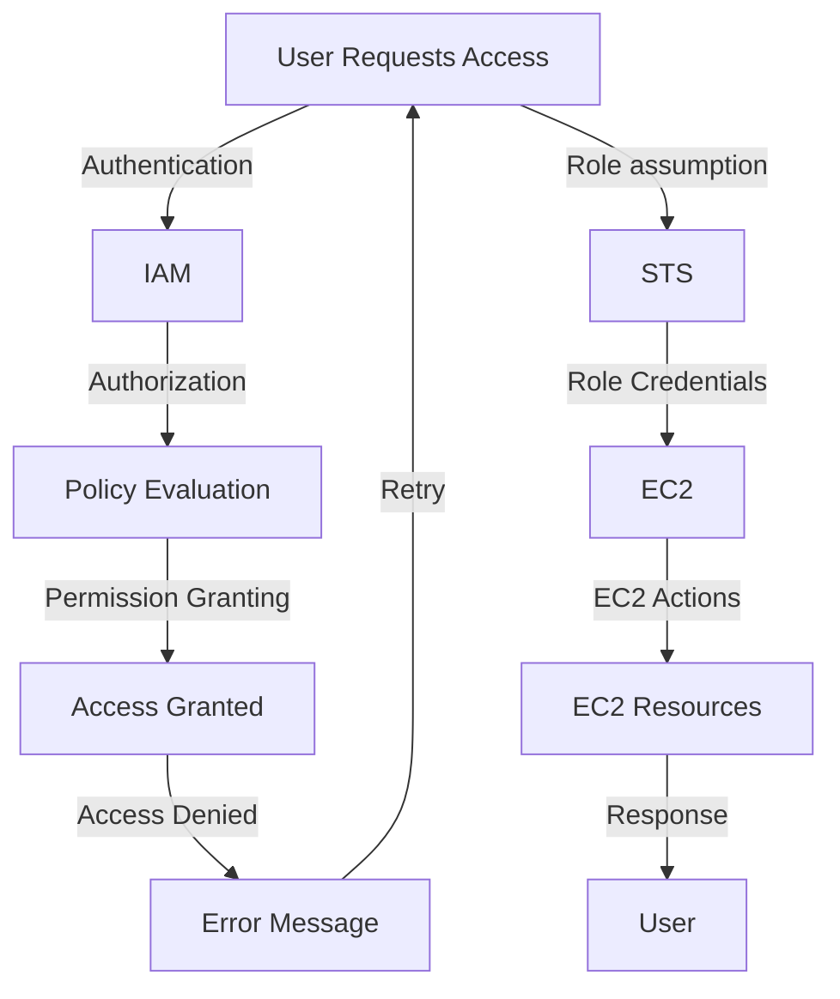

## Introduction
AWS IAM (Identity and Access Management) is a **critical security service** that enables you to manage access to your AWS resources securely. It provides a centralized way to manage access to your AWS account, including users, groups, roles, and permissions. IAM is the foundation of AWS security, and it's essential to understand how it works to secure your AWS resources. In this section, we'll explore what IAM is, why it matters, and its real-world relevance.

> **Note:** IAM is a free service, and you don't need to pay anything to use it. However, some features, such as IAM roles for Amazon EC2 instances, may incur costs.

In real-world scenarios, IAM is used by companies like Netflix, Amazon, and NASA to manage access to their AWS resources. For example, Netflix uses IAM to manage access to its AWS resources, ensuring that only authorized personnel can access sensitive data.

## Core Concepts
To understand IAM, you need to grasp some core concepts:

* **Users**: An IAM user is an entity that can access your AWS resources. Users can be individuals or applications.
* **Groups**: An IAM group is a collection of users that can be managed together. Groups can be used to assign permissions to multiple users at once.
* **Roles**: An IAM role is a set of permissions that can be assigned to a user or a service. Roles can be used to delegate access to AWS resources.
* **Policies**: An IAM policy is a document that defines a set of permissions. Policies can be attached to users, groups, or roles.
* **Permissions**: Permissions define what actions can be performed on an AWS resource. Permissions can be granted or denied.

> **Tip:** It's essential to understand the difference between a user and a role. A user is an entity that can access AWS resources, while a role is a set of permissions that can be assigned to a user or a service.

## How It Works Internally
IAM works by using a combination of authentication and authorization. When a user or a service requests access to an AWS resource, IAM checks the user's or service's identity and verifies their permissions.

Here's a step-by-step breakdown of how IAM works internally:

1. **Authentication**: The user or service provides their credentials to IAM.
2. **Authorization**: IAM checks the user's or service's permissions to determine if they have access to the requested resource.
3. **Policy Evaluation**: IAM evaluates the policies attached to the user or service to determine if they have the required permissions.
4. **Permission Granting**: If the user or service has the required permissions, IAM grants access to the requested resource.

> **Warning:** IAM policies can be complex, and it's essential to understand how they work to avoid security issues. Make sure to test your policies thoroughly to ensure they're working as expected.

## Code Examples
Here are three complete and runnable code examples that demonstrate how to use IAM:

### Example 1: Creating an IAM User
```python
import boto3

iam = boto3.client('iam')

# Create a new IAM user
response = iam.create_user(
    UserName='newuser'
)

print(response)
```

### Example 2: Attaching a Policy to a User
```python
import boto3

iam = boto3.client('iam')

# Create a new policy
policy_document = {
    'Version': '2012-10-17',
    'Statement': [
        {
            'Sid': 'AllowEC2ReadOnly',
            'Effect': 'Allow',
            'Action': [
                'ec2:DescribeInstances',
                'ec2:DescribeImages'
            ],
            'Resource': '*'
        }
    ]
}

response = iam.create_policy(
    PolicyName='EC2ReadOnly',
    PolicyDocument=json.dumps(policy_document)
)

# Attach the policy to the user
response = iam.attach_user_policy(
    UserName='newuser',
    PolicyArn=response['Policy']['Arn']
)

print(response)
```

### Example 3: Assuming a Role
```python
import boto3

sts = boto3.client('sts')

# Assume a role
response = sts.assume_role(
    RoleArn='arn:aws:iam::123456789012:role/EC2ReadOnly',
    RoleSessionName='EC2ReadOnlySession'
)

print(response)
```

## Visual Diagram

This diagram illustrates the IAM workflow, including authentication, authorization, policy evaluation, and permission granting.

## Comparison
Here's a comparison of different IAM approaches:

| Approach | Time Complexity | Space Complexity | Pros | Cons | Best For |
| --- | --- | --- | --- | --- | --- |
| IAM Users | O(1) | O(1) | Easy to manage, fine-grained control | Limited scalability, prone to permission drift | Small-scale applications |
| IAM Roles | O(1) | O(1) | Scalable, flexible, and secure | Complex to manage, requires STS | Large-scale applications |
| IAM Groups | O(n) | O(n) | Simplifies user management, reduces permission drift | Limited flexibility, may lead to over-privilege | Medium-scale applications |
| Custom IAM Policies | O(n) | O(n) | Highly customizable, fine-grained control | Complex to manage, prone to errors | Large-scale applications with complex security requirements |

## Real-world Use Cases
Here are three real-world use cases for IAM:

1. **Netflix**: Netflix uses IAM to manage access to its AWS resources, ensuring that only authorized personnel can access sensitive data.
2. **Amazon**: Amazon uses IAM to manage access to its AWS resources, including its e-commerce platform and cloud services.
3. **NASA**: NASA uses IAM to manage access to its AWS resources, including its satellite imaging and data analytics platforms.

## Common Pitfalls
Here are four common pitfalls to watch out for when using IAM:

1. **Over-privilege**: Granting too many permissions to a user or service can lead to security issues.
2. **Under-privilege**: Not granting enough permissions to a user or service can lead to access denied errors.
3. **Permission drift**: Not regularly reviewing and updating IAM policies can lead to permission drift, where users or services have more permissions than they need.
4. **Lack of monitoring**: Not monitoring IAM activity can lead to security issues, such as unauthorized access to AWS resources.

> **Tip:** Use IAM's built-in monitoring and logging features to detect and respond to security issues.

## Interview Tips
Here are three common interview questions on IAM, along with weak and strong answers:

1. **What is IAM, and how does it work?**
	* Weak answer: IAM is a security service that manages access to AWS resources.
	* Strong answer: IAM is a critical security service that enables you to manage access to your AWS resources securely. It works by using a combination of authentication and authorization to grant access to AWS resources.
2. **How do you manage IAM policies?**
	* Weak answer: I use the AWS Management Console to create and manage IAM policies.
	* Strong answer: I use a combination of the AWS Management Console, AWS CLI, and IAM policy documents to create and manage IAM policies. I also regularly review and update IAM policies to ensure they're working as expected.
3. **How do you troubleshoot IAM issues?**
	* Weak answer: I check the AWS documentation and online forums for solutions.
	* Strong answer: I use a combination of IAM's built-in logging and monitoring features, AWS CloudTrail, and AWS CloudWatch to detect and respond to security issues. I also regularly review and update IAM policies to ensure they're working as expected.

## Key Takeaways
Here are six key takeaways to remember:

* IAM is a critical security service that enables you to manage access to your AWS resources securely.
* IAM policies define what actions can be performed on an AWS resource.
* IAM roles can be used to delegate access to AWS resources.
* IAM groups can be used to simplify user management and reduce permission drift.
* IAM's built-in monitoring and logging features can be used to detect and respond to security issues.
* Regularly reviewing and updating IAM policies is essential to ensure they're working as expected.

> **Interview:** Be prepared to answer questions about IAM, including how it works, how to manage IAM policies, and how to troubleshoot IAM issues.