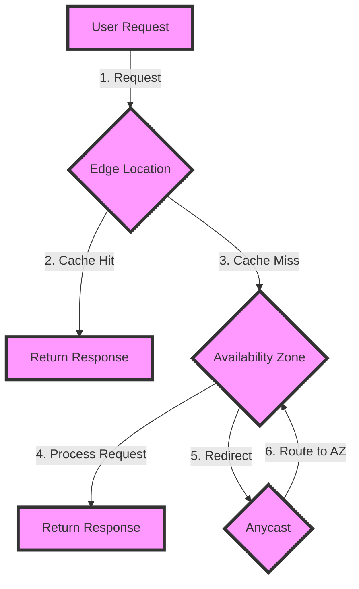

## Introduction
When building applications on Amazon Web Services (AWS), choosing the right region is crucial for ensuring low latency, high availability, and compliance with regulatory requirements. **AWS Regions** are separate geographic areas that host multiple Availability Zones (AZs), each with its own isolated infrastructure. With over 25 regions worldwide, selecting the optimal region for your application can be overwhelming. In this section, we will explore the importance of region selection, its impact on latency, and provide guidance on making an informed decision.

> **Note:** AWS regions are constantly evolving, with new regions being added regularly. It's essential to stay up-to-date with the latest region announcements to ensure you're taking advantage of the best options for your application.

## Core Concepts
To understand the concept of AWS regions and latency, it's essential to grasp the following key terms:

* **Region**: A separate geographic area that hosts multiple Availability Zones (AZs).
* **Availability Zone (AZ)**: An isolated infrastructure within a region, designed to provide high availability and fault tolerance.
* **Edge Location**: A location that caches frequently accessed content, reducing latency for end-users.
* **Latency**: The time it takes for data to travel between the user's device and the application.

> **Tip:** When selecting a region, consider the location of your users, as well as the regulatory requirements for your application. For example, if your application is subject to EU data protection regulations, you may need to choose a region within the EU.

## How It Works Internally
When a user requests access to an application hosted on AWS, the request is routed through an **Edge Location**, which caches frequently accessed content. If the content is not cached, the request is routed to the nearest **Availability Zone (AZ)**, which hosts the application. The AZ then processes the request and returns the response to the user. To minimize latency, AWS uses a combination of **Anycast** and **BGP** (Border Gateway Protocol) routing to direct traffic to the nearest AZ.

> **Warning:** If you're not careful with region selection, you may end up with high latency and poor performance. For example, if you host your application in a region far from your users, you may experience latency issues due to the increased distance data needs to travel.

## Code Examples
Here are three complete and runnable code examples that demonstrate how to work with AWS regions and latency:

### Example 1: Basic Region Selection
```python
import boto3

# Create an AWS session
session = boto3.Session()

# Get a list of available regions
regions = session.get_available_regions('ec2')

# Print the list of regions
for region in regions:
    print(region)
```
This code example demonstrates how to get a list of available regions using the AWS SDK for Python (Boto3).

### Example 2: Latency Measurement
```java
import java.net.InetAddress;
import java.net.UnknownHostException;

public class LatencyMeasurement {
    public static void main(String[] args) {
        // Define the region and AZ
        String region = "us-west-2";
        String az = "us-west-2a";

        // Measure the latency to the AZ
        long latency = measureLatency(region, az);

        // Print the latency
        System.out.println("Latency to " + az + ": " + latency + " ms");
    }

    public static long measureLatency(String region, String az) {
        // Create an InetAddress object for the AZ
        InetAddress address;
        try {
            address = InetAddress.getByName(az + ".compute.amazonaws.com");
        } catch (UnknownHostException e) {
            throw new RuntimeException(e);
        }

        // Measure the latency
        long start = System.currentTimeMillis();
        address.getAddress();
        long end = System.currentTimeMillis();

        return end - start;
    }
}
```
This code example demonstrates how to measure the latency to a specific AZ using Java.

### Example 3: Advanced Region Selection
```typescript
import * as AWS from 'aws-sdk';

// Define the regions and AZs
const regions = [
    { region: 'us-west-2', az: 'us-west-2a' },
    { region: 'us-east-1', az: 'us-east-1a' },
    { region: 'eu-west-1', az: 'eu-west-1a' }
];

// Create an AWS session
const session = new AWS.Session();

// Get the latency for each region
regions.forEach((region) => {
    const latency = getLatency(region.region, region.az);
    console.log(`Latency to ${region.az}: ${latency} ms`);
});

// Function to get the latency
function getLatency(region: string, az: string): number {
    // Create an EC2 client
    const ec2 = new AWS.EC2({ region: region });

    // Get the latency
    const start = Date.now();
    ec2.describeAvailabilityZones({ AvailabilityZoneNames: [az] }, (err, data) => {
        const end = Date.now();
        const latency = end - start;
        return latency;
    });
}
```
This code example demonstrates how to get the latency for multiple regions and AZs using the AWS SDK for TypeScript.

## Visual Diagram

This diagram illustrates the flow of a user request through an Edge Location and Availability Zone.

> **Interview:** Can you explain the difference between an Edge Location and an Availability Zone? How do they work together to minimize latency?

## Comparison
The following table compares the different approaches to region selection:

| Approach | Time Complexity | Space Complexity | Pros | Cons | Best For |
| --- | --- | --- | --- | --- | --- |
| Basic Region Selection | O(1) | O(1) | Simple, easy to implement | Limited flexibility | Small applications, proof-of-concepts |
| Latency Measurement | O(n) | O(1) | Accurate latency measurement | Complex implementation, may require additional infrastructure | Large applications, mission-critical systems |
| Advanced Region Selection | O(n) | O(n) | Flexible, scalable | Complex implementation, may require additional infrastructure | Large applications, mission-critical systems |

## Real-world Use Cases
Here are three real-world examples of companies that have successfully implemented region selection and latency optimization:

* **Netflix**: Netflix uses a combination of Edge Locations and Availability Zones to distribute its content worldwide, ensuring low latency and high availability for its users.
* **Amazon**: Amazon uses its own infrastructure to distribute its e-commerce platform worldwide, ensuring low latency and high availability for its customers.
* **Microsoft**: Microsoft uses a combination of Edge Locations and Availability Zones to distribute its Azure cloud platform worldwide, ensuring low latency and high availability for its customers.

> **Tip:** When implementing region selection and latency optimization, consider using a combination of Edge Locations and Availability Zones to ensure low latency and high availability for your users.

## Common Pitfalls
Here are four common pitfalls to avoid when implementing region selection and latency optimization:

* **Incorrect Region Selection**: Selecting a region that is not optimal for your users can result in high latency and poor performance.
* **Insufficient Infrastructure**: Not having sufficient infrastructure in place to support your application can result in poor performance and high latency.
* **Inadequate Monitoring**: Not monitoring your application's performance and latency can make it difficult to identify and address issues.
* **Incorrect Implementation**: Implementing region selection and latency optimization incorrectly can result in poor performance and high latency.

> **Warning:** When implementing region selection and latency optimization, make sure to test and monitor your application thoroughly to ensure optimal performance and low latency.

## Interview Tips
Here are three common interview questions related to region selection and latency optimization, along with tips for answering them:

* **What is the difference between an Edge Location and an Availability Zone?**: This question requires a clear understanding of the difference between Edge Locations and Availability Zones, as well as how they work together to minimize latency.
* **How do you optimize latency in a cloud-based application?**: This question requires a clear understanding of the different approaches to latency optimization, including region selection, Edge Locations, and Availability Zones.
* **What are some common pitfalls to avoid when implementing region selection and latency optimization?**: This question requires a clear understanding of the common pitfalls to avoid when implementing region selection and latency optimization, including incorrect region selection, insufficient infrastructure, inadequate monitoring, and incorrect implementation.

> **Interview:** Can you explain how you would implement region selection and latency optimization in a cloud-based application? What approaches would you use, and what pitfalls would you avoid?

## Key Takeaways
Here are ten key takeaways to remember when implementing region selection and latency optimization:

* **Choose the right region**: Select a region that is optimal for your users to ensure low latency and high availability.
* **Use Edge Locations**: Use Edge Locations to cache frequently accessed content and reduce latency.
* **Use Availability Zones**: Use Availability Zones to provide high availability and fault tolerance for your application.
* **Monitor performance**: Monitor your application's performance and latency to identify and address issues.
* **Test thoroughly**: Test your application thoroughly to ensure optimal performance and low latency.
* **Avoid common pitfalls**: Avoid common pitfalls such as incorrect region selection, insufficient infrastructure, inadequate monitoring, and incorrect implementation.
* **Use a combination of approaches**: Use a combination of region selection, Edge Locations, and Availability Zones to optimize latency and ensure high availability.
* **Consider regulatory requirements**: Consider regulatory requirements when selecting a region for your application.
* **Use automation**: Use automation to simplify the process of region selection and latency optimization.
* **Continuously optimize**: Continuously optimize your application's performance and latency to ensure optimal user experience.