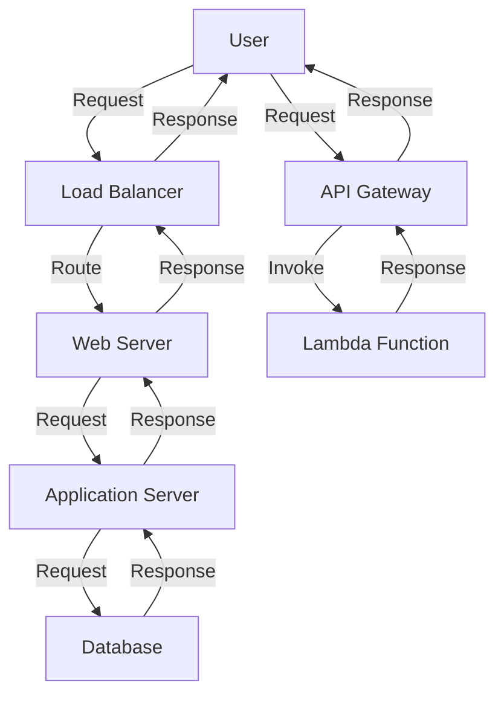

## Introduction
Cloud computing has revolutionized the way we deploy and manage applications, providing scalability, flexibility, and cost-effectiveness. At the heart of cloud computing are three primary service models: **Infrastructure as a Service (IaaS)**, **Platform as a Service (PaaS)**, and **Software as a Service (SaaS)**. Additionally, a newer model, **Function as a Service (FaaS)**, has gained popularity in recent years. Understanding these cloud models is crucial for every engineer, as they form the foundation of modern cloud-based systems. In this article, we will delve into the world of cloud models, exploring their definitions, internal workings, and real-world applications.

## Core Concepts
Let's start with the precise definitions of each cloud model:
* **IaaS**: Provides virtualized computing resources, such as servers, storage, and networking, over the internet. The user has full control over the infrastructure.
* **PaaS**: Offers a complete development and deployment environment for applications, including tools, libraries, and infrastructure. The user has control over the application and data, but not the underlying infrastructure.
* **SaaS**: Delivers software applications over the internet, eliminating the need for local installation and maintenance. The user has access to the application, but not the underlying infrastructure or data.
* **FaaS**: Enables the deployment of individual functions or code snippets, which are executed on demand. The user has control over the code, but not the underlying infrastructure.

> **Note:** Each cloud model has its own set of advantages and disadvantages, and the choice of model depends on the specific use case and requirements.

## How It Works Internally
Let's take a closer look at the internal mechanics of each cloud model:
* **IaaS**: The cloud provider manages the physical infrastructure, while the user is responsible for configuring and managing the virtualized resources. This includes setting up and configuring virtual machines, storage, and networking.
* **PaaS**: The cloud provider manages the underlying infrastructure, including the operating system, middleware, and tools. The user is responsible for developing and deploying applications, as well as managing data and security.
* **SaaS**: The cloud provider manages the entire application, including the infrastructure, middleware, and software. The user is responsible for configuring and using the application.
* **FaaS**: The cloud provider manages the underlying infrastructure, including the operating system, middleware, and tools. The user is responsible for writing and deploying individual functions, which are executed on demand.

## Code Examples
Here are three complete and runnable code examples, demonstrating the use of each cloud model:
### Example 1: IaaS - Creating a Virtual Machine
```python
import boto3

# Create an EC2 client
ec2 = boto3.client('ec2')

# Create a new virtual machine
response = ec2.run_instances(
    ImageId='ami-0c94855ba95c71c99',
    InstanceType='t2.micro',
    MinCount=1,
    MaxCount=1
)

# Print the instance ID
print(response['Instances'][0]['InstanceId'])
```
### Example 2: PaaS - Deploying a Web Application
```javascript
const express = require('express');
const app = express();

// Define a route
app.get('/', (req, res) => {
  res.send('Hello World!');
});

// Deploy the application to Heroku
const heroku = require('heroku-api');
const api = new heroku({ token: 'your-heroku-token' });

api.post('/apps', {
  name: 'my-app',
  stack: 'heroku-18'
}, (err, app) => {
  if (err) {
    console.error(err);
  } else {
    console.log(`App created: ${app.name}`);
  }
});
```
### Example 3: FaaS - Deploying a Serverless Function
```python
import boto3

# Create a Lambda client
lambda_client = boto3.client('lambda')

# Define a Lambda function
def lambda_handler(event, context):
  return {
    'statusCode': 200,
    'body': 'Hello World!'
  }

# Deploy the Lambda function
response = lambda_client.create_function(
  FunctionName='my-function',
  Runtime='python3.8',
  Role='arn:aws:iam::123456789012:role/lambda-execution-role',
  Handler='lambda_handler',
  Code={'ZipFile': bytes(b'lambda_handler function')},
  Description='My Lambda function'
)

# Print the function ARN
print(response['FunctionArn'])
```
> **Tip:** When using FaaS, make sure to optimize your code for cold starts and minimize dependencies to reduce execution time.

## Visual Diagram

This diagram illustrates the flow of requests and responses in a cloud-based system, including IaaS, PaaS, and FaaS components.

## Comparison
| Approach | Time Complexity | Space Complexity | Pros | Cons | Best For |
| --- | --- | --- | --- | --- | --- |
| IaaS | O(1) | O(n) | Full control over infrastructure, scalability | High maintenance, complex setup | Large-scale applications, custom infrastructure |
| PaaS | O(log n) | O(n) | Easy deployment, managed infrastructure | Limited control, vendor lock-in | Web applications, development environments |
| SaaS | O(1) | O(1) | Low maintenance, easy access | Limited customization, security concerns | Productivity software, collaboration tools |
| FaaS | O(1) | O(1) | Scalable, cost-effective, easy deployment | Cold starts, limited dependencies | Real-time data processing, serverless architecture |

## Real-world Use Cases
Here are three production examples of cloud models in use:
* **Netflix (IaaS)**: Netflix uses Amazon Web Services (AWS) to host its streaming service, leveraging IaaS to manage its infrastructure and scale to meet demand.
* **Heroku (PaaS)**: Heroku provides a PaaS platform for developers to build and deploy web applications, offering a managed infrastructure and easy deployment.
* **Google Docs (SaaS)**: Google Docs is a SaaS application that provides word processing, spreadsheet, and presentation software, accessible via the web and mobile devices.

## Common Pitfalls
Here are four specific mistakes to avoid when using cloud models:
* **Overprovisioning**: Overestimating resource requirements and provisioning too many resources, leading to waste and increased costs.
* **Underprovisioning**: Underestimating resource requirements and provisioning too few resources, leading to performance issues and downtime.
* **Vendor lock-in**: Becoming too dependent on a single cloud provider, making it difficult to switch to a different provider if needed.
* **Security misconfiguration**: Failing to properly secure cloud resources, leading to security breaches and data loss.

> **Warning:** Make sure to monitor and adjust resource provisioning regularly to avoid overprovisioning and underprovisioning.

## Interview Tips
Here are three common interview questions related to cloud models:
* **What is the difference between IaaS, PaaS, and SaaS?**: A strong answer should provide a clear definition of each model, highlighting their advantages and disadvantages.
* **How would you deploy a web application using PaaS?**: A strong answer should describe the steps involved in deploying a web application using a PaaS platform, including setting up the environment, deploying the application, and configuring security.
* **What are the benefits and drawbacks of using FaaS?**: A strong answer should discuss the benefits of FaaS, including scalability and cost-effectiveness, as well as the drawbacks, such as cold starts and limited dependencies.

## Key Takeaways
Here are ten key takeaways to remember:
* **IaaS provides full control over infrastructure**: IaaS offers the most control over infrastructure, but requires more maintenance and setup.
* **PaaS simplifies deployment and management**: PaaS provides a managed infrastructure and easy deployment, but may limit control and customization.
* **SaaS offers low maintenance and easy access**: SaaS provides low maintenance and easy access to applications, but may limit customization and security.
* **FaaS is scalable and cost-effective**: FaaS provides scalable and cost-effective deployment of individual functions, but may require optimization for cold starts and dependencies.
* **Cloud models are not mutually exclusive**: Cloud models can be used in combination to achieve specific goals and requirements.
* **Security is a top priority**: Security is a critical aspect of cloud computing, and should be properly configured and monitored.
* **Monitoring and adjustment are key**: Regular monitoring and adjustment of resource provisioning are essential to avoid overprovisioning and underprovisioning.
* **Vendor lock-in should be avoided**: Vendor lock-in should be avoided by using standardized protocols and APIs, and by maintaining a flexible architecture.
* **Cloud models are evolving**: Cloud models are constantly evolving, and new models and technologies are emerging to address specific needs and requirements.
* **Education and training are essential**: Education and training are essential to stay up-to-date with the latest cloud models, technologies, and best practices.