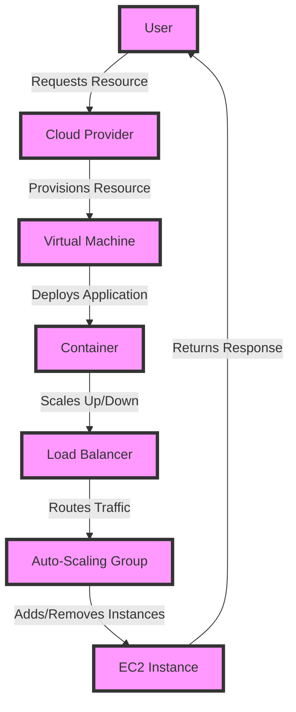

## Introduction
**Cloud Computing** is a model of delivering computing services over the internet, where resources such as servers, storage, databases, software, and applications are provided as a service to users on-demand. This allows users to access and utilize these resources from anywhere, at any time, without the need for physical infrastructure or upfront capital expenditures. Cloud computing has revolutionized the way businesses and individuals approach IT, providing scalability, flexibility, and cost-effectiveness. As a result, cloud computing has become a crucial aspect of modern computing, with companies like Amazon, Microsoft, and Google investing heavily in cloud infrastructure.

> **Note:** Cloud computing is not just about storing data online; it's about providing a complete platform for computing, including processing power, memory, and software applications.

## Core Concepts
Some key concepts in cloud computing include:
* **On-demand self-service**: Users can provision and de-provision resources as needed, without requiring human intervention.
* **Broad network access**: Resources are accessible over the internet, from any device, anywhere in the world.
* **Resource pooling**: Resources are pooled together to provide a multi-tenant environment, where resources can be dynamically allocated and re-allocated.
* **Rapid elasticity**: Resources can be quickly scaled up or down to match changing demand.
* **Measured service**: Users only pay for the resources they use, rather than having to purchase and maintain their own infrastructure.

> **Warning:** One of the biggest security risks in cloud computing is the lack of control over data and applications, which can lead to data breaches and other security incidents if not properly managed.

## How It Works Internally
Cloud computing providers use a variety of technologies to deliver their services, including:
* **Hypervisors**: Software that creates and manages virtual machines (VMs) on physical servers.
* **Containerization**: Lightweight and portable way to deploy applications, using containers instead of VMs.
* **Load balancing**: Distributes incoming traffic across multiple servers to improve responsiveness and availability.
* **Auto-scaling**: Automatically adds or removes resources based on demand, to ensure optimal performance and cost-effectiveness.

Here is an example of how a cloud provider might use these technologies to deliver a scalable web application:
```python
import boto3

# Create an EC2 instance
ec2 = boto3.client('ec2')
instance = ec2.run_instances(
    ImageId='ami-abc123',
    InstanceType='t2.micro',
    MinCount=1,
    MaxCount=1
)

# Create a load balancer
elb = boto3.client('elb')
load_balancer = elb.create_load_balancer(
    LoadBalancerName='my-load-balancer',
    Listeners=[
        {
            'Protocol': 'HTTP',
            'LoadBalancerPort': 80,
            'InstanceProtocol': 'HTTP',
            'InstancePort': 80
        }
    ]
)

# Auto-scale the instance
asg = boto3.client('autoscaling')
auto_scaling_group = asg.create_auto_scaling_group(
    AutoScalingGroupName='my-auto-scaling-group',
    LaunchConfigurationName='my-launch-configuration',
    MinSize=1,
    MaxSize=10
)
```
> **Tip:** When designing a cloud-based system, it's essential to consider the trade-offs between scalability, performance, and cost. A well-designed system should be able to scale up or down quickly, while also minimizing costs and optimizing performance.

## Code Examples
Here are three examples of cloud computing in action:
### Example 1: Basic AWS EC2 Instance
```python
import boto3

# Create an EC2 instance
ec2 = boto3.client('ec2')
instance = ec2.run_instances(
    ImageId='ami-abc123',
    InstanceType='t2.micro',
    MinCount=1,
    MaxCount=1
)

print(instance['Instances'][0]['InstanceId'])
```
### Example 2: Real-world Pattern - Auto-Scaling Web Application
```python
import boto3

# Create an EC2 instance
ec2 = boto3.client('ec2')
instance = ec2.run_instances(
    ImageId='ami-abc123',
    InstanceType='t2.micro',
    MinCount=1,
    MaxCount=1
)

# Create a load balancer
elb = boto3.client('elb')
load_balancer = elb.create_load_balancer(
    LoadBalancerName='my-load-balancer',
    Listeners=[
        {
            'Protocol': 'HTTP',
            'LoadBalancerPort': 80,
            'InstanceProtocol': 'HTTP',
            'InstancePort': 80
        }
    ]
)

# Auto-scale the instance
asg = boto3.client('autoscaling')
auto_scaling_group = asg.create_auto_scaling_group(
    AutoScalingGroupName='my-auto-scaling-group',
    LaunchConfigurationName='my-launch-configuration',
    MinSize=1,
    MaxSize=10
)
```
### Example 3: Advanced - Serverless Architecture with AWS Lambda
```python
import boto3

# Create an AWS Lambda function
lambda_client = boto3.client('lambda')
function = lambda_client.create_function(
    FunctionName='my-lambda-function',
    Runtime='python3.8',
    Role='arn:aws:iam::123456789012:role/lambda-execution-role',
    Handler='index.handler',
    Code={'ZipFile': bytes(b'print("Hello World!")')}
)

# Create an API Gateway
apigateway = boto3.client('apigateway')
rest_api = apigateway.create_rest_api(
    name='my-api',
    description='My API'
)

# Create a resource and method
resource = apigateway.create_resource(
    restApiId=rest_api['id'],
    parentId='/',
    pathPart='my-resource'
)

method = apigateway.put_method(
    restApiId=rest_api['id'],
    resourceId=resource['id'],
    httpMethod='GET',
    authorization='NONE'
)
```
> **Interview:** Can you explain the differences between IaaS, PaaS, and SaaS? How would you choose between them for a given project?

## Visual Diagram

This diagram illustrates the basic flow of a cloud computing system, from user request to resource provisioning and deployment.

## Comparison
| Approach | Time Complexity | Space Complexity | Pros | Cons | Best For |
|----------|----------------|-----------------|------|------|----------|
| IaaS | O(1) | O(n) | High control, flexibility | High management overhead | Large-scale enterprises, complex applications |
| PaaS | O(n) | O(1) | Easy to use, scalable | Limited control, vendor lock-in | Web applications, mobile apps |
| SaaS | O(1) | O(1) | Convenient, cost-effective | Limited customization, security risks | Small businesses, personal use |

## Real-world Use Cases
* **Netflix**: Uses a combination of IaaS and PaaS to deliver its streaming service, with a focus on scalability and high availability.
* **Dropbox**: Uses a PaaS approach to provide its cloud storage service, with a focus on ease of use and convenience.
* **Amazon**: Uses a combination of IaaS, PaaS, and SaaS to provide its e-commerce platform, with a focus on scalability, flexibility, and cost-effectiveness.

> **Tip:** When choosing a cloud provider, consider factors such as scalability, security, compliance, and cost. It's also essential to evaluate the provider's support for your specific use case and requirements.

## Common Pitfalls
* **Inadequate security**: Failing to properly secure cloud resources and data can lead to security breaches and data loss.
* **Insufficient scalability**: Failing to properly scale cloud resources can lead to performance issues and downtime.
* **Vendor lock-in**: Failing to consider vendor lock-in can make it difficult to switch cloud providers or migrate to a different platform.
* **Lack of monitoring and logging**: Failing to properly monitor and log cloud resources can make it difficult to troubleshoot issues and optimize performance.

Here is an example of how to avoid vendor lock-in by using a cloud-agnostic architecture:
```python
import boto3
import azure

# Create an AWS EC2 instance
ec2 = boto3.client('ec2')
instance = ec2.run_instances(
    ImageId='ami-abc123',
    InstanceType='t2.micro',
    MinCount=1,
    MaxCount=1
)

# Create an Azure VM
azure_vm = azure.compute.VirtualMachine(
    'my-vm',
    'my-resource-group',
    'my-location',
    'my-vm-size'
)

# Use a cloud-agnostic library to deploy the application
cloud_agnostic_library = CloudAgnosticLibrary()
cloud_agnostic_library.deploy_application('my-application', 'my-vm')
```
> **Warning:** Failing to properly monitor and log cloud resources can lead to performance issues, security breaches, and data loss. Use cloud provider logging and monitoring tools to ensure visibility and control over your cloud resources.

## Interview Tips
* **What is cloud computing?**: Be prepared to explain the basics of cloud computing, including IaaS, PaaS, and SaaS.
* **How do you choose between IaaS, PaaS, and SaaS?**: Be prepared to discuss the trade-offs between each approach, including control, scalability, and cost.
* **What are some common cloud security risks?**: Be prepared to discuss common security risks, including data breaches, insecure APIs, and inadequate access controls.
* **How do you design a scalable cloud architecture?**: Be prepared to discuss design principles, including auto-scaling, load balancing, and caching.

> **Interview:** Can you explain the concept of a cloud-native application? How would you design a cloud-native application for a given use case?

## Key Takeaways
* Cloud computing is a model of delivering computing services over the internet, providing scalability, flexibility, and cost-effectiveness.
* IaaS, PaaS, and SaaS are three main approaches to cloud computing, each with its own trade-offs and use cases.
* Cloud security is a critical concern, with common risks including data breaches, insecure APIs, and inadequate access controls.
* Cloud architecture design principles include auto-scaling, load balancing, and caching.
* Cloud providers offer a range of services and tools, including compute, storage, databases, and machine learning.
* Cloud computing is a rapidly evolving field, with new technologies and innovations emerging constantly.
* Cloud computing has many benefits, including increased agility, improved scalability, and reduced costs.
* Cloud computing also has some challenges, including security risks, vendor lock-in, and lack of control.