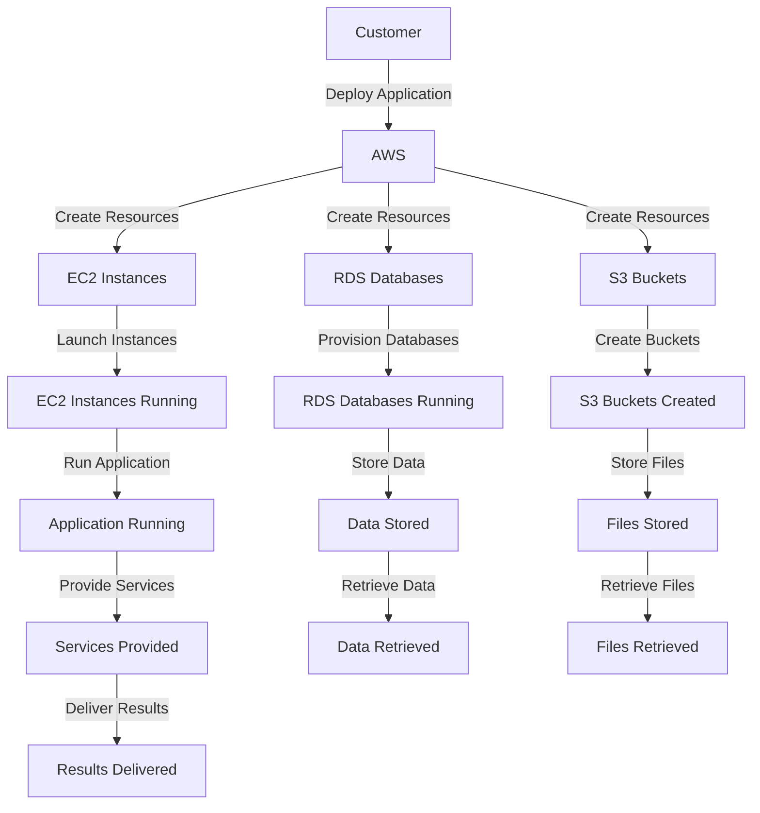

## Introduction
Amazon Web Services (AWS) is the largest cloud provider, offering over 200 services that enable individuals, businesses, and governments to build, deploy, and manage applications and workloads in a flexible, scalable, and secure manner. With its global infrastructure spanning across 25 regions, 77 availability zones, and 200+ services, AWS provides a comprehensive platform for a wide range of use cases, from web and mobile applications to data analytics, artificial intelligence, and the Internet of Things (IoT). As the leading cloud provider, AWS has become an essential tool for businesses and individuals looking to leverage the benefits of cloud computing, including reduced costs, increased agility, and improved scalability.

> **Note:** AWS is not just a cloud provider, but a platform that enables innovation, experimentation, and rapid deployment of new ideas and applications.

In real-world scenarios, AWS is used by companies like Netflix, Airbnb, and Uber to power their applications and services. For example, Netflix uses AWS to stream videos to its users, while Airbnb uses AWS to manage its global platform and provide a seamless experience to its users. As a result, understanding AWS and its various services has become a crucial skill for software engineers, developers, and IT professionals looking to build and deploy scalable, secure, and efficient applications.

## Core Concepts
To understand AWS, it's essential to grasp some core concepts, including:
* **Regions**: Geographic locations where AWS data centers are located, such as US East (N. Virginia) or EU (Frankfurt).
* **Availability Zones**: Isolated locations within a region that provide high availability and redundancy, such as us-east-1a or eu-central-1a.
* **Services**: Individual components of the AWS platform, such as Amazon S3 (storage), Amazon EC2 (compute), or Amazon RDS (database).
* **Instances**: Virtual machines or containers that run applications and services, such as EC2 instances or ECS containers.

> **Warning:** Not understanding the differences between regions, availability zones, and services can lead to incorrect architecture and deployment decisions, resulting in increased costs, reduced performance, and decreased availability.

Mental models, such as the **shared responsibility model**, help engineers understand the roles and responsibilities of both AWS and the customer in securing and managing AWS resources. Key terminology, including **IAM** (Identity and Access Management), **VPC** (Virtual Private Cloud), and **ELB** (Elastic Load Balancer), are essential for designing and deploying secure, scalable, and efficient AWS architectures.

## How It Works Internally
AWS provides a complex and highly available infrastructure that enables customers to deploy and manage applications and workloads. Under the hood, AWS uses a combination of:
* **Data centers**: Physically secure locations that house servers, storage, and network equipment.
* **Server clusters**: Groups of servers that work together to provide high availability and scalability.
* **Network infrastructure**: High-speed networks that connect data centers and enable communication between services.

> **Tip:** Understanding how AWS works internally can help engineers design and deploy more efficient, scalable, and secure architectures.

When a customer deploys an application or service on AWS, the following steps occur:
1. **Resource creation**: The customer creates resources, such as EC2 instances, S3 buckets, or RDS databases.
2. **Resource allocation**: AWS allocates resources, such as servers, storage, and network capacity.
3. **Resource configuration**: The customer configures resources, such as setting up security groups, configuring load balancers, and defining database parameters.
4. **Resource deployment**: AWS deploys resources, such as launching EC2 instances, creating S3 buckets, or provisioning RDS databases.

## Code Examples
### Example 1: Basic AWS Configuration
```python
import boto3

# Create an S3 client
s3 = boto3.client('s3')

# Create an S3 bucket
bucket_name = 'my-bucket'
s3.create_bucket(Bucket=bucket_name)

# Upload a file to the bucket
file_name = 'example.txt'
s3.upload_file(file_name, bucket_name, file_name)
```
This example demonstrates how to create an S3 bucket and upload a file using the AWS SDK for Python.

### Example 2: Real-world AWS Deployment
```java
import software.amazon.awscdk.core.*;
import software.amazon.awscdk.services.ec2.*;
import software.amazon.awscdk.services.rds.*;

public class MyStack extends Stack {
    public MyStack(final Construct scope, final String id) {
        super(scope, id);

        // Create a VPC
        Vpc vpc = Vpc.Builder.create(this, "VPC")
                .cidrBlock("10.0.0.0/16")
                .build();

        // Create an RDS instance
        DatabaseInstance database = DatabaseInstance.Builder.create(this, "Database")
                .engine(DatabaseInstanceEngine.mysql({ version: DatabaseInstanceEngineVersion.VER_8_0_23 }))
                .instanceIdentifier("my-database")
                .vpc(vpc)
                .build();

        // Create an EC2 instance
        Instance instance = Instance.Builder.create(this, "Instance")
                .instanceType(InstanceType.of(InstanceTypeFamily.T2, InstanceTypeSize.MEDIUM))
                .vpc(vpc)
                .build();
    }
}
```
This example demonstrates how to create a VPC, RDS instance, and EC2 instance using the AWS CDK for Java.

### Example 3: Advanced AWS Security
```typescript
import * as cdk from 'aws-cdk-lib';
import * as iam from 'aws-cdk-lib/aws-iam';
import * as ec2 from 'aws-cdk-lib/aws-ec2';

export class MyStack extends cdk.Stack {
    constructor(scope: cdk.Construct, id: string, props?: cdk.StackProps) {
        super(scope, id, props);

        // Create an IAM role
        const role = new iam.Role(this, 'Role', {
            assumedBy: new iam.ServicePrincipal('ec2.amazonaws.com'),
        });

        // Create an IAM policy
        const policy = new iam.Policy(this, 'Policy', {
            statements: [
                new iam.PolicyStatement({
                    effect: iam.Effect.ALLOW,
                    actions: ['ec2:*'],
                    resources: ['*'],
                }),
            ],
        });

        // Attach the policy to the role
        role.addManagedPolicy(policy);

        // Create an EC2 instance with the role
        const instance = new ec2.Instance(this, 'Instance', {
            instanceType: ec2.InstanceType.of(ec2.InstanceTypeFamily.T2, ec2.InstanceTypeSize.MEDIUM),
            machineImage: new ec2.AmazonLinuxImage(),
            role: role,
        });
    }
}
```
This example demonstrates how to create an IAM role, policy, and attach the policy to the role using the AWS CDK for TypeScript.

## Visual Diagram

This diagram illustrates the process of deploying an application on AWS, from creating resources to running the application and storing data.

## Comparison
| Approach | Time Complexity | Space Complexity | Pros | Cons | Best For |
| --- | --- | --- | --- | --- | --- |
| On-Premises | O(1) | O(n) | Control, Security | High Costs, Maintenance | Small-Scale Applications |
| AWS | O(log n) | O(log n) | Scalability, Flexibility | High Costs, Complexity | Large-Scale Applications |
| Azure | O(log n) | O(log n) | Integration, Security | High Costs, Complexity | Enterprise Applications |
| Google Cloud | O(log n) | O(log n) | Innovation, Scalability | High Costs, Complexity | Innovative Applications |

## Real-world Use Cases
1. **Netflix**: Uses AWS to stream videos to its users, leveraging the scalability and flexibility of the AWS platform.
2. **Airbnb**: Uses AWS to manage its global platform, providing a seamless experience to its users and hosts.
3. **Uber**: Uses AWS to power its ride-hailing platform, leveraging the scalability and reliability of the AWS infrastructure.

## Common Pitfalls
1. **Not understanding the shared responsibility model**: Not understanding the roles and responsibilities of both AWS and the customer in securing and managing AWS resources.
2. **Not using IAM roles and policies**: Not using IAM roles and policies to manage access to AWS resources, leading to security risks and compliance issues.
3. **Not monitoring and logging**: Not monitoring and logging AWS resources, leading to performance issues and security risks.
4. **Not using AWS best practices**: Not using AWS best practices, such as using VPCs, subnets, and security groups, leading to security risks and performance issues.

> **Warning:** Not following AWS best practices can lead to security risks, performance issues, and compliance problems.

## Interview Tips
1. **What is the difference between AWS and Azure?**: A strong answer should highlight the differences in services, pricing, and features between AWS and Azure.
2. **How do you secure an AWS account?**: A strong answer should highlight the importance of IAM roles and policies, as well as monitoring and logging.
3. **What is the shared responsibility model?**: A strong answer should explain the roles and responsibilities of both AWS and the customer in securing and managing AWS resources.

> **Interview:** Be prepared to answer questions about AWS services, security, and best practices, as well as demonstrate hands-on experience with AWS.

## Key Takeaways
* **AWS is the largest cloud provider**: With over 200 services and a global infrastructure, AWS provides a comprehensive platform for a wide range of use cases.
* **Understanding AWS services is crucial**: Understanding the different AWS services, including EC2, S3, and RDS, is essential for designing and deploying efficient, scalable, and secure architectures.
* **Security is a top priority**: Security is a top priority when deploying applications on AWS, and using IAM roles and policies, as well as monitoring and logging, is essential for securing AWS resources.
* **AWS provides a shared responsibility model**: The shared responsibility model highlights the roles and responsibilities of both AWS and the customer in securing and managing AWS resources.
* **AWS best practices are essential**: Following AWS best practices, such as using VPCs, subnets, and security groups, is essential for designing and deploying efficient, scalable, and secure architectures.
* **Monitoring and logging are crucial**: Monitoring and logging are crucial for identifying performance issues and security risks, and for ensuring compliance with regulatory requirements.
* **AWS provides a wide range of services**: AWS provides a wide range of services, including compute, storage, database, and analytics services, as well as machine learning and artificial intelligence services.
* **AWS is constantly evolving**: AWS is constantly evolving, with new services and features being added regularly, and it's essential to stay up-to-date with the latest developments and best practices.