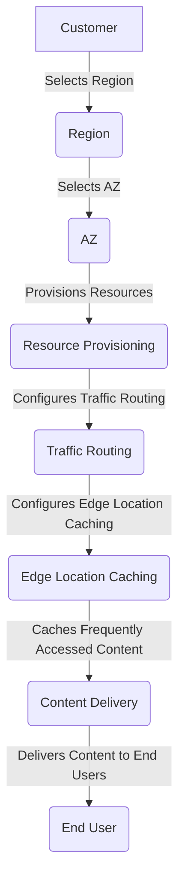

## Introduction
AWS Global Infrastructure is a critical component of Amazon Web Services (AWS) that enables customers to deploy their applications and workloads in a highly available, scalable, and secure manner. The global infrastructure consists of **Regions**, **Availability Zones (AZs)**, and **Edge Locations**, which work together to provide a robust and reliable platform for deploying applications. In this section, we will explore the importance of AWS Global Infrastructure, its real-world relevance, and why every engineer needs to know about it.

AWS Global Infrastructure is essential for several reasons:
- **High Availability**: By deploying applications across multiple AZs and Regions, customers can ensure high availability and minimize downtime.
- **Scalability**: The global infrastructure allows customers to scale their applications quickly and efficiently, without worrying about the underlying infrastructure.
- **Security**: AWS Global Infrastructure provides a secure environment for deploying applications, with features like network isolation, firewalls, and encryption.

> **Note:** AWS Global Infrastructure is a complex system that requires careful planning and design to ensure optimal performance, security, and availability.

## Core Concepts
To understand AWS Global Infrastructure, it's essential to grasp the following core concepts:
- **Region**: A Region is a geographical area that hosts multiple AZs. Each Region is isolated from other Regions, and customers can deploy their applications in one or more Regions.
- **Availability Zone (AZ)**: An AZ is a isolated location within a Region that has its own independent infrastructure, including power, cooling, and networking. AZs are connected to each other through low-latency networks.
- **Edge Location**: An Edge Location is a small data center that is used to cache frequently accessed content, such as videos, images, and web pages. Edge Locations are typically located in major cities around the world and are used to reduce latency and improve performance.

> **Tip:** When designing an application, it's essential to consider the Region and AZ placement to ensure optimal performance, availability, and security.

## How It Works Internally
Here's a step-by-step overview of how AWS Global Infrastructure works internally:
1. **Region Selection**: The customer selects a Region to deploy their application.
2. **AZ Selection**: The customer selects one or more AZs within the chosen Region.
3. **Resource Provisioning**: The customer provisions the necessary resources, such as EC2 instances, RDS databases, and S3 buckets.
4. **Traffic Routing**: The customer configures traffic routing to route incoming traffic to the selected AZs.
5. **Edge Location Caching**: The customer configures Edge Location caching to cache frequently accessed content.

> **Warning:** Incorrectly configuring traffic routing and Edge Location caching can lead to performance issues and increased latency.

## Code Examples
Here are three code examples that demonstrate how to use AWS Global Infrastructure:
### Example 1: Basic Region and AZ Selection
```python
import boto3

# Create an EC2 client
ec2 = boto3.client('ec2', region_name='us-west-2')

# Get a list of available AZs in the Region
response = ec2.describe_availability_zones()
azs = response['AvailabilityZones']

# Print the list of AZs
for az in azs:
    print(az['ZoneName'])
```
### Example 2: Traffic Routing using Route 53
```java
import software.amazon.awssdk.services.route53.Route53Client;
import software.amazon.awssdk.services.route53.model.CreateResourceRecordSetRequest;
import software.amazon.awssdk.services.route53.model.ResourceRecordSet;

// Create a Route 53 client
Route53Client route53 = Route53Client.create();

// Create a resource record set
ResourceRecordSet recordSet = ResourceRecordSet.builder()
        .name("example.com")
        .type("A")
        .ttl(300)
        .build();

// Create a create resource record set request
CreateResourceRecordSetRequest request = CreateResourceRecordSetRequest.builder()
        .hostedZoneId("ZONE_ID")
        .changeBatch(software.amazon.awssdk.services.route53.model.ChangeBatch.builder()
                .changes(software.amazon.awssdk.services.route53.model.Change.builder()
                        .action("CREATE")
                        .resourceRecordSet(recordSet)
                        .build())
                .build())
        .build();

// Create the resource record set
route53.createResourceRecordSet(request);
```
### Example 3: Edge Location Caching using CloudFront
```typescript
import * as AWS from 'aws-sdk';

// Create a CloudFront client
const cloudFront = new AWS.CloudFront();

// Create a distribution
const distribution = {
    DistributionConfig: {
        CallerReference: 'example',
        DefaultCacheBehavior: {
            ForwardedValues: {
                QueryString: false,
                Cookies: {
                    Forward: 'none'
                }
            },
            TargetOriginId: 'example',
            ViewerProtocolPolicy: 'allow-all'
        },
        DefaultRootObject: 'index.html',
        Enabled: true,
        Origins: {
            Quantity: 1,
            Items: [
                {
                    Id: 'example',
                    DomainName: 'example.com',
                    CustomHeaders: {
                        Quantity: 0
                    },
                    CustomOriginConfig: {
                        HTTPPort: 80,
                        HTTPSPort: 443,
                        OriginProtocolPolicy: 'match-viewer'
                    }
                }
            ]
        }
    }
};

// Create the distribution
cloudFront.createDistribution(distribution, (err, data) => {
    if (err) {
        console.log(err);
    } else {
        console.log(data);
    }
});
```
## Visual Diagram

The diagram illustrates the process of selecting a Region, AZ, provisioning resources, configuring traffic routing, and configuring Edge Location caching.

> **Interview:** When asked about AWS Global Infrastructure, be prepared to discuss the different components, such as Regions, AZs, and Edge Locations, and how they work together to provide a robust and reliable platform for deploying applications.

## Comparison
The following table compares different approaches to deploying applications on AWS:
| Approach | Time Complexity | Space Complexity | Pros | Cons | Best For |
|----------|----------------|-----------------|------|------|----------|
| Single Region | O(1) | O(1) | Simple to deploy, low latency | Limited availability, single point of failure | Small applications, development environments |
| Multi-Region | O(n) | O(n) | High availability, scalable | Complex to deploy, higher latency | Large applications, production environments |
| Edge Location Caching | O(1) | O(1) | Low latency, high performance | Limited cache size, cache invalidation issues | Applications with frequently accessed content |
| CloudFront | O(1) | O(1) | Low latency, high performance, secure | Higher cost, complex configuration | Applications with high traffic, sensitive data |

## Real-world Use Cases
Here are three real-world use cases for AWS Global Infrastructure:
1. **Netflix**: Netflix uses AWS Global Infrastructure to deploy its application across multiple Regions and AZs, ensuring high availability and low latency for its users.
2. **Amazon**: Amazon uses AWS Global Infrastructure to deploy its e-commerce platform across multiple Regions and AZs, ensuring high availability and low latency for its customers.
3. **Dropbox**: Dropbox uses AWS Global Infrastructure to deploy its cloud storage application across multiple Regions and AZs, ensuring high availability and low latency for its users.

> **Tip:** When designing an application, consider using AWS Global Infrastructure to ensure high availability, scalability, and low latency.

## Common Pitfalls
Here are four common pitfalls to avoid when using AWS Global Infrastructure:
1. **Incorrect Region Selection**: Selecting the wrong Region can lead to high latency and poor performance.
2. **Insufficient AZ Selection**: Selecting too few AZs can lead to limited availability and single points of failure.
3. **Inadequate Traffic Routing**: Incorrectly configuring traffic routing can lead to performance issues and increased latency.
4. **Inadequate Edge Location Caching**: Incorrectly configuring Edge Location caching can lead to cache invalidation issues and poor performance.

> **Warning:** Avoid these common pitfalls by carefully designing and configuring your application to use AWS Global Infrastructure.

## Interview Tips
Here are three common interview questions related to AWS Global Infrastructure, along with weak and strong answers:
1. **What is AWS Global Infrastructure?**
	* Weak answer: "It's a bunch of data centers around the world."
	* Strong answer: "AWS Global Infrastructure is a network of Regions, AZs, and Edge Locations that work together to provide a robust and reliable platform for deploying applications."
2. **How do you configure traffic routing on AWS?**
	* Weak answer: "I'm not sure, I've never done it before."
	* Strong answer: "You can configure traffic routing using Route 53, which allows you to route traffic to different AZs and Regions based on latency, geolocation, and other factors."
3. **What is the difference between a Region and an AZ?**
	* Weak answer: "I think they're the same thing."
	* Strong answer: "A Region is a geographical area that hosts multiple AZs, while an AZ is a isolated location within a Region that has its own independent infrastructure."

> **Interview:** Be prepared to discuss the different components of AWS Global Infrastructure, how they work together, and how to configure them for optimal performance and availability.

## Key Takeaways
Here are ten key takeaways to remember about AWS Global Infrastructure:
* **Regions** are geographical areas that host multiple AZs.
* **AZs** are isolated locations within a Region that have their own independent infrastructure.
* **Edge Locations** are small data centers that cache frequently accessed content.
* **Traffic routing** is critical for ensuring high availability and low latency.
* **Edge Location caching** can improve performance and reduce latency.
* **CloudFront** is a content delivery network (CDN) that can be used to distribute content across multiple Edge Locations.
* **Route 53** is a DNS service that can be used to route traffic to different AZs and Regions.
* **High availability** is critical for ensuring that applications are always available to users.
* **Scalability** is critical for ensuring that applications can handle increased traffic and demand.
* **Security** is critical for ensuring that applications and data are protected from unauthorized access.

> **Note:** AWS Global Infrastructure is a complex system that requires careful planning and design to ensure optimal performance, availability, and security.