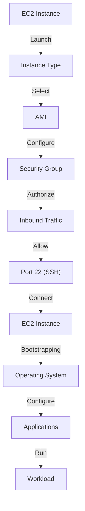

## Introduction
**Amazon EC2 (Elastic Compute Cloud)** is a web service provided by Amazon Web Services (AWS) that allows users to run and manage virtual machines in the cloud. EC2 provides a wide range of instance types, from small to large, to accommodate different workloads and use cases. With EC2, users can launch virtual servers, configure security and networking, and manage storage, all while only paying for the resources they use. In this study guide, we will delve into the core concepts of EC2, including instance types, AMIs, security groups, and key pairs, as well as provide code examples, visual diagrams, and real-world use cases.

> **Note:** EC2 is a fundamental service in AWS, and understanding its concepts and features is crucial for any cloud engineer or architect.

## Core Concepts
- **Instance Types:** EC2 provides a wide range of instance types, each with its own set of characteristics, such as CPU, memory, and storage. Instance types are categorized into several families, including General Purpose, Compute Optimized, Memory Optimized, and Storage Optimized.
- **AMIs (Amazon Machine Images):** An AMI is a pre-configured image that contains the operating system, applications, and settings required to launch an EC2 instance. AMIs can be created from scratch or based on existing images.
- **Security Groups:** A security group is a virtual firewall that controls inbound and outbound traffic to an EC2 instance. Security groups can be used to allow or deny traffic based on IP address, port, and protocol.
- **Key Pairs:** A key pair is a set of cryptographic keys used to securely connect to an EC2 instance. Key pairs consist of a public key and a private key, which are used for authentication and encryption.

> **Tip:** When creating an EC2 instance, it's essential to choose the right instance type and configure the security group and key pair correctly to ensure optimal performance and security.

## How It Works Internally
When an EC2 instance is launched, the following steps occur:
1. **Instance Type Selection:** The user selects an instance type based on their workload requirements.
2. **AMI Selection:** The user selects an AMI that contains the required operating system and applications.
3. **Security Group Configuration:** The user configures the security group to allow or deny traffic based on IP address, port, and protocol.
4. **Key Pair Generation:** The user generates a key pair, which is used to securely connect to the EC2 instance.
5. **Instance Launch:** The EC2 instance is launched, and the operating system and applications are installed and configured.
6. **Instance Bootstrapping:** The EC2 instance is bootstrapped, and the necessary scripts and configurations are applied.

> **Warning:** If the security group is not configured correctly, the EC2 instance may be vulnerable to unauthorized access or attacks.

## Code Examples
### Example 1: Launching an EC2 Instance using AWS CLI
```bash
# Import the necessary libraries
aws ec2 describe-images --owners amazon

# Set the instance type and AMI ID
INSTANCE_TYPE="t2.micro"
AMI_ID="ami-0c94855ba95c71c99"

# Launch the EC2 instance
aws ec2 run-instances --image-id $AMI_ID --instance-type $INSTANCE_TYPE
```
### Example 2: Creating a Security Group using AWS SDK (Python)
```python
import boto3

# Create an EC2 client
ec2 = boto3.client('ec2')

# Create a security group
response = ec2.create_security_group(
    GroupName='my-security-group',
    Description='My security group'
)

# Get the security group ID
security_group_id = response['GroupId']

# Authorize inbound traffic on port 22 (SSH)
ec2.authorize_security_group_ingress(
    GroupId=security_group_id,
    IpPermissions=[
        {
            'IpProtocol': 'tcp',
            'FromPort': 22,
            'ToPort': 22,
            'IpRanges': [
                {
                    'CidrIp': '0.0.0.0/0'
                }
            ]
        }
    ]
)
```
### Example 3: Connecting to an EC2 Instance using SSH (Java)
```java
import com.jcraft.jsch.JSch;
import com.jcraft.jsch.JSchException;
import com.jcraft.jsch.Session;

// Set the EC2 instance IP address and key pair
String ipAddress = "ec2-instance-ip-address";
String privateKey = "path-to-private-key";

// Create a JSch object
JSch jsch = new JSch();

// Add the private key to the JSch object
jsch.addIdentity(privateKey);

// Create a session
Session session = jsch.getSession("ec2-user", ipAddress, 22);

// Connect to the EC2 instance
session.connect();
```
> **Interview:** Can you explain the difference between a security group and a network ACL? How would you configure them to allow inbound traffic on port 80 (HTTP)?

## Visual Diagram

The visual diagram illustrates the launch process of an EC2 instance, from selecting the instance type and AMI to configuring the security group and authorizing inbound traffic.

## Comparison
| Approach | Time Complexity | Space Complexity | Pros | Cons | Best For |
|----------|----------------|-----------------|------|------|----------|
| Security Group | O(1) | O(1) | Easy to configure, flexible | Limited control over inbound traffic | Small to medium-sized applications |
| Network ACL | O(n) | O(n) | Fine-grained control over inbound traffic | Complex configuration, limited scalability | Large-scale applications, enterprises |
| Firewall | O(1) | O(1) | Easy to configure, high security | Limited control over inbound traffic, additional cost | Small to medium-sized applications, high-security requirements |
| VPN | O(n) | O(n) | Secure, flexible | Complex configuration, high latency | Large-scale applications, remote access |

## Real-world Use Cases
1. **Netflix:** Netflix uses EC2 to run its video streaming service, with a large-scale deployment of instances across multiple availability zones.
2. **Airbnb:** Airbnb uses EC2 to run its web application, with a focus on security and scalability to handle high traffic volumes.
3. **Dropbox:** Dropbox uses EC2 to run its file storage service, with a large-scale deployment of instances across multiple availability zones.

> **Tip:** When designing a real-world application, consider using a combination of EC2 instance types, security groups, and key pairs to ensure optimal performance and security.

## Common Pitfalls
1. **Incorrect Security Group Configuration:** Failing to configure the security group correctly can lead to unauthorized access or attacks.
2. **Insufficient Key Pair Management:** Failing to manage key pairs correctly can lead to lost or compromised private keys.
3. **Inadequate Instance Monitoring:** Failing to monitor EC2 instances can lead to performance issues or security breaches.
4. **Inefficient Resource Utilization:** Failing to optimize resource utilization can lead to high costs and inefficient use of resources.

> **Warning:** Failing to follow best practices for EC2 instance management can lead to security breaches, performance issues, or high costs.

## Interview Tips
1. **What is the difference between a security group and a network ACL?**
	* Weak answer: "A security group is used to control inbound traffic, while a network ACL is used to control outbound traffic."
	* Strong answer: "A security group is a stateful firewall that controls inbound and outbound traffic, while a network ACL is a stateless firewall that controls inbound and outbound traffic at the subnet level."
2. **How would you configure a security group to allow inbound traffic on port 80 (HTTP)?**
	* Weak answer: "I would create a security group and add a rule to allow inbound traffic on port 80."
	* Strong answer: "I would create a security group, add a rule to allow inbound traffic on port 80, and specify the source IP address or CIDR block to restrict access."
3. **What is the purpose of a key pair in EC2?**
	* Weak answer: "A key pair is used to authenticate users."
	* Strong answer: "A key pair is used to securely connect to an EC2 instance, with the private key used for authentication and encryption."

## Key Takeaways
* EC2 provides a wide range of instance types to accommodate different workloads and use cases.
* Security groups and key pairs are essential for securing EC2 instances.
* AMIs can be used to create customized images for EC2 instances.
* EC2 instances can be launched and managed using the AWS CLI, SDKs, or AWS Management Console.
* Real-world applications such as Netflix, Airbnb, and Dropbox use EC2 to run their web applications and services.
* Common pitfalls include incorrect security group configuration, insufficient key pair management, inadequate instance monitoring, and inefficient resource utilization.
* Best practices for EC2 instance management include using security groups, key pairs, and monitoring tools to ensure optimal performance and security.