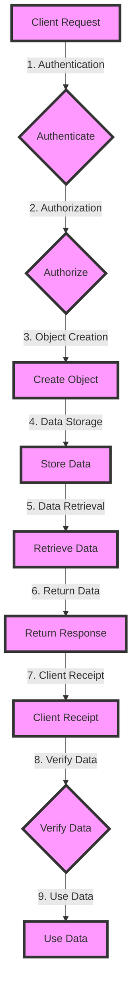

## Introduction
**Amazon S3 (Simple Storage Service)** is a highly durable, scalable, and secure object storage service offered by AWS. It allows users to store and serve large amounts of data, such as videos, images, and documents, from anywhere on the web. S3 is a fundamental service in the AWS ecosystem, and understanding how it works is crucial for building scalable and reliable applications. In this section, we will delve into the world of S3, exploring its core concepts, internal mechanics, and best practices for using it effectively.

> **Note:** S3 is not a traditional file system, but rather an object store, which means it stores data as a collection of objects, each with its own metadata.

## Core Concepts
To work with S3, you need to understand the following core concepts:
* **Buckets**: A bucket is a container that holds objects. You can think of a bucket as a directory, but it's more like a namespace that stores objects.
* **Objects**: An object is a file or a collection of files stored in a bucket. Objects can be up to 5 TB in size, and they are stored in a single location.
* **Versioning**: Versioning allows you to store multiple versions of an object in a bucket. This is useful for tracking changes to an object over time.
* **Lifecycle Policies**: A lifecycle policy is a set of rules that define how objects in a bucket are managed over time. You can use lifecycle policies to transition objects to different storage classes, archive them, or delete them.

> **Tip:** Use versioning to track changes to your objects, and use lifecycle policies to automate the management of your objects.

## How It Works Internally
When you upload an object to S3, the following steps occur:
1. **Authentication**: Your request is authenticated using your AWS credentials.
2. **Authorization**: Your request is authorized to ensure you have permission to upload an object to the specified bucket.
3. **Object Creation**: The object is created in the specified bucket, and its metadata is stored in the S3 database.
4. **Data Storage**: The object data is stored in a distributed storage system, which ensures high durability and availability.
5. **Data Retrieval**: When you request an object, S3 retrieves the object data from the storage system and returns it to you.

> **Warning:** S3 uses a distributed storage system, which means that data is stored across multiple devices. This provides high durability and availability, but it also means that data retrieval can take longer than traditional file systems.

## Code Examples
Here are three complete and runnable examples that demonstrate how to use S3:
### Example 1: Basic Object Upload
```python
import boto3

# Create an S3 client
s3 = boto3.client('s3')

# Define the bucket and object names
bucket_name = 'my-bucket'
object_name = 'my-object.txt'

# Upload the object
s3.put_object(Body='Hello World!', Bucket=bucket_name, Key=object_name)
```
### Example 2: Versioning and Lifecycle Policies
```python
import boto3

# Create an S3 client
s3 = boto3.client('s3')

# Define the bucket and object names
bucket_name = 'my-bucket'
object_name = 'my-object.txt'

# Enable versioning on the bucket
s3.put_bucket_versioning(
    Bucket=bucket_name,
    VersioningConfiguration={
        'Status': 'Enabled'
    }
)

# Upload the object with versioning
s3.put_object(Body='Hello World!', Bucket=bucket_name, Key=object_name)

# Define a lifecycle policy
lifecycle_policy = {
    'Rules': [
        {
            'ID': 'Transition to Standard-IA after 30 days',
            'Filter': {},
            'Status': 'Enabled',
            'Transitions': [
                {
                    'Date': '30',
                    'StorageClass': 'STANDARD_IA'
                }
            ]
        }
    ]
}

# Apply the lifecycle policy to the bucket
s3.put_bucket_lifecycle_configuration(
    Bucket=bucket_name,
    LifecycleConfiguration=lifecycle_policy
)
```
### Example 3: Advanced Object Retrieval
```python
import boto3

# Create an S3 client
s3 = boto3.client('s3')

# Define the bucket and object names
bucket_name = 'my-bucket'
object_name = 'my-object.txt'

# Retrieve the object with versioning
response = s3.get_object(
    Bucket=bucket_name,
    Key=object_name,
    VersionId='string'
)

# Print the object data
print(response['Body'].read().decode('utf-8'))
```
> **Interview:** Can you explain the difference between S3's `put_object` and `upload_part` methods? How would you use them in a real-world application?

## Visual Diagram

The diagram illustrates the steps involved in uploading and retrieving an object from S3. The client request is authenticated and authorized, and then the object is created and stored in the S3 database. The object data is stored in a distributed storage system, and when the client requests the object, the data is retrieved and returned to the client.

## Comparison
The following table compares different approaches to storing and retrieving objects in S3:
| Approach | Time Complexity | Space Complexity | Pros | Cons | Best For |
| --- | --- | --- | --- | --- | --- |
| **put_object** | O(1) | O(1) | Simple, efficient | Limited to 5 GB | Small objects |
| **upload_part** | O(n) | O(n) | Can handle large objects | More complex, requires multipart upload | Large objects |
| **get_object** | O(1) | O(1) | Simple, efficient | Limited to 5 GB | Small objects |
| **list_objects** | O(n) | O(n) | Can retrieve multiple objects | More complex, requires pagination | Large numbers of objects |
> **Tip:** Use `put_object` for small objects and `upload_part` for large objects. Use `get_object` for retrieving small objects and `list_objects` for retrieving large numbers of objects.

## Real-world Use Cases
The following companies use S3 in production:
* **Netflix**: Uses S3 to store and stream video content to millions of users.
* **Dropbox**: Uses S3 to store and sync user files across devices.
* **Airbnb**: Uses S3 to store and serve images and other media for listings.

## Common Pitfalls
The following are common mistakes made when using S3:
* **Not enabling versioning**: Failing to enable versioning can result in data loss if an object is accidentally deleted or overwritten.
* **Not using lifecycle policies**: Failing to use lifecycle policies can result in unnecessary storage costs and data retention.
* **Not handling errors**: Failing to handle errors can result in application crashes and data corruption.
* **Not using secure protocols**: Failing to use secure protocols can result in data breaches and security vulnerabilities.

> **Warning:** Always enable versioning and use lifecycle policies to manage your objects. Always handle errors and use secure protocols to protect your data.

## Interview Tips
The following are common interview questions related to S3:
* **What is the difference between S3's `put_object` and `upload_part` methods?**: The `put_object` method is used for small objects, while the `upload_part` method is used for large objects.
* **How do you handle errors when using S3?**: Use try-except blocks to catch and handle errors, and always log error messages for debugging purposes.
* **What is the purpose of lifecycle policies in S3?**: Lifecycle policies are used to manage the storage and retention of objects in S3, and can be used to automate tasks such as transitioning objects to different storage classes or deleting objects after a certain period of time.

> **Interview:** Can you explain the concept of data durability in S3? How does S3 ensure that data is stored reliably and securely?

## Key Takeaways
The following are key takeaways related to S3:
* **S3 is an object store, not a traditional file system**: S3 stores data as a collection of objects, each with its own metadata.
* **Use versioning to track changes to objects**: Versioning allows you to store multiple versions of an object in a bucket.
* **Use lifecycle policies to manage objects**: Lifecycle policies can be used to automate tasks such as transitioning objects to different storage classes or deleting objects after a certain period of time.
* **Always handle errors and use secure protocols**: Failing to handle errors and use secure protocols can result in application crashes and data breaches.
* **Use `put_object` for small objects and `upload_part` for large objects**: The `put_object` method is used for small objects, while the `upload_part` method is used for large objects.
* **Use `get_object` for retrieving small objects and `list_objects` for retrieving large numbers of objects**: The `get_object` method is used for retrieving small objects, while the `list_objects` method is used for retrieving large numbers of objects.