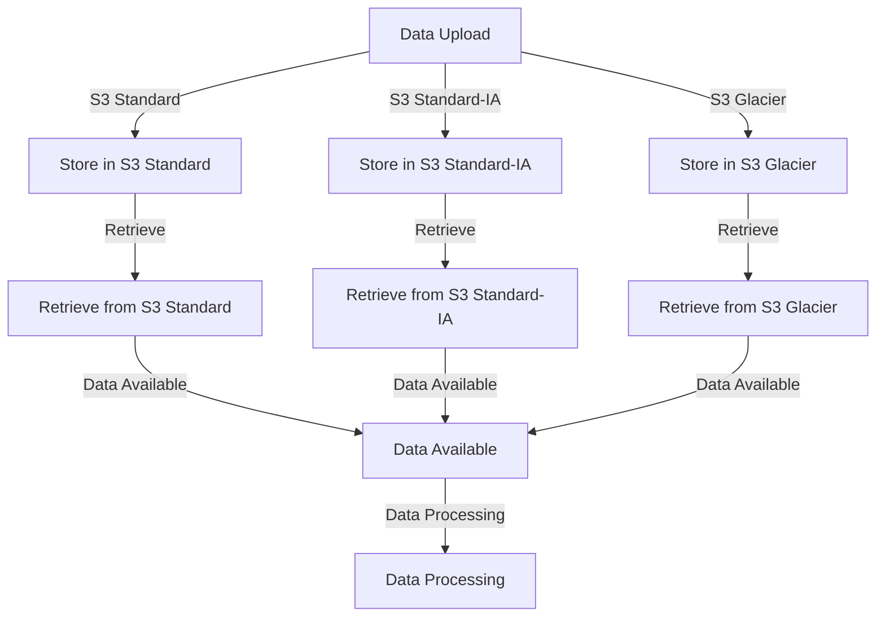

## Introduction
**Amazon S3** is a highly durable, scalable, and secure object store that allows users to store and retrieve data from anywhere on the internet. **S3 Storage Classes** are a key feature of Amazon S3, providing different levels of storage, retrieval, and pricing options to meet the needs of various use cases. In this section, we will delve into the world of S3 Storage Classes, exploring what they are, why they matter, and their real-world relevance.

S3 Storage Classes are essential for optimizing storage costs, ensuring data durability, and meeting specific business requirements. With the increasing amount of data being generated, stored, and processed, it is crucial to understand the different storage classes available in Amazon S3. This knowledge will enable you to make informed decisions about which storage class to use for your specific use case, ensuring that your data is stored efficiently, securely, and cost-effectively.

> **Note:** Amazon S3 provides six storage classes: S3 Standard, S3 Standard-IA, S3 One Zone-IA, S3 Intelligent-Tiering, S3 Glacier, and S3 Glacier Deep Archive. Each storage class has its own characteristics, benefits, and use cases.

## Core Concepts
To understand S3 Storage Classes, it is essential to grasp the following core concepts:

* **Data durability**: The ability of a storage system to ensure that data is not lost or corrupted over time.
* **Data availability**: The ability of a storage system to ensure that data is accessible when needed.
* **Storage cost**: The cost of storing data in a particular storage class.
* **Retrieval cost**: The cost of retrieving data from a particular storage class.

The three main S3 Storage Classes are:

* **S3 Standard**: Designed for frequently accessed data, offering high durability and availability.
* **S3 Standard-IA**: Designed for less frequently accessed data, offering a lower storage cost than S3 Standard.
* **S3 Glacier**: Designed for archiving data, offering the lowest storage cost but higher retrieval costs and longer retrieval times.

> **Tip:** When choosing an S3 Storage Class, consider the trade-offs between data durability, availability, storage cost, and retrieval cost.

## How It Works Internally
Here's a step-by-step breakdown of how S3 Storage Classes work internally:

1. **Data upload**: When you upload data to Amazon S3, you specify the storage class for the object.
2. **Data storage**: Amazon S3 stores the data in the specified storage class, using a combination of disk storage and redundancy to ensure data durability.
3. **Data retrieval**: When you retrieve data from Amazon S3, the system checks the storage class of the object and retrieves it accordingly.
4. **Storage cost calculation**: Amazon S3 calculates the storage cost based on the storage class, object size, and storage duration.
5. **Retrieval cost calculation**: Amazon S3 calculates the retrieval cost based on the storage class, object size, and retrieval frequency.

> **Warning:** Be aware of the retrieval costs associated with each storage class, as they can add up quickly, especially for large objects or frequent retrievals.

## Code Examples
Here are three complete, runnable code examples demonstrating the use of S3 Storage Classes:

### Example 1: Basic S3 Upload with S3 Standard Storage Class
```python
import boto3

s3 = boto3.client('s3')

# Upload object to S3 with S3 Standard storage class
s3.put_object(
    Bucket='my-bucket',
    Key='my-object.txt',
    Body='Hello, World!',
    StorageClass='STANDARD'
)
```

### Example 2: S3 Upload with S3 Standard-IA Storage Class
```python
import boto3

s3 = boto3.client('s3')

# Upload object to S3 with S3 Standard-IA storage class
s3.put_object(
    Bucket='my-bucket',
    Key='my-object.txt',
    Body='Hello, World!',
    StorageClass='STANDARD_IA'
)
```

### Example 3: S3 Upload with S3 Glacier Storage Class and Lifecycle Configuration
```python
import boto3

s3 = boto3.client('s3')
iam = boto3.client('iam')

# Create IAM role for S3 Glacier
iam.create_role(
    RoleName='S3GlacierRole',
    AssumeRolePolicyDocument={
        'Version': '2012-10-17',
        'Statement': [
            {
                'Effect': 'Allow',
                'Principal': {
                    'Service': 's3.amazonaws.com'
                },
                'Action': 'sts:AssumeRole'
            }
        ]
    }
)

# Create S3 bucket with lifecycle configuration
s3.create_bucket(
    Bucket='my-bucket',
    CreateBucketConfiguration={
        'LocationConstraint': 'us-east-1'
    }
)

# Upload object to S3 with S3 Glacier storage class and lifecycle configuration
s3.put_object(
    Bucket='my-bucket',
    Key='my-object.txt',
    Body='Hello, World!',
    StorageClass='GLACIER'
)

# Create lifecycle configuration
s3.put_bucket_lifecycle_configuration(
    Bucket='my-bucket',
    LifecycleConfiguration={
        'Rules': [
            {
                'ID': 'S3GlacierRule',
                'Filter': {
                    'Prefix': 'glacier/'
                },
                'Status': 'Enabled',
                'Transition': {
                    'Date': '2024-01-01T00:00:00.000Z',
                    'StorageClass': 'GLACIER'
                }
            }
        ]
    }
)
```

## Visual Diagram

This diagram illustrates the flow of data through the different S3 Storage Classes, from upload to retrieval and processing.

## Comparison
Here's a comparison table of the three main S3 Storage Classes:

| Storage Class | Data Durability | Data Availability | Storage Cost | Retrieval Cost |
| --- | --- | --- | --- | --- |
| S3 Standard | 99.999999999% | 99.99% | $0.023 per GB-month | $0.000004 per GB |
| S3 Standard-IA | 99.999999999% | 99.9% | $0.0125 per GB-month | $0.00001 per GB |
| S3 Glacier | 99.999999999% | N/A | $0.004 per GB-month | $0.05 per GB |

> **Interview:** What are the trade-offs between data durability, availability, storage cost, and retrieval cost in S3 Storage Classes? (Answer: Data durability and availability come at a higher storage cost, while retrieval cost is higher for less frequently accessed data.)

## Real-world Use Cases
Here are three production examples of S3 Storage Classes in use:

* **Netflix**: Uses S3 Standard for storing and streaming video content, ensuring high data durability and availability.
* **Amazon**: Uses S3 Standard-IA for storing and retrieving product images, balancing storage cost and retrieval frequency.
* **NASA**: Uses S3 Glacier for archiving and preserving large datasets, taking advantage of the lowest storage cost and long-term data preservation.

## Common Pitfalls
Here are four specific mistakes to avoid when using S3 Storage Classes:

* **Incorrect storage class selection**: Choosing the wrong storage class for your use case, leading to higher costs or reduced data durability.
* **Insufficient data retrieval planning**: Failing to plan for data retrieval costs and frequencies, resulting in unexpected expenses.
* **Inadequate data lifecycle management**: Not implementing a data lifecycle management strategy, leading to data accumulation and increased storage costs.
* **Insecure data storage**: Not using proper security measures, such as encryption and access controls, to protect data stored in S3.

> **Warning:** Be aware of the potential pitfalls and take steps to avoid them, ensuring that your S3 Storage Class usage is optimized and secure.

## Interview Tips
Here are three common interview questions related to S3 Storage Classes, along with weak and strong answer examples:

* **Question 1:** What is the difference between S3 Standard and S3 Standard-IA?
	+ Weak answer: "S3 Standard is for storing data, and S3 Standard-IA is for storing less frequently accessed data."
	+ Strong answer: "S3 Standard offers high data durability and availability, while S3 Standard-IA provides a lower storage cost but slightly reduced data availability. The choice between the two depends on the specific use case and requirements."
* **Question 2:** How do you optimize storage costs in S3?
	+ Weak answer: "I use S3 Standard for all my data."
	+ Strong answer: "I analyze my data access patterns and storage requirements, and choose the most cost-effective S3 Storage Class for each use case. I also implement data lifecycle management strategies to minimize storage costs and ensure data durability."
* **Question 3:** What are some best practices for using S3 Glacier?
	+ Weak answer: "I store all my data in S3 Glacier."
	+ Strong answer: "I use S3 Glacier for long-term data archiving and preservation, and ensure that I have a clear data retrieval plan in place to minimize costs and retrieval times. I also consider using S3 Glacier Deep Archive for extremely long-term data storage."

## Key Takeaways
Here are ten key takeaways to remember about S3 Storage Classes:

* S3 Standard offers high data durability and availability, but at a higher storage cost.
* S3 Standard-IA provides a lower storage cost but slightly reduced data availability.
* S3 Glacier offers the lowest storage cost but higher retrieval costs and longer retrieval times.
* Data durability and availability come at a higher storage cost.
* Retrieval cost is higher for less frequently accessed data.
* Implementing a data lifecycle management strategy can help minimize storage costs and ensure data durability.
* Choosing the right S3 Storage Class depends on the specific use case and requirements.
* Analyzing data access patterns and storage requirements is essential for optimizing storage costs.
* Ensuring data security and access controls is crucial for protecting data stored in S3.
* Understanding the trade-offs between data durability, availability, storage cost, and retrieval cost is essential for effective S3 Storage Class usage.