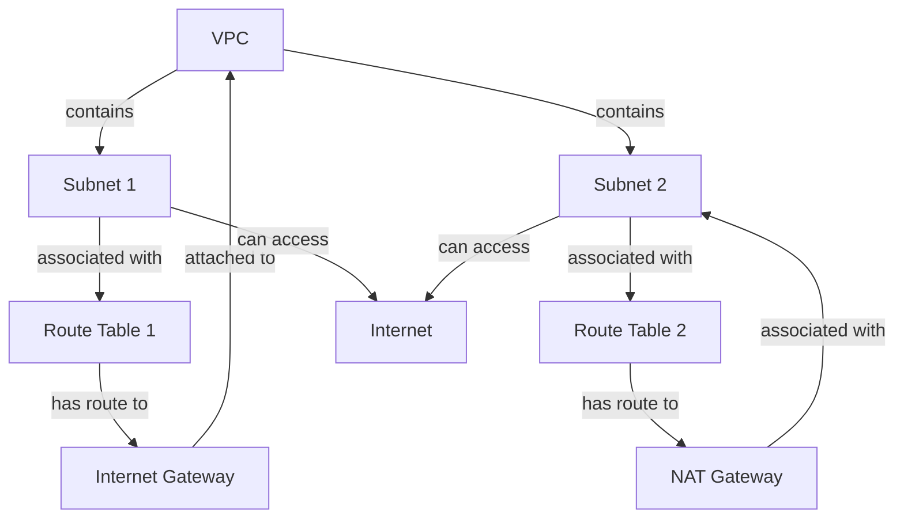

## Introduction
A **Virtual Private Cloud (VPC)** is a virtual network dedicated to your AWS account. It allows you to launch AWS resources, such as Amazon EC2 instances, into a virtual network that you define. A VPC is similar to a traditional network that you would operate in your own data center, with the benefits of using the scalable infrastructure of AWS. In this study guide, we will explore the core concepts of VPC, including subnets, route tables, internet gateways, and NAT gateways. We will also provide code examples, visual diagrams, and real-world use cases to help you understand how to design and implement a secure and scalable VPC.

> **Note:** A VPC is a fundamental component of AWS, and understanding how to design and implement a VPC is crucial for any AWS professional.

## Core Concepts
The following are the core concepts related to VPC:

* **Subnet**: A subnet is a segment of a VPC's IP address range where you can place groups of isolated resources. You can think of a subnet as a network segment.
* **Route Table**: A route table is a set of rules that determine where network traffic from your subnet or gateway is directed. You can associate a route table with a subnet or a gateway.
* **Internet Gateway**: An internet gateway is a horizontally scaled, redundant, and highly available VPC component that allows communication between your VPC and the internet.
* **NAT Gateway**: A NAT gateway is a managed service that provides outbound internet access for instances in a private subnet.

> **Tip:** When designing a VPC, it's essential to plan your subnets carefully, as they will determine the IP address range and the level of isolation for your resources.

## How It Works Internally
Here's a step-by-step breakdown of how a VPC works internally:

1. When you create a VPC, you define an IP address range for the VPC.
2. You create subnets within the VPC, and each subnet has its own IP address range.
3. You associate a route table with each subnet, which determines where network traffic from the subnet is directed.
4. If you want to allow internet access from your VPC, you create an internet gateway and attach it to your VPC.
5. If you want to allow outbound internet access from a private subnet, you create a NAT gateway and associate it with the subnet.

> **Warning:** If you don't associate a route table with a subnet, the subnet will not be able to communicate with other subnets or the internet.

## Code Examples
The following are three complete and runnable code examples that demonstrate how to create and configure a VPC, subnets, route tables, internet gateways, and NAT gateways using AWS CloudFormation:

### Example 1: Basic VPC and Subnet
```python
import boto3

# Create a VPC
ec2 = boto3.client('ec2')
vpc = ec2.create_vpc(
    CidrBlock='10.0.0.0/16',
    TagSpecifications=[
        {
            'ResourceType': 'vpc',
            'Tags': [
                {
                    'Key': 'Name',
                    'Value': 'my-vpc'
                },
            ]
        },
    ]
)

# Create a subnet
subnet = ec2.create_subnet(
    VpcId=vpc['Vpc']['VpcId'],
    CidrBlock='10.0.1.0/24',
    AvailabilityZone='us-west-2a',
    TagSpecifications=[
        {
            'ResourceType': 'subnet',
            'Tags': [
                {
                    'Key': 'Name',
                    'Value': 'my-subnet'
                },
            ]
        },
    ]
)
```

### Example 2: Route Table and Internet Gateway
```python
import boto3

# Create a route table
ec2 = boto3.client('ec2')
route_table = ec2.create_route_table(
    VpcId='vpc-12345678',
    TagSpecifications=[
        {
            'ResourceType': 'route-table',
            'Tags': [
                {
                    'Key': 'Name',
                    'Value': 'my-route-table'
                },
            ]
        },
    ]
)

# Create an internet gateway
internet_gateway = ec2.create_internet_gateway(
    TagSpecifications=[
        {
            'ResourceType': 'internet-gateway',
            'Tags': [
                {
                    'Key': 'Name',
                    'Value': 'my-internet-gateway'
                },
            ]
        },
    ]
)

# Attach the internet gateway to the VPC
ec2.attach_internet_gateway(
    InternetGatewayId=internet_gateway['InternetGateway']['InternetGatewayId'],
    VpcId='vpc-12345678'
)

# Create a route to the internet gateway
ec2.create_route(
    RouteTableId=route_table['RouteTable']['RouteTableId'],
    DestinationCidrBlock='0.0.0.0/0',
    GatewayId=internet_gateway['InternetGateway']['InternetGatewayId']
)
```

### Example 3: NAT Gateway and Private Subnet
```python
import boto3

# Create a NAT gateway
ec2 = boto3.client('ec2')
nat_gateway = ec2.create_nat_gateway(
    SubnetId='subnet-12345678',
    TagSpecifications=[
        {
            'ResourceType': 'nat-gateway',
            'Tags': [
                {
                    'Key': 'Name',
                    'Value': 'my-nat-gateway'
                },
            ]
        },
    ]
)

# Create a private subnet
private_subnet = ec2.create_subnet(
    VpcId='vpc-12345678',
    CidrBlock='10.0.2.0/24',
    AvailabilityZone='us-west-2a',
    TagSpecifications=[
        {
            'ResourceType': 'subnet',
            'Tags': [
                {
                    'Key': 'Name',
                    'Value': 'my-private-subnet'
                },
            ]
        },
    ]
)

# Create a route table for the private subnet
private_route_table = ec2.create_route_table(
    VpcId='vpc-12345678',
    TagSpecifications=[
        {
            'ResourceType': 'route-table',
            'Tags': [
                {
                    'Key': 'Name',
                    'Value': 'my-private-route-table'
                },
            ]
        },
    ]
)

# Create a route to the NAT gateway
ec2.create_route(
    RouteTableId=private_route_table['RouteTable']['RouteTableId'],
    DestinationCidrBlock='0.0.0.0/0',
    NatGatewayId=nat_gateway['NatGateway']['NatGatewayId']
)
```

## Visual Diagram

This diagram shows a VPC with two subnets, each associated with a different route table. The first subnet has a route to an internet gateway, while the second subnet has a route to a NAT gateway.

> **Interview:** Can you explain the difference between a subnet and a route table? How do you associate a route table with a subnet?

## Comparison
The following table compares the different types of gateways and their characteristics:

| Gateway Type | Purpose | Cost | Complexity |
| --- | --- | --- | --- |
| Internet Gateway | Provides internet access to a VPC | Free | Low |
| NAT Gateway | Provides outbound internet access to a private subnet | Charged by the hour | Medium |
| VPN Gateway | Provides a secure connection between a VPC and a remote network | Charged by the hour | High |
| Direct Connect Gateway | Provides a dedicated network connection between a VPC and a remote network | Charged by the hour | High |

## Real-world Use Cases
The following are three real-world use cases for VPCs and subnets:

* **Amazon**: Amazon uses VPCs to provide a secure and isolated environment for its e-commerce platform. Each VPC is associated with a specific region and has multiple subnets for different types of resources.
* **Netflix**: Netflix uses VPCs to provide a secure and scalable environment for its streaming service. Each VPC is associated with a specific region and has multiple subnets for different types of resources.
* **Airbnb**: Airbnb uses VPCs to provide a secure and isolated environment for its web application. Each VPC is associated with a specific region and has multiple subnets for different types of resources.

## Common Pitfalls
The following are four common pitfalls to avoid when designing and implementing a VPC:

* **Incorrect Subnet CIDR Blocks**: Using incorrect subnet CIDR blocks can lead to IP address conflicts and routing issues.
* **Insufficient Route Tables**: Not creating enough route tables can lead to routing issues and security vulnerabilities.
* **Incorrect Gateway Associations**: Not associating gateways with the correct subnets can lead to connectivity issues.
* **Inadequate Security Groups**: Not creating adequate security groups can lead to security vulnerabilities.

> **Warning:** Not monitoring VPC logs and metrics can lead to security vulnerabilities and performance issues.

## Interview Tips
The following are three common interview questions related to VPCs and subnets, along with sample answers:

* **What is the difference between a subnet and a route table?**
	+ Weak answer: A subnet is a network segment, and a route table is a set of rules that determine where network traffic is directed.
	+ Strong answer: A subnet is a segment of a VPC's IP address range where you can place groups of isolated resources. A route table is a set of rules that determine where network traffic from your subnet or gateway is directed. You can associate a route table with a subnet or a gateway.
* **How do you associate a route table with a subnet?**
	+ Weak answer: You can associate a route table with a subnet using the AWS Management Console or the AWS CLI.
	+ Strong answer: You can associate a route table with a subnet using the AWS Management Console or the AWS CLI. To do this, you need to create a route table and then associate it with the subnet. You can also associate a route table with a gateway.
* **What is the purpose of a NAT gateway?**
	+ Weak answer: A NAT gateway provides internet access to a private subnet.
	+ Strong answer: A NAT gateway provides outbound internet access to a private subnet. It allows instances in a private subnet to connect to the internet, but prevents the internet from connecting to the instances.

## Key Takeaways
The following are ten key takeaways to remember when designing and implementing a VPC:

* **VPCs provide a secure and isolated environment for resources**.
* **Subnets are segments of a VPC's IP address range**.
* **Route tables determine where network traffic is directed**.
* **Internet gateways provide internet access to a VPC**.
* **NAT gateways provide outbound internet access to a private subnet**.
* **Security groups provide network traffic filtering**.
* **VPC logs and metrics should be monitored regularly**.
* **VPCs should be designed with scalability and security in mind**.
* **Subnets should be associated with the correct route tables**.
* **Gateways should be associated with the correct subnets**.

> **Tip:** When designing a VPC, it's essential to plan your subnets carefully, as they will determine the IP address range and the level of isolation for your resources.