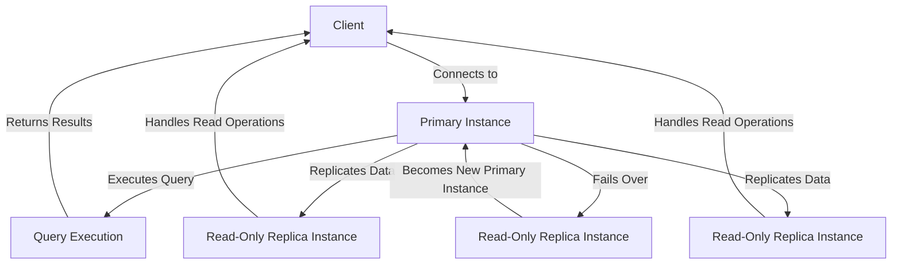

## Introduction
**Aurora** is a MySQL and PostgreSQL compatible relational database service offered by Amazon Web Services (AWS). It is designed to provide high performance, reliability, and scalability for database workloads. Aurora is built on top of a custom-designed database engine that is compatible with MySQL and PostgreSQL, allowing users to easily migrate their existing databases to the cloud. In this section, we will explore the benefits of using Aurora, its real-world relevance, and why every engineer should know about it.
> **Note:** Aurora is a fully managed database service, which means that AWS handles the underlying infrastructure and maintenance, allowing users to focus on their application development.

## Core Concepts
To understand Aurora, it's essential to grasp the following core concepts:
* **Database Engine**: Aurora is built on a custom-designed database engine that is compatible with MySQL and PostgreSQL. This engine provides high performance, reliability, and scalability for database workloads.
* **Cluster**: An Aurora cluster consists of a primary instance and up to 15 read-only replica instances. The primary instance handles all write operations, while the replica instances handle read operations.
* **Instance Type**: Aurora supports a variety of instance types, including General Purpose, Memory Optimized, and Burstable Performance.
* **Storage**: Aurora uses a distributed storage system that provides high availability and durability for database data.
> **Warning:** Aurora is not a direct replacement for MySQL or PostgreSQL. While it is compatible with these databases, there may be some differences in behavior and functionality.

## How It Works Internally
Here's a step-by-step breakdown of how Aurora works internally:
1. **Connection Establishment**: When a client connects to an Aurora cluster, the connection is established with the primary instance.
2. **Query Execution**: The primary instance executes the query and returns the results to the client.
3. **Read Replication**: For read-only queries, the client can connect to a read-only replica instance, which replicates the data from the primary instance.
4. **Write Replication**: For write operations, the primary instance replicates the data to the read-only replica instances.
5. **Failover**: If the primary instance fails, one of the read-only replica instances is promoted to become the new primary instance.
> **Tip:** Aurora provides a **Database Activity Stream** feature that allows users to monitor and analyze database activity in real-time.

## Code Examples
Here are three complete and runnable code examples that demonstrate how to use Aurora:
### Example 1: Basic Usage
```python
import boto3

# Create an Aurora client
aurora = boto3.client('rds')

# Create a new Aurora cluster
response = aurora.create_db_cluster(
    DBClusterIdentifier='my-aurora-cluster',
    MasterUsername='my-username',
    MasterUserPassword='my-password',
    DBClusterParameterGroupName='default.aurora5.6',
    VpcSecurityGroupIds=['sg-12345678'],
    DBSubnetGroupName='my-subnet-group'
)

print(response)
```
### Example 2: Real-World Pattern
```java
import software.amazon.awssdk.services.rds.RdsClient;
import software.amazon.awssdk.services.rds.model.CreateDbClusterRequest;
import software.amazon.awssdk.services.rds.model.CreateDbClusterResponse;

// Create an Aurora client
RdsClient aurora = RdsClient.create();

// Create a new Aurora cluster
CreateDbClusterRequest request = CreateDbClusterRequest.builder()
        .dBClusterIdentifier("my-aurora-cluster")
        .masterUsername("my-username")
        .masterUserPassword("my-password")
        .dBClusterParameterGroupName("default.aurora5.6")
        .vpcSecurityGroupIds("sg-12345678")
        .dBSubnetGroupName("my-subnet-group")
        .build();

CreateDbClusterResponse response = aurora.createDbCluster(request);

System.out.println(response);
```
### Example 3: Advanced Usage
```javascript
const { RDSClient } = require('@aws-sdk/client-rds');

// Create an Aurora client
const aurora = new RDSClient({ region: 'us-east-1' });

// Create a new Aurora cluster
const params = {
  DBClusterIdentifier: 'my-aurora-cluster',
  MasterUsername: 'my-username',
  MasterUserPassword: 'my-password',
  DBClusterParameterGroupName: 'default.aurora5.6',
  VpcSecurityGroupIds: ['sg-12345678'],
  DBSubnetGroupName: 'my-subnet-group'
};

aurora.createDBCluster(params, (err, data) => {
  if (err) {
    console.log(err);
  } else {
    console.log(data);
  }
});
```
> **Interview:** What is the difference between Aurora and a traditional relational database management system? Answer: Aurora is a fully managed relational database service that provides high performance, reliability, and scalability for database workloads, while a traditional relational database management system requires manual management and maintenance.

## Visual Diagram

The diagram illustrates the architecture of an Aurora cluster, including the primary instance, read-only replica instances, and the client. The primary instance executes queries and replicates data to the read-only replica instances, which handle read operations. If the primary instance fails, one of the read-only replica instances becomes the new primary instance.

## Comparison
| Approach | Time Complexity | Space Complexity | Pros | Cons | Best For |
| --- | --- | --- | --- | --- | --- |
| Aurora | O(1) | O(n) | High performance, reliability, and scalability | Additional cost, compatibility issues | Large-scale database workloads |
| MySQL | O(n) | O(n) | Open-source, widely adopted | Limited scalability, manual management | Small- to medium-scale database workloads |
| PostgreSQL | O(n) | O(n) | Open-source, feature-rich | Limited scalability, manual management | Small- to medium-scale database workloads |
| Amazon RDS | O(1) | O(n) | Managed database service, high performance | Additional cost, limited control | Large-scale database workloads |
> **Tip:** When choosing a database approach, consider the trade-offs between performance, scalability, and cost.

## Real-world Use Cases
Here are three real-world use cases for Aurora:
1. **Airbnb**: Airbnb uses Aurora to power its database workloads, providing high performance and scalability for its large-scale application.
2. **Uber**: Uber uses Aurora to power its database workloads, providing high performance and reliability for its real-time analytics and reporting.
3. **Netflix**: Netflix uses Aurora to power its database workloads, providing high performance and scalability for its large-scale application.
> **Note:** These companies chose Aurora for its high performance, reliability, and scalability, as well as its ability to handle large-scale database workloads.

## Common Pitfalls
Here are four common pitfalls to avoid when using Aurora:
1. **Inadequate Instance Sizing**: Failing to properly size instances can lead to performance issues and increased costs.
2. **Insufficient Storage**: Failing to provide sufficient storage can lead to performance issues and data loss.
3. **Inadequate Security**: Failing to properly secure the database can lead to data breaches and security issues.
4. **Inadequate Monitoring**: Failing to properly monitor the database can lead to performance issues and downtime.
> **Warning:** Avoid these common pitfalls by properly sizing instances, providing sufficient storage, securing the database, and monitoring performance.

## Interview Tips
Here are three common interview questions and answers for Aurora:
1. **What is Aurora?**: Aurora is a fully managed relational database service that provides high performance, reliability, and scalability for database workloads.
2. **How does Aurora differ from MySQL and PostgreSQL?**: Aurora is a custom-designed database engine that is compatible with MySQL and PostgreSQL, but provides higher performance and scalability.
3. **What are the benefits of using Aurora?**: The benefits of using Aurora include high performance, reliability, and scalability, as well as reduced administrative burdens and costs.
> **Interview:** What are the trade-offs between using Aurora and a traditional relational database management system? Answer: The trade-offs include additional cost, compatibility issues, and limited control, but also provide high performance, reliability, and scalability.

## Key Takeaways
Here are ten key takeaways for Aurora:
* **Aurora is a fully managed relational database service**: Aurora provides high performance, reliability, and scalability for database workloads.
* **Aurora is compatible with MySQL and PostgreSQL**: Aurora is built on a custom-designed database engine that is compatible with MySQL and PostgreSQL.
* **Aurora provides high performance**: Aurora provides high performance for database workloads, including high throughput and low latency.
* **Aurora provides reliability and scalability**: Aurora provides reliability and scalability for database workloads, including automatic failover and replication.
* **Aurora reduces administrative burdens**: Aurora reduces administrative burdens by providing a fully managed database service.
* **Aurora provides security and compliance**: Aurora provides security and compliance features, including encryption and access controls.
* **Aurora supports a variety of instance types**: Aurora supports a variety of instance types, including General Purpose, Memory Optimized, and Burstable Performance.
* **Aurora provides a database activity stream**: Aurora provides a database activity stream feature that allows users to monitor and analyze database activity in real-time.
* **Aurora supports read replication**: Aurora supports read replication, which allows users to replicate data to read-only replica instances.
* **Aurora provides a cost-effective solution**: Aurora provides a cost-effective solution for large-scale database workloads, including reduced costs and improved performance.
> **Note:** These key takeaways provide a summary of the benefits and features of Aurora, as well as its use cases and best practices.