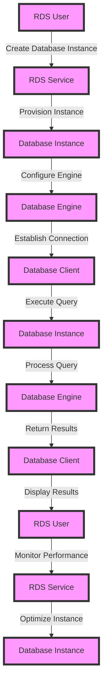

## Introduction
Amazon Relational Database Service (RDS) is a **managed relational database** service provided by Amazon Web Services (AWS). It allows users to create, manage, and scale relational databases in the cloud, supporting popular database engines such as MySQL, PostgreSQL, Oracle, SQL Server, and Amazon Aurora. RDS provides a **highly available** and **secure** database environment, with features like automated backups, patching, and scaling. With RDS, users can focus on developing and running their applications, without worrying about the underlying database infrastructure. 
> **Note:** RDS is a key component of AWS's database services, allowing users to choose from a range of database engines and manage their databases with ease.

## Core Concepts
To understand RDS, it's essential to grasp some core concepts:
* **Database Instance**: A self-contained database environment, with its own database engine, storage, and networking configuration.
* **Database Engine**: The underlying database management system, such as MySQL or PostgreSQL.
* **Storage**: The amount of disk space allocated to the database instance, which can be scaled up or down as needed.
* **Security Group**: A virtual firewall that controls incoming and outgoing network traffic to the database instance.
* **Parameter Group**: A collection of settings that define the behavior of the database instance, such as the database engine version and character set.
> **Tip:** When choosing a database engine, consider factors like data type support, query performance, and compatibility with your application.

## How It Works Internally
Here's a step-by-step breakdown of how RDS works internally:
1. **Instance Creation**: The user creates a new database instance, specifying the database engine, instance type, storage, and other configuration options.
2. **Instance Provisioning**: RDS provisions the database instance, allocating the specified resources and configuring the database engine.
3. **Connection Establishment**: The user establishes a connection to the database instance, using a database client or API.
4. **Query Execution**: The user executes queries against the database instance, which are processed by the database engine.
5. **Storage Management**: RDS manages the storage allocated to the database instance, handling tasks like backup and recovery.
6. **Security and Monitoring**: RDS provides security features like encryption and access controls, as well as monitoring and logging capabilities.
> **Warning:** When configuring security groups, ensure that the rules are restrictive enough to prevent unauthorized access to the database instance.

## Code Examples
Here are three complete, runnable code examples demonstrating how to interact with RDS:
### Example 1: Basic Connection
```python
import boto3
import psycopg2

# Create an RDS client
rds = boto3.client('rds')

# Get the database instance details
response = rds.describe_db_instances(
    DBInstanceIdentifier='my-database'
)

# Extract the database endpoint and credentials
endpoint = response['DBInstances'][0]['Endpoint']['Address']
username = 'my-username'
password = 'my-password'

# Establish a connection to the database instance
conn = psycopg2.connect(
    host=endpoint,
    user=username,
    password=password,
    dbname='my-database'
)

# Execute a query
cur = conn.cursor()
cur.execute('SELECT * FROM my-table')
results = cur.fetchall()

# Print the results
for row in results:
    print(row)

# Close the connection
conn.close()
```
### Example 2: Advanced Query Execution
```java
import software.amazon.awssdk.services.rds.RdsClient;
import software.amazon.awssdk.services.rds.model.DescribeDbInstancesRequest;
import software.amazon.awssdk.services.rds.model.DescribeDbInstancesResponse;
import java.sql.Connection;
import java.sql.DriverManager;
import java.sql.ResultSet;
import java.sql.SQLException;
import java.sql.Statement;

public class RdsExample {
    public static void main(String[] args) {
        // Create an RDS client
        RdsClient rds = RdsClient.create();

        // Get the database instance details
        DescribeDbInstancesRequest request = DescribeDbInstancesRequest.builder()
                .dbInstanceIdentifier("my-database")
                .build();
        DescribeDbInstancesResponse response = rds.describeDbInstances(request);

        // Extract the database endpoint and credentials
        String endpoint = response.dbInstances().get(0).endpoint().address();
        String username = "my-username";
        String password = "my-password";

        // Establish a connection to the database instance
        Connection conn = DriverManager.getConnection(
                "jdbc:postgresql://" + endpoint + ":5432/my-database",
                username,
                password
        );

        // Execute a query
        Statement stmt = conn.createStatement();
        ResultSet results = stmt.executeQuery("SELECT * FROM my-table");

        // Print the results
        while (results.next()) {
            System.out.println(results.getString(1));
        }

        // Close the connection
        conn.close();
    }
}
```
### Example 3: Database Instance Creation
```bash
aws rds create-db-instance \
    --db-instance-identifier my-database \
    --db-instance-class db.t2.micro \
    --engine postgres \
    --master-username my-username \
    --master-user-password my-password \
    --allocated-storage 20
```
> **Interview:** When asked about RDS, be prepared to discuss the benefits of using a managed relational database service, such as reduced administrative burden and improved security.

## Visual Diagram

This diagram illustrates the flow of creating a database instance, establishing a connection, executing a query, and returning results.

## Comparison
Here's a comparison table highlighting the key differences between RDS and other database services:
| Approach | Time Complexity | Space Complexity | Pros | Cons | Best For |
|----------|----------------|-----------------|------|------|----------|
| RDS | O(1) | O(n) | Managed service, high availability, security | Limited control, costs | Web applications, enterprise databases |
| EC2 | O(n) | O(n) | Full control, cost-effective | Administrative burden, security | Custom databases, legacy systems |
| DynamoDB | O(1) | O(1) | NoSQL, high performance, scalable | Limited query support, costs | Real-time analytics, gaming |
| Aurora | O(1) | O(n) | MySQL and PostgreSQL compatibility, high performance | Limited control, costs | Web applications, enterprise databases |
> **Tip:** When choosing a database service, consider factors like data type support, query performance, and compatibility with your application.

## Real-world Use Cases
Here are three real-world use cases for RDS:
1. **Airbnb**: Airbnb uses RDS to manage its PostgreSQL database, which stores information about listings, users, and bookings.
2. **Uber**: Uber uses RDS to manage its MySQL database, which stores information about rides, drivers, and passengers.
3. **Netflix**: Netflix uses RDS to manage its PostgreSQL database, which stores information about user preferences, viewing history, and content metadata.
> **Note:** These companies use RDS to take advantage of its managed service features, such as automated backups and patching.

## Common Pitfalls
Here are four common pitfalls to avoid when using RDS:
1. **Insufficient Security**: Failing to configure security groups and access controls properly can lead to unauthorized access to the database instance.
2. **Inadequate Storage**: Failing to allocate sufficient storage to the database instance can lead to performance issues and data loss.
3. **Incompatible Database Engine**: Choosing an incompatible database engine can lead to compatibility issues and data corruption.
4. **Inadequate Monitoring**: Failing to monitor the database instance's performance and security can lead to downtime and data breaches.
> **Warning:** Always configure security groups and access controls properly to prevent unauthorized access to the database instance.

## Interview Tips
Here are three common interview questions related to RDS, along with weak and strong answers:
1. **What is RDS, and how does it work?**
	* Weak answer: "RDS is a database service that provides a managed relational database."
	* Strong answer: "RDS is a managed relational database service that provides a self-contained database environment, with features like automated backups, patching, and scaling. It works by provisioning a database instance, configuring the database engine, and establishing a connection to the instance."
2. **How do you optimize the performance of an RDS database instance?**
	* Weak answer: "I would increase the instance type and allocate more storage."
	* Strong answer: "I would analyze the database instance's performance metrics, such as CPU utilization and disk I/O, and optimize the database engine configuration, indexing, and query execution plans accordingly. I would also consider using Amazon Aurora or other high-performance database engines."
3. **How do you ensure the security of an RDS database instance?**
	* Weak answer: "I would use a strong password and enable SSL/TLS encryption."
	* Strong answer: "I would configure security groups and access controls properly, using IAM roles and policies to restrict access to the database instance. I would also enable encryption at rest and in transit, using AWS Key Management Service (KMS) to manage encryption keys. Additionally, I would regularly monitor the database instance's security and performance metrics, using Amazon CloudWatch and AWS CloudTrail to detect and respond to security incidents."

## Key Takeaways
Here are ten key takeaways to remember when using RDS:
* **RDS provides a managed relational database service**, with features like automated backups and patching.
* **RDS supports multiple database engines**, including MySQL, PostgreSQL, Oracle, SQL Server, and Amazon Aurora.
* **RDS provides high availability and security**, with features like encryption at rest and in transit, and access controls using IAM roles and policies.
* **RDS supports scalable storage**, with options for allocating storage and configuring storage types.
* **RDS provides performance metrics**, using Amazon CloudWatch to monitor CPU utilization, disk I/O, and other performance metrics.
* **RDS supports query optimization**, with features like indexing and query execution plans.
* **RDS provides security features**, such as encryption at rest and in transit, and access controls using IAM roles and policies.
* **RDS supports monitoring and logging**, using Amazon CloudWatch and AWS CloudTrail to detect and respond to security incidents.
* **RDS provides cost-effective pricing**, with options for choosing instance types, storage, and database engines to optimize costs.
* **RDS supports integration with other AWS services**, such as Amazon S3, Amazon EC2, and Amazon Lambda.