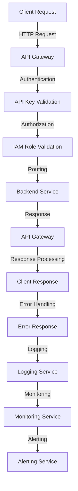

## Introduction
The **API Gateway** is a fully managed service offered by AWS that enables developers to create, publish, maintain, monitor, and secure APIs at scale. It acts as an entry point for clients to access backend services, providing a single interface for multiple microservices. The API Gateway supports both **REST** (Representational State of Resource) and **HTTP** APIs, allowing developers to choose the best approach for their use case. In real-world scenarios, the API Gateway is used by companies like **Netflix**, **Uber**, and **Airbnb** to manage their APIs and provide a seamless experience for their users.

> **Note:** The API Gateway provides a range of benefits, including security, scalability, and monitoring, making it an essential tool for building robust and reliable APIs.

## Core Concepts
The following are key concepts related to the API Gateway:
* **REST API**: An architectural style for designing networked applications, emphasizing simplicity, flexibility, and scalability.
* **HTTP API**: A type of API that uses the HTTP protocol to interact with backend services.
* **API Endpoint**: A URL that defines the location of a specific API resource.
* **API Key**: A unique identifier used to authenticate and authorize API requests.
* **IAM Role**: A role that defines the permissions and access levels for an API Gateway.

> **Warning:** Failure to properly secure API endpoints and manage API keys can lead to unauthorized access and data breaches.

## How It Works Internally
The API Gateway works by receiving incoming requests from clients, processing them, and then routing them to the corresponding backend services. Here's a step-by-step breakdown of the process:
1. **Client Request**: The client sends a request to the API Gateway.
2. **Authentication**: The API Gateway authenticates the request using API keys, IAM roles, or other authentication mechanisms.
3. **Authorization**: The API Gateway authorizes the request based on the client's permissions and access levels.
4. **Routing**: The API Gateway routes the request to the corresponding backend service.
5. **Response**: The backend service processes the request and returns a response to the API Gateway.
6. **Response Processing**: The API Gateway processes the response and returns it to the client.

> **Tip:** Using a load balancer in front of the API Gateway can help distribute traffic and improve scalability.

## Code Examples
### Example 1: Basic API Gateway Setup
```python
import boto3

apigateway = boto3.client('apigateway')

# Create a new REST API
response = apigateway.create_rest_api(
    name='MyAPI',
    description='My API'
)

# Get the API ID
api_id = response['id']

# Create a new resource
response = apigateway.create_resource(
    restApiId=api_id,
    parentId='/',
    pathPart='users'
)

# Get the resource ID
resource_id = response['id']

# Create a new method
response = apigateway.put_method(
    restApiId=api_id,
    resourceId=resource_id,
    httpMethod='GET',
    authorization='NONE'
)
```
### Example 2: Securing API Endpoints with API Keys
```java
import software.amazon.awssdk.services.apigateway.ApiGatewayClient;
import software.amazon.awssdk.services.apigateway.model.CreateApiKeyRequest;
import software.amazon.awssdk.services.apigateway.model.CreateApiKeyResponse;

// Create a new API key
ApiGatewayClient apiGatewayClient = ApiGatewayClient.create();
CreateApiKeyRequest createApiKeyRequest = CreateApiKeyRequest.builder()
    .name("MyApiKey")
    .description("My API key")
    .build();

CreateApiKeyResponse createApiKeyResponse = apiGatewayClient.createApiKey(createApiKeyRequest);
String apiKey = createApiKeyResponse.id();

// Use the API key to authenticate requests
String authHeader = "x-api-key: " + apiKey;
```
### Example 3: Integrating with Lambda Functions
```javascript
const AWS = require('aws-sdk');
const lambda = new AWS.Lambda({ region: 'us-east-1' });

// Create a new Lambda function
const lambdaFunctionName = 'my-lambda-function';
const lambdaFunctionCode = 'exports.handler = async (event) => { return { statusCode: 200 }; };';

lambda.createFunction({
  FunctionName: lambdaFunctionName,
  Runtime: 'nodejs14.x',
  Role: 'arn:aws:iam::123456789012:role/lambda-execution-role',
  Handler: 'index.handler',
  Code: {
    ZipFile: Buffer.from(lambdaFunctionCode, 'utf8')
  }
}, (err, data) => {
  if (err) {
    console.log(err);
  } else {
    console.log(data);
  }
});

// Integrate the Lambda function with the API Gateway
const apiGateway = new AWS.APIGateway({ region: 'us-east-1' });
const apiId = '1234567890';
const resourceId = '1234567890';
const httpMethod = 'GET';

apiGateway.putIntegration({
  restApiId: apiId,
  resourceId: resourceId,
  httpMethod: httpMethod,
  integrationHttpMethod: 'POST',
  type: 'LAMBDA',
  uri: `arn:aws:apigateway:us-east-1:lambda:path/2015-03-31/functions/arn:aws:lambda:us-east-1:123456789012:function:${lambdaFunctionName}/invocations`
}, (err, data) => {
  if (err) {
    console.log(err);
  } else {
    console.log(data);
  }
});
```
## Visual Diagram

The diagram illustrates the flow of a client request through the API Gateway, including authentication, authorization, routing, response processing, and error handling.

## Comparison
| Approach | Time Complexity | Space Complexity | Pros | Cons | Best For |
| --- | --- | --- | --- | --- | --- |
| REST API | O(1) | O(n) | Simple, flexible, scalable | Limited support for complex queries | Simple, real-time APIs |
| HTTP API | O(1) | O(n) | Fast, secure, scalable | Limited support for complex queries | Real-time, event-driven APIs |
| GraphQL API | O(n) | O(n) | Flexible, scalable, supports complex queries | Steep learning curve, complex implementation | Complex, data-driven APIs |
| gRPC API | O(1) | O(n) | Fast, secure, scalable | Limited support for complex queries, requires protobuf | Real-time, high-performance APIs |

> **Interview:** When asked about the differences between REST and HTTP APIs, a strong answer would highlight the benefits of each approach and provide examples of when to use each.

## Real-world Use Cases
1. **Netflix**: Uses the API Gateway to manage its APIs and provide a seamless experience for its users.
2. **Uber**: Uses the API Gateway to manage its APIs and provide real-time updates to its users.
3. **Airbnb**: Uses the API Gateway to manage its APIs and provide a secure and scalable experience for its users.

## Common Pitfalls
1. **Insecure API Endpoints**: Failing to properly secure API endpoints can lead to unauthorized access and data breaches.
2. **Insufficient Error Handling**: Failing to handle errors properly can lead to poor user experience and increased support requests.
3. **Inadequate Logging and Monitoring**: Failing to log and monitor API activity can lead to poor performance and security issues.
4. **Inconsistent API Design**: Failing to follow API design best practices can lead to confusing and difficult-to-use APIs.

> **Warning:** Inconsistent API design can lead to increased maintenance costs and decreased user adoption.

## Interview Tips
1. **API Design**: Be prepared to discuss API design best practices, including REST, HTTP, and GraphQL.
2. **Security**: Be prepared to discuss API security best practices, including authentication, authorization, and encryption.
3. **Scalability**: Be prepared to discuss API scalability best practices, including load balancing, caching, and content delivery networks.

> **Tip:** When asked about API design, a strong answer would highlight the importance of consistency, simplicity, and scalability.

## Key Takeaways
* **API Gateway**: A fully managed service that enables developers to create, publish, maintain, monitor, and secure APIs at scale.
* **REST API**: An architectural style for designing networked applications, emphasizing simplicity, flexibility, and scalability.
* **HTTP API**: A type of API that uses the HTTP protocol to interact with backend services.
* **API Key**: A unique identifier used to authenticate and authorize API requests.
* **IAM Role**: A role that defines the permissions and access levels for an API Gateway.
* **Load Balancing**: A technique used to distribute traffic across multiple instances of an application.
* **Caching**: A technique used to improve performance by storing frequently accessed data in memory.
* **Content Delivery Network (CDN)**: A network of distributed servers that deliver content to users based on their geographic location.
* **API Security**: The practice of protecting APIs from unauthorized access, data breaches, and other security threats.
* **API Monitoring**: The practice of monitoring API activity to improve performance, security, and user experience.