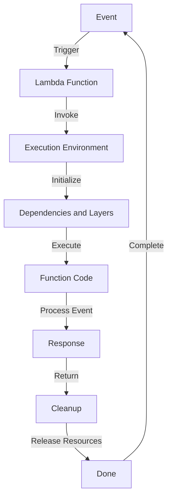

## Introduction
**AWS Lambda** is a serverless compute service that allows you to run code without provisioning or managing servers. It's a key component of the AWS serverless architecture, enabling developers to build scalable, event-driven applications. With Lambda, you can focus on writing code without worrying about the underlying infrastructure. In this study guide, we'll delve into the world of Lambda functions, triggers, and layers, exploring their core concepts, internal mechanics, and real-world applications.

> **Note:** AWS Lambda supports a wide range of programming languages, including Node.js, Python, Java, Go, and more.

## Core Concepts
To understand Lambda, you need to grasp the following core concepts:

* **Lambda Function**: A self-contained piece of code that can be executed in response to an event. Functions are stateless, meaning they don't maintain any information between invocations.
* **Trigger**: An event that activates a Lambda function. Triggers can come from various sources, such as API Gateway, S3, DynamoDB, and more.
* **Layer**: A ZIP archive that contains additional code or dependencies required by a Lambda function. Layers can be used to share code between functions or to add custom dependencies.

> **Tip:** Use layers to keep your Lambda functions small and focused on their core logic, while keeping dependencies and shared code separate.

## How It Works Internally
When a trigger event occurs, Lambda performs the following steps:

1. **Invoke**: Lambda invokes the target function, passing the event data as an argument.
2. **Initialize**: Lambda initializes the function's execution environment, including setting up the necessary dependencies and layers.
3. **Execute**: The function executes, processing the event data and returning a response.
4. **Cleanup**: Lambda cleans up the execution environment, releasing any system resources.

> **Warning:** Be mindful of the execution time limit for Lambda functions, which is 15 minutes by default. Exceeding this limit can result in errors and additional costs.

## Code Examples
Here are three complete, runnable examples demonstrating basic, real-world, and advanced Lambda function usage:

### Example 1: Basic Lambda Function
```python
import boto3

def lambda_handler(event, context):
    # Print the event data
    print(event)
    # Return a success response
    return {
        'statusCode': 200,
        'body': 'Hello from Lambda!'
    }
```
This example shows a simple Lambda function that prints the event data and returns a success response.

### Example 2: Real-World Lambda Function with API Gateway
```javascript
exports.handler = async (event) => {
    // Extract the request body
    const requestBody = JSON.parse(event.body);
    // Process the request data
    const responseData = processRequest(requestBody);
    // Return a response
    return {
        statusCode: 200,
        body: JSON.stringify(responseData),
    };
};

function processRequest(requestBody) {
    // Simulate some processing time
    const processingTime = Math.random() * 1000;
    return new Promise((resolve) => {
        setTimeout(() => {
            resolve({ message: 'Request processed successfully' });
        }, processingTime);
    });
}
```
This example demonstrates a Lambda function integrated with API Gateway, processing request data and returning a response.

### Example 3: Advanced Lambda Function with Layers
```java
import com.amazonaws.services.lambda.runtime.Context;
import com.amazonaws.services.lambda.runtime.RequestHandler;
import com.amazonaws.services.lambda.runtime.events.APIGatewayProxyRequestEvent;
import com.amazonaws.services.lambda.runtime.events.APIGatewayProxyResponseEvent;

public class AdvancedLambdaFunction implements RequestHandler<APIGatewayProxyRequestEvent, APIGatewayProxyResponseEvent> {
    @Override
    public APIGatewayProxyResponseEvent handleRequest(APIGatewayProxyRequestEvent input, Context context) {
        // Load the layer
        Layer layer = new Layer();
        // Use the layer to process the request data
        String responseData = layer.processRequest(input.getBody());
        // Return a response
        return new APIGatewayProxyResponseEvent()
                .withStatusCode(200)
                .withBody(responseData);
    }
}

class Layer {
    public String processRequest(String requestBody) {
        // Simulate some processing time
        try {
            Thread.sleep(1000);
        } catch (InterruptedException e) {
            Thread.currentThread().interrupt();
        }
        return "Request processed successfully";
    }
}
```
This example shows an advanced Lambda function using layers to share code between functions.

## Visual Diagram

This diagram illustrates the Lambda function execution flow, from event trigger to cleanup.

## Comparison
| Approach | Time Complexity | Space Complexity | Pros | Cons | Best For |
| --- | --- | --- | --- | --- | --- |
| Serverless (Lambda) | O(1) | O(1) | Scalable, cost-effective, easy to deploy | Limited control, cold starts | Real-time data processing, API Gateway integrations |
| Containerized (ECS) | O(n) | O(n) | Flexible, customizable, high performance | Complex setup, resource-intensive | Long-running tasks, batch processing |
| Serverful (EC2) | O(n) | O(n) | High control, customizable, reliable | Resource-intensive, expensive | Traditional web applications, legacy systems |
| Function-as-a-Service (FaaS) | O(1) | O(1) | Scalable, cost-effective, easy to deploy | Limited control, vendor lock-in | Real-time data processing, API Gateway integrations |

## Real-world Use Cases
1. **Image Processing**: A company like Instagram uses Lambda to process images in real-time, applying filters and effects.
2. **Real-time Analytics**: A company like Netflix uses Lambda to process real-time analytics data, providing insights into user behavior.
3. **API Gateway Integration**: A company like Airbnb uses Lambda to integrate with API Gateway, handling requests and responses for their web application.

> **Interview:** Can you explain the difference between a Lambda function and a containerized application?

## Common Pitfalls
1. **Cold Starts**: Lambda functions can experience cold starts, which can lead to increased latency. To avoid this, use provisioned concurrency or warm up your functions regularly.
2. **Dependency Management**: Lambda functions can have complex dependency management issues. To avoid this, use layers to share code and dependencies between functions.
3. **Error Handling**: Lambda functions can be prone to errors if not handled properly. To avoid this, use try-catch blocks and log errors for later analysis.
4. **Security**: Lambda functions can be vulnerable to security threats if not secured properly. To avoid this, use IAM roles and permissions to limit access to sensitive data.

> **Warning:** Be mindful of the security risks associated with Lambda functions, such as unauthorized access to sensitive data.

## Interview Tips
1. **What is the difference between a Lambda function and a containerized application?**
	* Weak answer: "A Lambda function is a type of containerized application."
	* Strong answer: "A Lambda function is a serverless compute service that runs code in response to events, whereas a containerized application is a self-contained package that includes code, dependencies, and configurations."
2. **How do you handle errors in a Lambda function?**
	* Weak answer: "I just log the error and move on."
	* Strong answer: "I use try-catch blocks to catch and handle errors, logging them for later analysis and providing a meaningful error response to the user."
3. **What is the purpose of a layer in a Lambda function?**
	* Weak answer: "A layer is used to add custom dependencies to a Lambda function."
	* Strong answer: "A layer is a ZIP archive that contains additional code or dependencies required by a Lambda function, allowing for code reuse and simplifying dependency management."

## Key Takeaways
* **Lambda functions are serverless compute services** that run code in response to events.
* **Triggers are events** that activate Lambda functions.
* **Layers are ZIP archives** that contain additional code or dependencies required by Lambda functions.
* **Cold starts can occur** if Lambda functions are not warmed up regularly.
* **Dependency management is crucial** for Lambda functions to avoid errors and security risks.
* **Error handling is essential** for Lambda functions to provide a good user experience.
* **Security is a top priority** for Lambda functions to protect sensitive data.
* **Provisioned concurrency can help** reduce cold starts and improve performance.
* **Monitoring and logging are critical** for Lambda functions to detect errors and security threats.