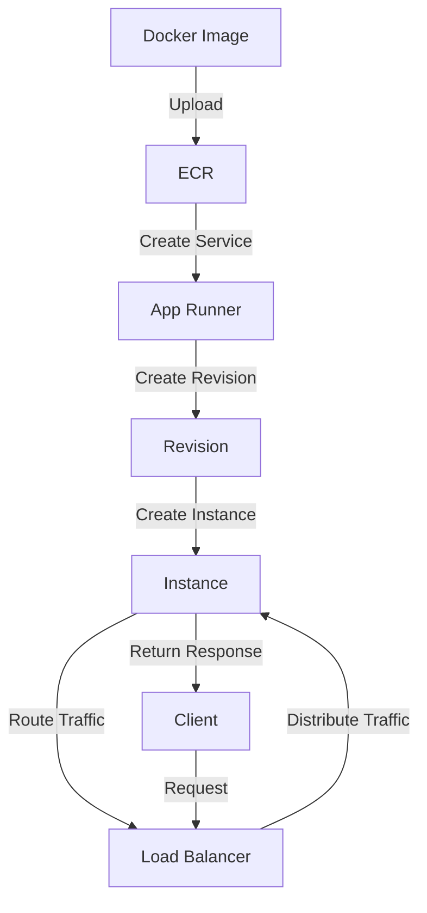

## Introduction
**App Runner** is a fully managed service offered by Amazon Web Services (AWS) that makes it easy to build, deploy, and manage containerized web applications. It provides a simple and cost-effective way to deploy containerized applications, without requiring expertise in container orchestration or server management. App Runner is designed to work with **Docker** containers, allowing developers to focus on writing code and delivering features, rather than managing infrastructure. In this section, we will explore the importance of App Runner, its real-world relevance, and why every engineer needs to know about it.

> **Note:** With the rise of cloud computing and containerization, the demand for efficient and scalable deployment solutions has increased. App Runner addresses this need by providing a managed platform for deploying containerized applications.

## Core Concepts
To understand App Runner, it's essential to grasp the following core concepts:

* **Containerization**: A lightweight and portable way to deploy applications, using containers that include the application code, dependencies, and configurations.
* **Docker**: A popular containerization platform that provides a simple way to create, deploy, and manage containers.
* **App Runner Service**: A fully managed service that provides a scalable and secure platform for deploying containerized web applications.
* **Service Quotas**: The limits imposed by App Runner on the number of services, revisions, and instances that can be created.

> **Tip:** When working with App Runner, it's essential to understand the service quotas and plan accordingly to avoid hitting limits and incurring additional costs.

## How It Works Internally
App Runner works by providing a managed platform for deploying containerized web applications. Here's a step-by-step breakdown of the internal mechanics:

1. **Image Creation**: The developer creates a Docker image for the application, which includes the application code, dependencies, and configurations.
2. **Image Upload**: The Docker image is uploaded to a container registry, such as Amazon Elastic Container Registry (ECR).
3. **Service Creation**: The developer creates an App Runner service, specifying the Docker image, port, and other configurations.
4. **Revision Creation**: App Runner creates a new revision of the service, which includes the specified Docker image and configurations.
5. **Instance Creation**: App Runner creates one or more instances of the service, depending on the specified instance count and scaling configuration.
6. **Traffic Routing**: App Runner routes incoming traffic to the instances, using a load balancer to distribute traffic and ensure high availability.

> **Warning:** When working with App Runner, it's essential to ensure that the Docker image is correctly configured and uploaded to the container registry, to avoid deployment issues and errors.

## Code Examples
Here are three complete and runnable code examples that demonstrate how to use App Runner:

### Example 1: Basic App Runner Service
```python
import boto3

app_runner = boto3.client('apprunner')

# Create a new App Runner service
response = app_runner.create_service(
    ServiceName='my-service',
    SourceConfiguration={
        'ImageRepository': {
            'ImageIdentifier': 'my-image',
            'ImageRepositoryType': 'ECR'
        }
    },
    InstanceConfiguration={
        'InstanceRoleArn': 'arn:aws:iam::123456789012:role/my-role'
    }
)

print(response)
```

### Example 2: App Runner Service with Custom Configuration
```python
import boto3

app_runner = boto3.client('apprunner')

# Create a new App Runner service with custom configuration
response = app_runner.create_service(
    ServiceName='my-service',
    SourceConfiguration={
        'ImageRepository': {
            'ImageIdentifier': 'my-image',
            'ImageRepositoryType': 'ECR'
        }
    },
    InstanceConfiguration={
        'InstanceRoleArn': 'arn:aws:iam::123456789012:role/my-role',
        'CPU': '2',
        'Memory': '4'
    },
    Port='8080',
    HealthCheckConfiguration={
        'Protocol': 'HTTP',
        'Path': '/healthcheck'
    }
)

print(response)
```

### Example 3: App Runner Service with Autoscaling
```python
import boto3

app_runner = boto3.client('apprunner')

# Create a new App Runner service with autoscaling
response = app_runner.create_service(
    ServiceName='my-service',
    SourceConfiguration={
        'ImageRepository': {
            'ImageIdentifier': 'my-image',
            'ImageRepositoryType': 'ECR'
        }
    },
    InstanceConfiguration={
        'InstanceRoleArn': 'arn:aws:iam::123456789012:role/my-role',
        'CPU': '2',
        'Memory': '4'
    },
    Port='8080',
    HealthCheckConfiguration={
        'Protocol': 'HTTP',
        'Path': '/healthcheck'
    },
    AutoScalingConfigurationArn='arn:aws:apprunner:us-east-1:123456789012:autoscalingconfiguration/my-config'
)

print(response)
```

## Visual Diagram

The diagram illustrates the workflow of deploying a containerized application using App Runner. The Docker image is uploaded to ECR, and then an App Runner service is created. The service creates a new revision, which creates one or more instances. The load balancer routes incoming traffic to the instances, and the instances return responses to the client.

> **Interview:** Can you explain the workflow of deploying a containerized application using App Runner? How does the load balancer distribute traffic to the instances?

## Comparison
| Approach | Time Complexity | Space Complexity | Pros | Cons | Best For |
| --- | --- | --- | --- | --- | --- |
| App Runner | O(1) | O(1) | Fully managed, scalable, secure | Limited control, additional costs | Small to medium-sized applications |
| Kubernetes | O(n) | O(n) | Highly customizable, flexible | Steep learning curve, complex management | Large-scale applications, enterprise environments |
| Docker Swarm | O(n) | O(n) | Easy to use, scalable | Limited features, not suitable for large-scale applications | Small to medium-sized applications, development environments |
| AWS Elastic Beanstalk | O(1) | O(1) | Fully managed, scalable, secure | Limited control, additional costs | Small to medium-sized applications, web applications |

> **Tip:** When choosing an approach, consider the size and complexity of the application, as well as the level of control and customization required.

## Real-world Use Cases
Here are three real-world use cases for App Runner:

1. **Web Application**: A company wants to deploy a web application that handles user requests and returns responses. They use App Runner to create a service that runs the application, and the load balancer distributes traffic to the instances.
2. **API Gateway**: A company wants to deploy an API gateway that handles incoming requests and routes them to the appropriate services. They use App Runner to create a service that runs the API gateway, and the load balancer distributes traffic to the instances.
3. **Microservices Architecture**: A company wants to deploy a microservices architecture that consists of multiple services that communicate with each other. They use App Runner to create services that run each microservice, and the load balancer distributes traffic to the instances.

> **Warning:** When deploying a microservices architecture, it's essential to ensure that each service is correctly configured and communicates with the other services to avoid errors and downtime.

## Common Pitfalls
Here are four common pitfalls to avoid when using App Runner:

1. **Incorrect Image Configuration**: The Docker image is not correctly configured, leading to deployment issues and errors.
2. **Insufficient Instance Count**: The instance count is not sufficient to handle incoming traffic, leading to downtime and errors.
3. **Incorrect Load Balancer Configuration**: The load balancer is not correctly configured, leading to traffic not being distributed correctly to the instances.
4. **Inadequate Monitoring and Logging**: The application is not correctly monitored and logged, leading to difficulties in debugging and troubleshooting issues.

> **Note:** To avoid these pitfalls, it's essential to carefully configure the Docker image, instance count, load balancer, and monitoring and logging settings.

## Interview Tips
Here are three common interview questions related to App Runner:

1. **What is App Runner, and how does it work?**: The interviewer wants to assess your understanding of App Runner and its internal mechanics.
2. **How do you configure a Docker image for App Runner?**: The interviewer wants to assess your understanding of Docker image configuration and how to prepare it for App Runner.
3. **How do you troubleshoot issues with App Runner?**: The interviewer wants to assess your understanding of troubleshooting techniques and how to debug issues with App Runner.

> **Interview:** Can you explain how to configure a Docker image for App Runner? What are some common issues that can occur during deployment, and how do you troubleshoot them?

## Key Takeaways
Here are ten key takeaways to remember when working with App Runner:

* App Runner is a fully managed service that provides a scalable and secure platform for deploying containerized web applications.
* Docker images must be correctly configured and uploaded to ECR to avoid deployment issues and errors.
* The instance count and load balancer configuration must be correctly set to ensure that incoming traffic is distributed correctly to the instances.
* Monitoring and logging settings must be correctly configured to ensure that the application is correctly monitored and logged.
* App Runner provides a simple and cost-effective way to deploy containerized applications, without requiring expertise in container orchestration or server management.
* The service quotas imposed by App Runner must be understood and planned accordingly to avoid hitting limits and incurring additional costs.
* The autoscaling configuration must be correctly set to ensure that the instance count is adjusted based on incoming traffic.
* The health check configuration must be correctly set to ensure that the instances are correctly monitored and replaced if they become unhealthy.
* The security group configuration must be correctly set to ensure that the instances are correctly secured and access is restricted to authorized users.
* The VPC configuration must be correctly set to ensure that the instances are correctly connected to the VPC and access is restricted to authorized users.

> **Note:** By following these key takeaways, you can ensure that your App Runner deployment is correctly configured and running smoothly, and that you are taking advantage of the benefits that App Runner provides.