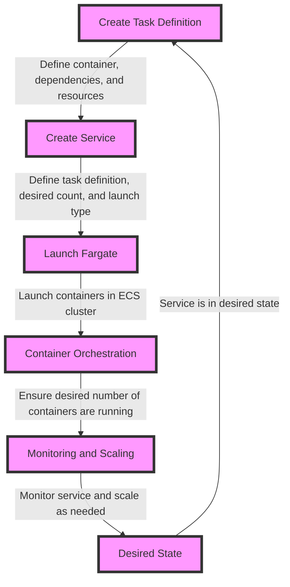

## Introduction
ECS (Elastic Container Service) with Fargate is a serverless container orchestration service offered by AWS. It allows users to run containers without managing the underlying infrastructure, making it a highly scalable and efficient way to deploy containerized applications. With ECS and Fargate, users can focus on writing code and deploying applications without worrying about the underlying infrastructure. This is particularly useful for companies that need to quickly deploy and scale their applications, such as **Netflix**, **Airbnb**, and **Uber**. As a senior engineer, it's essential to understand how ECS with Fargate works, its benefits, and how to use it effectively.

> **Note:** ECS with Fargate is a fully managed service, which means that AWS handles the underlying infrastructure, patching, and maintenance, allowing users to focus on their applications.

## Core Concepts
To understand ECS with Fargate, it's essential to grasp the following core concepts:
* **Container**: A lightweight and standalone executable package that includes everything an application needs to run, such as code, libraries, and dependencies.
* **ECS Cluster**: A logical grouping of ECS instances that can be used to run containers.
* **Fargate**: A serverless compute engine for containers that allows users to run containers without managing the underlying infrastructure.
* **Task Definition**: A blueprint for a containerized application that defines the container, its dependencies, and the resources required to run it.
* **Service**: A long-running task that can be used to run multiple containers.

> **Tip:** When designing a containerized application, it's essential to consider the trade-offs between using a single large container versus multiple smaller containers. Using multiple smaller containers can make it easier to manage and scale individual components of the application.

## How It Works Internally
When a user creates a task definition and runs a service using ECS with Fargate, the following steps occur:
1. **Task Definition Creation**: The user creates a task definition that defines the container, its dependencies, and the resources required to run it.
2. **Service Creation**: The user creates a service that defines the task definition, the number of containers to run, and the desired state of the service.
3. **Fargate Launch**: Fargate launches the containers defined in the task definition and runs them in the ECS cluster.
4. **Container Orchestration**: ECS orchestrates the containers, ensuring that the desired number of containers are running and that the service is in the desired state.
5. **Monitoring and Scaling**: ECS monitors the service and scales it as needed to ensure that the desired number of containers are running and that the service is performing well.

> **Warning:** When using Fargate, it's essential to consider the cost implications of running containers. Fargate charges based on the amount of CPU and memory used by the containers, so it's essential to optimize container resource usage to minimize costs.

## Code Examples
### Example 1: Basic Task Definition
```python
import boto3

ecs = boto3.client('ecs')

task_definition = {
    'family': 'my-task-definition',
    'requiresCompatibilities': ['FARGATE'],
    'networkMode': 'awsvpc',
    'cpu': '256',
    'memory': '512',
    'containerDefinitions': [
        {
            'name': 'my-container',
            'image': 'my-docker-image',
            'portMappings': [
                {
                    'containerPort': 80,
                    'hostPort': 80,
                    'protocol': 'tcp'
                }
            ]
        }
    ]
}

response = ecs.create_task_definition(taskDefinition=task_definition)
print(response)
```
### Example 2: Service Creation
```python
import boto3

ecs = boto3.client('ecs')

service = {
    'serviceName': 'my-service',
    'taskDefinition': 'my-task-definition',
    'desiredCount': 2,
    'launchType': 'FARGATE',
    'networkConfiguration': {
        'awsvpcConfiguration': {
            'subnets': ['subnet-12345678'],
            'securityGroups': ['sg-12345678'],
            'assignPublicIp': 'ENABLED'
        }
    }
}

response = ecs.create_service(service=service)
print(response)
```
### Example 3: Advanced Task Definition with Environment Variables
```python
import boto3

ecs = boto3.client('ecs')

task_definition = {
    'family': 'my-task-definition',
    'requiresCompatibilities': ['FARGATE'],
    'networkMode': 'awsvpc',
    'cpu': '256',
    'memory': '512',
    'containerDefinitions': [
        {
            'name': 'my-container',
            'image': 'my-docker-image',
            'portMappings': [
                {
                    'containerPort': 80,
                    'hostPort': 80,
                    'protocol': 'tcp'
                }
            ],
            'environment': [
                {
                    'name': 'MY_ENV_VAR',
                    'value': 'my-env-var-value'
                }
            ]
        }
    ]
}

response = ecs.create_task_definition(taskDefinition=task_definition)
print(response)
```
> **Interview:** When asked about the differences between ECS and Fargate, a strong answer would highlight the key benefits of using Fargate, such as not having to manage the underlying infrastructure and being able to focus on writing code and deploying applications.

## Visual Diagram

The diagram illustrates the process of creating a task definition, creating a service, launching Fargate, container orchestration, monitoring and scaling, and achieving the desired state.

## Comparison
| Approach | Time Complexity | Space Complexity | Pros | Cons | Best For |
|----------|----------------|-----------------|------|------|----------|
| ECS with Fargate | O(1) | O(1) | Highly scalable, efficient, and secure | Can be complex to set up and manage | Large-scale containerized applications |
| Kubernetes | O(n) | O(n) | Highly customizable and extensible | Can be complex to set up and manage | Large-scale containerized applications |
| Docker Swarm | O(n) | O(n) | Easy to set up and manage | Limited scalability and security features | Small-scale containerized applications |
| AWS Lambda | O(1) | O(1) | Highly scalable and secure | Limited control over underlying infrastructure | Serverless applications |

> **Tip:** When choosing a container orchestration tool, it's essential to consider the trade-offs between scalability, security, and complexity.

## Real-world Use Cases
* **Netflix**: Uses ECS with Fargate to deploy and manage its containerized applications, including its streaming service.
* **Airbnb**: Uses ECS with Fargate to deploy and manage its containerized applications, including its booking and payment systems.
* **Uber**: Uses ECS with Fargate to deploy and manage its containerized applications, including its ride-hailing and food delivery services.

## Common Pitfalls
* **Insufficient Resource Allocation**: Failing to allocate sufficient resources to containers can lead to performance issues and errors.
* **Insecure Container Configuration**: Failing to properly secure container configurations can lead to security vulnerabilities and data breaches.
* **Inadequate Monitoring and Scaling**: Failing to properly monitor and scale containerized applications can lead to performance issues and downtime.
* **Incorrect Task Definition**: Failing to properly define task definitions can lead to errors and performance issues.

> **Warning:** When using Fargate, it's essential to consider the cost implications of running containers and to optimize container resource usage to minimize costs.

## Interview Tips
* **What is the difference between ECS and Fargate?**: A strong answer would highlight the key benefits of using Fargate, such as not having to manage the underlying infrastructure and being able to focus on writing code and deploying applications.
* **How do you optimize container resource usage?**: A strong answer would highlight the importance of monitoring and optimizing container resource usage to minimize costs and improve performance.
* **What is the best approach for deploying containerized applications?**: A strong answer would highlight the importance of considering the trade-offs between scalability, security, and complexity when choosing a container orchestration tool.

## Key Takeaways
* **ECS with Fargate is a highly scalable and efficient way to deploy containerized applications**: It allows users to focus on writing code and deploying applications without worrying about the underlying infrastructure.
* **Task definitions are critical to deploying containerized applications**: They define the container, its dependencies, and the resources required to run it.
* **Fargate is a serverless compute engine for containers**: It allows users to run containers without managing the underlying infrastructure.
* **Monitoring and scaling are critical to ensuring the performance and reliability of containerized applications**: It's essential to properly monitor and scale containerized applications to ensure that the desired number of containers are running and that the service is performing well.
* **Security is a top priority when deploying containerized applications**: It's essential to properly secure container configurations and to consider the security implications of running containers.
* **Optimizing container resource usage is critical to minimizing costs**: It's essential to monitor and optimize container resource usage to minimize costs and improve performance.
* **ECS with Fargate is a highly secure way to deploy containerized applications**: It provides a highly secure environment for deploying containerized applications, with features such as encryption and access controls.
* **Fargate is a highly scalable way to deploy containerized applications**: It allows users to quickly deploy and scale containerized applications, with features such as automatic scaling and load balancing.