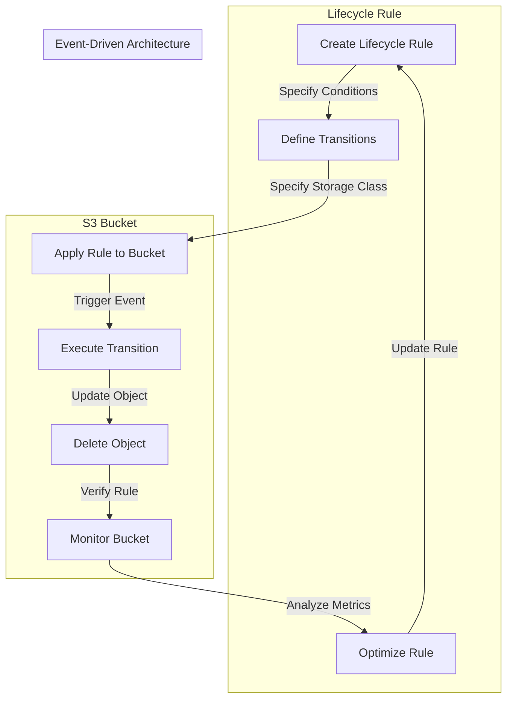

## Introduction
Serverless S3 Storage lifecycle rules are a powerful feature in Amazon Web Services (AWS) that allows users to manage the storage and deletion of objects in their S3 buckets. This feature is crucial for optimizing storage costs, ensuring data compliance, and maintaining data integrity. In this guide, we will delve into the world of Serverless S3 Storage lifecycle rules, exploring what they are, why they matter, and how they can be used to streamline data management in the cloud.

> **Note:** Serverless S3 Storage lifecycle rules are a key component of AWS's serverless architecture, enabling users to focus on their application logic without worrying about the underlying infrastructure.

In real-world scenarios, Serverless S3 Storage lifecycle rules are used by companies like Netflix, Amazon, and Microsoft to manage their vast amounts of data stored in S3 buckets. For instance, Netflix uses lifecycle rules to automatically transition objects from standard storage to infrequent access storage after a certain period, reducing storage costs while maintaining data availability.

## Core Concepts
To understand Serverless S3 Storage lifecycle rules, it's essential to grasp the following core concepts:

* **Lifecycle rules**: A set of rules that define the actions to be taken on objects in an S3 bucket based on their age, size, or other attributes.
* **Transition**: The process of moving objects from one storage class to another, such as from standard storage to infrequent access storage.
* **Expiration**: The process of deleting objects from an S3 bucket after a specified period.
* **Storage classes**: The different types of storage available in S3, including standard storage, infrequent access storage, and glacier storage.

> **Tip:** When designing lifecycle rules, it's essential to consider the trade-offs between storage costs, data availability, and data durability.

## How It Works Internally
Serverless S3 Storage lifecycle rules work by leveraging AWS's internal event-driven architecture. Here's a step-by-step breakdown of how it works:

1. **Rule creation**: A user creates a lifecycle rule for an S3 bucket, specifying the conditions and actions to be taken.
2. **Event triggering**: When an object in the bucket meets the specified conditions, an event is triggered, which invokes the lifecycle rule.
3. **Action execution**: The lifecycle rule executes the specified action, such as transitioning the object to a different storage class or deleting it.
4. **Object updates**: The object is updated to reflect the new storage class or is deleted from the bucket.

> **Warning:** Be cautious when creating lifecycle rules, as incorrect configurations can result in unintended data loss or storage costs.

## Code Examples
Here are three complete and runnable code examples demonstrating the use of Serverless S3 Storage lifecycle rules:

### Example 1: Basic Lifecycle Rule
```python
import boto3

s3 = boto3.client('s3')

# Create a lifecycle rule
rule = {
    'ID': 'my-rule',
    'Filter': {
        'Prefix': 'my-prefix/'
    },
    'Status': 'Enabled',
    'Transitions': [
        {
            'Date': '2024-01-01T00:00:00.000Z',
            'StorageClass': 'STANDARD_IA'
        }
    ]
}

# Apply the lifecycle rule to the bucket
response = s3.put_bucket_lifecycle_configuration(
    Bucket='my-bucket',
    LifecycleConfiguration={
        'Rules': [rule]
    }
)

print(response)
```

### Example 2: Real-World Lifecycle Rule
```java
import software.amazon.awssdk.services.s3.S3Client;
import software.amazon.awssdk.services.s3.model.LifecycleRule;
import software.amazon.awssdk.services.s3.model.PutBucketLifecycleConfigurationRequest;

public class LifecycleRuleExample {
    public static void main(String[] args) {
        S3Client s3 = S3Client.create();

        // Create a lifecycle rule
        LifecycleRule rule = LifecycleRule.builder()
            .id("my-rule")
            .filter("my-prefix/")
            .status("Enabled")
            .transitions(
                LifecycleRule.Transition.builder()
                    .date("2024-01-01T00:00:00.000Z")
                    .storageClass("STANDARD_IA")
                    .build()
            )
            .build();

        // Apply the lifecycle rule to the bucket
        PutBucketLifecycleConfigurationRequest request = PutBucketLifecycleConfigurationRequest.builder()
            .bucket("my-bucket")
            .lifecycleConfiguration(
                LifecycleConfiguration.builder()
                    .rules(rule)
                    .build()
            )
            .build();

        s3.putBucketLifecycleConfiguration(request);
    }
}
```

### Example 3: Advanced Lifecycle Rule
```typescript
import * as AWS from 'aws-sdk';

const s3 = new AWS.S3({ region: 'us-west-2' });

// Create a lifecycle rule with multiple transitions
const rule = {
  ID: 'my-rule',
  Filter: {
    Prefix: 'my-prefix/',
  },
  Status: 'Enabled',
  Transitions: [
    {
      Date: '2024-01-01T00:00:00.000Z',
      StorageClass: 'STANDARD_IA',
    },
    {
      Date: '2024-01-15T00:00:00.000Z',
      StorageClass: 'GLACIER',
    },
  ],
};

// Apply the lifecycle rule to the bucket
s3.putBucketLifecycleConfiguration(
  {
    Bucket: 'my-bucket',
    LifecycleConfiguration: {
      Rules: [rule],
    },
  },
  (err, data) => {
    if (err) {
      console.log(err);
    } else {
      console.log(data);
    }
  }
);
```

## Visual Diagram

The diagram illustrates the lifecycle of a Serverless S3 Storage lifecycle rule, from creation to execution and monitoring.

## Comparison
The following table compares different approaches to managing S3 storage:

| Approach | Time Complexity | Space Complexity | Pros | Cons | Best For |
| --- | --- | --- | --- | --- | --- |
| Manual Management | O(n) | O(1) | Flexibility, control | Time-consuming, error-prone | Small-scale, ad-hoc use cases |
| Lifecycle Rules | O(1) | O(n) | Scalability, automation | Complexity, overhead | Large-scale, production environments |
| Third-Party Tools | O(n) | O(1) | Ease of use, features | Cost, vendor lock-in | Medium-scale, managed environments |
| AWS S3 Analytics | O(1) | O(n) | Insights, optimization | Cost, complexity | Large-scale, data-driven environments |

## Real-world Use Cases
Here are three real-world examples of companies using Serverless S3 Storage lifecycle rules:

1. **Netflix**: Netflix uses lifecycle rules to transition objects from standard storage to infrequent access storage after 30 days, reducing storage costs while maintaining data availability.
2. **Amazon**: Amazon uses lifecycle rules to manage its vast amounts of data stored in S3 buckets, including transitioning objects to glacier storage for long-term archival.
3. **Microsoft**: Microsoft uses lifecycle rules to automate the deletion of temporary data in its S3 buckets, ensuring compliance with regulatory requirements and optimizing storage costs.

## Common Pitfalls
Here are four common mistakes to avoid when using Serverless S3 Storage lifecycle rules:

1. **Incorrect rule configuration**: Incorrectly configuring lifecycle rules can result in unintended data loss or storage costs.
2. **Insufficient monitoring**: Failing to monitor bucket metrics and analyze logs can lead to missed opportunities for optimization and cost reduction.
3. **Inadequate testing**: Not thoroughly testing lifecycle rules can result in errors and unexpected behavior.
4. **Inconsistent naming conventions**: Using inconsistent naming conventions for objects and buckets can make it difficult to manage and optimize lifecycle rules.

> **Interview:** When asked about common pitfalls in using Serverless S3 Storage lifecycle rules, a strong answer would include examples of incorrect rule configuration, insufficient monitoring, inadequate testing, and inconsistent naming conventions, along with strategies for avoiding these mistakes.

## Interview Tips
Here are three common interview questions related to Serverless S3 Storage lifecycle rules, along with weak and strong answers:

1. **What is the purpose of Serverless S3 Storage lifecycle rules?**
	* Weak answer: "To manage S3 buckets."
	* Strong answer: "To automate the management of objects in S3 buckets, optimizing storage costs and ensuring data compliance."
2. **How do you configure a lifecycle rule to transition objects to infrequent access storage?**
	* Weak answer: "I'm not sure."
	* Strong answer: "You would create a lifecycle rule with a transition action, specifying the storage class as STANDARD_IA and the date as the desired transition date."
3. **What are some common pitfalls to avoid when using Serverless S3 Storage lifecycle rules?**
	* Weak answer: "I don't know."
	* Strong answer: "Some common pitfalls include incorrect rule configuration, insufficient monitoring, inadequate testing, and inconsistent naming conventions. To avoid these mistakes, it's essential to thoroughly test lifecycle rules, monitor bucket metrics, and use consistent naming conventions."

## Key Takeaways
Here are ten key takeaways to remember when using Serverless S3 Storage lifecycle rules:

* **Lifecycle rules automate object management**: Lifecycle rules can be used to automate the transition of objects between storage classes, reducing storage costs and ensuring data compliance.
* **Correct configuration is crucial**: Incorrectly configuring lifecycle rules can result in unintended data loss or storage costs.
* **Monitoring is essential**: Monitoring bucket metrics and analyzing logs is essential for optimizing lifecycle rules and reducing costs.
* **Testing is critical**: Thoroughly testing lifecycle rules is critical to ensure correct behavior and avoid errors.
* **Naming conventions matter**: Using consistent naming conventions for objects and buckets is essential for managing and optimizing lifecycle rules.
* **Storage classes have different costs**: Different storage classes have different costs, and choosing the right storage class is essential for optimizing storage costs.
* **Lifecycle rules can be complex**: Lifecycle rules can be complex, and it's essential to thoroughly understand the rules and their implications.
* **AWS provides tools and services**: AWS provides tools and services, such as S3 Analytics, to help manage and optimize lifecycle rules.
* **Best practices exist**: Best practices exist for using Serverless S3 Storage lifecycle rules, and following these practices can help ensure correct behavior and reduce costs.
* **Continuous optimization is necessary**: Continuously optimizing lifecycle rules is necessary to ensure that storage costs are minimized and data compliance is maintained.