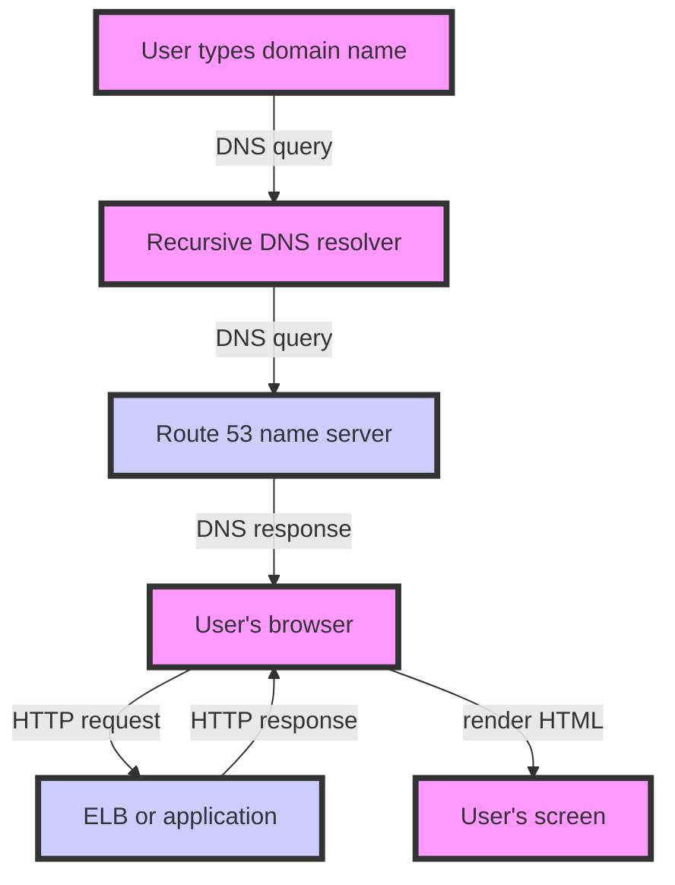

## Introduction
**Amazon Route 53** is a highly available and scalable **Domain Name System (DNS)** service offered by **Amazon Web Services (AWS)**. It provides a reliable way to route traffic to your applications, allowing you to manage DNS records, health checks, and traffic routing. Route 53 is essential for any organization that wants to ensure high availability, scalability, and performance for their web applications. In this study guide, we will explore the common pitfalls when configuring Route 53 DNS records, and provide best practices for avoiding these mistakes.

> **Note:** Route 53 is not just a DNS service, but also a traffic routing service that can help you improve the availability and performance of your applications.

## Core Concepts
To understand how Route 53 works, you need to know some key concepts:
* **DNS records**: These are the mappings between domain names and IP addresses. There are several types of DNS records, including A, AAAA, CNAME, MX, NS, SOA, and TXT.
* **Hosted zones**: These are containers for your DNS records. You can think of a hosted zone as a database that stores all the DNS records for a particular domain.
* **Resource record sets**: These are groups of DNS records that have the same name and type. For example, you can have multiple A records for the same domain name, each pointing to a different IP address.
* **Alias records**: These are special types of DNS records that map a domain name to an AWS resource, such as an ELB or an S3 bucket.

> **Warning:** One common mistake is to confuse DNS records with resource record sets. While they are related, they are not the same thing.

## How It Works Internally
When you create a hosted zone in Route 53, AWS assigns a set of name servers to your zone. These name servers are responsible for responding to DNS queries for your domain. Here's a step-by-step breakdown of how it works:
1. A user types your domain name into their browser.
2. The browser sends a DNS query to a recursive DNS resolver.
3. The recursive DNS resolver sends the query to one of the name servers assigned to your hosted zone.
4. The name server responds with the IP address associated with your domain name.
5. The browser sends an HTTP request to the IP address.
6. The request is routed to your application, which responds with the requested content.

> **Tip:** To improve performance, you can use **Route 53 latency-based routing**, which routes traffic to the closest available resource based on the user's location.

## Code Examples
Here are three code examples to illustrate how to work with Route 53:
### Example 1: Basic Usage
```python
import boto3

# Create a Route 53 client
route53 = boto3.client('route53')

# Create a hosted zone
response = route53.create_hosted_zone(
    Name='example.com',
    CallerReference='example-com'
)

# Get the hosted zone ID
hosted_zone_id = response['HostedZone']['Id']

# Create an A record
response = route53.change_resource_record_sets(
    HostedZoneId=hosted_zone_id,
    ChangeBatch={
        'Changes': [
            {
                'Action': 'CREATE',
                'ResourceRecordSet': {
                    'Name': 'example.com',
                    'Type': 'A',
                    'TTL': 300,
                    'ResourceRecords': [
                        {
                            'Value': '192.0.2.1'
                        }
                    ]
                }
            }
        ]
    }
)
```
### Example 2: Real-World Pattern
```java
import software.amazon.awssdk.services.route53.Route53Client;
import software.amazon.awssdk.services.route53.model.ChangeResourceRecordSetsRequest;
import software.amazon.awssdk.services.route53.model.ChangeResourceRecordSetsResponse;
import software.amazon.awssdk.services.route53.model.ResourceRecord;
import software.amazon.awssdk.services.route53.model.ResourceRecordSet;

public class Route53Example {
    public static void main(String[] args) {
        // Create a Route 53 client
        Route53Client route53 = Route53Client.create();

        // Create a hosted zone
        String hostedZoneId = route53.createHostedZone(b -> b.name("example.com").callerReference("example-com")).hostedZone().id();

        // Create an A record
        ChangeResourceRecordSetsRequest request = ChangeResourceRecordSetsRequest.builder()
                .hostedZoneId(hostedZoneId)
                .changeBatch(b -> b.changes(
                        ChangeResourceRecordSetsRequest.Change.builder()
                                .action("CREATE")
                                .resourceRecordSet(
                                        ResourceRecordSet.builder()
                                                .name("example.com")
                                                .type("A")
                                                .ttl(300)
                                                .resourceRecords(
                                                        ResourceRecord.builder()
                                                                .value("192.0.2.1")
                                                                .build()
                                                )
                                                .build()
                                )
                                .build()
                ))
                .build();

        ChangeResourceRecordSetsResponse response = route53.changeResourceRecordSets(request);
    }
}
```
### Example 3: Advanced Usage
```typescript
import * as AWS from 'aws-sdk';

// Create a Route 53 client
const route53 = new AWS.Route53();

// Create a hosted zone
const hostedZoneId = route53.createHostedZone({
  Name: 'example.com',
  CallerReference: 'example-com'
}).promise().then(data => data.HostedZone.Id);

// Create an alias record
const aliasRecord = {
  Action: 'CREATE',
  ResourceRecordSet: {
    Name: 'example.com',
    Type: 'A',
    AliasTarget: {
      DNSName: 'example-elb-123456789.us-east-1.elb.amazonaws.com',
      HostedZoneId: 'Z3DNSZZZZZZZZ',
      EvaluateTargetHealth: true
    }
  }
};

// Create the alias record
route53.changeResourceRecordSets({
  HostedZoneId: hostedZoneId,
  ChangeBatch: {
    Changes: [aliasRecord]
  }
}).promise().then(data => console.log(data));
```
## Visual Diagram

> **Note:** This diagram shows the basic flow of a DNS query and how it is resolved by Route 53.

## Comparison
| Approach | Time Complexity | Space Complexity | Pros | Cons | Best For |
| --- | --- | --- | --- | --- | --- |
| Route 53 | O(1) | O(1) | Highly available, scalable, and secure | Can be complex to configure | Large-scale web applications |
| BIND | O(n) | O(n) | Flexible and customizable | Can be resource-intensive | Small-scale web applications |
| PowerDNS | O(1) | O(1) | Highly scalable and performant | Can be complex to configure | Large-scale web applications |
| Google Cloud DNS | O(1) | O(1) | Highly available and scalable | Can be expensive | Large-scale web applications |

> **Warning:** When choosing a DNS service, consider the trade-offs between availability, scalability, and cost.

## Real-world Use Cases
Here are three real-world use cases for Route 53:
1. **Netflix**: Netflix uses Route 53 to manage its DNS records and route traffic to its applications. By using Route 53, Netflix can ensure high availability and scalability for its global user base.
2. **Airbnb**: Airbnb uses Route 53 to manage its DNS records and route traffic to its applications. By using Route 53, Airbnb can ensure high availability and scalability for its global user base.
3. **Dropbox**: Dropbox uses Route 53 to manage its DNS records and route traffic to its applications. By using Route 53, Dropbox can ensure high availability and scalability for its global user base.

> **Tip:** When using Route 53, make sure to configure your DNS records and hosted zones correctly to ensure high availability and scalability.

## Common Pitfalls
Here are four common pitfalls when configuring Route 53 DNS records:
1. **Incorrect DNS record configuration**: Make sure to configure your DNS records correctly, including the correct IP addresses and TTL values.
2. **Insufficient hosted zone configuration**: Make sure to configure your hosted zones correctly, including the correct name servers and DNS records.
3. **Inadequate traffic routing**: Make sure to configure your traffic routing correctly, including the correct routing policies and health checks.
4. **Insecure DNS record configuration**: Make sure to configure your DNS records securely, including the correct security settings and access controls.

> **Interview:** When interviewing for a cloud engineering position, be prepared to answer questions about Route 53 and DNS configuration.

## Interview Tips
Here are three common interview questions for Route 53 and DNS configuration:
1. **What is the difference between a DNS record and a resource record set?**
	* Weak answer: "I'm not sure, but I think they're related to DNS configuration."
	* Strong answer: "A DNS record is a single mapping between a domain name and an IP address, while a resource record set is a group of DNS records with the same name and type."
2. **How do you configure traffic routing in Route 53?**
	* Weak answer: "I'm not sure, but I think you need to configure the routing policies and health checks."
	* Strong answer: "You need to configure the routing policies, health checks, and DNS records to ensure that traffic is routed correctly to your applications."
3. **What is the purpose of a hosted zone in Route 53?**
	* Weak answer: "I'm not sure, but I think it's related to DNS configuration."
	* Strong answer: "A hosted zone is a container for your DNS records, and it provides a way to manage your DNS configuration and route traffic to your applications."

> **Tip:** When answering interview questions, make sure to provide specific examples and details to demonstrate your knowledge and experience.

## Key Takeaways
Here are ten key takeaways for Route 53 and DNS configuration:
* **Use Route 53 for high availability and scalability**: Route 53 provides a highly available and scalable DNS service that can handle large volumes of traffic.
* **Configure DNS records correctly**: Make sure to configure your DNS records correctly, including the correct IP addresses and TTL values.
* **Use hosted zones to manage DNS configuration**: Hosted zones provide a way to manage your DNS configuration and route traffic to your applications.
* **Configure traffic routing correctly**: Make sure to configure your traffic routing correctly, including the correct routing policies and health checks.
* **Use security settings to secure DNS records**: Make sure to configure your DNS records securely, including the correct security settings and access controls.
* **Monitor DNS configuration and traffic routing**: Make sure to monitor your DNS configuration and traffic routing to ensure that everything is working correctly.
* **Use automation to simplify DNS configuration**: Use automation tools to simplify DNS configuration and reduce the risk of human error.
* **Test DNS configuration and traffic routing**: Make sure to test your DNS configuration and traffic routing to ensure that everything is working correctly.
* **Document DNS configuration and traffic routing**: Make sure to document your DNS configuration and traffic routing to ensure that everything is well-documented and easy to understand.
* **Use best practices to optimize DNS configuration and traffic routing**: Use best practices to optimize your DNS configuration and traffic routing, including the use of caching, load balancing, and content delivery networks.