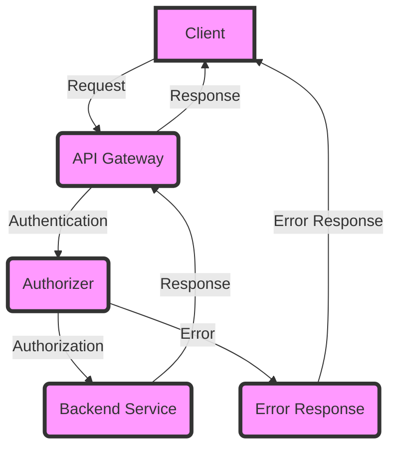

## Introduction
**API Gateway** is a fully managed service offered by AWS that enables developers to create, publish, maintain, monitor, and secure APIs at scale. It acts as an entry point for clients to access backend services, providing a robust and scalable way to manage API traffic. In this section, we will delve into the common pitfalls when provisioning API Gateway HTTP endpoints and explore how to avoid them.

API Gateway is essential in modern cloud-based architectures, as it provides a single entry point for clients to access multiple backend services. This simplifies the client-side code and allows for better management of API traffic. **API Gateway** also provides features such as authentication, rate limiting, and caching, which are crucial for building scalable and secure APIs.

> **Tip:** When designing an API Gateway architecture, consider using a **microservices** approach, where each service is responsible for a specific business capability. This enables greater scalability and maintainability.

## Core Concepts
To understand the common pitfalls when provisioning API Gateway HTTP endpoints, it is essential to grasp the core concepts of API Gateway. These include:

* **API**: A set of definitions and protocols that enables different applications to communicate with each other.
* **Resource**: A specific entity that can be accessed through an API, such as a user or a product.
* **Method**: An HTTP method that can be used to interact with a resource, such as GET, POST, or PUT.
* **Integration**: The connection between an API and a backend service, which can be an AWS service, such as Lambda, or an external service.

> **Note:** API Gateway supports multiple integration types, including **Lambda**, **HTTP**, and **Mock**. Each integration type has its own set of benefits and use cases.

## How It Works Internally
When a client sends a request to an API Gateway endpoint, the following steps occur:

1. **Request reception**: API Gateway receives the request and performs initial processing, such as authentication and rate limiting.
2. **Routing**: API Gateway routes the request to the corresponding backend service, based on the API definition.
3. **Integration**: API Gateway invokes the backend service, using the specified integration type.
4. **Response**: The backend service returns a response to API Gateway, which then sends the response back to the client.

> **Warning:** If the backend service returns an error, API Gateway will return a **500 Internal Server Error** to the client, unless a custom error response is configured.

## Code Examples
Here are three complete and runnable code examples that demonstrate how to provision API Gateway HTTP endpoints:

### Example 1: Basic API Gateway Setup
```python
import boto3

apigateway = boto3.client('apigateway')

# Create a new API
api = apigateway.create_rest_api(
    name='my-api',
    description='My API'
)

# Create a new resource
resource = apigateway.create_resource(
    restApiId=api['id'],
    parentId='/',
    pathPart='users'
)

# Create a new method
method = apigateway.put_method(
    restApiId=api['id'],
    resourceId=resource['id'],
    httpMethod='GET',
    authorization='NONE'
)

print(method)
```

### Example 2: API Gateway with Lambda Integration
```java
import software.amazon.awssdk.services.apigateway.ApiGatewayClient;
import software.amazon.awssdk.services.apigateway.model.CreateRestApiRequest;
import software.amazon.awssdk.services.apigateway.model.CreateRestApiResponse;
import software.amazon.awssdk.services.apigateway.model.PutMethodRequest;
import software.amazon.awssdk.services.apigateway.model.PutMethodResponse;
import software.amazon.awssdk.services.lambda.LambdaClient;
import software.amazon.awssdk.services.lambda.model.CreateFunctionRequest;
import software.amazon.awssdk.services.lambda.model.CreateFunctionResponse;

public class ApiGatewayLambda {
    public static void main(String[] args) {
        ApiGatewayClient apiGateway = ApiGatewayClient.create();
        LambdaClient lambda = LambdaClient.create();

        // Create a new API
        CreateRestApiRequest apiRequest = CreateRestApiRequest.builder()
                .name("my-api")
                .description("My API")
                .build();
        CreateRestApiResponse apiResponse = apiGateway.createRestApi(apiRequest);

        // Create a new Lambda function
        CreateFunctionRequest lambdaRequest = CreateFunctionRequest.builder()
                .functionName("my-lambda")
                .runtime("java11")
                .handler("com.example.MyHandler")
                .code(Code.builder().zipFile(ByteBuffer.wrap("Hello World!".getBytes())).build())
                .build();
        CreateFunctionResponse lambdaResponse = lambda.createFunction(lambdaRequest);

        // Create a new method with Lambda integration
        PutMethodRequest methodRequest = PutMethodRequest.builder()
                .restApiId(apiResponse.id())
                .resourceId(apiResponse.rootResourceId())
                .httpMethod("GET")
                .authorization("NONE")
                .integration(Integration.builder()
                        .httpMethod("POST")
                        .type(IntegrationType.LAMBDA)
                        .uri("arn:aws:apigateway:" + Regions.getCurrentRegion().name() + ":lambda:path/2015-03-31/functions/" + lambdaResponse.functionArn() + "/invocations")
                        .build())
                .build();
        PutMethodResponse methodResponse = apiGateway.putMethod(methodRequest);

        System.out.println(methodResponse);
    }
}
```

### Example 3: API Gateway with Custom Authorizer
```typescript
import * as AWS from 'aws-sdk';

const apiGateway = new AWS.APIGateway({ region: 'us-east-1' });

// Create a new API
const api = apiGateway.createRestApi({
  name: 'my-api',
  description: 'My API'
}, (err, data) => {
  if (err) {
    console.log(err);
  } else {
    // Create a new custom authorizer
    const authorizer = apiGateway.createAuthorizer({
      restApiId: data.id,
      name: 'my-authorizer',
      type: 'TOKEN',
      providerARNs: ['arn:aws:iam::123456789012:role/my-role'],
      identitySource: 'method.request.header.Authorization',
      identityValidationExpression: '^[a-zA-Z0-9]+$'
    }, (err, data) => {
      if (err) {
        console.log(err);
      } else {
        // Create a new method with custom authorizer
        const method = apiGateway.putMethod({
          restApiId: api.id,
          resourceId: api.rootResourceId,
          httpMethod: 'GET',
          authorization: 'CUSTOM',
          authorizerId: data.id
        }, (err, data) => {
          if (err) {
            console.log(err);
          } else {
            console.log(data);
          }
        });
      }
    });
  }
});
```

## Visual Diagram

This diagram illustrates the flow of a request through API Gateway, including authentication and authorization.

## Comparison
| Approach | Time Complexity | Space Complexity | Pros | Cons | Best For |
| --- | --- | --- | --- | --- | --- |
| API Gateway with Lambda | O(1) | O(1) | Scalable, secure, and easy to manage | Can be expensive, may have cold start issues | Real-time data processing, serverless architectures |
| API Gateway with HTTP Integration | O(1) | O(1) | Fast, reliable, and easy to set up | May have security concerns, limited scalability | Legacy systems, simple APIs |
| API Gateway with Custom Authorizer | O(1) | O(1) | Highly customizable, secure, and scalable | Can be complex to set up, may have performance issues | Complex APIs, enterprise systems |

## Real-world Use Cases
Here are three real-world examples of companies using API Gateway:

* **Netflix**: Uses API Gateway to manage its vast library of content, providing a scalable and secure way to access its services.
* **Airbnb**: Utilizes API Gateway to provide a seamless experience for its users, allowing them to access its services from multiple platforms.
* **Uber**: Employs API Gateway to manage its complex network of drivers, riders, and services, ensuring a secure and scalable experience for its users.

> **Tip:** When designing an API Gateway architecture, consider using a **service-oriented** approach, where each service is responsible for a specific business capability. This enables greater scalability and maintainability.

## Common Pitfalls
Here are four common mistakes to avoid when provisioning API Gateway HTTP endpoints:

* **Insufficient security**: Failing to implement proper security measures, such as authentication and authorization, can lead to security breaches and data exposure.
* **Inadequate testing**: Not thoroughly testing API Gateway endpoints can result in errors and downtime, negatively impacting the user experience.
* **Poor performance**: Failing to optimize API Gateway endpoints for performance can lead to slow response times and increased latency, resulting in a poor user experience.
* **Inadequate monitoring**: Not properly monitoring API Gateway endpoints can make it difficult to identify and resolve issues, leading to extended downtime and decreased user satisfaction.

> **Warning:** When using API Gateway with Lambda, be aware of the **cold start** issue, where the first request to a Lambda function can take significantly longer to process. This can be mitigated by using **provisioned concurrency** or **warm-up** scripts.

## Interview Tips
Here are three common interview questions related to API Gateway, along with sample answers:

* **What is API Gateway, and how does it work?**
	+ Weak answer: "API Gateway is a service that manages APIs. It works by... um... magic?"
	+ Strong answer: "API Gateway is a fully managed service that enables developers to create, publish, maintain, monitor, and secure APIs at scale. It works by receiving requests from clients, routing them to the corresponding backend services, and returning responses to the clients."
* **How do you optimize API Gateway endpoints for performance?**
	+ Weak answer: "I'm not sure. Maybe by... uh... caching?"
	+ Strong answer: "To optimize API Gateway endpoints for performance, I would use techniques such as caching, content compression, and query parameter optimization. I would also ensure that the backend services are properly scaled and optimized for performance."
* **How do you secure API Gateway endpoints?**
	+ Weak answer: "I'm not sure. Maybe by... uh... using a firewall?"
	+ Strong answer: "To secure API Gateway endpoints, I would use a combination of authentication, authorization, and encryption. I would also ensure that the API Gateway configuration is properly set up to handle errors and exceptions, and that the backend services are properly secured."

> **Interview:** When answering interview questions related to API Gateway, be sure to demonstrate a deep understanding of the service and its capabilities. Provide specific examples and use cases to illustrate your points, and be prepared to discuss common pitfalls and best practices.

## Key Takeaways
Here are ten key takeaways to remember when provisioning API Gateway HTTP endpoints:

* **API Gateway** is a fully managed service that enables developers to create, publish, maintain, monitor, and secure APIs at scale.
* **Authentication** and **authorization** are critical components of API Gateway, and should be properly configured to ensure security and access control.
* **Caching**, **content compression**, and **query parameter optimization** can be used to optimize API Gateway endpoints for performance.
* **Provisioned concurrency** and **warm-up** scripts can be used to mitigate the **cold start** issue when using API Gateway with Lambda.
* **Error handling** and **exception handling** should be properly configured to ensure that API Gateway endpoints can handle errors and exceptions.
* **Monitoring** and **logging** are critical components of API Gateway, and should be properly configured to ensure that issues can be identified and resolved.
* **Security** is a top priority when provisioning API Gateway endpoints, and should be properly configured to ensure that data is protected and access is controlled.
* **Scalability** is critical when provisioning API Gateway endpoints, and should be properly configured to ensure that the API can handle increased traffic and demand.
* **Best practices** should be followed when provisioning API Gateway endpoints, including using a **service-oriented** approach, implementing **security** measures, and optimizing for **performance**.
* **Common pitfalls** should be avoided when provisioning API Gateway endpoints, including **insufficient security**, **inadequate testing**, **poor performance**, and **inadequate monitoring**.