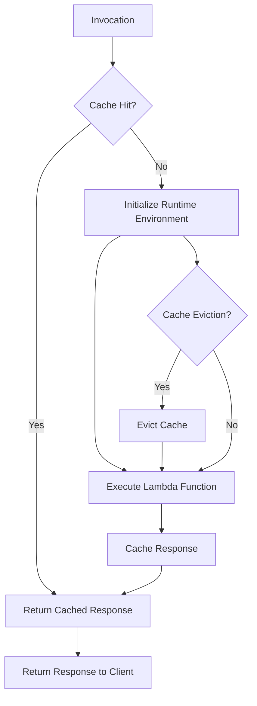

## Introduction
**Lambda Cold Start optimization** is a technique used to improve the performance of AWS Lambda functions by reducing the time it takes for a function to respond to an incoming request. When a Lambda function is invoked for the first time after a period of inactivity, it can take longer to respond due to the overhead of initializing the function's runtime environment. This delay is known as a **Cold Start**. By implementing Lambda Cold Start optimization, developers can minimize the impact of Cold Starts and ensure that their Lambda functions respond quickly to incoming requests. In this section, we will explore the importance of Lambda Cold Start optimization, its real-world relevance, and why every engineer should understand this concept.

> **Note:** AWS Lambda is a serverless compute service that allows developers to run code without provisioning or managing servers. It provides a highly scalable and cost-effective way to build applications, but it can also introduce performance challenges, such as Cold Starts.

## Core Concepts
To understand Lambda Cold Start optimization, it's essential to grasp the following core concepts:
* **Cold Start**: The delay that occurs when a Lambda function is invoked for the first time after a period of inactivity.
* **Runtime Environment**: The environment in which the Lambda function executes, including the language runtime, libraries, and dependencies.
* **Initialization**: The process of setting up the runtime environment, including loading libraries and initializing dependencies.
* **Cache**: A mechanism for storing frequently accessed data in memory to reduce the time it takes to retrieve it.

> **Tip:** Understanding these core concepts is crucial for optimizing Lambda Cold Starts. By minimizing the time it takes to initialize the runtime environment and leveraging caching mechanisms, developers can significantly improve the performance of their Lambda functions.

## How It Works Internally
When a Lambda function is invoked, the following steps occur:
1. **Initialization**: The Lambda service initializes the runtime environment, including loading libraries and dependencies.
2. **Code Execution**: The Lambda function code is executed, and the response is generated.
3. **Cache Population**: If caching is enabled, the response is stored in the cache for future requests.

> **Warning:** If the Lambda function is not invoked for an extended period, the cache may be evicted, and the function may experience a Cold Start on the next invocation.

## Code Examples
Here are three complete and runnable code examples that demonstrate Lambda Cold Start optimization:

### Example 1: Basic Lambda Function
```python
import boto3

# Create an S3 client
s3 = boto3.client('s3')

def lambda_handler(event, context):
    # Get the bucket name from the event
    bucket_name = event['bucket_name']
    
    # Get the object from S3
    object = s3.get_object(Bucket=bucket_name, Key='object_key')
    
    # Return the object contents
    return {'body': object['Body'].read().decode('utf-8')}
```
This example demonstrates a basic Lambda function that retrieves an object from S3. It does not implement any caching or optimization techniques.

### Example 2: Lambda Function with Caching
```python
import boto3
from functools import lru_cache

# Create an S3 client
s3 = boto3.client('s3')

# Define a cache decorator
@lru_cache(maxsize=128)
def get_object_from_s3(bucket_name, object_key):
    # Get the object from S3
    object = s3.get_object(Bucket=bucket_name, Key=object_key)
    
    # Return the object contents
    return object['Body'].read().decode('utf-8')

def lambda_handler(event, context):
    # Get the bucket name and object key from the event
    bucket_name = event['bucket_name']
    object_key = event['object_key']
    
    # Get the object from the cache or S3
    object_contents = get_object_from_s3(bucket_name, object_key)
    
    # Return the object contents
    return {'body': object_contents}
```
This example demonstrates a Lambda function that uses caching to store frequently accessed objects. The `lru_cache` decorator is used to implement a least-recently-used (LRU) cache.

### Example 3: Lambda Function with Advanced Caching
```python
import boto3
from functools import lru_cache
from aws_lambda_powertools import Logger

# Create an S3 client
s3 = boto3.client('s3')

# Create a logger
logger = Logger()

# Define a cache decorator with a TTL
def cache_with_ttl(ttl=60):
    def decorator(func):
        cache = {}
        def wrapper(*args, **kwargs):
            key = str(args) + str(kwargs)
            if key in cache:
                value, expires = cache[key]
                if expires > time.time():
                    return value
            value = func(*args, **kwargs)
            cache[key] = (value, time.time() + ttl)
            return value
        return wrapper
    return decorator

# Define a cache decorator with a TTL
@cache_with_ttl(ttl=300)
def get_object_from_s3(bucket_name, object_key):
    # Get the object from S3
    object = s3.get_object(Bucket=bucket_name, Key=object_key)
    
    # Return the object contents
    return object['Body'].read().decode('utf-8')

def lambda_handler(event, context):
    # Get the bucket name and object key from the event
    bucket_name = event['bucket_name']
    object_key = event['object_key']
    
    # Get the object from the cache or S3
    object_contents = get_object_from_s3(bucket_name, object_key)
    
    # Return the object contents
    return {'body': object_contents}
```
This example demonstrates a Lambda function that uses advanced caching with a time-to-live (TTL) to store frequently accessed objects.

## Visual Diagram

This diagram illustrates the flow of a Lambda function invocation, including caching and cache eviction.

## Comparison
| Approach | Time Complexity | Space Complexity | Pros | Cons | Best For |
| --- | --- | --- | --- | --- | --- |
| No Caching | O(1) | O(1) | Simple, low overhead | Slow response times, high latency | Small-scale applications, infrequent invocations |
| LRU Caching | O(1) | O(n) | Fast response times, low latency | Higher overhead, cache eviction | Medium-scale applications, frequent invocations |
| TTL Caching | O(1) | O(n) | Fast response times, low latency, cache expiration | Higher overhead, cache eviction | Large-scale applications, frequent invocations, cache expiration |

## Real-world Use Cases
* **AWS**: AWS uses Lambda Cold Start optimization to improve the performance of its serverless applications, such as AWS API Gateway and AWS Step Functions.
* **Dropbox**: Dropbox uses Lambda Cold Start optimization to improve the performance of its file-sharing platform, which relies heavily on serverless computing.
* **Netflix**: Netflix uses Lambda Cold Start optimization to improve the performance of its content delivery network, which relies on serverless computing to stream videos to users.

## Common Pitfalls
* **Insufficient caching**: Failing to implement caching or using an insufficient cache size can lead to slow response times and high latency.
* **Inadequate cache eviction**: Failing to implement cache eviction or using an inadequate cache eviction strategy can lead to cache thrashing and reduced performance.
* **Incorrect cache key**: Using an incorrect cache key can lead to cache misses and reduced performance.
* **Inadequate monitoring**: Failing to monitor cache performance and adjust cache settings accordingly can lead to reduced performance and increased latency.

## Interview Tips
* **What is Lambda Cold Start optimization?**: A technique used to improve the performance of AWS Lambda functions by reducing the time it takes for a function to respond to an incoming request.
* **How do you implement caching in a Lambda function?**: By using a caching library or framework, such as AWS Lambda Powertools, or by implementing a custom caching solution using a cache decorator or a caching library.
* **What are the benefits of using Lambda Cold Start optimization?**: Improved performance, reduced latency, and increased scalability.

## Key Takeaways
* **Lambda Cold Start optimization is crucial for serverless applications**: It can significantly improve the performance and reduce the latency of serverless applications.
* **Caching is a key component of Lambda Cold Start optimization**: Implementing caching can reduce the time it takes for a Lambda function to respond to an incoming request.
* **Cache eviction is essential for maintaining cache performance**: Implementing cache eviction can help maintain cache performance and prevent cache thrashing.
* **Monitoring cache performance is essential for optimizing cache settings**: Monitoring cache performance can help identify areas for improvement and optimize cache settings accordingly.
* **AWS Lambda Powertools is a useful library for implementing caching**: It provides a simple and efficient way to implement caching in Lambda functions.
* **Custom caching solutions can be implemented using cache decorators or caching libraries**: Implementing a custom caching solution can provide more control over caching behavior and performance.