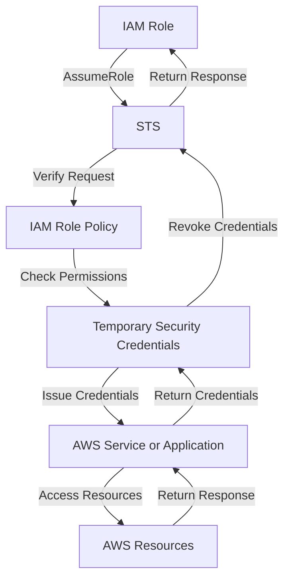

## Introduction
**Identity and Access Management (IAM)** is a crucial component of Amazon Web Services (AWS) that enables secure access to AWS resources. One of the key features of IAM is the **IAM Role**, which allows AWS services to assume a specific role and access resources without requiring long-term credentials. In this study guide, we will delve into the lifecycle and mechanics of IAM Role policies, exploring what they are, why they matter, and their real-world relevance.

IAM Role policies are essential in the cloud computing landscape, as they provide a secure and flexible way to manage access to AWS resources. With the increasing adoption of cloud services, understanding IAM Role policies is vital for any organization looking to leverage the benefits of cloud computing while maintaining security and compliance.

## Core Concepts
To understand IAM Role policies, it's essential to grasp the following core concepts:

* **IAM Role**: An IAM Role is an entity that defines a set of permissions that can be assumed by an AWS service or an application.
* **IAM Policy**: An IAM Policy is a document that defines the permissions and constraints for an IAM Role or user.
* **AssumeRole**: The AssumeRole action allows an AWS service or an application to assume an IAM Role and access resources.
* **Temporary Security Credentials**: Temporary Security Credentials are credentials that are issued to an AWS service or an application when it assumes an IAM Role.

A mental model to understand IAM Role policies is to think of them as a **trust relationship** between an AWS service or an application and the IAM Role. The IAM Role defines the permissions and constraints, and the AWS service or application assumes the role to access resources.

## How It Works Internally
When an AWS service or an application assumes an IAM Role, the following steps occur:

1. The AWS service or application requests temporary security credentials from the **Security Token Service (STS)**.
2. The STS verifies the request and checks the IAM Role policy to ensure that the AWS service or application has permission to assume the role.
3. If the request is approved, the STS issues temporary security credentials to the AWS service or application.
4. The AWS service or application uses the temporary security credentials to access AWS resources.

The time complexity for assuming an IAM Role is O(1), as it involves a single request to the STS. The space complexity is O(1), as it only requires a small amount of memory to store the temporary security credentials.

> **Note:** The STS is a highly available and scalable service that handles a large volume of requests. However, it's essential to monitor the STS usage and adjust the IAM Role policies accordingly to avoid any performance issues.

## Code Examples
### Example 1: Basic IAM Role Policy
```python
import boto3

# Create an IAM client
iam = boto3.client('iam')

# Define the IAM Role policy
policy_document = {
    'Version': '2012-10-17',
    'Statement': [
        {
            'Sid': 'AllowEC2ReadOnly',
            'Effect': 'Allow',
            'Action': 'ec2:Describe*',
            'Resource': '*'
        }
    ]
}

# Create the IAM Role policy
response = iam.create_policy(
    PolicyName='EC2ReadOnlyPolicy',
    PolicyDocument=json.dumps(policy_document)
)

print(response)
```
This example creates a basic IAM Role policy that allows read-only access to EC2 resources.

### Example 2: Real-World IAM Role Policy
```python
import boto3

# Create an IAM client
iam = boto3.client('iam')

# Define the IAM Role policy
policy_document = {
    'Version': '2012-10-17',
    'Statement': [
        {
            'Sid': 'AllowS3ReadWrite',
            'Effect': 'Allow',
            'Action': [
                's3:PutObject',
                's3:GetObject',
                's3:DeleteObject'
            ],
            'Resource': 'arn:aws:s3:::my-bucket/*'
        },
        {
            'Sid': 'AllowEC2ReadOnly',
            'Effect': 'Allow',
            'Action': 'ec2:Describe*',
            'Resource': '*'
        }
    ]
}

# Create the IAM Role policy
response = iam.create_policy(
    PolicyName='S3ReadWriteEC2ReadOnlyPolicy',
    PolicyDocument=json.dumps(policy_document)
)

print(response)
```
This example creates an IAM Role policy that allows read-write access to an S3 bucket and read-only access to EC2 resources.

### Example 3: Advanced IAM Role Policy with Conditions
```python
import boto3

# Create an IAM client
iam = boto3.client('iam')

# Define the IAM Role policy
policy_document = {
    'Version': '2012-10-17',
    'Statement': [
        {
            'Sid': 'AllowS3ReadWrite',
            'Effect': 'Allow',
            'Action': [
                's3:PutObject',
                's3:GetObject',
                's3:DeleteObject'
            ],
            'Resource': 'arn:aws:s3:::my-bucket/*',
            'Condition': {
                'IpAddress': {
                    'aws:SourceIp': '192.0.2.0/24'
                }
            }
        },
        {
            'Sid': 'AllowEC2ReadOnly',
            'Effect': 'Allow',
            'Action': 'ec2:Describe*',
            'Resource': '*'
        }
    ]
}

# Create the IAM Role policy
response = iam.create_policy(
    PolicyName='S3ReadWriteEC2ReadOnlyPolicyWithCondition',
    PolicyDocument=json.dumps(policy_document)
)

print(response)
```
This example creates an IAM Role policy that allows read-write access to an S3 bucket only from a specific IP address range.

## Visual Diagram

This diagram illustrates the lifecycle of an IAM Role policy, from the AWS service or application assuming the role to accessing AWS resources.

> **Tip:** When designing IAM Role policies, it's essential to consider the principle of least privilege and grant only the necessary permissions to the AWS service or application.

## Comparison
| Approach | Time Complexity | Space Complexity | Pros | Cons | Best For |
| --- | --- | --- | --- | --- | --- |
| IAM Role Policy | O(1) | O(1) | Fine-grained access control, flexible, and scalable | Can be complex to manage, requires careful planning | Large-scale AWS deployments |
| IAM User Policy | O(1) | O(1) | Simple to manage, easy to understand | Limited flexibility, not suitable for large-scale deployments | Small-scale AWS deployments |
| Resource-Based Policy | O(1) | O(1) | Fine-grained access control, easy to manage | Limited flexibility, not suitable for large-scale deployments | Small-scale AWS deployments |
| Service Control Policy | O(1) | O(1) | Fine-grained access control, easy to manage | Limited flexibility, not suitable for large-scale deployments | Small-scale AWS deployments |

## Real-world Use Cases
1. **Netflix**: Netflix uses IAM Role policies to manage access to its AWS resources, ensuring that only authorized services and applications can access sensitive data.
2. **Amazon**: Amazon uses IAM Role policies to manage access to its AWS resources, ensuring that only authorized services and applications can access sensitive data.
3. **Airbnb**: Airbnb uses IAM Role policies to manage access to its AWS resources, ensuring that only authorized services and applications can access sensitive data.

> **Warning:** When using IAM Role policies, it's essential to monitor the STS usage and adjust the IAM Role policies accordingly to avoid any performance issues.

## Common Pitfalls
1. **Insufficient Permissions**: Failing to grant sufficient permissions to the AWS service or application can result in access denied errors.
2. **Overly Permissive Policies**: Granting overly permissive policies can result in security vulnerabilities and unauthorized access to sensitive data.
3. **Incorrect Condition**: Using incorrect conditions in IAM Role policies can result in unexpected behavior and security vulnerabilities.
4. **Inconsistent Policy Updates**: Failing to update IAM Role policies consistently can result in security vulnerabilities and access denied errors.

> **Interview:** When interviewing for an AWS-related position, be prepared to answer questions about IAM Role policies, such as how to design and implement fine-grained access control using IAM Role policies.

## Interview Tips
1. **Designing IAM Role Policies**: Be prepared to answer questions about designing IAM Role policies, such as how to grant fine-grained access control and manage permissions.
2. **Troubleshooting IAM Role Policies**: Be prepared to answer questions about troubleshooting IAM Role policies, such as how to resolve access denied errors and security vulnerabilities.
3. **Best Practices**: Be prepared to answer questions about best practices for using IAM Role policies, such as how to monitor STS usage and adjust IAM Role policies accordingly.

## Key Takeaways
* IAM Role policies provide fine-grained access control and flexibility in managing access to AWS resources.
* The STS is a highly available and scalable service that handles a large volume of requests.
* It's essential to monitor STS usage and adjust IAM Role policies accordingly to avoid performance issues.
* IAM Role policies can be used to grant read-write access to S3 buckets and read-only access to EC2 resources.
* Conditions can be used to restrict access to IAM Role policies based on IP address, time, and other factors.
* It's essential to test and validate IAM Role policies to ensure they are working as expected.
* Best practices for using IAM Role policies include monitoring STS usage, adjusting IAM Role policies accordingly, and using conditions to restrict access.
* IAM Role policies can be used in conjunction with other AWS services, such as AWS Lambda and Amazon API Gateway, to provide fine-grained access control and flexibility in managing access to AWS resources.