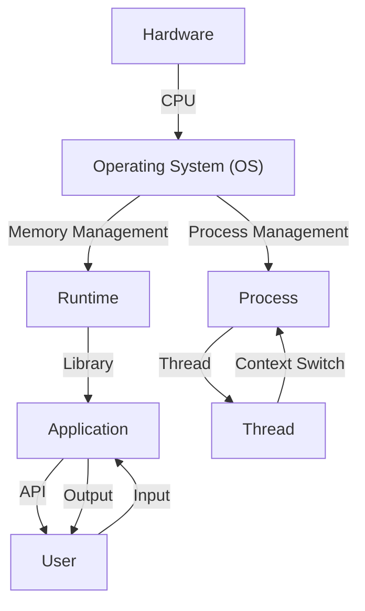

## Introduction
Abstraction layers are a fundamental concept in computer science, allowing us to simplify complex systems by breaking them down into manageable components. The four primary abstraction layers are: **Hardware**, **Operating System (OS)**, **Runtime**, and **Application**. Each layer provides a specific set of services and interfaces, enabling developers to focus on writing code without worrying about the underlying details. In this overview, we'll delve into the world of abstraction layers, exploring their importance, real-world relevance, and key concepts.

> **Note:** Abstraction layers are essential for building scalable, maintainable, and efficient systems. They enable developers to work at a high level of abstraction, while the lower-level details are handled by the underlying layers.

## Core Concepts
To understand abstraction layers, it's crucial to grasp the following core concepts:
* **Hardware**: The physical components of a computer system, including the CPU, memory, and I/O devices.
* **Operating System (OS)**: A software layer that manages hardware resources and provides a platform for running applications.
* **Runtime**: A software layer that provides a environment for executing applications, including libraries, frameworks, and interpreters.
* **Application**: The software that runs on top of the runtime layer, providing a specific set of services or functionality.

> **Tip:** When working with abstraction layers, it's essential to understand the boundaries and interfaces between each layer. This knowledge enables developers to optimize their code and make informed design decisions.

## How It Works Internally
Let's take a step-by-step look at how abstraction layers work:
1. **Hardware**: The CPU executes machine code instructions, which are generated by the compiler or interpreter.
2. **Operating System (OS)**: The OS manages hardware resources, such as memory, I/O devices, and processes. It provides a platform for running applications.
3. **Runtime**: The runtime layer provides a environment for executing applications, including libraries, frameworks, and interpreters.
4. **Application**: The application layer provides a specific set of services or functionality, built on top of the runtime layer.

> **Warning:** When working with abstraction layers, it's easy to get lost in the complexity of the system. Remember to focus on the interfaces and boundaries between each layer, rather than the implementation details.

## Code Examples
Here are three complete and runnable code examples, demonstrating the abstraction layers in action:
### Example 1: Basic Hardware Interaction (C)
```c
#include <stdio.h>

int main() {
    // Interact with the hardware (CPU) using assembly code
    __asm__ volatile("movl $1, %eax");
    __asm__ volatile("movl %eax, %ebx");
    printf("%d\n", 1);
    return 0;
}
```
### Example 2: Operating System Interaction (Python)
```python
import os

def main():
    # Interact with the operating system (OS) using the os module
    pid = os.getpid()
    print(f"Process ID: {pid}")
    # Create a new process using the os.fork() function
    pid = os.fork()
    if pid == 0:
        print("Child process")
    else:
        print("Parent process")

if __name__ == "__main__":
    main()
```
### Example 3: Runtime Interaction (JavaScript)
```javascript
// Interact with the runtime environment (Node.js) using the process module
console.log(process.version);
// Create a new thread using the worker_threads module
const { Worker } = require('worker_threads');
const worker = new Worker('./worker.js');
worker.on('message', (message) => {
    console.log(`Received message from worker: ${message}`);
});
```
> **Interview:** When asked about abstraction layers in an interview, be prepared to explain the boundaries and interfaces between each layer. Provide examples of how you've worked with abstraction layers in your previous projects.

## Visual Diagram

This diagram illustrates the abstraction layers, from hardware to application, and the interactions between each layer.

## Comparison
Here's a comparison table of different abstraction layers:
| Layer | Time Complexity | Space Complexity | Pros | Cons | Best For |
| --- | --- | --- | --- | --- | --- |
| Hardware | O(1) | O(1) | Fast, efficient | Limited flexibility | Embedded systems, real-time systems |
| Operating System (OS) | O(n) | O(n) | Provides a platform for applications | Complexity, overhead | General-purpose computing, servers |
| Runtime | O(log n) | O(log n) | Provides a environment for executing applications | Limited control over hardware | Web development, scripting |
| Application | O(n log n) | O(n log n) | Provides a specific set of services or functionality | Complexity, overhead | Business applications, scientific computing |

> **Tip:** When choosing an abstraction layer, consider the trade-offs between time complexity, space complexity, and flexibility.

## Real-world Use Cases
Here are three real-world examples of abstraction layers in action:
1. **Google's Chrome Browser**: Chrome uses a multi-process architecture, where each tab runs in a separate process. This provides a high level of isolation and security, while also improving performance.
2. **Amazon's EC2**: EC2 provides a virtualized environment for running applications, using a combination of hardware and software abstraction layers. This enables developers to deploy and manage applications without worrying about the underlying infrastructure.
3. **Microsoft's Azure**: Azure provides a cloud-based platform for building and deploying applications, using a combination of abstraction layers, including hardware, OS, runtime, and application.

## Common Pitfalls
Here are four common mistakes to watch out for when working with abstraction layers:
1. **Inconsistent interfaces**: Failing to define consistent interfaces between abstraction layers can lead to complexity and bugs.
2. **Insufficient testing**: Failing to test the interactions between abstraction layers can lead to unexpected behavior and errors.
3. **Over-engineering**: Over-engineering the abstraction layers can lead to unnecessary complexity and overhead.
4. **Under-engineering**: Under-engineering the abstraction layers can lead to inadequate performance and scalability.

> **Warning:** When working with abstraction layers, it's essential to test and validate the interactions between each layer to ensure correct behavior.

## Interview Tips
Here are three common interview questions related to abstraction layers, along with weak and strong answers:
1. **What is the purpose of abstraction layers?**
	* Weak answer: Abstraction layers are used to simplify complex systems.
	* Strong answer: Abstraction layers provide a way to manage complexity by breaking down systems into manageable components, while also enabling developers to focus on writing code without worrying about the underlying details.
2. **How do you optimize the performance of an application using abstraction layers?**
	* Weak answer: I would use a faster hardware or optimize the code.
	* Strong answer: I would analyze the interactions between abstraction layers, identify bottlenecks, and optimize the code and configuration accordingly.
3. **What are the trade-offs between different abstraction layers?**
	* Weak answer: The trade-offs are between performance and flexibility.
	* Strong answer: The trade-offs are between time complexity, space complexity, and flexibility, and the choice of abstraction layer depends on the specific requirements of the application and the underlying infrastructure.

## Key Takeaways
Here are six key takeaways to remember:
* Abstraction layers are essential for building scalable, maintainable, and efficient systems.
* The four primary abstraction layers are: **Hardware**, **Operating System (OS)**, **Runtime**, and **Application**.
* Each abstraction layer provides a specific set of services and interfaces, enabling developers to focus on writing code without worrying about the underlying details.
* The interactions between abstraction layers are critical to understand and optimize.
* The choice of abstraction layer depends on the specific requirements of the application and the underlying infrastructure.
* Abstraction layers can be optimized for performance, scalability, and flexibility by analyzing the interactions between layers and making informed design decisions.