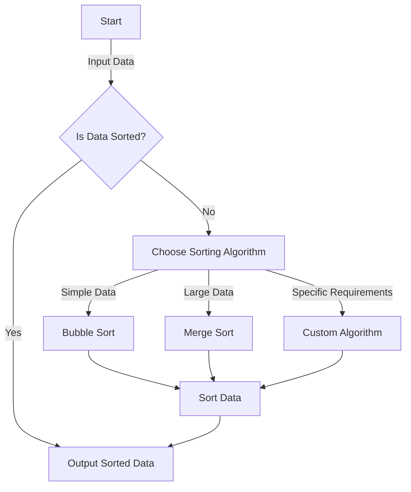

## Introduction
Computer Science (CS) is a vast and diverse field that encompasses a wide range of topics, from the theoretical foundations of computation to the practical applications of software development. At the core of any CS degree program are the fundamental courses that provide a solid foundation for further study and a successful career in the field. These core courses include **Algorithms**, **Operating Systems (OS)**, **Computer Networks**, **Databases**, **Compilers**, and **Theory of Computation**. Understanding these subjects is crucial for any aspiring computer scientist or software engineer, as they provide the building blocks for designing, developing, and optimizing complex software systems.

> **Note:** These core courses are not only essential for a deep understanding of computer science but also highly valued by employers in the tech industry. A strong foundation in these areas can significantly enhance one's career prospects and adaptability in a rapidly evolving technological landscape.

## Core Concepts
- **Algorithms**: These are well-defined procedures that take some input and produce a corresponding output. They are the backbone of software development, as they enable computers to solve problems and perform tasks efficiently. Key concepts include **time complexity** (e.g., O(n), O(n^2)) and **space complexity** (e.g., O(1), O(n)), which measure how an algorithm's running time and memory usage grow as the input size increases.
- **Operating Systems (OS)**: An OS manages computer hardware resources and provides a platform for running application software. It acts as an intermediary between computer hardware and user-level applications, controlling the allocation of system resources such as memory, CPU time, and storage. Understanding OS concepts like **process scheduling**, **memory management**, and **file systems** is vital for developing efficient and scalable software systems.
- **Computer Networks**: This field deals with the communication between devices (computer, phone, etc.) in a network, including protocols, architecture, and network topology. Key concepts include **TCP/IP**, **HTTP**, **DNS**, and understanding how data packets are routed across the internet.
- **Databases**: A database is a collection of organized data that is stored in a way that allows for efficient retrieval and manipulation. **Database management systems (DBMS)** like MySQL, PostgreSQL, and MongoDB provide a structured approach to managing data, including concepts like **SQL**, **data modeling**, and **transaction management**.
- **Compilers**: A compiler is a program that translates code written in a high-level programming language (like C, Java, or Python) into machine code that a computer's processor can execute directly. Understanding how compilers work involves knowledge of **lexical analysis**, **syntax analysis**, **semantic analysis**, and **code generation**.
- **Theory of Computation**: This branch of computer science deals with the study of the fundamental capabilities and limitations of computers. It includes topics like **automata theory**, **formal languages**, **computability theory**, and **complexity theory**, which provide a deep understanding of what can be computed and how efficiently.

## How It Works Internally
Let's take a closer look at how some of these core concepts work internally, focusing on algorithms as an example. When you write an algorithm to solve a problem, several steps are involved:
1. **Problem Definition**: Clearly define the problem you're trying to solve.
2. **Algorithm Design**: Choose an appropriate algorithmic strategy (e.g., divide and conquer, dynamic programming).
3. **Implementation**: Write the code for your algorithm, considering factors like efficiency and readability.
4. **Testing**: Test your algorithm with various inputs to ensure it produces the correct output.

> **Tip:** Always consider the time and space complexity of your algorithms. For instance, an algorithm with a time complexity of O(n^2) might be acceptable for small inputs but becomes impractically slow for large datasets.

## Code Examples
### Example 1: Basic Sorting Algorithm (Bubble Sort)
```python
def bubble_sort(arr):
    n = len(arr)
    for i in range(n):
        # Create a flag that will allow the function to terminate early if there's nothing left to sort
        already_sorted = True
        # Start looking at each item of the list one by one, comparing it with its adjacent value
        for j in range(n - i - 1):
            if arr[j] > arr[j + 1]:
                # Swap values
                arr[j], arr[j + 1] = arr[j + 1], arr[j]
                # Since we had to swap two elements,
                # we need to iterate over the list again.
                already_sorted = False
        # If there were no swaps during the last iteration,
        # the list is already sorted, and we can terminate
        if already_sorted:
            break
    return arr

# Example usage
print(bubble_sort([64, 34, 25, 12, 22, 11, 90]))
```
### Example 2: Real-world Pattern (Dynamic Programming - Fibonacci Series)
```javascript
function fibonacci(n) {
    // Create an array to store the Fibonacci numbers
    let fib = new Array(n + 1);
    // Base cases
    fib[0] = 0;
    fib[1] = 1;
    // Fill the array in a bottom-up manner
    for (let i = 2; i <= n; i++) {
        fib[i] = fib[i - 1] + fib[i - 2];
    }
    return fib[n];
}

// Example usage
console.log(fibonacci(9)); // Output: 34
```
### Example 3: Advanced Usage or Edge Case Handling (Merge Sort)
```java
public class MergeSort {
    public static void mergeSort(int[] array) {
        if (array.length > 1) {
            int mid = array.length / 2;
            // Divide array into two halves
            int[] left = new int[mid];
            int[] right = new int[array.length - mid];
            System.arraycopy(array, 0, left, 0, mid);
            System.arraycopy(array, mid, right, 0, array.length - mid);
            // Recursively invoke a merge sort on the two halves
            mergeSort(left);
            mergeSort(right);
            // Merge the two halves
            merge(array, left, right);
        }
    }

    private static void merge(int[] array, int[] left, int[] right) {
        int i = 0, j = 0, k = 0;
        // Compare elements from the two halves and place them in the correct order in the original array
        while (i < left.length && j < right.length) {
            if (left[i] < right[j]) {
                array[k++] = left[i++];
            } else {
                array[k++] = right[j++];
            }
        }
        // If there are remaining elements in the left or right arrays, append them to the original array
        while (i < left.length) {
            array[k++] = left[i++];
        }
        while (j < right.length) {
            array[k++] = right[j++];
        }
    }

    public static void main(String[] args) {
        int[] array = {64, 34, 25, 12, 22, 11, 90};
        mergeSort(array);
        System.out.println("Sorted array: ");
        for (int i : array) {
            System.out.print(i + " ");
        }
    }
}
```
Each of these examples demonstrates a different aspect of algorithms, from basic sorting to more complex dynamic programming and divide-and-conquer strategies.

## Visual Diagram

This diagram illustrates the decision-making process for selecting and applying an appropriate sorting algorithm based on the characteristics of the input data and specific requirements of the problem.

> **Warning:** Incorrectly choosing an algorithm can lead to inefficient solutions, wasting computational resources and potentially causing programs to fail or behave unpredictably.

## Comparison
| Algorithm | Time Complexity | Space Complexity | Pros | Cons | Best For |
|----------|----------------|-----------------|------|------|----------|
| Bubble Sort | O(n^2) | O(1) | Simple to implement | Inefficient for large datasets | Small datasets or educational purposes |
| Merge Sort | O(n log n) | O(n) | Efficient, stable | Requires extra space | Large datasets, stability is crucial |
| Quick Sort | O(n log n) on average, O(n^2) in worst case | O(log n) | Generally efficient, in-place | Can be slow for already sorted or nearly sorted data | General-purpose sorting |
| Heap Sort | O(n log n) | O(1) | Efficient, in-place | Not stable | When stability is not required and efficiency is key |

## Real-world Use Cases
1. **Google's Search Algorithm**: Uses a complex ranking algorithm that considers numerous factors to return the most relevant search results. This involves advanced data structures and algorithms to manage and rank web pages efficiently.
2. **Amazon's Recommendation System**: Employs collaborative filtering and other algorithms to suggest products based on a user's browsing and purchase history. This system must handle vast amounts of data and provide real-time recommendations.
3. **Facebook's News Feed Algorithm**: Utilizes machine learning algorithms to personalize the news feed for each user, considering factors like engagement, relevance, and user preferences. This requires sophisticated algorithms to analyze user behavior and content metadata.

## Common Pitfalls
1. **Inefficient Algorithm Choice**: Using an algorithm that has a high time or space complexity for a given problem can lead to performance issues.
2. **Insufficient Testing**: Failing to thoroughly test an algorithm can result in bugs or unexpected behavior, especially for edge cases.
3. **Ignoring Scalability**: Algorithms that are not designed to scale can become bottlenecks as the input size increases.
4. **Not Considering Stability**: In sorting algorithms, stability (preserving the order of equal elements) is crucial in certain applications. Ignoring this aspect can lead to incorrect results.

> **Tip:** Always consider the scalability and potential bottlenecks of your algorithms. Profiling and benchmarking can help identify performance issues early in development.

## Interview Tips
1. **Be Prepared to Explain Complex Concepts Simply**: Interviewers often look for the ability to distill complex ideas into understandable terms.
2. **Practice Whiteboarding**: Many technical interviews involve solving problems on a whiteboard. Practice explaining your thought process and writing clean, readable code under time pressure.
3. **Review Fundamental Data Structures and Algorithms**: Make sure you have a solid grasp of common data structures (arrays, linked lists, trees, graphs) and algorithms (sorting, searching, graph traversal).

> **Interview:** A common interview question is to implement a simple algorithm like binary search or to solve a small problem on the spot. Be ready to think critically and communicate your approach clearly.

## Key Takeaways
* **Algorithms are the backbone of computer science**, and understanding their time and space complexity is crucial.
* **Data structures like arrays, linked lists, trees, and graphs** are fundamental to implementing efficient algorithms.
* **Operating Systems manage hardware resources** and provide a platform for running software applications.
* **Computer Networks enable communication** between devices, with protocols like TCP/IP and HTTP being essential.
* **Databases organize and manage data**, with SQL being a standard language for database management systems.
* **Compilers translate high-level code into machine code**, and understanding their operation can improve coding efficiency and effectiveness.
* **Theory of Computation** provides the theoretical foundations for what can be computed and how efficiently, covering topics like automata, formal languages, and complexity theory.
* **Scalability and performance** should always be considered when designing and implementing algorithms and software systems.
* **Testing and debugging** are critical steps in the software development process, ensuring that algorithms and systems work correctly and efficiently.

By mastering these core concepts and understanding how they work internally, software engineers can design, develop, and optimize complex software systems that are efficient, scalable, and reliable. Whether it's developing a new application, improving existing software, or solving complex computational problems, a deep understanding of computer science fundamentals is essential for success in the tech industry.