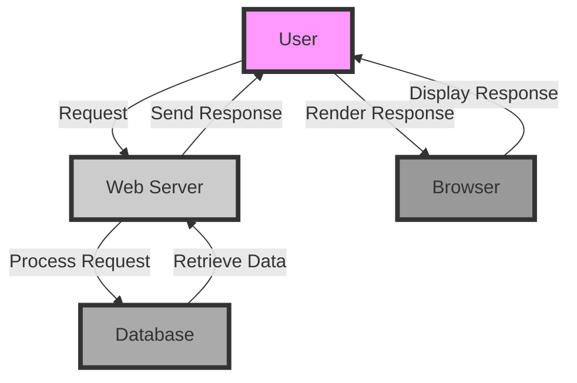

## Introduction
The core pillars of computer science are the fundamental building blocks that underlie all aspects of the field. These pillars include **algorithms**, **data structures**, **operating systems**, **networks**, **compilers**, and **databases**. Each of these areas is crucial for developing efficient, scalable, and reliable software systems. In this overview, we will delve into the definitions, core concepts, and internal workings of these pillars, as well as provide code examples, comparisons, and real-world use cases.

> **Note:** Understanding these core pillars is essential for any aspiring software engineer, as they form the foundation of computer science and are used extensively in industry and academia.

## Core Concepts
Let's start by defining each of the core pillars:
* **Algorithms**: A set of instructions that is used to solve a specific problem or perform a particular task. Examples include sorting, searching, and graph traversal.
* **Data Structures**: A way to organize and store data in a computer so that it can be efficiently accessed and modified. Examples include arrays, linked lists, and trees.
* **Operating Systems**: A software that manages computer hardware resources and provides a platform for running applications. Examples include Windows, Linux, and macOS.
* **Networks**: A collection of interconnected devices that can communicate with each other. Examples include local area networks (LANs) and the internet.
* **Compilers**: A software that translates source code written in a high-level programming language into machine code that can be executed directly by the computer's processor.
* **Databases**: A collection of organized data that is stored in a way that allows for efficient retrieval and manipulation. Examples include relational databases and NoSQL databases.

> **Tip:** When approaching a problem, consider which of these pillars is most relevant and how you can apply the corresponding concepts and techniques to solve it.

## How It Works Internally
Let's take a closer look at how each of these pillars works internally:
* **Algorithms**: An algorithm typically consists of a series of steps that are executed in a specific order. The time complexity of an algorithm is a measure of how long it takes to complete, usually expressed in terms of the size of the input. For example, the time complexity of the **binary search** algorithm is O(log n), where n is the number of elements in the search space.
* **Data Structures**: A data structure is typically implemented using a combination of arrays, pointers, and other primitive data types. The choice of data structure depends on the specific requirements of the problem, such as the need for efficient insertion, deletion, or search operations.
* **Operating Systems**: An operating system provides a layer of abstraction between the user and the computer hardware. It manages resources such as memory, CPU time, and I/O devices, and provides a platform for running applications.
* **Networks**: A network consists of a collection of devices that are connected by communication links. Each device has a unique address, and data is transmitted between devices using protocols such as TCP/IP.
* **Compilers**: A compiler translates source code into machine code by performing a series of steps, including lexical analysis, syntax analysis, semantic analysis, and code generation.
* **Databases**: A database stores data in a structured format, using a schema to define the relationships between different data entities. Queries are executed using a query language, such as SQL.

## Code Examples
Here are three complete and runnable code examples that demonstrate the use of these pillars:
### Example 1: Binary Search Algorithm
```python
def binary_search(arr, target):
    # Initialize the search space
    low = 0
    high = len(arr) - 1

    # Loop until the search space is empty
    while low <= high:
        # Calculate the midpoint of the search space
        mid = (low + high) // 2

        # Check if the target is at the midpoint
        if arr[mid] == target:
            return mid
        # If the target is less than the midpoint, search the left half
        elif arr[mid] > target:
            high = mid - 1
        # If the target is greater than the midpoint, search the right half
        else:
            low = mid + 1

    # If the target is not found, return -1
    return -1

# Test the binary search algorithm
arr = [1, 2, 3, 4, 5, 6, 7, 8, 9]
target = 5
result = binary_search(arr, target)
print("Target found at index", result)
```
### Example 2: Linked List Data Structure
```java
public class LinkedList {
    // Node class represents a single element in the linked list
    private static class Node {
        int data;
        Node next;

        public Node(int data) {
            this.data = data;
            this.next = null;
        }
    }

    // Head of the linked list
    private Node head;

    // Constructor to initialize the linked list
    public LinkedList() {
        this.head = null;
    }

    // Method to insert a new node at the end of the linked list
    public void insert(int data) {
        Node newNode = new Node(data);
        if (head == null) {
            head = newNode;
        } else {
            Node current = head;
            while (current.next != null) {
                current = current.next;
            }
            current.next = newNode;
        }
    }

    // Method to print the linked list
    public void print() {
        Node current = head;
        while (current != null) {
            System.out.print(current.data + " ");
            current = current.next;
        }
        System.out.println();
    }

    public static void main(String[] args) {
        LinkedList list = new LinkedList();
        list.insert(1);
        list.insert(2);
        list.insert(3);
        list.print();
    }
}
```
### Example 3: TCP Client-Server Network Communication
```c
#include <stdio.h>
#include <stdlib.h>
#include <string.h>
#include <sys/socket.h>
#include <netinet/in.h>
#include <arpa/inet.h>

#define BUFFER_SIZE 1024

int main() {
    // Create a socket
    int sockfd = socket(AF_INET, SOCK_STREAM, 0);
    if (sockfd < 0) {
        perror("socket creation failed");
        exit(1);
    }

    // Set up the server address
    struct sockaddr_in server_addr;
    server_addr.sin_family = AF_INET;
    server_addr.sin_port = htons(8080);
    inet_pton(AF_INET, "127.0.0.1", &server_addr.sin_addr);

    // Connect to the server
    if (connect(sockfd, (struct sockaddr *)&server_addr, sizeof(server_addr)) < 0) {
        perror("connection failed");
        exit(1);
    }

    // Send a message to the server
    char* message = "Hello, server!";
    send(sockfd, message, strlen(message), 0);

    // Receive a response from the server
    char buffer[BUFFER_SIZE];
    recv(sockfd, buffer, BUFFER_SIZE, 0);
    printf("Received: %s\n", buffer);

    // Close the socket
    close(sockfd);
    return 0;
}
```
## Visual Diagram

This diagram illustrates the flow of a web request from the user to the web server, and then to the database, and finally back to the user's browser.

> **Warning:** When working with networks, be aware of potential security risks, such as data breaches or denial-of-service attacks.

## Comparison
Here is a comparison of different approaches to solving a problem:
| Approach | Time Complexity | Space Complexity | Pros | Cons | Best For |
| --- | --- | --- | --- | --- | --- |
| Brute Force | O(n^2) | O(1) | Simple to implement | Inefficient for large inputs | Small inputs |
| Divide and Conquer | O(n log n) | O(log n) | Efficient for large inputs | More complex to implement | Large inputs |
| Dynamic Programming | O(n) | O(n) | Efficient for large inputs | More complex to implement | Large inputs with overlapping subproblems |
| Greedy Algorithm | O(n) | O(1) | Simple to implement | May not always find the optimal solution | Problems with a clear optimal solution |

## Real-world Use Cases
Here are three real-world examples of companies that use these pillars:
* **Google**: Google uses a combination of algorithms, data structures, and networks to provide fast and efficient search results. Their search algorithm is based on a complex system of ranking factors, including keyword frequency, link equity, and user behavior.
* **Amazon**: Amazon uses a combination of databases, operating systems, and compilers to manage their vast e-commerce platform. Their database system is designed to handle large volumes of data and provide fast query performance.
* **Facebook**: Facebook uses a combination of algorithms, data structures, and networks to provide personalized news feeds to their users. Their news feed algorithm is based on a complex system of ranking factors, including user engagement, post type, and time of day.

> **Tip:** When working on a project, consider how you can apply these pillars to solve real-world problems and improve the performance and efficiency of your system.

## Common Pitfalls
Here are four common mistakes that engineers make when working with these pillars:
* **Inefficient algorithms**: Using an algorithm with high time complexity can lead to slow performance and inefficiency.
* **Poor data structure choice**: Choosing the wrong data structure can lead to poor performance and inefficiency.
* **Insufficient testing**: Failing to test code thoroughly can lead to bugs and errors.
* **Insecure coding practices**: Failing to follow secure coding practices can lead to security vulnerabilities and data breaches.

> **Interview:** When interviewing for a software engineering position, be prepared to answer questions about these pillars, such as "What is the time complexity of the binary search algorithm?" or "How would you optimize the performance of a database query?"

## Interview Tips
Here are three common interview questions related to these pillars, along with sample answers:
* **What is the difference between a hash table and a binary search tree?**
	+ Weak answer: "I'm not sure."
	+ Strong answer: "A hash table is a data structure that uses a hash function to map keys to values, while a binary search tree is a data structure that uses a binary tree to store and retrieve data. Hash tables are generally faster for lookup and insertion operations, but may have poor performance for deletion operations. Binary search trees are generally more balanced and provide faster search and insertion operations, but may have poorer performance for deletion operations."
* **How would you optimize the performance of a slow database query?**
	+ Weak answer: "I would just add more hardware to the server."
	+ Strong answer: "I would start by analyzing the query plan and identifying the bottlenecks. I would then consider optimizing the query by adding indexes, rewriting the query to use more efficient joins, or using caching to reduce the load on the database. I would also consider optimizing the database configuration and hardware to improve performance."
* **What is the trade-off between using a brute force algorithm versus a more efficient algorithm?**
	+ Weak answer: "I don't know."
	+ Strong answer: "The trade-off between using a brute force algorithm versus a more efficient algorithm is that the brute force algorithm is generally simpler to implement, but may have poor performance for large inputs. A more efficient algorithm may be more complex to implement, but will generally have better performance for large inputs. The choice of algorithm depends on the specific requirements of the problem and the trade-offs between simplicity, performance, and maintainability."

## Key Takeaways
Here are ten key takeaways from this overview:
* **Algorithms**: Understanding algorithms is crucial for developing efficient software systems.
* **Data structures**: Choosing the right data structure can significantly impact the performance and efficiency of a system.
* **Operating systems**: Operating systems provide a platform for running applications and managing computer hardware resources.
* **Networks**: Networks enable communication between devices and are a critical component of modern software systems.
* **Compilers**: Compilers translate source code into machine code and are essential for developing software systems.
* **Databases**: Databases provide a way to store and retrieve data efficiently and are a critical component of many software systems.
* **Time complexity**: Understanding time complexity is crucial for developing efficient algorithms and data structures.
* **Space complexity**: Understanding space complexity is crucial for developing efficient algorithms and data structures.
* **Security**: Security is a critical consideration when developing software systems, and engineers must follow secure coding practices to prevent vulnerabilities and data breaches.
* **Testing**: Thorough testing is essential for ensuring the reliability and performance of software systems.