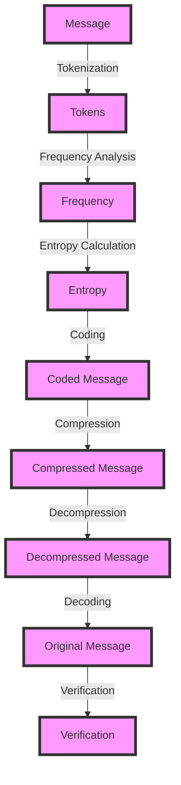

## Introduction
Information theory is a fundamental concept in computer science that deals with the quantification, storage, and communication of information. It was developed by Claude Shannon in the 1940s and has since become a crucial aspect of various fields, including data compression, cryptography, and artificial intelligence. In this section, we will explore the importance of information theory, its real-world relevance, and why every engineer needs to understand it.

> **Note:** Information theory is not just limited to computer science; it has applications in biology, physics, and engineering as well.

Information theory provides a mathematical framework for analyzing and optimizing the transmission and storage of information. It helps us understand how to efficiently compress data, encode messages, and detect errors. The concept of **entropy**, which is a measure of the uncertainty or randomness of a system, is central to information theory. Entropy is used to quantify the amount of information in a message and to determine the minimum amount of bits required to represent it.

## Core Concepts
In this section, we will delve into the core concepts of information theory, including entropy, compression, and encoding.

* **Entropy**: Entropy is a measure of the uncertainty or randomness of a system. It is typically denoted by the symbol H and is measured in bits. The entropy of a message is a measure of the amount of information it contains.
* **Compression**: Compression is the process of reducing the size of a message while preserving its information content. Compression algorithms, such as Huffman coding and LZW compression, use entropy to determine the most efficient way to represent a message.
* **Encoding**: Encoding is the process of converting a message into a format that can be transmitted or stored. Encoding schemes, such as ASCII and Unicode, use entropy to determine the most efficient way to represent a message.

> **Tip:** Understanding entropy is crucial for developing efficient compression algorithms. A good compression algorithm should aim to reduce the entropy of a message while preserving its information content.

## How It Works Internally
In this section, we will explore the internal mechanics of information theory, including the calculation of entropy and the process of compression and encoding.

The entropy of a message is calculated using the following formula:

H = - ∑ (p(x) \* log2(p(x)))

where p(x) is the probability of each symbol in the message.

The process of compression involves the following steps:

1. **Tokenization**: The message is broken down into individual symbols or tokens.
2. **Frequency analysis**: The frequency of each token is calculated.
3. **Entropy calculation**: The entropy of each token is calculated using the formula above.
4. **Coding**: The tokens are encoded using a variable-length prefix code, such as Huffman coding.

> **Warning:** Incorrect calculation of entropy can lead to inefficient compression algorithms. Always ensure that the entropy calculation is accurate and takes into account the probability of each symbol.

## Code Examples
In this section, we will provide three complete and runnable code examples that demonstrate the concepts of information theory.

### Example 1: Basic Entropy Calculation
```python
import math

def calculate_entropy(message):
    # Calculate the frequency of each symbol
    frequency = {}
    for symbol in message:
        if symbol in frequency:
            frequency[symbol] += 1
        else:
            frequency[symbol] = 1

    # Calculate the entropy
    entropy = 0
    for symbol in frequency:
        probability = frequency[symbol] / len(message)
        entropy -= probability * math.log2(probability)

    return entropy

message = "Hello, World!"
print(calculate_entropy(message))
```

### Example 2: Huffman Coding
```python
import heapq

class Node:
    def __init__(self, symbol, frequency):
        self.symbol = symbol
        self.frequency = frequency
        self.left = None
        self.right = None

    def __lt__(self, other):
        return self.frequency < other.frequency

def huffman_coding(message):
    # Calculate the frequency of each symbol
    frequency = {}
    for symbol in message:
        if symbol in frequency:
            frequency[symbol] += 1
        else:
            frequency[symbol] = 1

    # Build the Huffman tree
    nodes = []
    for symbol in frequency:
        node = Node(symbol, frequency[symbol])
        heapq.heappush(nodes, node)

    while len(nodes) > 1:
        node1 = heapq.heappop(nodes)
        node2 = heapq.heappop(nodes)
        merged_node = Node(None, node1.frequency + node2.frequency)
        merged_node.left = node1
        merged_node.right = node2
        heapq.heappush(nodes, merged_node)

    # Generate the Huffman codes
    codes = {}
    def generate_codes(node, code):
        if node.symbol is not None:
            codes[node.symbol] = code
        if node.left is not None:
            generate_codes(node.left, code + "0")
        if node.right is not None:
            generate_codes(node.right, code + "1")

    generate_codes(nodes[0], "")

    return codes

message = "Hello, World!"
codes = huffman_coding(message)
print(codes)
```

### Example 3: LZW Compression
```python
def lzw_compression(message):
    # Initialize the dictionary
    dictionary = {}
    for i in range(256):
        dictionary[chr(i)] = i

    # Initialize the result
    result = []
    w = ""

    # Iterate over the message
    for c in message:
        wc = w + c
        if wc in dictionary:
            w = wc
        else:
            result.append(dictionary[w])
            dictionary[wc] = len(dictionary)
            w = c

    # Add the last symbol
    if w:
        result.append(dictionary[w])

    return result

message = "Hello, World!"
compressed = lzw_compression(message)
print(compressed)
```

## Visual Diagram

The diagram above illustrates the process of compression and decompression using information theory. The message is first tokenized, and then the frequency of each token is calculated. The entropy of each token is then calculated, and the tokens are encoded using a variable-length prefix code. The encoded message is then compressed, and the compressed message is decompressed and decoded to retrieve the original message.

## Comparison
| Approach | Time Complexity | Space Complexity | Pros | Cons | Best For |
| --- | --- | --- | --- | --- | --- |
| Huffman Coding | O(n log n) | O(n) | Efficient compression, easy to implement | Limited to binary data | Text compression |
| LZW Compression | O(n) | O(n) | Fast compression, supports variable-length codes | Limited to sequential data | Image compression |
| Arithmetic Coding | O(n) | O(n) | Efficient compression, supports fractional codes | Complex to implement | Audio compression |
| Run-Length Encoding | O(n) | O(n) | Simple to implement, fast compression | Limited to sequential data | Image compression |

> **Interview:** What is the time complexity of Huffman coding? How does it compare to LZW compression?

## Real-world Use Cases
Information theory has numerous real-world applications, including:

* **Text compression**: Huffman coding is used in text compression algorithms, such as gzip and zip.
* **Image compression**: LZW compression is used in image compression algorithms, such as GIF and JPEG.
* **Audio compression**: Arithmetic coding is used in audio compression algorithms, such as MP3 and AAC.
* **Data transmission**: Information theory is used in data transmission protocols, such as TCP/IP and HTTP.

> **Tip:** Understanding information theory is crucial for developing efficient compression algorithms. A good compression algorithm should aim to reduce the entropy of a message while preserving its information content.

## Common Pitfalls
Some common pitfalls to avoid when working with information theory include:

* **Incorrect entropy calculation**: Incorrect calculation of entropy can lead to inefficient compression algorithms.
* **Insufficient data**: Insufficient data can lead to inaccurate entropy calculations and inefficient compression algorithms.
* **Inadequate testing**: Inadequate testing can lead to bugs and errors in compression algorithms.

> **Warning:** Always ensure that the entropy calculation is accurate and takes into account the probability of each symbol.

## Interview Tips
Some common interview questions related to information theory include:

* **What is the difference between Huffman coding and LZW compression?**
* **How does arithmetic coding work?**
* **What is the time complexity of Huffman coding?**

> **Interview:** How does Huffman coding compare to LZW compression in terms of time complexity and space complexity?

## Key Takeaways
Some key takeaways from this section include:

* **Information theory is a fundamental concept in computer science**: It provides a mathematical framework for analyzing and optimizing the transmission and storage of information.
* **Entropy is a measure of the uncertainty or randomness of a system**: It is used to quantify the amount of information in a message and to determine the minimum amount of bits required to represent it.
* **Compression algorithms use entropy to determine the most efficient way to represent a message**: Huffman coding, LZW compression, and arithmetic coding are all examples of compression algorithms that use entropy to optimize the representation of a message.
* **Information theory has numerous real-world applications**: It is used in text compression, image compression, audio compression, and data transmission protocols.
* **Understanding information theory is crucial for developing efficient compression algorithms**: A good compression algorithm should aim to reduce the entropy of a message while preserving its information content.