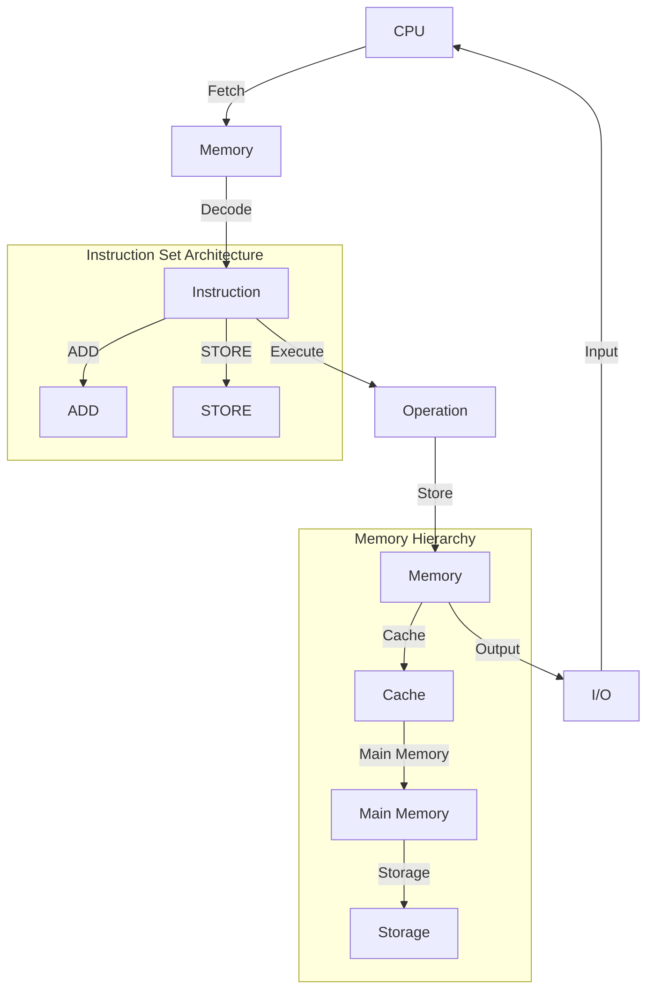

## Introduction
The **Von Neumann Architecture** is a fundamental concept in computer science that describes the basic structure and operation of a computer's central processing unit (CPU), memory, and input/output (I/O) systems. This architecture is named after the mathematician and computer scientist **John von Neumann**, who first proposed it in the 1940s. The Von Neumann Architecture is still the basis for most modern computers, and understanding it is essential for any software engineer or computer scientist.

> **Note:** The Von Neumann Architecture is a stored-program computer, meaning that the program and data are stored in the same memory. This is in contrast to other architectures, such as the **Harvard Architecture**, which use separate memories for program and data.

The Von Neumann Architecture is relevant in real-world scenarios because it is the foundation for most modern computing systems, from smartphones to supercomputers. Understanding how the CPU, memory, and I/O systems interact is crucial for optimizing software performance, debugging issues, and designing efficient algorithms.

## Core Concepts
The Von Neumann Architecture consists of three main components:

* **Central Processing Unit (CPU)**: The CPU is the brain of the computer, responsible for executing instructions and performing calculations. It consists of several key components, including the **Arithmetic Logic Unit (ALU)**, **Registers**, and **Control Unit**.
* **Memory**: Memory is where the computer stores data and programs. It is divided into two main types: **Random Access Memory (RAM)** and **Read-Only Memory (ROM)**.
* **Input/Output (I/O) Systems**: I/O systems allow the computer to interact with the outside world, including devices such as keyboards, displays, and hard drives.

> **Warning:** One common mistake is to confuse the **Von Neumann Architecture** with the **Von Neumann Bottleneck**, which refers to the limitation of the architecture's bandwidth between the CPU and memory.

Key terminology includes:

* **Fetch-Decode-Execute Cycle**: The process by which the CPU retrieves an instruction from memory, decodes it, and executes it.
* **Instruction Set Architecture (ISA)**: The set of instructions that a CPU can execute.
* **Memory Hierarchy**: The organization of memory levels, from fastest to slowest, including **Registers**, **Cache**, **Main Memory**, and **Storage**.

## How It Works Internally
The Von Neumann Architecture works as follows:

1. The **CPU** fetches an instruction from **Memory**.
2. The **CPU** decodes the instruction and determines what operation to perform.
3. The **CPU** executes the instruction, which may involve accessing **Memory** or **I/O** systems.
4. The **CPU** stores the results of the instruction in **Memory** or **Registers**.

The **Fetch-Decode-Execute Cycle** is the fundamental process by which the CPU executes instructions. The **Instruction Set Architecture (ISA)** defines the set of instructions that the CPU can execute, and the **Memory Hierarchy** determines how data is accessed and stored.

> **Tip:** Understanding the **Memory Hierarchy** is crucial for optimizing software performance, as it can significantly impact the speed of data access and storage.

## Code Examples
Here are three complete, runnable code examples that demonstrate the Von Neumann Architecture:

### Example 1: Basic CPU Simulation (Python)
```python
# Define a simple CPU class
class CPU:
    def __init__(self):
        self.registers = {}
        self.memory = {}

    def fetch(self, address):
        return self.memory.get(address)

    def decode(self, instruction):
        # Simplified decoding process
        if instruction == "ADD":
            return "ADD"
        elif instruction == "STORE":
            return "STORE"
        else:
            raise ValueError("Invalid instruction")

    def execute(self, instruction):
        if instruction == "ADD":
            # Simplified addition operation
            self.registers["ACC"] = self.registers.get("ACC", 0) + 1
        elif instruction == "STORE":
            # Simplified store operation
            self.memory["RESULT"] = self.registers.get("ACC", 0)

# Create a CPU instance and execute instructions
cpu = CPU()
cpu.memory["INSTRUCTION"] = "ADD"
cpu.execute(cpu.decode(cpu.fetch("INSTRUCTION")))
print(cpu.registers["ACC"])  # Output: 1
```

### Example 2: Memory Hierarchy Simulation (Java)
```java
// Define a simple MemoryHierarchy class
public class MemoryHierarchy {
    private int[] registers;
    private int[] cache;
    private int[] mainMemory;

    public MemoryHierarchy(int registerSize, int cacheSize, int mainMemorySize) {
        registers = new int[registerSize];
        cache = new int[cacheSize];
        mainMemory = new int[mainMemorySize];
    }

    public int accessMemory(int address) {
        // Simplified memory access process
        if (address < registers.length) {
            return registers[address];
        } else if (address < cache.length) {
            return cache[address];
        } else {
            return mainMemory[address];
        }
    }

    public void storeMemory(int address, int value) {
        // Simplified memory store process
        if (address < registers.length) {
            registers[address] = value;
        } else if (address < cache.length) {
            cache[address] = value;
        } else {
            mainMemory[address] = value;
        }
    }

    public static void main(String[] args) {
        MemoryHierarchy memory = new MemoryHierarchy(10, 100, 1000);
        memory.storeMemory(5, 10);
        System.out.println(memory.accessMemory(5));  // Output: 10
    }
}
```

### Example 3: I/O System Simulation (C++)
```cpp
// Define a simple IOSystem class
class IOSystem {
public:
    void readInput() {
        // Simplified input read process
        std::cout << "Enter a value: ";
        int value;
        std::cin >> value;
        std::cout << "You entered: " << value << std::endl;
    }

    void writeOutput(int value) {
        // Simplified output write process
        std::cout << "Output: " << value << std::endl;
    }
};

int main() {
    IOSystem io;
    io.readInput();
    io.writeOutput(10);
    return 0;
}
```

## Visual Diagram

The diagram illustrates the Von Neumann Architecture, including the CPU, memory, and I/O systems. The **Memory Hierarchy** and **Instruction Set Architecture** are also shown.

> **Interview:** Can you explain the difference between the **Von Neumann Architecture** and the **Harvard Architecture**? How do they impact software performance?

## Comparison
| Architecture | Time Complexity | Space Complexity | Pros | Cons | Best For |
| --- | --- | --- | --- | --- | --- |
| Von Neumann | O(n) | O(n) | Simple, efficient | Limited bandwidth | General-purpose computing |
| Harvard | O(1) | O(1) | Fast, low latency | Complex, expensive | Real-time systems, embedded systems |
| ARM | O(n) | O(n) | Power-efficient, scalable | Limited compatibility | Mobile devices, IoT devices |
| x86 | O(n) | O(n) | High-performance, compatible | Power-hungry, complex | Desktop computers, servers |

The table compares different architectures, including their time and space complexities, pros, cons, and best use cases.

## Real-world Use Cases
Here are three real-world examples of the Von Neumann Architecture in use:

* **Google's Data Centers**: Google's data centers use a combination of **Von Neumann Architecture** and **Harvard Architecture** to optimize performance and reduce latency.
* **Apple's iPhones**: Apple's iPhones use a **Von Neumann Architecture** to execute instructions and access memory.
* **NASA's Supercomputers**: NASA's supercomputers use a **Von Neumann Architecture** to simulate complex phenomena and analyze large datasets.

## Common Pitfalls
Here are four common mistakes to avoid when working with the Von Neumann Architecture:

* **Confusing the Von Neumann Architecture with the Von Neumann Bottleneck**: The **Von Neumann Bottleneck** refers to the limitation of the architecture's bandwidth between the CPU and memory, while the **Von Neumann Architecture** refers to the overall design of the CPU, memory, and I/O systems.
* **Ignoring the Memory Hierarchy**: Failing to optimize memory access and storage can lead to significant performance degradation.
* **Not considering the Instruction Set Architecture**: The **Instruction Set Architecture** defines the set of instructions that the CPU can execute, and failing to consider it can lead to compatibility issues and performance problems.
* **Not optimizing I/O operations**: Failing to optimize I/O operations can lead to significant performance degradation and increased latency.

> **Warning:** Ignoring the **Memory Hierarchy** can lead to significant performance degradation and increased latency.

## Interview Tips
Here are three common interview questions related to the Von Neumann Architecture:

* **What is the difference between the Von Neumann Architecture and the Harvard Architecture?**: A strong answer should explain the key differences between the two architectures, including the use of separate memories for program and data in the Harvard Architecture.
* **How does the Memory Hierarchy impact software performance?**: A strong answer should explain the different levels of the memory hierarchy, including **Registers**, **Cache**, **Main Memory**, and **Storage**, and how they impact software performance.
* **What are some common pitfalls to avoid when working with the Von Neumann Architecture?**: A strong answer should identify common mistakes, such as confusing the **Von Neumann Architecture** with the **Von Neumann Bottleneck**, ignoring the **Memory Hierarchy**, and not considering the **Instruction Set Architecture**.

## Key Takeaways
Here are ten key takeaways to remember about the Von Neumann Architecture:

* The **Von Neumann Architecture** is a fundamental concept in computer science that describes the basic structure and operation of a computer's CPU, memory, and I/O systems.
* The **Fetch-Decode-Execute Cycle** is the fundamental process by which the CPU executes instructions.
* The **Memory Hierarchy** is crucial for optimizing software performance, and includes **Registers**, **Cache**, **Main Memory**, and **Storage**.
* The **Instruction Set Architecture** defines the set of instructions that the CPU can execute.
* **I/O operations** can significantly impact software performance and latency.
* The **Von Neumann Architecture** is still the basis for most modern computers.
* Understanding the **Von Neumann Architecture** is essential for optimizing software performance and debugging issues.
* The **Von Neumann Bottleneck** refers to the limitation of the architecture's bandwidth between the CPU and memory.
* **Harvard Architecture** uses separate memories for program and data, while the **Von Neumann Architecture** uses a single memory for both.
* **ARM** and **x86** are examples of architectures that use the **Von Neumann Architecture**.