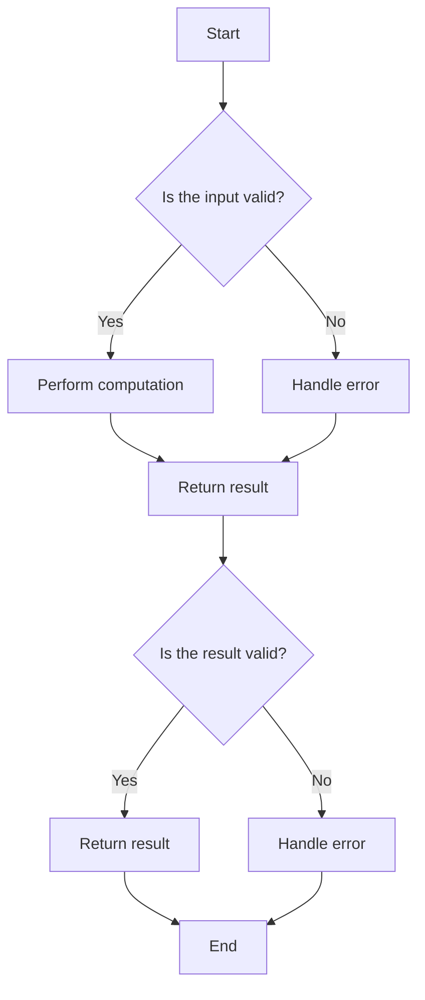

## Introduction
Computer Science is the study of **computation**, **algorithms**, and **data**. It encompasses a broad range of subfields, including **artificial intelligence**, **computer networks**, **database systems**, **human-computer interaction**, and **software engineering**. Computer Science is a fundamental field that underlies many modern technologies, from **smartphones** and **social media** to **medical imaging** and **financial transactions**. As technology continues to advance and permeate every aspect of our lives, the importance of Computer Science cannot be overstated. Every engineer needs to have a solid understanding of Computer Science concepts, as they are essential for building efficient, scalable, and reliable software systems.

## Core Concepts
At its core, Computer Science is about understanding how to **represent**, **manipulate**, and **analyze** data. This involves studying **data structures**, such as **arrays**, **linked lists**, and **trees**, as well as **algorithms**, which are step-by-step procedures for solving problems. Key terminology includes **Big O notation**, which describes the time and space complexity of an algorithm, and **recursion**, which is a technique for solving problems by breaking them down into smaller sub-problems. Mental models, such as the **von Neumann architecture**, which describes the basic components of a computer, are also essential for understanding how Computer Science works.

> **Note:** Computer Science is not just about programming, but about understanding the underlying principles and concepts that make computing possible.

## How It Works Internally
When a computer executes a program, it follows a series of steps that involve **fetching**, **decoding**, and **executing** instructions. The **central processing unit (CPU)** is the brain of the computer, responsible for performing calculations and executing instructions. The **memory hierarchy**, which includes **registers**, **cache**, and **main memory**, provides a layered system for storing and retrieving data. The **input/output (I/O) subsystem** allows the computer to interact with the outside world, reading input from devices such as keyboards and mice, and writing output to devices such as monitors and printers.

## Code Examples
### Example 1: Basic Sorting Algorithm
```python
def bubble_sort(arr):
    # Initialize a flag to track if any swaps were made
    swapped = True
    
    # Continue iterating until no more swaps are needed
    while swapped:
        swapped = False
        
        # Iterate through the array, comparing each pair of adjacent elements
        for i in range(len(arr) - 1):
            if arr[i] > arr[i + 1]:
                # Swap the elements if they are in the wrong order
                arr[i], arr[i + 1] = arr[i + 1], arr[i]
                swapped = True
                
    return arr

# Test the function
arr = [5, 2, 8, 3, 1, 4, 6]
print(bubble_sort(arr))
```
This example demonstrates a basic **bubble sort** algorithm, which has a time complexity of O(n^2) and a space complexity of O(1).

### Example 2: Real-World Pattern - Finding the Closest Pair of Points
```java
import java.util.*;

class Point {
    int x, y;
    
    public Point(int x, int y) {
        this.x = x;
        this.y = y;
    }
}

public class ClosestPair {
    public static void main(String[] args) {
        // Generate a set of random points
        Point[] points = new Point[10];
        Random rand = new Random();
        for (int i = 0; i < 10; i++) {
            points[i] = new Point(rand.nextInt(100), rand.nextInt(100));
        }
        
        // Find the closest pair of points
        Point[] closestPair = findClosestPair(points);
        
        // Print the result
        System.out.println("Closest pair: (" + closestPair[0].x + ", " + closestPair[0].y + ") and (" + closestPair[1].x + ", " + closestPair[1].y + ")");
    }
    
    public static Point[] findClosestPair(Point[] points) {
        // Initialize the minimum distance and the closest pair
        double minDistance = Double.MAX_VALUE;
        Point[] closestPair = new Point[2];
        
        // Iterate through all pairs of points
        for (int i = 0; i < points.length; i++) {
            for (int j = i + 1; j < points.length; j++) {
                // Calculate the distance between the points
                double distance = Math.sqrt(Math.pow(points[i].x - points[j].x, 2) + Math.pow(points[i].y - points[j].y, 2));
                
                // Update the minimum distance and the closest pair if necessary
                if (distance < minDistance) {
                    minDistance = distance;
                    closestPair[0] = points[i];
                    closestPair[1] = points[j];
                }
            }
        }
        
        return closestPair;
    }
}
```
This example demonstrates a real-world pattern for finding the **closest pair of points** in a set of 2D points, which has a time complexity of O(n^2) and a space complexity of O(1).

### Example 3: Advanced Usage - Implementing a Trie Data Structure
```typescript
class TrieNode {
    children: { [key: string]: TrieNode };
    isEndOfWord: boolean;
    
    constructor() {
        this.children = {};
        this.isEndOfWord = false;
    }
}

class Trie {
    root: TrieNode;
    
    constructor() {
        this.root = new TrieNode();
    }
    
    insert(word: string): void {
        let node = this.root;
        for (let char of word) {
            if (!node.children[char]) {
                node.children[char] = new TrieNode();
            }
            node = node.children[char];
        }
        node.isEndOfWord = true;
    }
    
    search(word: string): boolean {
        let node = this.root;
        for (let char of word) {
            if (!node.children[char]) {
                return false;
            }
            node = node.children[char];
        }
        return node.isEndOfWord;
    }
}

// Test the Trie implementation
let trie = new Trie();
trie.insert("apple");
trie.insert("banana");
console.log(trie.search("apple"));  // true
console.log(trie.search("banana"));  // true
console.log(trie.search("orange"));  // false
```
This example demonstrates an advanced usage of a **Trie data structure**, which has a time complexity of O(m) for insertion and search, where m is the length of the word.

## Visual Diagram

This diagram illustrates the basic flow of a computational process, including input validation, computation, error handling, and result validation.

## Comparison
| Approach | Time Complexity | Space Complexity | Pros | Cons | Best For |
| --- | --- | --- | --- | --- | --- |
| Bubble Sort | O(n^2) | O(1) | Simple to implement, stable | Slow for large datasets | Small datasets, educational purposes |
| Quick Sort | O(n log n) | O(log n) | Fast, efficient | Not stable, can be slow for small datasets | Large datasets, performance-critical applications |
| Merge Sort | O(n log n) | O(n) | Stable, efficient | Requires extra memory, can be slow for small datasets | Large datasets, stability-critical applications |
| Trie | O(m) | O(m) | Fast lookup, insertion, and deletion | Can be memory-intensive, complex to implement | String matching, autocomplete, and spell-checking applications |

## Real-world Use Cases
1. **Google's Search Engine**: Google's search engine uses a combination of algorithms, including **PageRank** and **Latent Semantic Analysis**, to rank web pages based on their relevance and importance.
2. **Amazon's Recommendation System**: Amazon's recommendation system uses a combination of **collaborative filtering** and **content-based filtering** to suggest products to customers based on their browsing and purchasing history.
3. **Facebook's News Feed**: Facebook's news feed uses a combination of **machine learning** and **natural language processing** to rank and filter posts based on their relevance and engagement.

## Common Pitfalls
1. **Not considering the time complexity of an algorithm**: Failing to consider the time complexity of an algorithm can lead to slow performance and scalability issues.
2. **Not handling errors and edge cases**: Failing to handle errors and edge cases can lead to crashes, data corruption, and security vulnerabilities.
3. **Not testing and validating algorithms**: Failing to test and validate algorithms can lead to incorrect results, crashes, and security vulnerabilities.
4. **Not considering the trade-offs between different approaches**: Failing to consider the trade-offs between different approaches can lead to suboptimal solutions that do not meet the requirements of the problem.

> **Warning:** Not considering the time complexity of an algorithm can lead to slow performance and scalability issues.

## Interview Tips
1. **Be prepared to explain the time and space complexity of an algorithm**: Interviewers often ask about the time and space complexity of an algorithm, so be prepared to explain it clearly and concisely.
2. **Be prepared to implement an algorithm from scratch**: Interviewers often ask candidates to implement an algorithm from scratch, so be prepared to write clean, efficient, and well-documented code.
3. **Be prepared to discuss the trade-offs between different approaches**: Interviewers often ask about the trade-offs between different approaches, so be prepared to discuss the pros and cons of each approach.

> **Interview:** Can you explain the time and space complexity of the bubble sort algorithm?

## Key Takeaways
* Computer Science is the study of computation, algorithms, and data.
* Understanding the time and space complexity of an algorithm is crucial for building efficient and scalable software systems.
* Considering the trade-offs between different approaches is essential for building optimal solutions that meet the requirements of the problem.
* Not considering the time complexity of an algorithm can lead to slow performance and scalability issues.
* Not handling errors and edge cases can lead to crashes, data corruption, and security vulnerabilities.
* Testing and validating algorithms is essential for ensuring correctness and reliability.
* Understanding the basics of data structures and algorithms is essential for building efficient and scalable software systems.
* Practicing coding and problem-solving is essential for building skills and confidence in Computer Science.