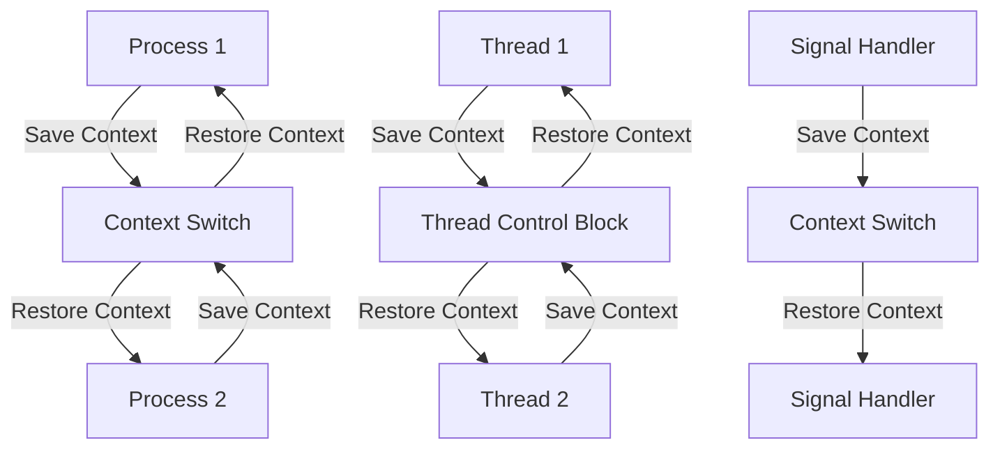

## Introduction
**Context switching** is a fundamental concept in computer science that refers to the process of switching between two or more processes or threads in a multitasking operating system. It is a crucial mechanism that enables multiple tasks to share the same resources, such as CPU time, memory, and I/O devices. Context switching is essential in modern operating systems, as it allows for efficient use of system resources, improved responsiveness, and increased productivity. In this section, we will delve into the world of context switching, exploring its importance, real-world relevance, and the problems it solves.

> **Note:** Context switching is not unique to operating systems; it is also used in other areas, such as programming languages and software development, to manage multiple tasks and threads.

In real-world scenarios, context switching is encountered in various situations, such as when a user switches between multiple applications on their desktop, or when a web server handles multiple concurrent requests. The ability to context switch efficiently is critical in these scenarios, as it directly impacts the overall performance and responsiveness of the system.

## Core Concepts
To understand context switching, it is essential to grasp the following core concepts:

* **Process**: A program in execution, which includes the program's code, data, and system resources.
* **Thread**: A lightweight process that shares the same memory space as other threads in the same process.
* **Context**: The current state of a process or thread, including its registers, program counter, and memory pointers.
* **Context switch**: The process of saving the current context of a process or thread and restoring the context of another process or thread.

> **Tip:** A good mental model for context switching is to think of it as a "save and restore" operation, where the current context is saved, and the new context is restored.

Key terminology includes:

* **Process control block (PCB)**: A data structure that contains information about a process, such as its context, priority, and memory allocation.
* **Thread control block (TCB)**: A data structure that contains information about a thread, such as its context, priority, and memory allocation.

## How It Works Internally
The context switching process involves the following steps:

1. **Save the current context**: The operating system saves the current context of the process or thread, including its registers, program counter, and memory pointers.
2. **Fetch the new context**: The operating system fetches the context of the new process or thread from the PCB or TCB.
3. **Restore the new context**: The operating system restores the new context, including its registers, program counter, and memory pointers.
4. **Update the PCB or TCB**: The operating system updates the PCB or TCB to reflect the new context.

The time complexity of context switching is typically O(1), as it involves a fixed number of operations. However, the space complexity can vary depending on the implementation, as it may require additional memory to store the context.

## Code Examples
### Example 1: Basic Context Switching
```c
#include <stdio.h>
#include <stdlib.h>
#include <ucontext.h>

// Define a context structure
ucontext_t context1, context2;

// Define a function to switch contexts
void switch_context(ucontext_t *context) {
    // Save the current context
    getcontext(context);
    // Restore the new context
    setcontext(context);
}

int main() {
    // Initialize the contexts
    getcontext(&context1);
    getcontext(&context2);

    // Switch contexts
    switch_context(&context2);

    return 0;
}
```
This example demonstrates a basic context switching mechanism using the `ucontext` library in C.

### Example 2: Context Switching with Threads
```java
import java.lang.Thread;

// Define a thread class
class MyThread extends Thread {
    public void run() {
        // Simulate some work
        for (int i = 0; i < 10; i++) {
            System.out.println("Thread " + Thread.currentThread().getName() + ": " + i);
        }
    }
}

public class ContextSwitchingExample {
    public static void main(String[] args) {
        // Create two threads
        MyThread thread1 = new MyThread();
        MyThread thread2 = new MyThread();

        // Start the threads
        thread1.start();
        thread2.start();

        // Context switch between the threads
        try {
            thread1.join();
            thread2.join();
        } catch (InterruptedException e) {
            Thread.currentThread().interrupt();
        }
    }
}
```
This example demonstrates context switching between two threads in Java.

### Example 3: Advanced Context Switching with Signal Handling
```c
#include <stdio.h>
#include <stdlib.h>
#include <signal.h>
#include <ucontext.h>

// Define a context structure
ucontext_t context1, context2;

// Define a signal handler
void signal_handler(int sig) {
    // Save the current context
    getcontext(&context1);
    // Restore the new context
    setcontext(&context2);
}

int main() {
    // Initialize the contexts
    getcontext(&context1);
    getcontext(&context2);

    // Install the signal handler
    signal(SIGALRM, signal_handler);

    // Raise a signal to trigger the context switch
    raise(SIGALRM);

    return 0;
}
```
This example demonstrates advanced context switching using signal handling in C.

## Visual Diagram

This diagram illustrates the context switching process between processes and threads, as well as the role of signal handling in context switching.

> **Warning:** Context switching can lead to performance overhead due to the savings and restoration of contexts. It is essential to minimize context switching whenever possible.

## Comparison
| Approach | Time Complexity | Space Complexity | Pros | Cons | Best For |
| --- | --- | --- | --- | --- | --- |
| Process-based Context Switching | O(1) | O(n) | Efficient use of system resources | High overhead due to context switching | Multitasking operating systems |
| Thread-based Context Switching | O(1) | O(1) | Low overhead due to shared memory | Limited by the number of available threads | Concurrent programming |
| Signal-based Context Switching | O(1) | O(1) | Flexible and efficient | Complexity due to signal handling | Real-time systems and embedded systems |
| Cooperative Context Switching | O(1) | O(1) | Efficient and low overhead | Limited by the complexity of the scheduling algorithm | Cooperative multitasking |

## Real-world Use Cases
1. **Google's Chrome Browser**: Chrome uses a process-based context switching approach to manage multiple tabs and extensions, ensuring efficient use of system resources and improved responsiveness.
2. **Apache Web Server**: Apache uses a thread-based context switching approach to handle multiple concurrent requests, providing low overhead and efficient use of system resources.
3. **Real-time Systems**: Real-time systems, such as those used in aerospace and defense, use signal-based context switching to ensure predictable and efficient response times.

## Common Pitfalls
1. **Inefficient Context Switching**: Failing to minimize context switching can lead to performance overhead and decreased system responsiveness.
2. **Incorrect Context Restoration**: Failing to restore the correct context can lead to incorrect results or system crashes.
3. **Insufficient Resource Allocation**: Failing to allocate sufficient resources for context switching can lead to performance overhead and decreased system responsiveness.
4. **Complexity due to Signal Handling**: Failing to handle signals correctly can lead to complexity and performance overhead.

> **Tip:** To avoid common pitfalls, it is essential to understand the underlying context switching mechanism and to minimize context switching whenever possible.

## Interview Tips
1. **What is context switching, and how does it work?**: A strong answer should include a clear explanation of the context switching process, including the steps involved and the trade-offs between different approaches.
2. **How do you optimize context switching in a multitasking operating system?**: A strong answer should include a discussion of techniques such as minimizing context switching, using efficient data structures, and optimizing signal handling.
3. **What are the advantages and disadvantages of process-based context switching versus thread-based context switching?**: A strong answer should include a comparison of the two approaches, including their time and space complexities, pros, and cons.

> **Interview:** When answering context switching questions, be sure to provide specific examples and to discuss the trade-offs between different approaches.

## Key Takeaways
* Context switching is a fundamental concept in computer science that enables multiple tasks to share the same resources.
* The context switching process involves saving the current context, fetching the new context, restoring the new context, and updating the PCB or TCB.
* Context switching can be implemented using processes, threads, or signals, each with its own trade-offs and complexity.
* Minimizing context switching is essential to optimize system performance and responsiveness.
* Understanding the underlying context switching mechanism is critical to avoiding common pitfalls and optimizing system performance.
* Context switching is used in various real-world scenarios, including multitasking operating systems, concurrent programming, and real-time systems.
* The time complexity of context switching is typically O(1), while the space complexity can vary depending on the implementation.
* Context switching can lead to performance overhead due to the savings and restoration of contexts.