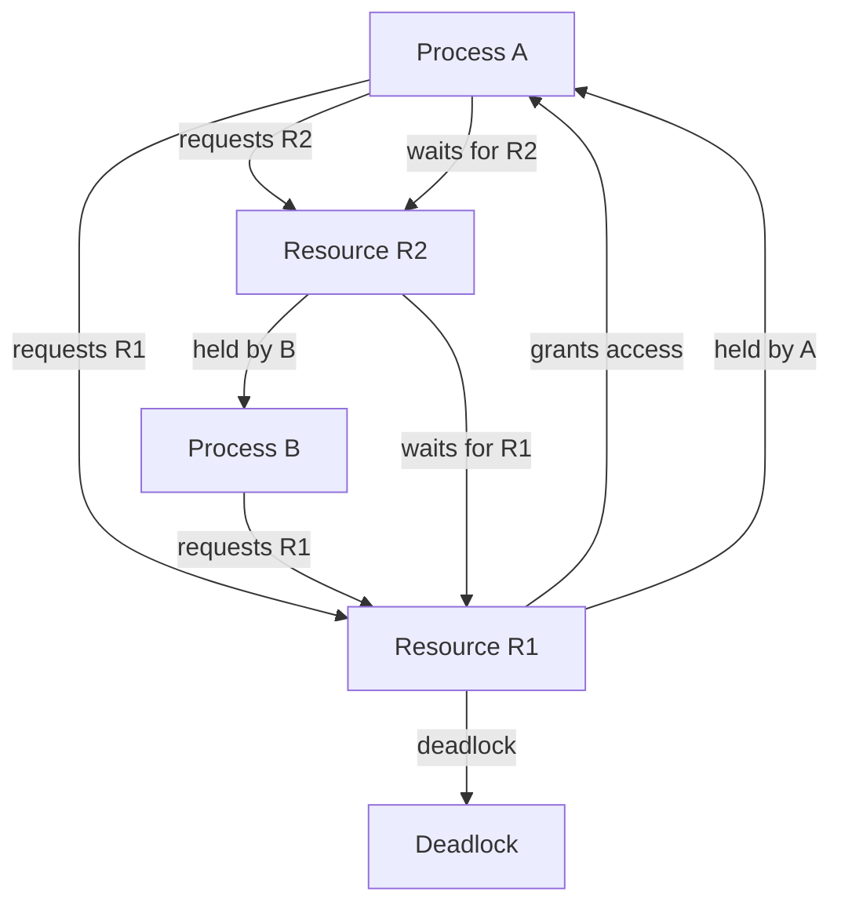

## Introduction
A **deadlock** is a situation in which two or more processes are unable to complete their tasks because each is waiting for the other to release a resource. This can happen in any system where multiple processes share resources, such as operating systems, databases, and networks. Deadlocks can cause significant performance issues and even lead to system crashes. Every engineer needs to understand deadlocks because they can occur in any system that uses shared resources, and knowing how to prevent, avoid, and detect them is crucial for building reliable and efficient systems.

> **Note:** Deadlocks are often confused with **livelocks**, which are similar but occur when two or more processes are unable to complete their tasks because they are constantly trying to acquire resources that are being held by other processes.

## Core Concepts
To understand deadlocks, we need to define some key terms:

* **Resource**: A resource is anything that a process needs to complete its task, such as a file, a network connection, or a lock.
* **Process**: A process is a program that is executing in the system.
* **Lock**: A lock is a mechanism that allows a process to acquire exclusive access to a resource.
* **Wait-for graph**: A wait-for graph is a graph that shows which processes are waiting for which resources.

The following are the necessary conditions for a deadlock to occur:

1. **Mutual Exclusion**: Two or more processes must be competing for the same resource.
2. **Hold and Wait**: One process must be holding a resource and waiting for another resource.
3. **No Preemption**: The operating system must not be able to preempt one process and give the resource to another process.
4. **Circular Wait**: The processes must be waiting for each other to release resources.

## How It Works Internally
When a process requests a resource, the operating system checks if the resource is available. If it is, the process is granted access to the resource. If not, the process is put on a wait queue. When a process releases a resource, the operating system checks the wait queue to see if any processes are waiting for that resource. If there are, the operating system grants access to the resource to the next process in the queue.

The following is a step-by-step example of how a deadlock can occur:

1. Process A requests resource R1 and is granted access.
2. Process B requests resource R2 and is granted access.
3. Process A requests resource R2, but it is held by process B, so process A is put on the wait queue.
4. Process B requests resource R1, but it is held by process A, so process B is put on the wait queue.
5. Both processes are waiting for each other to release resources, resulting in a deadlock.

## Code Examples
### Example 1: Basic Deadlock
```java
public class DeadlockExample {
    public static void main(String[] args) {
        final Object lock1 = new Object();
        final Object lock2 = new Object();

        Thread thread1 = new Thread(() -> {
            synchronized (lock1) {
                System.out.println("Thread 1: Holding lock 1");
                try {
                    Thread.sleep(100);
                } catch (InterruptedException e) {
                    Thread.currentThread().interrupt();
                }
                System.out.println("Thread 1: Waiting for lock 2");
                synchronized (lock2) {
                    System.out.println("Thread 1: Holding lock 1 and lock 2");
                }
            }
        });

        Thread thread2 = new Thread(() -> {
            synchronized (lock2) {
                System.out.println("Thread 2: Holding lock 2");
                try {
                    Thread.sleep(100);
                } catch (InterruptedException e) {
                    Thread.currentThread().interrupt();
                }
                System.out.println("Thread 2: Waiting for lock 1");
                synchronized (lock1) {
                    System.out.println("Thread 2: Holding lock 1 and lock 2");
                }
            }
        });

        thread1.start();
        thread2.start();
    }
}
```
This example demonstrates a basic deadlock scenario where two threads are competing for two locks.

### Example 2: Real-World Pattern
```python
import threading
import time

class BankAccount:
    def __init__(self, balance=0):
        self.balance = balance
        self.lock = threading.Lock()

    def transfer(self, amount, to_account):
        with self.lock:
            if self.balance >= amount:
                self.balance -= amount
                to_account.balance += amount
                print(f"Transferred {amount} from account 1 to account 2")
            else:
                print("Insufficient funds")

account1 = BankAccount(100)
account2 = BankAccount(100)

def transfer_money():
    account1.transfer(50, account2)
    account2.transfer(50, account1)

thread1 = threading.Thread(target=transfer_money)
thread2 = threading.Thread(target=transfer_money)

thread1.start()
thread2.start()

thread1.join()
thread2.join()

print(f"Account 1 balance: {account1.balance}")
print(f"Account 2 balance: {account2.balance}")
```
This example demonstrates a real-world pattern where two threads are competing for two bank accounts.

### Example 3: Advanced Deadlock Prevention
```cpp
#include <iostream>
#include <mutex>

class BankAccount {
public:
    BankAccount(int balance) : balance_(balance) {}

    void transfer(int amount, BankAccount& to_account) {
        std::lock_guard<std::mutex> lock1(account_mutex_);
        std::lock_guard<std::mutex> lock2(to_account.account_mutex_);

        if (balance_ >= amount) {
            balance_ -= amount;
            to_account.balance_ += amount;
            std::cout << "Transferred " << amount << " from account 1 to account 2" << std::endl;
        } else {
            std::cout << "Insufficient funds" << std::endl;
        }
    }

private:
    int balance_;
    std::mutex account_mutex_;
};

int main() {
    BankAccount account1(100);
    BankAccount account2(100);

    account1.transfer(50, account2);
    account2.transfer(50, account1);

    std::cout << "Account 1 balance: " << account1.balance_ << std::endl;
    std::cout << "Account 2 balance: " << account2.balance_ << std::endl;

    return 0;
}
```
This example demonstrates an advanced deadlock prevention technique using a lock hierarchy.

## Visual Diagram

This diagram illustrates the deadlock scenario where two processes are competing for two resources.

> **Warning:** Deadlocks can be difficult to detect and diagnose, especially in complex systems with many processes and resources.

## Comparison
| Approach | Time Complexity | Space Complexity | Pros | Cons | Best For |
| --- | --- | --- | --- | --- | --- |
| Lock Ordering | O(1) | O(1) | Simple to implement, efficient | May not work for all scenarios | Small systems with few resources |
| Lock Timeout | O(1) | O(1) | Simple to implement, efficient | May not work for all scenarios | Small systems with few resources |
| Banker's Algorithm | O(n^2) | O(n) | Can detect deadlocks, efficient | Complex to implement | Large systems with many resources |
| Wait-for Graph | O(n^2) | O(n) | Can detect deadlocks, efficient | Complex to implement | Large systems with many resources |

## Real-world Use Cases
1. **Database Systems**: Deadlocks can occur in database systems when multiple transactions are competing for the same resources, such as locks on tables or rows.
2. **Operating Systems**: Deadlocks can occur in operating systems when multiple processes are competing for the same resources, such as memory or I/O devices.
3. **Network Systems**: Deadlocks can occur in network systems when multiple nodes are competing for the same resources, such as network bandwidth or buffer space.

> **Tip:** To prevent deadlocks, it's essential to design systems with deadlock prevention in mind, using techniques such as lock ordering, lock timeout, or banker's algorithm.

## Common Pitfalls
1. **Insufficient Locking**: Not acquiring all necessary locks before accessing shared resources can lead to deadlocks.
2. **Excessive Locking**: Acquiring too many locks can lead to deadlocks and reduce system performance.
3. **Lock Starvation**: Failing to release locks in a timely manner can lead to lock starvation and deadlocks.
4. **Deadlock Detection**: Failing to detect deadlocks can lead to system crashes or hangs.

## Interview Tips
1. **What is a deadlock?**: A deadlock is a situation where two or more processes are unable to complete their tasks because each is waiting for the other to release a resource.
2. **How can deadlocks be prevented?**: Deadlocks can be prevented using techniques such as lock ordering, lock timeout, or banker's algorithm.
3. **What is the difference between a deadlock and a livelock?**: A deadlock occurs when two or more processes are waiting for each other to release resources, while a livelock occurs when two or more processes are constantly trying to acquire resources that are being held by other processes.

> **Interview:** Be prepared to explain the concept of deadlocks, how they can be prevented, and the differences between deadlocks and livelocks.

## Key Takeaways
* Deadlocks can occur in any system where multiple processes share resources.
* Deadlocks can be prevented using techniques such as lock ordering, lock timeout, or banker's algorithm.
* Deadlocks can be detected using techniques such as wait-for graphs or banker's algorithm.
* Insufficient locking, excessive locking, and lock starvation can lead to deadlocks.
* Deadlocks can be avoided by designing systems with deadlock prevention in mind.
* Deadlocks can have significant performance implications and can lead to system crashes or hangs.
* Understanding deadlocks is essential for building reliable and efficient systems.
* Deadlocks can be complex to detect and diagnose, especially in large systems with many resources.
* Deadlocks can be prevented using a combination of techniques, such as lock ordering and lock timeout.