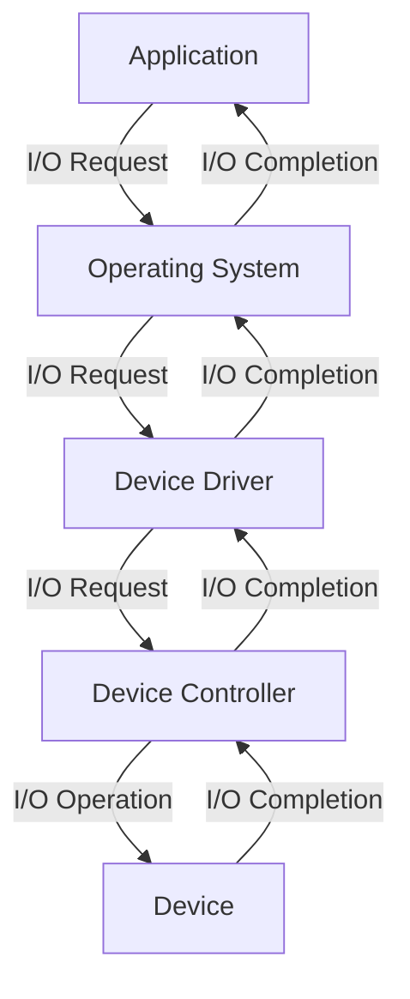

## Introduction
I/O Management and Device Drivers are crucial components of an operating system, responsible for managing input/output operations between devices and the system. **I/O Management** refers to the process of coordinating and optimizing the flow of data between devices, such as keyboards, displays, and storage devices, while **Device Drivers** are software components that interact with the operating system to control and manage the behavior of these devices. In this section, we will delve into the world of I/O Management and Device Drivers, exploring their importance, real-world relevance, and the problems they solve.

> **Note:** I/O Management and Device Drivers are essential for ensuring that devices interact correctly with the operating system, and that data is transmitted efficiently and reliably.

In real-world scenarios, I/O Management and Device Drivers play a vital role in various applications, including embedded systems, mobile devices, and cloud computing. For instance, in a data center, I/O Management and Device Drivers are responsible for managing the flow of data between storage devices, networks, and servers, ensuring that data is transmitted efficiently and reliably.

## Core Concepts
To understand I/O Management and Device Drivers, it's essential to grasp the following core concepts:

* **I/O Operations**: I/O operations refer to the process of reading or writing data to or from a device. These operations can be either **synchronous**, where the operating system waits for the operation to complete, or **asynchronous**, where the operating system continues executing other tasks while the I/O operation is in progress.
* **Device Drivers**: Device drivers are software components that interact with the operating system to control and manage the behavior of devices. They provide a layer of abstraction between the operating system and the device, allowing the operating system to communicate with the device without knowing the device's internal details.
* **I/O Scheduling**: I/O scheduling refers to the process of managing the order in which I/O operations are executed. This is crucial for optimizing system performance, as it ensures that I/O operations are executed in a way that minimizes delays and maximizes throughput.

> **Tip:** Understanding the core concepts of I/O Management and Device Drivers is essential for optimizing system performance and ensuring reliable data transmission.

## How It Works Internally
I/O Management and Device Drivers work internally by using a combination of hardware and software components. The following is a step-by-step breakdown of the process:

1. **I/O Request**: The operating system receives an I/O request from an application or a user.
2. **Device Driver**: The operating system passes the I/O request to the device driver, which is responsible for managing the device.
3. **Device Controller**: The device driver communicates with the device controller, which is a hardware component that controls the device.
4. **Device**: The device controller executes the I/O operation on the device.
5. **I/O Completion**: The device controller notifies the device driver when the I/O operation is complete.
6. **I/O Completion Notification**: The device driver notifies the operating system of the I/O completion.

> **Warning:** Improperly implemented device drivers can lead to system crashes, data corruption, and security vulnerabilities.

## Code Examples
The following code examples demonstrate the basics of I/O Management and Device Drivers:

### Example 1: Basic I/O Operation
```python
import os

# Open a file in read mode
file = open("example.txt", "r")

# Read the contents of the file
contents = file.read()

# Print the contents
print(contents)

# Close the file
file.close()
```
This example demonstrates a basic I/O operation, where a file is opened, read, and closed.

### Example 2: Device Driver Implementation
```c
#include <linux/module.h>
#include <linux/init.h>
#include <linux/device.h>

// Define a device driver structure
struct device_driver my_driver = {
    .name = "my_driver",
    .bus = &platform_bus_type,
};

// Initialize the device driver
static int __init my_driver_init(void) {
    // Register the device driver
    return driver_register(&my_driver);
}

// Clean up the device driver
static void __exit my_driver_exit(void) {
    // Unregister the device driver
    driver_unregister(&my_driver);
}

module_init(my_driver_init);
module_exit(my_driver_exit);
```
This example demonstrates a basic device driver implementation, where a device driver is initialized and registered with the operating system.

### Example 3: I/O Scheduling
```java
import java.io.IOException;
import java.util.concurrent.ExecutorService;
import java.util.concurrent.Executors;

// Define a class to manage I/O operations
public class IOScheduler {
    private ExecutorService executor;

    public IOScheduler(int numThreads) {
        executor = Executors.newFixedThreadPool(numThreads);
    }

    // Schedule an I/O operation
    public void schedule(IOOperation operation) {
        executor.execute(operation);
    }

    // Define a class to represent an I/O operation
    public static class IOOperation implements Runnable {
        private String filename;

        public IOOperation(String filename) {
            this.filename = filename;
        }

        @Override
        public void run() {
            try {
                // Read the contents of the file
                byte[] contents = Files.readAllBytes(Paths.get(filename));
                // Print the contents
                System.out.println(new String(contents));
            } catch (IOException e) {
                // Handle the exception
            }
        }
    }
}
```
This example demonstrates an I/O scheduling implementation, where I/O operations are scheduled and executed using a thread pool.

## Visual Diagram

This diagram illustrates the flow of I/O operations between the application, operating system, device driver, device controller, and device.

> **Interview:** When asked about I/O Management and Device Drivers, be sure to explain the core concepts, including I/O operations, device drivers, and I/O scheduling. Also, be prepared to discuss the internal workings of I/O Management and Device Drivers, including the role of device controllers and the flow of I/O operations.

## Comparison
The following table compares different I/O Management and Device Driver approaches:

| Approach | Time Complexity | Space Complexity | Pros | Cons | Best For |
| --- | --- | --- | --- | --- | --- |
| Synchronous I/O | O(1) | O(1) | Simple to implement, predictable performance | Blocking, limited scalability | Small-scale systems, embedded systems |
| Asynchronous I/O | O(n) | O(n) | Non-blocking, scalable | Complex to implement, unpredictable performance | Large-scale systems, cloud computing |
| I/O Scheduling | O(n log n) | O(n) | Optimized performance, reduced latency | Complex to implement, requires expertise | High-performance systems, real-time systems |
| Device Driver-Based I/O | O(1) | O(1) | Simple to implement, device-specific optimization | Limited scalability, device-dependent | Device-specific applications, embedded systems |

## Real-world Use Cases
The following are real-world examples of I/O Management and Device Drivers in production:

* **Google's Data Center**: Google's data center uses a custom-built I/O Management system to manage the flow of data between storage devices, networks, and servers.
* **Amazon's Cloud Computing**: Amazon's cloud computing platform uses a combination of synchronous and asynchronous I/O to manage the flow of data between devices and the cloud.
* **Intel's Device Drivers**: Intel's device drivers are used in a wide range of devices, including laptops, desktops, and servers, to manage the behavior of devices and optimize system performance.

## Common Pitfalls
The following are common pitfalls to avoid when implementing I/O Management and Device Drivers:

* **Incorrect Device Driver Implementation**: Incorrectly implemented device drivers can lead to system crashes, data corruption, and security vulnerabilities.
* **Inadequate I/O Scheduling**: Inadequate I/O scheduling can lead to reduced system performance, increased latency, and decreased throughput.
* **Insufficient Error Handling**: Insufficient error handling can lead to system crashes, data corruption, and security vulnerabilities.
* **Incompatible Device Drivers**: Incompatible device drivers can lead to system crashes, data corruption, and security vulnerabilities.

> **Warning:** Incorrectly implemented I/O Management and Device Drivers can have severe consequences, including system crashes, data corruption, and security vulnerabilities.

## Interview Tips
The following are common interview questions and tips for I/O Management and Device Drivers:

* **What is the difference between synchronous and asynchronous I/O?**: Be prepared to explain the difference between synchronous and asynchronous I/O, including the advantages and disadvantages of each approach.
* **How do you optimize I/O performance in a system?**: Be prepared to discuss the various techniques for optimizing I/O performance, including I/O scheduling, device driver optimization, and system configuration.
* **What are the common pitfalls to avoid when implementing device drivers?**: Be prepared to discuss the common pitfalls to avoid when implementing device drivers, including incorrect device driver implementation, inadequate error handling, and incompatible device drivers.

## Key Takeaways
The following are key takeaways to remember when working with I/O Management and Device Drivers:

* **I/O Management and Device Drivers are crucial components of an operating system**: I/O Management and Device Drivers are responsible for managing input/output operations between devices and the system.
* **I/O operations can be either synchronous or asynchronous**: I/O operations can be either synchronous, where the operating system waits for the operation to complete, or asynchronous, where the operating system continues executing other tasks while the I/O operation is in progress.
* **Device drivers provide a layer of abstraction between the operating system and the device**: Device drivers provide a layer of abstraction between the operating system and the device, allowing the operating system to communicate with the device without knowing the device's internal details.
* **I/O scheduling is crucial for optimizing system performance**: I/O scheduling is crucial for optimizing system performance, as it ensures that I/O operations are executed in a way that minimizes delays and maximizes throughput.
* **Incorrectly implemented I/O Management and Device Drivers can have severe consequences**: Incorrectly implemented I/O Management and Device Drivers can have severe consequences, including system crashes, data corruption, and security vulnerabilities.
* **Optimizing I/O performance requires a combination of techniques**: Optimizing I/O performance requires a combination of techniques, including I/O scheduling, device driver optimization, and system configuration.
* **Device drivers must be compatible with the operating system and device**: Device drivers must be compatible with the operating system and device to ensure reliable and efficient operation.
* **Error handling is crucial for ensuring system reliability and security**: Error handling is crucial for ensuring system reliability and security, as it prevents system crashes, data corruption, and security vulnerabilities.
* **I/O Management and Device Drivers are critical components of real-time systems**: I/O Management and Device Drivers are critical components of real-time systems, as they ensure predictable and reliable operation.