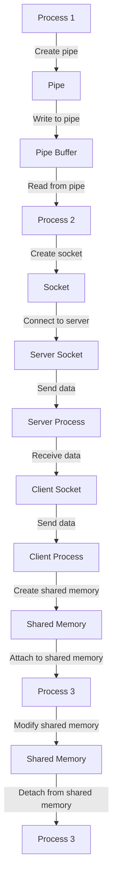

## Introduction
Inter-Process Communication (IPC) is a crucial aspect of operating systems, enabling separate processes to exchange data and coordinate their actions. IPC is essential in various scenarios, such as when multiple processes need to share resources, synchronize their execution, or communicate with each other to achieve a common goal. In real-world systems, IPC is used extensively in applications like web servers, database systems, and distributed file systems. For instance, a web server may use IPC to communicate with a database server to retrieve data for a user's request. **Every engineer needs to understand IPC** to design and develop efficient, scalable, and reliable systems.

## Core Concepts
IPC involves several key concepts, including:
* **Pipes**: Unidirectional communication channels between related processes.
* **Sockets**: Bidirectional communication channels between unrelated processes, potentially across different machines.
* **Shared Memory**: A region of memory that multiple processes can access and modify.
* **Synchronization**: Mechanisms to coordinate access to shared resources, such as locks, semaphores, and monitors.
* **Message Passing**: A paradigm where processes exchange data through messages, which can be buffered or unbuffered.

> **Note:** IPC mechanisms can be categorized into two main types: synchronous and asynchronous. Synchronous IPC involves blocking the sender process until the receiver process responds, whereas asynchronous IPC allows the sender process to continue execution without waiting for a response.

## How It Works Internally
Let's dive into the internal mechanics of each IPC mechanism:
1. **Pipes**: A pipe is created using the `pipe()` system call, which returns two file descriptors: one for reading and one for writing. When a process writes to the pipe, the data is stored in a buffer, and the reading process can retrieve the data from the buffer.
2. **Sockets**: A socket is created using the `socket()` system call, which returns a file descriptor. Sockets can be connection-oriented (TCP) or connectionless (UDP). When a process sends data through a socket, the operating system handles the underlying network communication.
3. **Shared Memory**: Shared memory is created using the `shmget()` system call, which returns a shared memory identifier. Processes can attach to the shared memory segment using the `shmat()` system call, allowing them to access and modify the shared memory.

> **Warning:** When using shared memory, processes must synchronize access to the shared memory segment to avoid data corruption and race conditions.

## Code Examples
### Example 1: Basic Pipe Usage (C)
```c
#include <stdio.h>
#include <stdlib.h>
#include <unistd.h>

int main() {
    int pipefd[2];
    char buffer[256];

    // Create a pipe
    if (pipe(pipefd) == -1) {
        perror("pipe");
        exit(EXIT_FAILURE);
    }

    // Write to the pipe
    char* message = "Hello, world!";
    write(pipefd[1], message, strlen(message));

    // Read from the pipe
    read(pipefd[0], buffer, 256);
    printf("%s\n", buffer);

    return 0;
}
```
### Example 2: Socket Communication (Python)
```python
import socket

def server():
    # Create a socket
    server_socket = socket.socket(socket.AF_INET, socket.SOCK_STREAM)

    # Bind the socket to a address and port
    server_socket.bind(("localhost", 8080))

    # Listen for incoming connections
    server_socket.listen(1)

    # Accept a connection
    client_socket, address = server_socket.accept()

    # Receive data from the client
    data = client_socket.recv(1024)
    print("Received:", data.decode())

    # Send data back to the client
    client_socket.sendall(b"Hello, client!")

    # Close the sockets
    client_socket.close()
    server_socket.close()

def client():
    # Create a socket
    client_socket = socket.socket(socket.AF_INET, socket.SOCK_STREAM)

    # Connect to the server
    client_socket.connect(("localhost", 8080))

    # Send data to the server
    client_socket.sendall(b"Hello, server!")

    # Receive data from the server
    data = client_socket.recv(1024)
    print("Received:", data.decode())

    # Close the socket
    client_socket.close()

server()
client()
```
### Example 3: Shared Memory (Java)
```java
import java.util.concurrent.atomic.AtomicInteger;

public class SharedMemoryExample {
    public static void main(String[] args) {
        // Create a shared memory segment
        AtomicInteger sharedVariable = new AtomicInteger(0);

        // Create a thread to increment the shared variable
        Thread thread = new Thread(() -> {
            for (int i = 0; i < 100000; i++) {
                sharedVariable.incrementAndGet();
            }
        });

        // Start the thread
        thread.start();

        // Increment the shared variable in the main thread
        for (int i = 0; i < 100000; i++) {
            sharedVariable.incrementAndGet();
        }

        // Wait for the thread to finish
        try {
            thread.join();
        } catch (InterruptedException e) {
            Thread.currentThread().interrupt();
        }

        // Print the final value of the shared variable
        System.out.println("Final value: " + sharedVariable.get());
    }
}
```
> **Tip:** When using shared memory, it's essential to use synchronization mechanisms to avoid data corruption and race conditions.

## Visual Diagram

The diagram illustrates the basic flow of IPC mechanisms, including pipe creation, socket communication, and shared memory access.

## Comparison
| Mechanism | Time Complexity | Space Complexity | Pros | Cons | Best For |
| --- | --- | --- | --- | --- | --- |
| Pipe | O(1) | O(1) | Unidirectional, efficient | Limited capacity, blocking | Simple, low-overhead communication |
| Socket | O(1) | O(1) | Bidirectional, flexible | Overhead, complexity | Network communication, distributed systems |
| Shared Memory | O(1) | O(1) | Fast, efficient | Synchronization required, data corruption | High-performance, real-time systems |

## Real-world Use Cases
1. **Google's MapReduce**: Uses pipes to communicate between mapper and reducer processes.
2. **Apache Kafka**: Employs sockets for distributed messaging and data processing.
3. **Linux Kernel**: Utilizes shared memory for efficient communication between kernel modules.

> **Interview:** Can you explain the differences between pipes, sockets, and shared memory? How would you choose the appropriate IPC mechanism for a given problem?

## Common Pitfalls
1. **Deadlocks**: Occur when two processes are blocked, waiting for each other to release a resource.
2. **Starvation**: Happens when a process is unable to access a shared resource due to other processes holding onto it for an extended period.
3. **Data Corruption**: Can occur when multiple processes access shared memory without proper synchronization.
4. **Overflows**: May happen when a pipe or socket buffer is filled beyond its capacity, leading to data loss.

> **Warning:** When using IPC mechanisms, it's crucial to handle errors and exceptions properly to avoid crashes and data corruption.

## Interview Tips
1. **Understand the basics**: Be familiar with the different IPC mechanisms, their advantages, and disadvantages.
2. **Know the trade-offs**: Be able to discuss the trade-offs between pipes, sockets, and shared memory, including performance, complexity, and scalability.
3. **Design a system**: Be prepared to design a system that uses IPC mechanisms to solve a real-world problem.

## Key Takeaways
* **Pipes are unidirectional**: Use pipes for simple, low-overhead communication between related processes.
* **Sockets are bidirectional**: Employ sockets for network communication, distributed systems, and flexible data exchange.
* **Shared memory is fast**: Utilize shared memory for high-performance, real-time systems, but ensure proper synchronization.
* **Synchronization is crucial**: Always use synchronization mechanisms when accessing shared resources to avoid data corruption and race conditions.
* **Error handling is essential**: Properly handle errors and exceptions when using IPC mechanisms to avoid crashes and data corruption.
* **Scalability matters**: Choose the appropriate IPC mechanism based on the problem's scalability requirements.