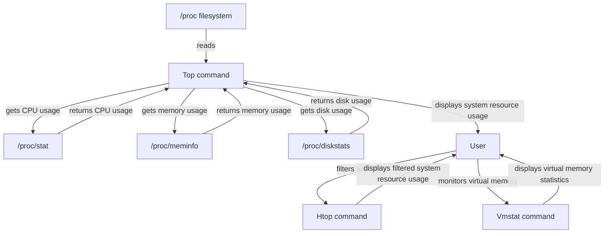

## Introduction
**Linux Commands for System Monitoring** are essential tools for any system administrator or engineer. These commands enable users to monitor and manage system resources, such as CPU usage, memory allocation, and disk space. In this section, we will explore the importance of Linux commands for system monitoring, their real-world relevance, and why every engineer needs to know them. 
> **Note:** Linux commands are not only useful for system monitoring but also for troubleshooting and optimizing system performance.

In real-world scenarios, Linux commands are used by companies like Google, Amazon, and Facebook to monitor their massive server farms. These commands help system administrators to identify potential issues before they become critical, ensuring high system availability and reliability. 
> **Tip:** Familiarity with Linux commands can significantly improve an engineer's productivity and efficiency in managing and troubleshooting Linux-based systems.

## Core Concepts
To understand Linux commands for system monitoring, it's essential to grasp some core concepts:
* **System Resources**: CPU, memory, disk space, and network bandwidth are examples of system resources that need to be monitored and managed.
* **System Calls**: System calls are APIs that allow user-space programs to interact with the kernel, enabling them to monitor and manage system resources.
* **Kernel Modules**: Kernel modules are pieces of code that can be loaded into the kernel to provide additional functionality, such as monitoring and managing system resources.

Some key terminology includes:
* **Top**: A command that displays real-time system resource usage, including CPU, memory, and disk usage.
* **Htop**: An interactive version of the top command that provides more detailed information and allows for interactive filtering and sorting.
* **Vmstat**: A command that reports virtual memory statistics, including page faults, page ins, and page outs.

## How It Works Internally
To understand how Linux commands for system monitoring work internally, let's take a closer look at the **top** command. The top command uses the **/proc** filesystem to gather information about system resource usage. The **/proc** filesystem is a virtual filesystem that provides information about the system's hardware and software configuration, as well as real-time system statistics.

Here's a step-by-step breakdown of how the top command works:
1. The top command reads the **/proc/stat** file to gather information about CPU usage, including the number of context switches, system calls, and CPU idle time.
2. The top command reads the **/proc/meminfo** file to gather information about memory usage, including the total amount of memory, free memory, and used memory.
3. The top command reads the **/proc/diskstats** file to gather information about disk usage, including the number of read and write operations, and the total amount of data read and written.

The time complexity of the top command is O(n), where n is the number of processes running on the system. The space complexity is O(1), as the top command only needs to store a fixed amount of information about each process.

## Code Examples
### Example 1: Basic Top Command
```bash
# Run the top command to display real-time system resource usage
top
```
This command will display a table showing the current system resource usage, including CPU, memory, and disk usage.

### Example 2: Htop Command with Filtering
```bash
# Run the htop command with filtering to display only processes using more than 10% CPU
htop -f 'CMD==nginx' -s 'PERCENT_CPU'
```
This command will display a table showing only the processes using more than 10% CPU, filtered by the command name "nginx".

### Example 3: Vmstat Command with Interval
```bash
# Run the vmstat command with an interval of 5 seconds to display virtual memory statistics
vmstat 5
```
This command will display a table showing virtual memory statistics, including page faults, page ins, and page outs, updated every 5 seconds.

## Visual Diagram

This diagram illustrates the flow of information between the **/proc** filesystem, the **top** command, and the **htop** and **vmstat** commands.

## Comparison
| Command | Time Complexity | Space Complexity | Pros | Cons | Best For |
| --- | --- | --- | --- | --- | --- |
| Top | O(n) | O(1) | Real-time system resource usage, simple to use | Limited filtering and sorting capabilities | Quick system resource monitoring |
| Htop | O(n) | O(1) | Interactive filtering and sorting, more detailed information | Steeper learning curve | Advanced system resource monitoring |
| Vmstat | O(1) | O(1) | Virtual memory statistics, simple to use | Limited system resource usage information | Monitoring virtual memory usage |

## Real-world Use Cases
* **Google**: Uses Linux commands for system monitoring to manage their massive server farms, ensuring high system availability and reliability.
* **Amazon**: Uses Linux commands for system monitoring to optimize system performance and troubleshoot issues in their cloud infrastructure.
* **Facebook**: Uses Linux commands for system monitoring to monitor and manage system resources, ensuring high system availability and reliability for their users.

## Common Pitfalls
* **Not using the -f option with htop**: The -f option allows for filtering and sorting of processes, making it easier to identify resource-intensive processes.
* **Not using the -s option with vmstat**: The -s option allows for sorting of virtual memory statistics, making it easier to identify trends and patterns.
* **Not monitoring system resources regularly**: Regular monitoring of system resources can help identify potential issues before they become critical, ensuring high system availability and reliability.
* **Not using the top command with caution**: The top command can consume significant system resources, especially when used with the -b option, which can cause system slowdowns and crashes.

## Interview Tips
* **What is the difference between top and htop?**: A strong answer would include the differences in filtering and sorting capabilities, as well as the level of detail provided by each command.
* **How do you monitor virtual memory usage?**: A strong answer would include the use of the vmstat command, as well as the importance of monitoring virtual memory usage to prevent system crashes and slowdowns.
* **What are some common pitfalls when using Linux commands for system monitoring?**: A strong answer would include the pitfalls mentioned above, as well as strategies for avoiding them.

## Key Takeaways
* **Linux commands for system monitoring are essential tools for system administrators and engineers**.
* **The top command provides real-time system resource usage information, including CPU, memory, and disk usage**.
* **The htop command provides interactive filtering and sorting capabilities, making it easier to identify resource-intensive processes**.
* **The vmstat command provides virtual memory statistics, including page faults, page ins, and page outs**.
* **Regular monitoring of system resources can help identify potential issues before they become critical**.
* **The time complexity of the top command is O(n), where n is the number of processes running on the system**.
* **The space complexity of the top command is O(1), as it only needs to store a fixed amount of information about each process**.
* **Familiarity with Linux commands can significantly improve an engineer's productivity and efficiency in managing and troubleshooting Linux-based systems**.
> **Warning:** Not monitoring system resources regularly can lead to system crashes and slowdowns, resulting in significant downtime and lost productivity. 
> **Tip:** Using Linux commands for system monitoring can help identify potential issues before they become critical, ensuring high system availability and reliability. 
> **Interview:** Be prepared to answer questions about the differences between top and htop, as well as strategies for monitoring virtual memory usage. 
> **Note:** Linux commands for system monitoring are not only useful for system monitoring but also for troubleshooting and optimizing system performance.