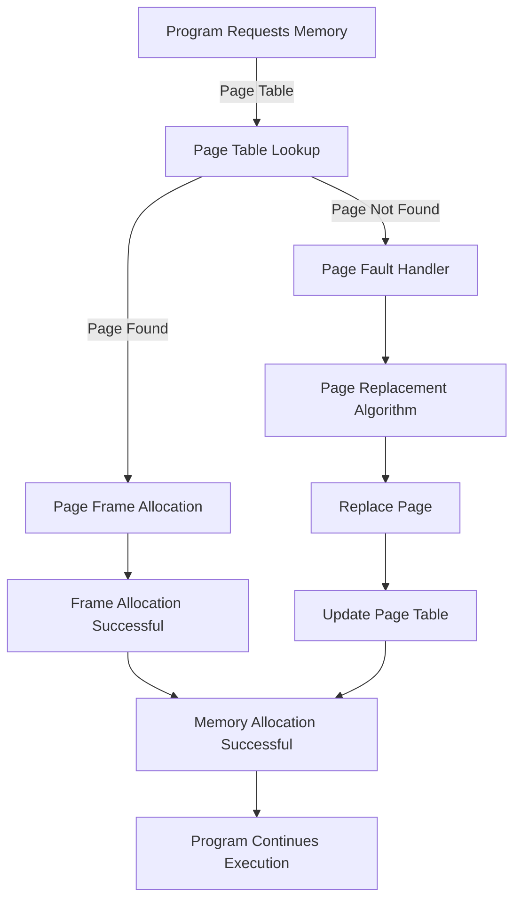

## Introduction
Memory management is a critical component of operating systems, responsible for managing the allocation and deallocation of memory for running programs. It ensures that multiple programs can share the same physical memory without interfering with each other. The two primary techniques used in memory management are **paging** and **segmentation**. In this study guide, we will delve into the details of these techniques, exploring how they work internally, their advantages and disadvantages, and real-world use cases.

> **Note:** Memory management is a complex topic, and a deep understanding of it is essential for any aspiring operating system developer or system administrator.

## Core Concepts
Before diving into the details of paging and segmentation, let's define some key terms:
* **Virtual memory**: a combination of physical memory (RAM) and secondary storage (hard disk or solid-state drive) that provides a large address space for programs to run.
* **Page**: a fixed-size block of memory that is allocated to a program.
* **Frame**: a fixed-size block of physical memory that can hold a page.
* **Segment**: a logical division of a program's memory space, such as code, data, or stack.
* **Paging table**: a data structure that maps virtual page numbers to physical frame numbers.

> **Tip:** Understanding these concepts is crucial for developing efficient memory management algorithms.

## How It Works Internally
Let's examine how paging and segmentation work internally:
1. **Paging**: When a program requests memory, the operating system allocates a page of memory to it. The page is then divided into frames, which are allocated to physical memory. The paging table is used to map virtual page numbers to physical frame numbers.
2. **Segmentation**: When a program requests memory, the operating system allocates a segment of memory to it. The segment is then divided into pages, which are allocated to physical memory. The segmentation table is used to map virtual segment numbers to physical page numbers.

> **Warning:** Improperly managing memory can lead to memory leaks, crashes, or security vulnerabilities.

## Code Examples
Here are three complete and runnable code examples demonstrating basic to advanced memory management concepts:
### Example 1: Basic Paging
```c
#include <stdio.h>
#include <stdlib.h>

// Define a page size
#define PAGE_SIZE 1024

// Define a frame size
#define FRAME_SIZE 1024

// Define a paging table
int paging_table[10];

// Function to allocate a page
int allocate_page() {
    // Find an empty frame
    for (int i = 0; i < 10; i++) {
        if (paging_table[i] == 0) {
            // Allocate the frame
            paging_table[i] = 1;
            return i;
        }
    }
    // No frames available
    return -1;
}

int main() {
    // Allocate a page
    int page = allocate_page();
    if (page != -1) {
        printf("Page allocated: %d\n", page);
    } else {
        printf("No frames available\n");
    }
    return 0;
}
```
### Example 2: Real-World Segmentation
```python
import numpy as np

# Define a segment size
segment_size = 1024

# Define a segmentation table
segmentation_table = {}

# Function to allocate a segment
def allocate_segment(segment_name):
    # Find an empty segment
    for i in range(10):
        if i not in segmentation_table:
            # Allocate the segment
            segmentation_table[i] = segment_name
            return i
    # No segments available
    return -1

# Function to deallocate a segment
def deallocate_segment(segment_id):
    # Check if the segment is allocated
    if segment_id in segmentation_table:
        # Deallocate the segment
        del segmentation_table[segment_id]
        return True
    return False

# Allocate a segment
segment_id = allocate_segment("code")
if segment_id != -1:
    print(f"Segment allocated: {segment_id}")
else:
    print("No segments available")

# Deallocate a segment
if deallocate_segment(segment_id):
    print(f"Segment deallocated: {segment_id}")
else:
    print("Segment not allocated")
```
### Example 3: Advanced Paging with Replacement
```java
import java.util.HashMap;
import java.util.Map;

// Define a page size
public class Page {
    private int id;
    private boolean referenced;

    public Page(int id) {
        this.id = id;
        this.referenced = false;
    }

    public int getId() {
        return id;
    }

    public boolean isReferenced() {
        return referenced;
    }

    public void setReferenced(boolean referenced) {
        this.referenced = referenced;
    }
}

public class Paging {
    private Map<Integer, Page> pageTable;
    private int frameSize;

    public Paging(int frameSize) {
        this.frameSize = frameSize;
        this.pageTable = new HashMap<>();
    }

    // Function to allocate a page
    public int allocatePage(int pageId) {
        // Check if the page is already allocated
        if (pageTable.containsKey(pageId)) {
            // Page is already allocated
            return pageId;
        }

        // Find an empty frame
        for (int i = 0; i < frameSize; i++) {
            if (!pageTable.containsValue(new Page(i))) {
                // Allocate the frame
                pageTable.put(pageId, new Page(i));
                return i;
            }
        }

        // No frames available
        return -1;
    }

    // Function to replace a page
    public int replacePage(int pageId) {
        // Find the least recently used page
        int lruPageId = -1;
        for (Map.Entry<Integer, Page> entry : pageTable.entrySet()) {
            if (!entry.getValue().isReferenced()) {
                lruPageId = entry.getKey();
                break;
            }
        }

        // Replace the LRU page
        if (lruPageId != -1) {
            pageTable.remove(lruPageId);
            pageTable.put(pageId, new Page(lruPageId));
            return lruPageId;
        }

        // No pages to replace
        return -1;
    }

    public static void main(String[] args) {
        Paging paging = new Paging(10);
        int pageId = 1;
        int frameId = paging.allocatePage(pageId);
        if (frameId != -1) {
            System.out.println("Page allocated: " + pageId);
        } else {
            System.out.println("No frames available");
        }

        // Replace a page
        int replacedPageId = paging.replacePage(2);
        if (replacedPageId != -1) {
            System.out.println("Page replaced: " + replacedPageId);
        } else {
            System.out.println("No pages to replace");
        }
    }
}
```
## Visual Diagram

The diagram illustrates the paging process, including page table lookup, page frame allocation, page fault handling, and page replacement.

## Comparison
| Approach | Time Complexity | Space Complexity | Pros | Cons | Best For |
| --- | --- | --- | --- | --- | --- |
| Paging | O(1) | O(n) | Efficient memory allocation, easy to implement | Page table overhead, page faults | Systems with limited memory |
| Segmentation | O(n) | O(n) | Flexible memory allocation, reduces page faults | Segmentation table overhead, complex implementation | Systems with large memory requirements |
| Hybrid Paging and Segmentation | O(n) | O(n) | Combines benefits of paging and segmentation, reduces page faults | Complex implementation, high overhead | Systems with varying memory requirements |
| Virtual Memory | O(n) | O(n) | Provides large address space, efficient memory allocation | Page faults, disk I/O overhead | Systems with large memory requirements |

> **Tip:** Choosing the right memory management approach depends on the system's specific requirements and constraints.

## Real-world Use Cases
1. **Android Operating System**: Android uses a combination of paging and segmentation to manage memory. The system allocates memory to apps in pages, and each app has its own segmentation table to manage its memory space.
2. **Linux Operating System**: Linux uses a paging system to manage memory. The system allocates memory to processes in pages, and each process has its own page table to manage its memory space.
3. **MySQL Database**: MySQL uses a combination of paging and segmentation to manage memory. The database allocates memory to tables in pages, and each table has its own segmentation table to manage its memory space.

> **Interview:** Be prepared to explain the differences between paging and segmentation, and how they are used in real-world systems.

## Common Pitfalls
1. **Page Table Overflow**: When the page table becomes full, the system may experience page faults, leading to performance degradation.
2. **Segmentation Table Overflow**: When the segmentation table becomes full, the system may experience segmentation faults, leading to performance degradation.
3. **Memory Leaks**: When memory is allocated but not deallocated, it can lead to memory leaks, causing the system to run out of memory.
4. **Page Replacement Algorithm**: A poor page replacement algorithm can lead to frequent page faults, causing performance degradation.

> **Warning:** Improperly managing memory can lead to system crashes, security vulnerabilities, and performance issues.

## Interview Tips
1. **Paging vs Segmentation**: Be prepared to explain the differences between paging and segmentation, and how they are used in real-world systems.
2. **Page Replacement Algorithm**: Be prepared to explain the different page replacement algorithms, such as LRU, FIFO, and Optimal.
3. **Memory Management**: Be prepared to explain the different memory management techniques, such as paging, segmentation, and virtual memory.

> **Tip:** Practice explaining complex concepts in simple terms, and be prepared to provide examples and diagrams to illustrate your points.

## Key Takeaways
* **Paging**: a memory management technique that divides memory into fixed-size blocks called pages.
* **Segmentation**: a memory management technique that divides memory into logical divisions called segments.
* **Page Table**: a data structure that maps virtual page numbers to physical frame numbers.
* **Segmentation Table**: a data structure that maps virtual segment numbers to physical page numbers.
* **Virtual Memory**: a memory management technique that provides a large address space by combining physical memory and secondary storage.
* **Page Fault**: an event that occurs when a page is not found in physical memory.
* **Segmentation Fault**: an event that occurs when a segment is not found in physical memory.
* **Memory Leak**: a situation where memory is allocated but not deallocated, leading to memory waste.
* **Page Replacement Algorithm**: an algorithm that replaces pages in physical memory to make room for new pages.

> **Note:** Understanding these concepts is crucial for developing efficient memory management algorithms and troubleshooting memory-related issues.