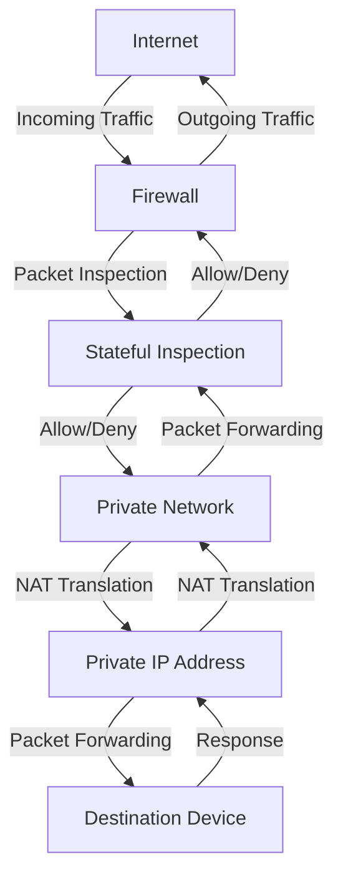

## Introduction
A **firewall** is a network security system that monitors and controls incoming and outgoing network traffic based on predetermined security rules. It acts as a barrier between a trusted network and an untrusted network, such as the Internet. Firewalls are essential for protecting networks from unauthorized access, malicious attacks, and other security threats. In addition to firewalls, **Network Address Translation (NAT)** is a technique used to allow multiple devices on a private network to share a single public IP address when accessing the Internet. This is particularly useful for home networks, where multiple devices need to access the Internet, but only one public IP address is available.

> **Note:** Firewalls and NAT are crucial components of network security and are widely used in both personal and enterprise environments.

## Core Concepts
To understand firewalls and NAT, it's essential to grasp the following core concepts:
* **Packet filtering**: The process of examining network packets and blocking or allowing them based on predetermined rules.
* **Stateful inspection**: A technique used by firewalls to track the state of network connections and make decisions based on that state.
* **NAT types**: There are several types of NAT, including **static NAT**, **dynamic NAT**, and **PAT (Port Address Translation)**.
* **Firewall rules**: A set of rules that define what traffic is allowed or blocked by the firewall.

> **Warning:** Improperly configured firewalls and NAT can lead to security vulnerabilities and connectivity issues.

## How It Works Internally
Here's a step-by-step explanation of how firewalls and NAT work internally:
1. **Packet reception**: The firewall receives incoming network packets from the Internet or a local network.
2. **Packet inspection**: The firewall inspects the packets and applies the configured rules to determine whether to allow or block the traffic.
3. **Stateful inspection**: The firewall tracks the state of network connections to ensure that incoming traffic is part of an established connection.
4. **NAT translation**: If the packet is destined for a device on the private network, the NAT translates the public IP address to the private IP address.
5. **Packet forwarding**: The firewall forwards the packet to its destination on the private network.

> **Tip:** Firewalls and NAT can be implemented in hardware or software, depending on the specific use case and performance requirements.

## Code Examples
Here are three code examples that demonstrate the basics of firewalls and NAT:
### Example 1: Basic Firewall Configuration (iptables)
```bash
# Allow incoming traffic on port 80 (HTTP)
iptables -A INPUT -p tcp --dport 80 -j ACCEPT

# Block incoming traffic on port 22 (SSH)
iptables -A INPUT -p tcp --dport 22 -j DROP
```
### Example 2: NAT Configuration (iptables)
```bash
# Enable NAT for the private network (192.168.1.0/24)
iptables -t nat -A POSTROUTING -s 192.168.1.0/24 -j MASQUERADE

# Allow outgoing traffic from the private network
iptables -A FORWARD -s 192.168.1.0/24 -j ACCEPT
```
### Example 3: Advanced Firewall Configuration (Python)
```python
import iptc

# Create a new firewall rule
rule = iptc.Rule()
rule.src = "192.168.1.0/24"
rule.dst = "0.0.0.0/0"
rule.protocol = "tcp"
rule.dport = "80"

# Add the rule to the INPUT chain
chain = iptc.Chain(iptc.Table(iptc.Table.FILTER), "INPUT")
chain.append_rule(rule)
```
## Visual Diagram

> **Note:** This diagram illustrates the basic flow of traffic through a firewall and NAT.

## Comparison
Here's a comparison of different firewall and NAT approaches:
| Approach | Time Complexity | Space Complexity | Pros | Cons | Best For |
| --- | --- | --- | --- | --- | --- |
| **Packet Filtering** | O(1) | O(1) | Simple, efficient | Limited security features | Small networks |
| **Stateful Inspection** | O(n) | O(n) | Advanced security features | Resource-intensive | Enterprise networks |
| **Static NAT** | O(1) | O(1) | Simple, efficient | Limited scalability | Small networks |
| **Dynamic NAT** | O(n) | O(n) | Scalable, flexible | Resource-intensive | Large networks |
| **PAT** | O(n) | O(n) | Scalable, flexible | Limited security features | Home networks |

> **Warning:** The choice of firewall and NAT approach depends on the specific use case and security requirements.

## Real-world Use Cases
Here are three real-world examples of firewalls and NAT in use:
* **Home Network**: A home network uses a router with a built-in firewall and NAT to protect devices from the Internet and allow multiple devices to share a single public IP address.
* **Enterprise Network**: A large enterprise network uses a combination of firewalls and NAT to protect sensitive data and allow employees to access the Internet.
* **Cloud Infrastructure**: A cloud infrastructure provider uses firewalls and NAT to protect customer data and provide secure access to cloud resources.

> **Tip:** Firewalls and NAT are essential components of network security and are widely used in various industries.

## Common Pitfalls
Here are four common mistakes to avoid when configuring firewalls and NAT:
* **Incorrect Rule Order**: Firewalls and NAT rules must be applied in the correct order to ensure proper functionality.
* **Insufficient Logging**: Firewalls and NAT must be configured to log traffic and security events to ensure proper monitoring and incident response.
* **Inadequate Testing**: Firewalls and NAT must be thoroughly tested to ensure proper functionality and security.
* **Lack of Regular Updates**: Firewalls and NAT must be regularly updated to ensure that security vulnerabilities are patched and new features are available.

> **Interview:** Can you explain the difference between a firewall and a NAT? How do you configure a firewall to allow incoming traffic on a specific port?

## Interview Tips
Here are three common interview questions related to firewalls and NAT:
* **What is the difference between a firewall and a NAT?**: A firewall is a network security system that monitors and controls incoming and outgoing network traffic, while a NAT is a technique used to allow multiple devices on a private network to share a single public IP address.
* **How do you configure a firewall to allow incoming traffic on a specific port?**: You can configure a firewall to allow incoming traffic on a specific port by creating a new rule that specifies the port and protocol.
* **What is the purpose of stateful inspection in a firewall?**: Stateful inspection is used to track the state of network connections and make decisions based on that state to ensure that incoming traffic is part of an established connection.

> **Note:** Firewalls and NAT are critical components of network security, and understanding their configuration and functionality is essential for any network administrator or security professional.

## Key Takeaways
Here are ten key takeaways to remember:
* Firewalls and NAT are essential components of network security.
* Firewalls monitor and control incoming and outgoing network traffic.
* NAT allows multiple devices on a private network to share a single public IP address.
* Packet filtering and stateful inspection are common techniques used in firewalls.
* Firewalls and NAT must be configured correctly to ensure proper functionality and security.
* Regular updates and testing are essential to ensure that firewalls and NAT remain secure and functional.
* Firewalls and NAT can be implemented in hardware or software.
* The choice of firewall and NAT approach depends on the specific use case and security requirements.
* Firewalls and NAT are widely used in various industries, including home networks, enterprise networks, and cloud infrastructure.
* Understanding firewalls and NAT is crucial for any network administrator or security professional.