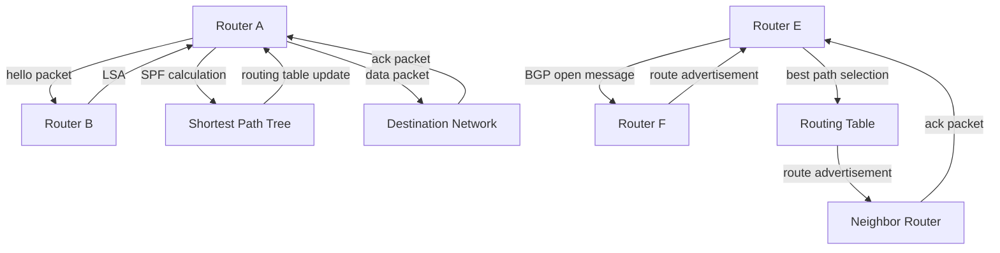

## Introduction
Routing protocols are essential in computer networks, enabling devices to communicate with each other by determining the best path for forwarding data packets. Two of the most widely used routing protocols are **OSPF (Open Shortest Path First)** and **BGP (Border Gateway Protocol)**. OSPF is an interior routing protocol used within an autonomous system, while BGP is an exterior routing protocol used between autonomous systems. Understanding these protocols is crucial for designing and maintaining efficient, scalable, and reliable networks. 
> **Note:** Knowledge of routing protocols is a fundamental skill for any network engineer or administrator, as it directly impacts network performance, security, and reliability.

## Core Concepts
- **OSPF**: An interior routing protocol that uses link-state routing algorithms to determine the best path for forwarding packets. It is widely used in large enterprise networks due to its ability to handle complex topologies and its support for variable-length subnet masks (VLSMs).
- **BGP**: An exterior routing protocol used to exchange routing information between different autonomous systems. It is the protocol that makes the internet work, enabling different networks to communicate with each other.
- **Autonomous System (AS)**: A network or group of networks under a common administration, which has a unique identifier (AS number) and manages its routing independently.
- **Link-State Routing**: A type of routing protocol that uses a topology map of the network to determine the best path for forwarding packets. Each router maintains a map of the network topology and uses this information to compute the shortest path to each destination.
- **Distance-Vector Routing**: A type of routing protocol that uses a routing table to determine the best path for forwarding packets. Each router maintains a table that lists the best path to each destination network, along with the distance (metric) to that network.

## How It Works Internally
Both OSPF and BGP have complex internal mechanisms that enable them to efficiently route traffic across networks. 
- **OSPF**:
  1. **Neighbor Discovery**: OSPF routers discover their neighbors by sending hello packets.
  2. **Link-State Advertisement (LSA)**: Each router sends LSA packets to its neighbors to describe its links and their costs.
  3. **Shortest Path First (SPF) Calculation**: Each router uses the Dijkstra algorithm to calculate the shortest path to each destination network based on the LSAs received from its neighbors.
  - Time complexity: O(|E| + |V|log|V|) for the SPF calculation, where |E| is the number of edges (links) and |V| is the number of vertices (routers).
  - Space complexity: O(|V| + |E|) for storing the network topology.
- **BGP**:
  1. **Neighbor Establishment**: BGP routers establish neighbor relationships by exchanging open messages.
  2. **Route Advertisement**: Each router sends route advertisements to its neighbors, which include the prefix, next hop, and a set of attributes (e.g., AS path, community).
  3. **Best Path Selection**: Each router selects the best path for each prefix based on a set of criteria (e.g., shortest AS path, lowest multi-exit discriminator).
  - Time complexity: O(n log n) for the best path selection, where n is the number of routes.
  - Space complexity: O(n) for storing the routing table.

## Code Examples
### Example 1: Basic OSPF Configuration
```python
import networkx as nx
import matplotlib.pyplot as plt

# Create a sample network topology
G = nx.Graph()
G.add_edge('A', 'B', weight=1)
G.add_edge('B', 'C', weight=2)
G.add_edge('A', 'C', weight=3)

# Compute the shortest path using Dijkstra's algorithm
shortest_path = nx.shortest_path(G, source='A', target='C', weight='weight')

print("Shortest path:", shortest_path)
```
### Example 2: BGP Route Advertisement
```java
import java.util.ArrayList;
import java.util.List;

class BGPRoute {
    String prefix;
    String nextHop;
    List<String> asPath;

    public BGPRoute(String prefix, String nextHop, List<String> asPath) {
        this.prefix = prefix;
        this.nextHop = nextHop;
        this.asPath = asPath;
    }
}

public class BGP {
    public static void main(String[] args) {
        // Create a sample BGP route advertisement
        List<String> asPath = new ArrayList<>();
        asPath.add("AS1");
        asPath.add("AS2");
        BGPRoute route = new BGPRoute("192.0.2.0/24", "10.0.0.1", asPath);

        System.out.println("Prefix: " + route.prefix);
        System.out.println("Next Hop: " + route.nextHop);
        System.out.println("AS Path: " + route.asPath);
    }
}
```
### Example 3: Advanced OSPF Configuration with Multiple Areas
```c
#include <stdio.h>
#include <stdlib.h>

// Define a structure to represent an OSPF area
typedef struct {
    int area_id;
    int num_routers;
} OspfArea;

int main() {
    // Create a sample OSPF network with multiple areas
    OspfArea areas[3];
    areas[0].area_id = 0;
    areas[0].num_routers = 5;
    areas[1].area_id = 1;
    areas[1].num_routers = 3;
    areas[2].area_id = 2;
    areas[2].num_routers = 4;

    // Compute the shortest path using Dijkstra's algorithm for each area
    for (int i = 0; i < 3; i++) {
        printf("Area %d: %d routers\n", areas[i].area_id, areas[i].num_routers);
    }

    return 0;
}
```
> **Tip:** When designing a network with multiple OSPF areas, it's essential to consider the area structure and the number of routers in each area to ensure efficient routing and minimize the risk of routing loops.

## Visual Diagram

This diagram illustrates the basic operation of OSPF and BGP, including neighbor discovery, route advertisement, and best path selection. 
> **Warning:** Incorrect configuration of OSPF or BGP can lead to routing loops, black holes, or other network instability issues.

## Comparison
| Protocol | Time Complexity | Space Complexity | Pros | Cons | Best For |
| --- | --- | --- | --- | --- | --- |
| OSPF | O(|E| + |V|log|V|) | O(|V| + |E|) | Efficient, scalable, supports VLSMs | Complex configuration, limited support for external routes | Large enterprise networks |
| BGP | O(n log n) | O(n) | Flexible, supports external routes, widely used | Complex configuration, resource-intensive | Internet service providers, large-scale networks |
| EIGRP | O(|E| + |V|log|V|) | O(|V| + |E|) | Fast convergence, efficient, supports VLSMs | Limited support for external routes, proprietary | Medium-sized enterprise networks |
| RIP | O(n) | O(n) | Simple configuration, easy to implement | Limited scalability, slow convergence | Small networks, legacy systems |

## Real-world Use Cases
1. **Google's Network**: Google uses a combination of OSPF and BGP to manage its massive network infrastructure, which includes thousands of routers and millions of IP addresses.
2. **Amazon Web Services (AWS)**: AWS uses BGP to manage its global network infrastructure, which includes multiple regions and availability zones.
3. **Verizon's Network**: Verizon uses OSPF to manage its large enterprise network, which includes thousands of routers and millions of IP addresses.

## Common Pitfalls
1. **Incorrect OSPF Configuration**: Failing to configure OSPF areas correctly can lead to routing loops and network instability.
2. **Insufficient BGP Route Filtering**: Failing to filter BGP routes properly can lead to network instability and security issues.
3. **Inadequate Network Redundancy**: Failing to design a network with adequate redundancy can lead to single points of failure and network downtime.
4. **Insecure BGP Peering**: Failing to secure BGP peering sessions can lead to route hijacking and other security issues.

## Interview Tips
1. **OSPF vs BGP**: Be prepared to explain the differences between OSPF and BGP, including their use cases and advantages.
2. **BGP Route Selection**: Be prepared to explain how BGP selects the best path for a given prefix, including the criteria used and the order of preference.
3. **OSPF Area Structure**: Be prepared to explain how to design an OSPF area structure, including the use of area types (e.g., backbone, stub, totally stubby) and the placement of area border routers.
> **Interview:** Can you explain the difference between OSPF and BGP, and how they are used in a real-world network?

## Key Takeaways
* OSPF is an interior routing protocol used within an autonomous system, while BGP is an exterior routing protocol used between autonomous systems.
* OSPF uses link-state routing algorithms to determine the best path for forwarding packets, while BGP uses a best path selection algorithm to select the best path for a given prefix.
* The time complexity of OSPF's SPF calculation is O(|E| + |V|log|V|), while the time complexity of BGP's best path selection is O(n log n).
* The space complexity of OSPF's routing table is O(|V| + |E|), while the space complexity of BGP's routing table is O(n).
* OSPF is widely used in large enterprise networks due to its efficiency and scalability, while BGP is widely used in internet service provider networks due to its flexibility and support for external routes.
* Common pitfalls in OSPF and BGP configuration include incorrect area configuration, insufficient route filtering, inadequate network redundancy, and insecure BGP peering.