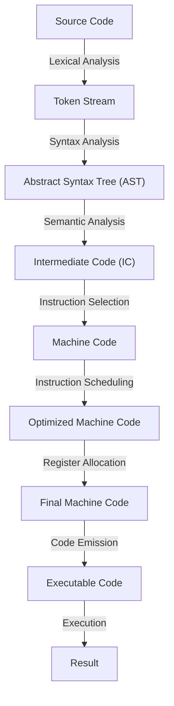

## Introduction
**Code Generation** is the process of converting **intermediate code** (IC) into **machine code** that can be executed directly by the computer's processor. The **Target Machine** refers to the specific computer architecture for which the code is being generated. In other words, it's the machine that will ultimately run the compiled code. Code generation is a critical step in the compilation process, as it determines the efficiency and performance of the generated code. Every engineer needs to understand code generation and its relationship with the target machine to write efficient, platform-specific code.

> **Note:** The code generation process is often referred to as the "back end" of the compiler, as opposed to the "front end," which handles lexical analysis, syntax analysis, and semantic analysis.

## Core Concepts
The core concepts in code generation and target machine include:
* **Instruction Set Architecture (ISA)**: The set of instructions that a computer's processor can execute.
* **Machine Code**: The binary code that the processor can execute directly.
* **Intermediate Code (IC)**: The platform-independent code generated by the compiler's front end.
* **Code Generation**: The process of converting IC into machine code.
* **Target Machine**: The specific computer architecture for which the code is being generated.

> **Tip:** Understanding the target machine's ISA is crucial for generating efficient code, as different architectures have varying instruction sets and capabilities.

## How It Works Internally
The code generation process involves the following steps:
1. **Instruction Selection**: The compiler selects the most suitable instructions from the target machine's ISA to implement the IC.
2. **Instruction Scheduling**: The compiler schedules the selected instructions to minimize execution time and optimize resource utilization.
3. **Register Allocation**: The compiler assigns registers to store temporary results and optimize memory access.
4. **Code Emission**: The compiler generates the final machine code by combining the scheduled instructions and allocated registers.

> **Warning:** Poor instruction selection and scheduling can result in inefficient code, leading to performance issues and increased power consumption.

## Code Examples
### Example 1: Basic Code Generation
```python
# Define a simple function to add two numbers
def add(a, b):
    return a + b

# Generate machine code for the function (simplified example)
machine_code = [
    # Load operands into registers
    "MOV eax, a",
    "MOV ebx, b",
    # Perform addition
    "ADD eax, ebx",
    # Return result
    "RET"
]

print(machine_code)
```
This example demonstrates a basic code generation process, where the compiler generates machine code for a simple function.

### Example 2: Real-World Code Generation
```java
// Define a Java class with a method to calculate the area of a rectangle
public class Rectangle {
    public int width;
    public int height;

    public int calculateArea() {
        return width * height;
    }
}

// Generate machine code for the calculateArea method (simplified example)
public class RectangleMachineCode {
    public static int calculateArea(int width, int height) {
        // Load operands into registers
        int result = width * height;
        return result;
    }
}
```
This example illustrates a more realistic code generation scenario, where the compiler generates machine code for a Java method.

### Example 3: Advanced Code Generation with Optimization
```c
// Define a C function to calculate the sum of an array
int calculateSum(int* arr, int size) {
    int sum = 0;
    for (int i = 0; i < size; i++) {
        sum += arr[i];
    }
    return sum;
}

// Generate optimized machine code for the function (simplified example)
int calculateSumOptimized(int* arr, int size) {
    int sum = 0;
    // Unroll the loop to reduce overhead
    for (int i = 0; i < size / 4; i++) {
        sum += arr[i * 4] + arr[i * 4 + 1] + arr[i * 4 + 2] + arr[i * 4 + 3];
    }
    // Handle remaining elements
    for (int i = size / 4 * 4; i < size; i++) {
        sum += arr[i];
    }
    return sum;
}
```
This example demonstrates an advanced code generation technique, where the compiler applies loop unrolling to optimize the generated machine code.

## Visual Diagram

This diagram illustrates the code generation process, from source code to executable code.

## Comparison
| Approach | Time Complexity | Space Complexity | Pros | Cons | Best For |
| --- | --- | --- | --- | --- | --- |
| **Naive Code Generation** | O(n) | O(n) | Simple implementation | Inefficient code | Small programs |
| **Optimized Code Generation** | O(n log n) | O(n) | Efficient code | Complex implementation | Large programs |
| **Just-In-Time (JIT) Compilation** | O(n) | O(n) | Fast execution | High memory usage | Dynamic languages |
| **Ahead-Of-Time (AOT) Compilation** | O(n) | O(n) | Fast execution | Limited flexibility | Static languages |

> **Interview:** What are the advantages and disadvantages of using a Just-In-Time (JIT) compiler versus an Ahead-Of-Time (AOT) compiler?

## Real-world Use Cases
1. **Google's V8 JavaScript Engine**: Uses a combination of JIT and AOT compilation to optimize JavaScript execution.
2. **Apple's LLVM Compiler**: Employs AOT compilation to generate efficient machine code for iOS and macOS applications.
3. **Microsoft's .NET Common Language Runtime (CLR)**: Utilizes JIT compilation to optimize .NET code execution.

## Common Pitfalls
1. **Inefficient Instruction Selection**: Failing to choose the most suitable instructions for the target machine can result in poor performance.
2. **Insufficient Register Allocation**: Inadequate register allocation can lead to excessive memory access and decreased performance.
3. **Poor Instruction Scheduling**: Suboptimal instruction scheduling can cause pipeline stalls and reduced throughput.
4. **Incorrect Code Emission**: Emitting incorrect machine code can result in crashes or unexpected behavior.

> **Warning:** Incorrect code emission can have severe consequences, including system crashes and data corruption.

## Interview Tips
1. **What is the difference between JIT and AOT compilation?**
	* Weak answer: "JIT is faster, and AOT is slower."
	* Strong answer: "JIT compilation occurs at runtime, while AOT compilation occurs before runtime. JIT provides faster execution, but AOT offers better performance and security."
2. **How does the target machine's ISA affect code generation?**
	* Weak answer: "The ISA doesn't matter."
	* Strong answer: "The target machine's ISA determines the available instructions and their characteristics, which significantly impact code generation and optimization."
3. **What are some common optimization techniques used in code generation?**
	* Weak answer: "Optimization is not important."
	* Strong answer: "Common optimization techniques include loop unrolling, register allocation, and instruction scheduling, which can significantly improve code performance and efficiency."

## Key Takeaways
* **Code generation is a critical step in the compilation process**, determining the efficiency and performance of the generated code.
* **Understanding the target machine's ISA is crucial** for generating efficient code.
* **Optimization techniques**, such as loop unrolling and register allocation, can significantly improve code performance.
* **JIT and AOT compilation** have different advantages and disadvantages, and the choice between them depends on the specific use case.
* **Incorrect code emission** can have severe consequences, including system crashes and data corruption.
* **Efficient instruction selection and scheduling** are essential for generating high-performance code.
* **Register allocation** plays a critical role in optimizing memory access and reducing pipeline stalls.
* **Code generation is a complex process**, requiring a deep understanding of computer architecture, compiler design, and optimization techniques.