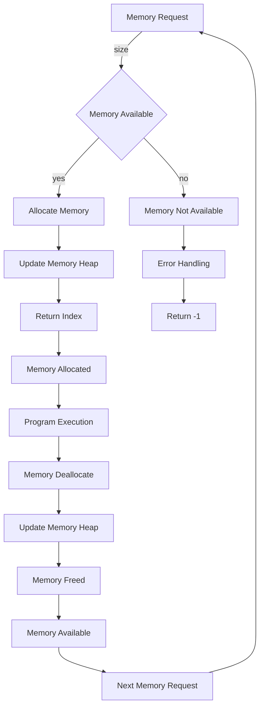

## Introduction
Memory allocation is a fundamental concept in computer science that plays a crucial role in the efficient management of memory in computer systems. It is the process of assigning a portion of memory to a program or a data structure, allowing it to store and retrieve data efficiently. **Memory allocation algorithms** are used to manage the allocation and deallocation of memory, ensuring that memory is used efficiently and that programs can run smoothly without running out of memory. In this article, we will delve into the lifecycle and mechanics of memory allocation algorithms, exploring their core concepts, internal workings, and real-world applications.

> **Note:** Memory allocation is a critical component of operating systems, programming languages, and software development, and a deep understanding of its concepts and mechanics is essential for any software engineer or computer science professional.

## Core Concepts
The core concepts of memory allocation algorithms include:

* **Memory fragmentation**: The process of breaking down large blocks of memory into smaller, non-contiguous blocks, leading to inefficient memory usage.
* **Memory compaction**: The process of rearranging memory blocks to eliminate fragmentation and improve memory efficiency.
* **Allocation strategies**: The methods used to allocate memory, such as **first-fit**, **best-fit**, and **worst-fit**.
* **Deallocation strategies**: The methods used to deallocate memory, such as **immediate deallocation** and **lazy deallocation**.
* **Memory pools**: A collection of memory blocks that can be allocated and deallocated efficiently.

> **Tip:** Understanding the trade-offs between different allocation strategies and deallocation strategies is crucial for optimizing memory allocation algorithms.

## How It Works Internally
Memory allocation algorithms work internally by maintaining a **memory heap**, which is a data structure that stores the available memory blocks. The algorithm iterates through the heap to find a suitable block of memory to allocate or deallocate. The steps involved in the memory allocation process are:

1. **Memory request**: The program requests a block of memory.
2. **Heap search**: The algorithm searches the memory heap for a suitable block of memory.
3. **Block allocation**: The algorithm allocates the block of memory to the program.
4. **Block deallocation**: The algorithm deallocates the block of memory when it is no longer needed.

> **Warning:** Memory leaks can occur if the algorithm fails to deallocate memory blocks properly, leading to memory fragmentation and inefficient memory usage.

## Code Examples
Here are three complete and runnable code examples that demonstrate the basics of memory allocation algorithms:

### Example 1: Basic Memory Allocation
```java
public class MemoryAllocator {
    private int[] memoryHeap;

    public MemoryAllocator(int size) {
        memoryHeap = new int[size];
    }

    public int allocate(int size) {
        for (int i = 0; i < memoryHeap.length; i++) {
            if (memoryHeap[i] == 0) {
                // Allocate memory block
                memoryHeap[i] = size;
                return i;
            }
        }
        return -1; // Memory not available
    }

    public void deallocate(int index) {
        memoryHeap[index] = 0; // Deallocate memory block
    }

    public static void main(String[] args) {
        MemoryAllocator allocator = new MemoryAllocator(10);
        int index = allocator.allocate(5);
        System.out.println("Allocated memory block at index " + index);
        allocator.deallocate(index);
    }
}
```

### Example 2: First-Fit Memory Allocation
```c
#include <stdio.h>
#include <stdlib.h>

typedef struct MemoryBlock {
    int size;
    int free;
} MemoryBlock;

MemoryBlock* memoryHeap;
int memoryHeapSize;

int allocate(int size) {
    for (int i = 0; i < memoryHeapSize; i++) {
        if (memoryHeap[i].free && memoryHeap[i].size >= size) {
            // Allocate memory block
            memoryHeap[i].free = 0;
            return i;
        }
    }
    return -1; // Memory not available
}

void deallocate(int index) {
    memoryHeap[index].free = 1; // Deallocate memory block
}

int main() {
    memoryHeapSize = 10;
    memoryHeap = (MemoryBlock*) malloc(memoryHeapSize * sizeof(MemoryBlock));
    int index = allocate(5);
    printf("Allocated memory block at index %d\n", index);
    deallocate(index);
    return 0;
}
```

### Example 3: Best-Fit Memory Allocation
```python
class MemoryAllocator:
    def __init__(self, size):
        self.memory_heap = [0] * size

    def allocate(self, size):
        best_fit_index = -1
        best_fit_size = float('inf')
        for i in range(len(self.memory_heap)):
            if self.memory_heap[i] == 0 and self.memory_heap[i] + size <= len(self.memory_heap):
                # Check if this block is the best fit
                if size <= best_fit_size:
                    best_fit_index = i
                    best_fit_size = size
        if best_fit_index != -1:
            # Allocate memory block
            self.memory_heap[best_fit_index] = size
            return best_fit_index
        return -1  # Memory not available

    def deallocate(self, index):
        self.memory_heap[index] = 0  # Deallocate memory block

    def print_memory_heap(self):
        print(self.memory_heap)

allocator = MemoryAllocator(10)
index = allocator.allocate(5)
print("Allocated memory block at index", index)
allocator.print_memory_heap()
allocator.deallocate(index)
allocator.print_memory_heap()
```

## Visual Diagram

This diagram illustrates the memory allocation process, from the initial memory request to the allocation and deallocation of memory blocks.

## Comparison
| Allocation Strategy | Time Complexity | Space Complexity | Pros | Cons | Best For |
| --- | --- | --- | --- | --- | --- |
| First-Fit | O(n) | O(1) | Simple to implement, fast allocation | May lead to fragmentation | Real-time systems |
| Best-Fit | O(n) | O(1) | Reduces fragmentation, efficient allocation | Slower allocation, complex implementation | General-purpose systems |
| Worst-Fit | O(n) | O(1) | Reduces fragmentation, efficient allocation | Slower allocation, complex implementation | Specialized systems |
| Buddy Allocation | O(log n) | O(log n) | Fast allocation, efficient deallocation | Complex implementation, may lead to fragmentation | High-performance systems |

## Real-world Use Cases
1. **Android Operating System**: The Android operating system uses a combination of first-fit and best-fit allocation strategies to manage memory allocation for apps.
2. **Google Chrome Browser**: The Google Chrome browser uses a buddy allocation strategy to manage memory allocation for web pages and extensions.
3. **Linux Kernel**: The Linux kernel uses a first-fit allocation strategy to manage memory allocation for system processes and kernel modules.

## Common Pitfalls
1. **Memory Leaks**: Failing to deallocate memory blocks properly can lead to memory leaks and fragmentation.
2. **Memory Fragmentation**: Incorrect allocation strategies can lead to memory fragmentation, reducing the efficiency of memory allocation.
3. **Memory Corruption**: Incorrectly updating the memory heap can lead to memory corruption and system crashes.
4. **Deadlocks**: Incorrectly handling memory allocation and deallocation can lead to deadlocks and system freezes.

> **Interview:** Can you explain the difference between first-fit and best-fit allocation strategies? How would you implement a buddy allocation strategy in a real-world system?

## Interview Tips
1. **Understand the Basics**: Make sure to understand the basics of memory allocation algorithms, including allocation strategies and deallocation strategies.
2. **Practice Implementation**: Practice implementing different allocation strategies, such as first-fit and best-fit, to understand their trade-offs and complexities.
3. **Optimization Techniques**: Be familiar with optimization techniques, such as memory compaction and buddy allocation, to improve memory allocation efficiency.

## Key Takeaways
* Memory allocation algorithms are crucial for efficient memory management in computer systems.
* Understanding the trade-offs between different allocation strategies and deallocation strategies is essential for optimizing memory allocation algorithms.
* Memory fragmentation and memory corruption can lead to system crashes and performance issues.
* Buddy allocation strategies can improve memory allocation efficiency in high-performance systems.
* First-fit and best-fit allocation strategies are simple to implement but may lead to memory fragmentation.
* Memory compaction and deallocation strategies can improve memory efficiency and reduce fragmentation.
* Understanding the basics of memory allocation algorithms is essential for any software engineer or computer science professional.