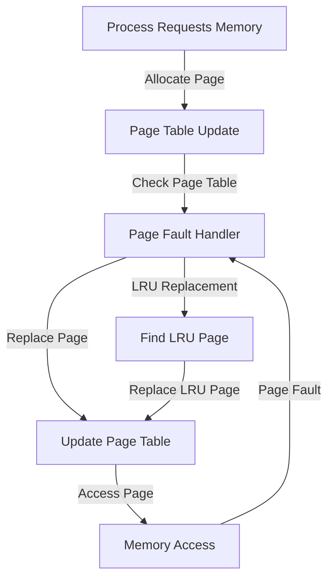

## Introduction
Virtual memory paging is a fundamental concept in computer science that enables efficient memory management in modern operating systems. It allows multiple processes to share the same physical memory, while providing each process with its own virtual address space. This approach has been widely adopted in various operating systems, including Windows, Linux, and macOS. In this study, we will delve into the details of virtual memory paging, explore alternative approaches, and compare their performance. **Virtual memory paging** is essential for modern computing, as it enables efficient use of physical memory, reduces memory fragmentation, and improves overall system performance.

## Core Concepts
To understand virtual memory paging, it's essential to grasp the following key concepts:
* **Page**: A fixed-size block of memory that is used as a unit of allocation and deallocation.
* **Page table**: A data structure that maps virtual page numbers to physical page numbers.
* **Page fault**: An event that occurs when a process attempts to access a page that is not in physical memory.
* **Paging algorithm**: A strategy used to determine which page to replace when a page fault occurs.

A mental model for virtual memory paging is to think of it as a **cache hierarchy**, where the page table serves as a cache for the physical memory. The page table contains a mapping of virtual page numbers to physical page numbers, allowing the operating system to quickly locate the physical location of a page.

## How It Works Internally
Here's a step-by-step breakdown of how virtual memory paging works:
1. **Page allocation**: When a process requests memory, the operating system allocates a page from the physical memory.
2. **Page table update**: The page table is updated to reflect the mapping between the virtual page number and the physical page number.
3. **Page access**: When a process accesses a page, the operating system checks the page table to determine the physical location of the page.
4. **Page fault handling**: If the page is not in physical memory, a page fault occurs, and the operating system uses a paging algorithm to determine which page to replace.

The under-the-hood mechanics of virtual memory paging involve the use of **memory management units (MMUs)**, which are responsible for translating virtual addresses to physical addresses. The MMU uses the page table to perform this translation, allowing the operating system to manage memory efficiently.

## Code Examples
Here are three complete and runnable examples that demonstrate virtual memory paging:
### Example 1: Basic Paging
```c
#include <stdio.h>
#include <stdlib.h>

// Define the page size
#define PAGE_SIZE 1024

// Define the number of pages
#define NUM_PAGES 10

int main() {
    // Allocate memory for the page table
    int* page_table = malloc(NUM_PAGES * sizeof(int));

    // Initialize the page table
    for (int i = 0; i < NUM_PAGES; i++) {
        page_table[i] = -1; // Initialize to invalid page
    }

    // Allocate a page
    int page = 0;
    page_table[page] = 0; // Map virtual page to physical page

    // Access the page
    printf("Accessing page %d\n", page);

    // Free the page table
    free(page_table);

    return 0;
}
```
### Example 2: Page Fault Handling
```c
#include <stdio.h>
#include <stdlib.h>

// Define the page size
#define PAGE_SIZE 1024

// Define the number of pages
#define NUM_PAGES 10

// Define the page fault handler
void page_fault_handler(int page) {
    printf("Page fault occurred on page %d\n", page);
    // Replace the page with a new one
    int* new_page = malloc(PAGE_SIZE);
    // Update the page table
    page_table[page] = (int)new_page;
}

int main() {
    // Allocate memory for the page table
    int* page_table = malloc(NUM_PAGES * sizeof(int));

    // Initialize the page table
    for (int i = 0; i < NUM_PAGES; i++) {
        page_table[i] = -1; // Initialize to invalid page
    }

    // Allocate a page
    int page = 0;
    page_table[page] = 0; // Map virtual page to physical page

    // Simulate a page fault
    page_fault_handler(page);

    // Access the page
    printf("Accessing page %d\n", page);

    // Free the page table
    free(page_table);

    return 0;
}
```
### Example 3: Advanced Paging with LRU Replacement
```c
#include <stdio.h>
#include <stdlib.h>

// Define the page size
#define PAGE_SIZE 1024

// Define the number of pages
#define NUM_PAGES 10

// Define the LRU page replacement algorithm
void lru_replacement(int* page_table, int page) {
    // Find the least recently used page
    int lru_page = 0;
    for (int i = 1; i < NUM_PAGES; i++) {
        if (page_table[i] < page_table[lru_page]) {
            lru_page = i;
        }
    }

    // Replace the LRU page with the new page
    page_table[lru_page] = page;
}

int main() {
    // Allocate memory for the page table
    int* page_table = malloc(NUM_PAGES * sizeof(int));

    // Initialize the page table
    for (int i = 0; i < NUM_PAGES; i++) {
        page_table[i] = -1; // Initialize to invalid page
    }

    // Allocate a page
    int page = 0;
    page_table[page] = 0; // Map virtual page to physical page

    // Access the page
    printf("Accessing page %d\n", page);

    // Simulate a page fault
    lru_replacement(page_table, page);

    // Access the page
    printf("Accessing page %d\n", page);

    // Free the page table
    free(page_table);

    return 0;
}
```
> **Note:** These examples demonstrate basic paging, page fault handling, and advanced paging with LRU replacement. They are simplified and not intended for production use.

## Visual Diagram

This diagram illustrates the flow of virtual memory paging, including page allocation, page table updates, page fault handling, and LRU replacement.

## Comparison
Here's a comparison of different paging algorithms:
| Algorithm | Time Complexity | Space Complexity | Pros | Cons | Best For |
| --- | --- | --- | --- | --- | --- |
| First-In-First-Out (FIFO) | O(1) | O(1) | Simple to implement | May replace recently used pages | Small systems |
| Least Recently Used (LRU) | O(1) | O(n) | Good performance | Complex to implement | Large systems |
| Optimal Replacement (OPT) | O(n) | O(n) | Best performance | Difficult to implement | Theoretical analysis |
| Random Replacement (RR) | O(1) | O(1) | Simple to implement | Poor performance | Small systems |
> **Warning:** The choice of paging algorithm can significantly impact system performance. A poor choice can lead to increased page faults and reduced system efficiency.

## Real-world Use Cases
Here are some real-world examples of virtual memory paging in production systems:
* **Google's Memory Management**: Google uses a custom memory management system that incorporates virtual memory paging to manage memory efficiently in their data centers.
* **Amazon's EC2**: Amazon's EC2 uses virtual memory paging to provide efficient memory management for their cloud-based services.
* **Linux Kernel**: The Linux kernel uses virtual memory paging to manage memory efficiently and provide a high level of performance.

## Common Pitfalls
Here are some common pitfalls to avoid when implementing virtual memory paging:
* **Incorrect Page Table Updates**: Failing to update the page table correctly can lead to page faults and reduced system performance.
* **Insufficient Memory Allocation**: Allocating insufficient memory can lead to page faults and reduced system performance.
* **Poor Choice of Paging Algorithm**: Choosing a poor paging algorithm can lead to increased page faults and reduced system efficiency.
* **Inadequate Error Handling**: Failing to handle errors correctly can lead to system crashes and data loss.

> **Tip:** When implementing virtual memory paging, it's essential to carefully consider the choice of paging algorithm and ensure that the page table is updated correctly.

## Interview Tips
Here are some common interview questions related to virtual memory paging:
* **What is virtual memory paging?**: This question requires a clear and concise explanation of virtual memory paging, including its benefits and limitations.
* **How does the LRU replacement algorithm work?**: This question requires a detailed explanation of the LRU replacement algorithm, including its advantages and disadvantages.
* **What are the benefits and limitations of virtual memory paging?**: This question requires a balanced discussion of the benefits and limitations of virtual memory paging, including its impact on system performance and memory efficiency.

> **Interview:** When answering interview questions related to virtual memory paging, be sure to provide clear and concise explanations, and highlight your understanding of the underlying concepts and algorithms.

## Key Takeaways
Here are the key takeaways from this study:
* **Virtual memory paging is essential for efficient memory management**: Virtual memory paging enables efficient use of physical memory, reducing memory fragmentation and improving overall system performance.
* **The choice of paging algorithm is critical**: The choice of paging algorithm can significantly impact system performance, and a poor choice can lead to increased page faults and reduced system efficiency.
* **Page table updates are crucial**: Correctly updating the page table is essential for virtual memory paging to work efficiently.
* **Error handling is essential**: Failing to handle errors correctly can lead to system crashes and data loss.
* **Virtual memory paging has real-world applications**: Virtual memory paging is used in production systems, including Google's memory management and Amazon's EC2.
* **Understanding virtual memory paging is essential for system programming**: Virtual memory paging is a fundamental concept in computer science, and understanding it is essential for system programming and memory management.