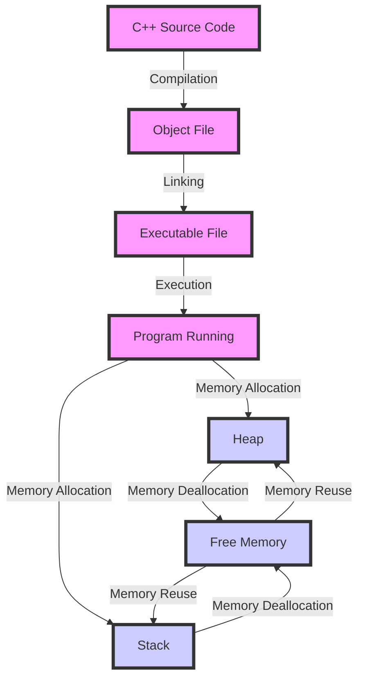

## Introduction
C++ is a high-performance, versatile programming language that **supports multiple programming paradigms**, including Object-Oriented Programming (OOP), Generic Programming, Functional Programming, and Procedural Programming. This **flexibility** makes C++ a popular choice for building a wide range of applications, from operating systems and games to web browsers and databases. C++'s **performance**, **reliability**, and **portability** have made it a staple in the software industry for decades. Every engineer should know C++ because it provides a **deep understanding of computer science fundamentals**, such as memory management, data structures, and algorithms.

## Core Concepts
C++'s core concepts include:
* **Variables**: named storage locations that hold values
* **Data Types**: classification of data into types, such as integers, floating-point numbers, and characters
* **Control Structures**: statements that control the flow of a program, such as if-else statements and loops
* **Functions**: reusable blocks of code that perform a specific task
* **Classes**: user-defined data types that encapsulate data and behavior
* **Objects**: instances of classes, which have their own set of attributes (data) and methods (functions)

> **Note:** C++'s core concepts are designed to provide a **solid foundation** for building robust and efficient software systems.

## How It Works Internally
C++'s internal mechanics involve:
1. **Compilation**: the process of translating C++ source code into machine code
2. **Linking**: the process of resolving external references between object files
3. **Execution**: the process of running the compiled and linked program
C++'s **memory model** consists of:
* **Stack**: a region of memory that stores local variables and function calls
* **Heap**: a region of memory that stores dynamically allocated objects
* **Global/Static**: a region of memory that stores global and static variables

> **Warning:** C++'s manual memory management can lead to memory leaks and dangling pointers if not used carefully.

## Code Examples
### Example 1: Basic C++ Program
```cpp
#include <iostream>

int main() {
    // Print "Hello, World!" to the console
    std::cout << "Hello, World!" << std::endl;
    return 0;
}
```
This example demonstrates a basic C++ program that prints a message to the console.

### Example 2: C++ Class and Object
```cpp
#include <iostream>
#include <string>

class Person {
public:
    // Constructor
    Person(std::string name, int age) : name_(name), age_(age) {}

    // Getter methods
    std::string getName() { return name_; }
    int getAge() { return age_; }

private:
    std::string name_;
    int age_;
};

int main() {
    // Create a Person object
    Person person("John Doe", 30);

    // Print person's name and age
    std::cout << "Name: " << person.getName() << std::endl;
    std::cout << "Age: " << person.getAge() << std::endl;
    return 0;
}
```
This example demonstrates a C++ class and object, showcasing encapsulation and abstraction.

### Example 3: C++ Template Metaprogramming
```cpp
#include <iostream>

// Template function to calculate the factorial of a number
template <int N>
struct Factorial {
    enum { value = N * Factorial<N - 1>::value };
};

// Base case: factorial of 0 is 1
template <>
struct Factorial<0> {
    enum { value = 1 };
};

int main() {
    // Calculate the factorial of 5
    int result = Factorial<5>::value;
    std::cout << "Factorial of 5: " << result << std::endl;
    return 0;
}
```
This example demonstrates C++ template metaprogramming, which enables **compile-time evaluation** of expressions.

## Visual Diagram

This diagram illustrates the C++ compilation, linking, and execution process, as well as memory allocation and deallocation.

## Comparison
| Paradigm | Time Complexity | Space Complexity | Pros | Cons | Best For |
| --- | --- | --- | --- | --- | --- |
| OOP | O(1) - O(n) | O(1) - O(n) | Encapsulation, Abstraction, Code Reuse | Steep Learning Curve, Over-Engineering | Complex Systems, Games |
| Generic Programming | O(1) - O(n) | O(1) - O(n) | Type Safety, Code Reuse | Complexity, Over-Engineering | Algorithms, Data Structures |
| Functional Programming | O(1) - O(n) | O(1) - O(n) | Immutability, Recursion | Performance Overhead, Learning Curve | Data Processing, Scientific Computing |
| Procedural Programming | O(1) - O(n) | O(1) - O(n) | Simple, Efficient | Limited Code Reuse, Error-Prone | Embedded Systems, Scripting |

> **Tip:** Choose the right paradigm based on the problem domain and performance requirements.

## Real-world Use Cases
1. **Google Chrome**: uses C++ for its rendering engine and other performance-critical components.
2. **Microsoft Windows**: uses C++ for its operating system kernel and device drivers.
3. **Mozilla Firefox**: uses C++ for its rendering engine and other performance-critical components.

## Common Pitfalls
1. **Memory Leaks**: failing to release dynamically allocated memory can lead to memory leaks.
2. **Dangling Pointers**: using pointers that point to released memory can lead to crashes or unexpected behavior.
3. **Null Pointer Dereferences**: dereferencing null pointers can lead to crashes or unexpected behavior.
4. **Off-by-One Errors**: making off-by-one errors in array indexing or loop bounds can lead to crashes or unexpected behavior.

> **Warning:** C++'s manual memory management and lack of runtime checks can lead to these common pitfalls.

## Interview Tips
1. **What is the difference between a pointer and a reference?**
	* Weak answer: "A pointer is a variable that holds a memory address, while a reference is... um... something else."
	* Strong answer: "A pointer is a variable that holds a memory address, while a reference is an alias for a variable. References are initialized with the address of a variable and cannot be changed to point to a different variable."
2. **How do you implement a singly linked list in C++?**
	* Weak answer: "Uh, you just use a bunch of pointers and... stuff."
	* Strong answer: "You define a struct to represent a node, which contains a value and a pointer to the next node. You then implement functions to insert, delete, and traverse the list, using pointers to manage the nodes."
3. **What is the purpose of the `const` keyword in C++?**
	* Weak answer: "It makes the variable... constant or something."
	* Strong answer: "The `const` keyword is used to declare variables that cannot be modified after initialization. It can also be used to specify that a function does not modify its arguments or return value, which can improve code readability and maintainability."

## Key Takeaways
* C++ is a versatile programming language that supports multiple paradigms.
* C++'s core concepts include variables, data types, control structures, functions, classes, and objects.
* C++'s internal mechanics involve compilation, linking, and execution.
* C++'s memory model consists of the stack, heap, and global/static memory.
* C++ template metaprogramming enables compile-time evaluation of expressions.
* C++'s common pitfalls include memory leaks, dangling pointers, null pointer dereferences, and off-by-one errors.
* C++ is widely used in real-world applications, including operating systems, games, and web browsers.
* C++'s time and space complexity can vary depending on the paradigm and algorithm used.
* C++'s performance and reliability make it a popular choice for building robust and efficient software systems.