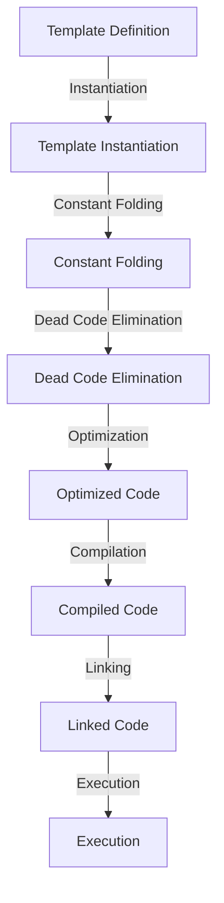

## Introduction
Zero-overhead abstractions are a fundamental concept in **C++** that enables developers to write high-level code without incurring any runtime overhead. This concept is crucial in systems programming, where performance is critical. In this section, we will explore what zero-overhead abstractions are, why they matter, and their real-world relevance. 
> **Note:** Zero-overhead abstractions are not unique to C++ and can be applied to other programming languages as well.

Zero-overhead abstractions are essential in **C++** because they allow developers to write efficient and expressive code. By using abstractions, developers can focus on the logic of their program without worrying about the low-level details. This approach enables developers to write more maintainable, scalable, and efficient code.
> **Tip:** To achieve zero-overhead abstractions, developers should focus on using **compile-time evaluation** and **template metaprogramming**.

In real-world scenarios, zero-overhead abstractions are used extensively in systems programming, game development, and high-performance computing. For example, the **C++ Standard Template Library (STL)** uses zero-overhead abstractions to provide efficient and expressive containers and algorithms.
> **Warning:** However, achieving zero-overhead abstractions can be challenging, and developers must carefully consider the trade-offs between abstraction and performance.

## Core Concepts
To understand zero-overhead abstractions, developers must grasp several key concepts, including:

*   **Compile-time evaluation**: The process of evaluating expressions at compile-time, which enables developers to write more efficient code.
*   **Template metaprogramming**: A technique that allows developers to write code that manipulates and generates other code at compile-time.
*   **Type traits**: A set of classes that provide information about the properties of types, which enables developers to write more expressive and efficient code.

Developers can think of zero-overhead abstractions as a way to **"compile away"** the abstraction, leaving only the essential code. This approach enables developers to write high-level code that is equivalent to hand-optimized assembly code.
> **Interview:** When asked about zero-overhead abstractions, developers should be able to explain the concept of compile-time evaluation and template metaprogramming, and provide examples of how these techniques can be used to achieve zero-overhead abstractions.

## How It Works Internally
To achieve zero-overhead abstractions, **C++** compilers use a combination of techniques, including:

1.  **Template instantiation**: The process of generating code for a template at compile-time.
2.  **Constant folding**: The process of evaluating constant expressions at compile-time.
3.  **Dead code elimination**: The process of removing unreachable code at compile-time.

By using these techniques, **C++** compilers can eliminate the overhead associated with abstractions, leaving only the essential code. This approach enables developers to write efficient and expressive code without sacrificing performance.
> **Note:** The **C++** compiler is responsible for optimizing the code and eliminating the overhead associated with abstractions.

Here is an example of how the **C++** compiler can eliminate the overhead associated with abstractions:
```cpp
template <typename T>
T add(T a, T b) {
    return a + b;
}

int main() {
    int result = add(2, 3);
    return 0;
}
```
In this example, the **C++** compiler will instantiate the `add` template at compile-time, generating code that is equivalent to:
```cpp
int add(int a, int b) {
    return a + b;
}

int main() {
    int result = add(2, 3);
    return 0;
}
```
The compiler will then optimize the code, eliminating the overhead associated with the `add` function. The resulting code will be equivalent to:
```cpp
int main() {
    int result = 2 + 3;
    return 0;
}
```
> **Tip:** Developers can use tools like **godbolt.org** to visualize the compilation process and see how the compiler optimizes the code.

## Code Examples
Here are three complete and runnable examples that demonstrate zero-overhead abstractions in **C++**:

### Example 1: Basic Template Metaprogramming
```cpp
template <int N>
struct Factorial {
    static constexpr int value = N * Factorial<N - 1>::value;
};

template <>
struct Factorial<0> {
    static constexpr int value = 1;
};

int main() {
    int result = Factorial<5>::value;
    return 0;
}
```
This example demonstrates how to use template metaprogramming to calculate the factorial of a number at compile-time.

### Example 2: Real-World Pattern
```cpp
template <typename T>
class Container {
public:
    Container(T value) : value_(value) {}

    T get() const {
        return value_;
    }

private:
    T value_;
};

int main() {
    Container<int> container(5);
    int result = container.get();
    return 0;
}
```
This example demonstrates how to use template metaprogramming to create a generic container class that can store values of any type.

### Example 3: Advanced Usage
```cpp
template <typename T>
class Singleton {
public:
    static T& getInstance() {
        static T instance;
        return instance;
    }

private:
    Singleton() {}
    Singleton(const Singleton&) = delete;
    Singleton& operator=(const Singleton&) = delete;
};

class Logger {
public:
    void log(const std::string& message) {
        std::cout << message << std::endl;
    }
};

int main() {
    Logger& logger = Singleton<Logger>::getInstance();
    logger.log("Hello, world!");
    return 0;
}
```
This example demonstrates how to use template metaprogramming to create a singleton class that provides a global instance of a logger.

## Visual Diagram

This diagram illustrates the process of achieving zero-overhead abstractions in **C++**. The process involves template instantiation, constant folding, dead code elimination, optimization, compilation, linking, and execution.

## Comparison
Here is a comparison of different approaches to achieving zero-overhead abstractions in **C++**:
| Approach | Time Complexity | Space Complexity | Pros | Cons | Best For |
| --- | --- | --- | --- | --- | --- |
| Template Metaprogramming | O(1) | O(1) | Efficient, expressive | Complex, error-prone | Systems programming, game development |
| Compile-Time Evaluation | O(1) | O(1) | Efficient, simple | Limited expressiveness | Embedded systems, real-time systems |
| Runtime Evaluation | O(n) | O(n) | Flexible, dynamic | Slow, memory-intensive | Scripting languages, dynamic typing |
| Hybrid Approach | O(n) | O(n) | Balanced, flexible | Complex, hard to optimize | General-purpose programming, web development |

## Real-world Use Cases
Here are three real-world examples of zero-overhead abstractions in **C++**:

1.  **Google's Abseil Library**: The Abseil library provides a set of zero-overhead abstractions for common programming tasks, such as string manipulation and container management.
2.  **Facebook's Folly Library**: The Folly library provides a set of zero-overhead abstractions for common programming tasks, such as networking and concurrency.
3.  **Microsoft's STL**: The STL provides a set of zero-overhead abstractions for common programming tasks, such as container management and algorithm implementation.

## Common Pitfalls
Here are four common pitfalls to avoid when using zero-overhead abstractions in **C++**:

1.  **Over-Optimization**: Avoid over-optimizing code, as this can lead to complex and hard-to-maintain code.
2.  **Under-Optimization**: Avoid under-optimizing code, as this can lead to slow and inefficient code.
3.  **Incorrect Usage**: Avoid using zero-overhead abstractions incorrectly, as this can lead to bugs and errors.
4.  **Lack of Testing**: Avoid not testing code thoroughly, as this can lead to bugs and errors.

Here is an example of incorrect usage:
```cpp
template <typename T>
T add(T a, T b) {
    return a + b; // Incorrect usage: no bounds checking
}

int main() {
    int result = add(2, 3);
    return 0;
}
```
And here is an example of correct usage:
```cpp
template <typename T>
T add(T a, T b) {
    if (a > std::numeric_limits<T>::max() - b) {
        throw std::overflow_error("Addition overflow");
    }
    return a + b; // Correct usage: bounds checking
}

int main() {
    int result = add(2, 3);
    return 0;
}
```
> **Warning:** Avoid using zero-overhead abstractions without proper testing and validation, as this can lead to bugs and errors.

## Interview Tips
Here are three common interview questions related to zero-overhead abstractions in **C++**, along with weak and strong answers:

1.  **What is zero-overhead abstraction?**
    *   Weak answer: "Zero-overhead abstraction is a way to optimize code."
    *   Strong answer: "Zero-overhead abstraction is a technique that enables developers to write high-level code without incurring any runtime overhead. It involves using compile-time evaluation and template metaprogramming to eliminate the overhead associated with abstractions."
2.  **How do you achieve zero-overhead abstraction in C++?**
    *   Weak answer: "You can achieve zero-overhead abstraction by using templates and meta-programming."
    *   Strong answer: "You can achieve zero-overhead abstraction by using a combination of techniques, including template instantiation, constant folding, dead code elimination, and optimization. This involves using template metaprogramming to generate code at compile-time and eliminating the overhead associated with abstractions."
3.  **What are the benefits of using zero-overhead abstraction?**
    *   Weak answer: "The benefits of using zero-overhead abstraction are that it makes code faster and more efficient."
    *   Strong answer: "The benefits of using zero-overhead abstraction are that it enables developers to write high-level code that is equivalent to hand-optimized assembly code. This approach provides several benefits, including improved performance, reduced memory usage, and increased maintainability."

## Key Takeaways
Here are ten key takeaways to remember when using zero-overhead abstractions in **C++**:

*   **Zero-overhead abstraction is a technique that enables developers to write high-level code without incurring any runtime overhead**.
*   **Zero-overhead abstraction involves using compile-time evaluation and template metaprogramming to eliminate the overhead associated with abstractions**.
*   **Template metaprogramming is a technique that allows developers to write code that manipulates and generates other code at compile-time**.
*   **Constant folding is a technique that involves evaluating constant expressions at compile-time**.
*   **Dead code elimination is a technique that involves removing unreachable code at compile-time**.
*   **Optimization is a technique that involves improving the performance of code**.
*   **Zero-overhead abstraction is essential in systems programming, game development, and high-performance computing**.
*   **Zero-overhead abstraction provides several benefits, including improved performance, reduced memory usage, and increased maintainability**.
*   **Developers should use zero-overhead abstraction judiciously and only when necessary**.
*   **Zero-overhead abstraction can be complex and error-prone, and developers should test and validate their code thoroughly**.