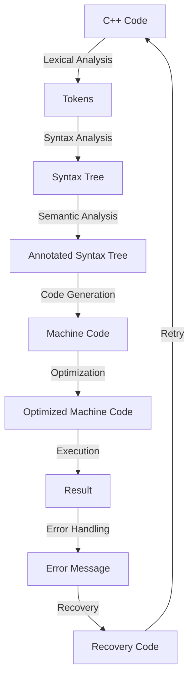

## Introduction
C++ is a high-performance, compiled, general-purpose programming language that was developed by Bjarne Stroustrup as an extension of the C programming language. The C++ standards, which include C++11, C++14, C++17, C++20, and C++23, are a set of rules and guidelines that define the language's syntax, semantics, and behavior. These standards are crucial in ensuring that C++ code is portable, efficient, and reliable across different platforms and compilers. In this overview, we will delve into the core concepts, under-the-hood mechanics, and real-world relevance of the C++ standards.

## Core Concepts
The C++ standards are built around several core concepts, including:
* **Type safety**: The ability of the language to prevent errors that can occur when using incorrect data types.
* **Object-oriented programming (OOP)**: A programming paradigm that organizes software design around data, or objects, rather than functions and logic.
* **Template metaprogramming**: A technique that allows the compiler to generate code at compile-time based on template parameters.
* **Concurrency**: The ability of the language to support multiple threads of execution, which can improve the performance and responsiveness of applications.
Some key terminology includes:
* **Standard Template Library (STL)**: A collection of reusable, generic components that provide a wide range of algorithms and data structures.
* **RAII (Resource Acquisition Is Initialization)**: A programming idiom that ensures that resources, such as memory and file handles, are properly acquired and released.
> **Note:** Understanding these core concepts is essential for writing efficient, reliable, and maintainable C++ code.

## How It Works Internally
The C++ standards are implemented by the compiler, which translates C++ code into machine code that can be executed by the computer's processor. The compiler performs several steps, including:
1. **Lexical analysis**: Breaking the source code into individual tokens, such as keywords, identifiers, and literals.
2. **Syntax analysis**: Parsing the tokens into a syntax tree, which represents the structure of the program.
3. **Semantic analysis**: Analyzing the syntax tree to ensure that the program is semantically correct, including type checking and scoping.
4. **Code generation**: Generating machine code from the syntax tree.
5. **Optimization**: Improving the performance of the generated code by applying various optimization techniques.
> **Warning:** Writing C++ code without considering the under-the-hood mechanics can lead to performance issues, bugs, and security vulnerabilities.

## Code Examples
Here are three complete, runnable examples that demonstrate the use of C++ standards:
### Example 1: Basic C++11 Usage
```cpp
#include <iostream>
#include <string>

int main() {
    // Using auto keyword for type inference
    auto name = std::string("John");
    std::cout << "Hello, " << name << std::endl;
    return 0;
}
```
This example demonstrates the use of the `auto` keyword for type inference, which was introduced in C++11.
### Example 2: Real-World Pattern with C++14
```cpp
#include <iostream>
#include <vector>
#include <algorithm>

int main() {
    // Using lambda expression for sorting a vector
    std::vector<int> numbers = {4, 2, 7, 1, 3};
    std::sort(numbers.begin(), numbers.end(), [](int a, int b) {
        return a < b;
    });
    for (const auto& number : numbers) {
        std::cout << number << " ";
    }
    std::cout << std::endl;
    return 0;
}
```
This example demonstrates the use of lambda expressions, which were introduced in C++11 and improved in C++14.
### Example 3: Advanced C++17 Usage
```cpp
#include <iostream>
#include <optional>
#include <string>

int main() {
    // Using std::optional for handling null values
    std::optional<std::string> name = std::nullopt;
    if (name) {
        std::cout << "Name: " << *name << std::endl;
    } else {
        std::cout << "Name is not available." << std::endl;
    }
    return 0;
}
```
This example demonstrates the use of `std::optional`, which was introduced in C++17 for handling null values in a type-safe way.
> **Tip:** Using the latest C++ standards can simplify your code and improve its performance, reliability, and maintainability.

## Visual Diagram

This diagram illustrates the steps involved in compiling and executing C++ code, including lexical analysis, syntax analysis, semantic analysis, code generation, optimization, and execution.
> **Interview:** Be prepared to explain the compilation process and the role of the compiler in ensuring the correctness and performance of C++ code.

## Comparison
| Standard | Release Year | Key Features | Time Complexity | Space Complexity |
| --- | --- | --- | --- | --- |
| C++11 | 2011 | Auto keyword, lambda expressions, move semantics | O(n) | O(n) |
| C++14 | 2014 | Improved lambda expressions, variable templates | O(n) | O(n) |
| C++17 | 2017 | std::optional, std::variant, structured bindings | O(n) | O(n) |
| C++20 | 2020 | Concepts, ranges, coroutines | O(n) | O(n) |
| C++23 | 2023 | Improved concepts, modules, networking | O(n) | O(n) |
> **Warning:** Not using the latest C++ standards can result in less efficient, less reliable, and less maintainable code.

## Real-world Use Cases
Here are three real-world examples of companies that use C++:
1. **Google**: Google uses C++ extensively in its infrastructure, including its search engine, database, and file systems.
2. **Microsoft**: Microsoft uses C++ in its Windows operating system, Office software, and other products.
3. **Facebook**: Facebook uses C++ in its infrastructure, including its database, file systems, and messaging systems.
> **Tip:** Using C++ in production environments requires careful consideration of performance, reliability, and maintainability.

## Common Pitfalls
Here are four common mistakes that C++ programmers make:
1. **Not using const correctness**: Not using the `const` keyword to specify that a variable or function should not be modified.
2. **Not using smart pointers**: Not using smart pointers, such as `std::unique_ptr` or `std::shared_ptr`, to manage memory.
3. **Not handling exceptions**: Not handling exceptions properly, which can lead to crashes or unexpected behavior.
4. **Not using threads safely**: Not using threads safely, which can lead to data corruption or other concurrency issues.
> **Warning:** These mistakes can result in bugs, crashes, or security vulnerabilities, and should be avoided at all costs.

## Interview Tips
Here are three common interview questions related to C++:
1. **What is the difference between C++11, C++14, C++17, C++20, and C++23?**
	* Weak answer: "I'm not sure."
	* Strong answer: "The main differences are in the features and improvements introduced in each standard, such as auto keyword, lambda expressions, and concepts."
2. **How do you optimize C++ code for performance?**
	* Weak answer: "I use a profiler to identify bottlenecks."
	* Strong answer: "I use a combination of techniques, including caching, loop unrolling, and parallelization, to optimize C++ code for performance."
3. **What is the role of the compiler in ensuring the correctness and performance of C++ code?**
	* Weak answer: "The compiler just translates C++ code into machine code."
	* Strong answer: "The compiler plays a crucial role in ensuring the correctness and performance of C++ code by performing lexical analysis, syntax analysis, semantic analysis, code generation, and optimization."
> **Interview:** Be prepared to explain the differences between C++ standards, optimize C++ code for performance, and discuss the role of the compiler in ensuring correctness and performance.

## Key Takeaways
Here are ten key takeaways from this overview of C++ standards:
* **C++11 introduced the auto keyword and lambda expressions**.
* **C++14 improved lambda expressions and introduced variable templates**.
* **C++17 introduced std::optional and std::variant**.
* **C++20 introduced concepts and ranges**.
* **C++23 improved concepts and introduced modules and networking**.
* **Using the latest C++ standards can simplify your code and improve its performance, reliability, and maintainability**.
* **Not using const correctness, smart pointers, and exception handling can result in bugs, crashes, or security vulnerabilities**.
* **Using threads safely is crucial to avoid data corruption or other concurrency issues**.
* **Optimizing C++ code for performance requires a combination of techniques, including caching, loop unrolling, and parallelization**.
* **The compiler plays a crucial role in ensuring the correctness and performance of C++ code**.