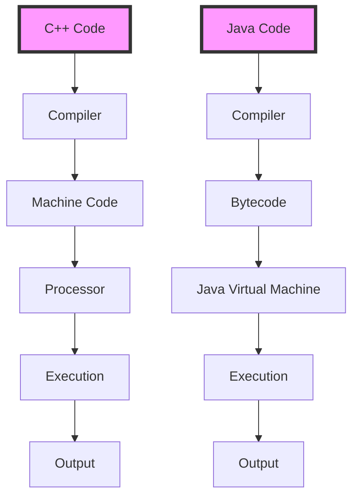

## Introduction
**C++** and **Java** are two of the most popular programming languages used in the industry today. While **C++** is known for its performance, **Java** is renowned for its portability. In this section, we will explore the differences between these two languages and discuss their strengths and weaknesses. **C++** is a **low-level**, **compiled** language that provides direct access to hardware resources, making it a popular choice for systems programming and high-performance applications. On the other hand, **Java** is a **high-level**, **interpreted** language that runs on a virtual machine, making it a popular choice for web development, mobile app development, and enterprise software development.

> **Note:** The choice between **C++** and **Java** depends on the specific requirements of the project. If performance is a top priority, **C++** may be a better choice. However, if portability and ease of development are more important, **Java** may be a better fit.

## Core Concepts
In order to understand the differences between **C++** and **Java**, it's essential to grasp the core concepts of each language. **C++** is an **object-oriented** language that supports **encapsulation**, **inheritance**, and **polymorphism**. It also provides **low-level memory management** through pointers, which can be error-prone but provides direct access to hardware resources. **Java**, on the other hand, is also an **object-oriented** language that supports **encapsulation**, **inheritance**, and **polymorphism**. However, it provides **high-level memory management** through a garbage collector, which eliminates the need for manual memory management but can introduce performance overhead.

> **Tip:** When working with **C++**, it's essential to use **smart pointers** to manage memory and avoid memory leaks. In **Java**, it's essential to use **try-with-resources** statements to ensure that resources are properly closed and released.

## How It Works Internally
When a **C++** program is compiled, the compiler generates **machine code** that can be executed directly by the computer's processor. This process is known as **just-in-time (JIT) compilation**. In contrast, **Java** programs are compiled into **bytecode**, which is then executed by the **Java Virtual Machine (JVM)**. The **JVM** provides a layer of abstraction between the **Java** program and the underlying hardware, making it possible to run **Java** programs on any platform that has a **JVM**.

> **Warning:** When working with **C++**, it's essential to be aware of the **undefined behavior** that can occur when using pointers or accessing memory outside the bounds of an array. In **Java**, it's essential to be aware of the **performance overhead** introduced by the **JVM** and the **garbage collector**.

## Code Examples
Here are three complete and runnable examples that demonstrate the differences between **C++** and **Java**:
### Example 1: Basic Hello World
```cpp
// C++ example
#include <iostream>

int main() {
    std::cout << "Hello, World!" << std::endl;
    return 0;
}
```

```java
// Java example
public class HelloWorld {
    public static void main(String[] args) {
        System.out.println("Hello, World!");
    }
}
```
### Example 2: Object-Oriented Programming
```cpp
// C++ example
class Person {
public:
    Person(std::string name, int age) : name_(name), age_(age) {}
    void sayHello() {
        std::cout << "Hello, my name is " << name_ << " and I am " << age_ << " years old." << std::endl;
    }

private:
    std::string name_;
    int age_;
};

int main() {
    Person person("John Doe", 30);
    person.sayHello();
    return 0;
}
```

```java
// Java example
public class Person {
    private String name;
    private int age;

    public Person(String name, int age) {
        this.name = name;
        this.age = age;
    }

    public void sayHello() {
        System.out.println("Hello, my name is " + name + " and I am " + age + " years old.");
    }

    public static void main(String[] args) {
        Person person = new Person("John Doe", 30);
        person.sayHello();
    }
}
```
### Example 3: Multithreading
```cpp
// C++ example
#include <iostream>
#include <thread>

void printNumbers() {
    for (int i = 0; i < 10; i++) {
        std::cout << i << std::endl;
    }
}

int main() {
    std::thread thread(printNumbers);
    thread.join();
    return 0;
}
```

```java
// Java example
public class PrintNumbers implements Runnable {
    @Override
    public void run() {
        for (int i = 0; i < 10; i++) {
            System.out.println(i);
        }
    }

    public static void main(String[] args) {
        Thread thread = new Thread(new PrintNumbers());
        thread.start();
        try {
            thread.join();
        } catch (InterruptedException e) {
            Thread.currentThread().interrupt();
        }
    }
}
```
## Visual Diagram

This diagram illustrates the compilation and execution process for both **C++** and **Java**. As you can see, **C++** code is compiled directly into machine code, which is then executed by the processor. In contrast, **Java** code is compiled into bytecode, which is then executed by the **Java Virtual Machine**.

> **Interview:** Can you explain the differences between **C++** and **Java** in terms of compilation and execution? How do these differences impact performance and portability?

## Comparison
| Approach | Time Complexity | Space Complexity | Pros | Cons | Best For |
|----------|----------------|-----------------|------|------|----------|
| C++ | O(1) | O(1) | High performance, low-level memory management | Error-prone, platform-dependent | Systems programming, high-performance applications |
| Java | O(1) | O(1) | High-level memory management, platform-independent | Performance overhead, garbage collector | Web development, mobile app development, enterprise software development |
| Python | O(1) | O(1) | Easy to learn, high-level memory management | Slow performance, limited multithreading | Data science, machine learning, scripting |
| C# | O(1) | O(1) | High-level memory management, platform-independent | Performance overhead, garbage collector | Windows desktop and mobile app development, web development |

## Real-world Use Cases
Here are three real-world examples of companies that use **C++** and **Java**:
* **Google**: Uses **C++** for its search engine and **Java** for its Android operating system.
* **Facebook**: Uses **C++** for its web server and **Java** for its Android app.
* **Amazon**: Uses **C++** for its web server and **Java** for its AWS platform.

> **Tip:** When choosing between **C++** and **Java**, consider the specific requirements of your project. If performance is a top priority, **C++** may be a better choice. However, if portability and ease of development are more important, **Java** may be a better fit.

## Common Pitfalls
Here are four common mistakes that engineers make when working with **C++** and **Java**:
* **Dangling pointers**: In **C++**, a dangling pointer is a pointer that points to memory that has already been freed. This can cause crashes and unexpected behavior.
* **Null pointer exceptions**: In **Java**, a null pointer exception occurs when a program attempts to access a null object reference. This can cause crashes and unexpected behavior.
* **Memory leaks**: In both **C++** and **Java**, memory leaks can occur when a program allocates memory but fails to release it. This can cause performance issues and crashes.
* **Thread safety issues**: In both **C++** and **Java**, thread safety issues can occur when multiple threads access shared resources without proper synchronization. This can cause crashes and unexpected behavior.

> **Warning:** When working with **C++**, be careful to avoid dangling pointers and memory leaks. In **Java**, be careful to avoid null pointer exceptions and thread safety issues.

## Interview Tips
Here are three common interview questions that you may encounter when applying for a job that requires **C++** and **Java**:
* **What are the differences between C++ and Java?**: Be prepared to explain the differences between **C++** and **Java** in terms of compilation, execution, and memory management.
* **How do you handle memory management in C++?**: Be prepared to explain how you handle memory management in **C++**, including the use of smart pointers and RAII (Resource Acquisition Is Initialization).
* **How do you handle thread safety issues in Java?**: Be prepared to explain how you handle thread safety issues in **Java**, including the use of synchronization and concurrency utilities.

> **Interview:** Can you explain the differences between **C++** and **Java** in terms of compilation and execution? How do these differences impact performance and portability?

## Key Takeaways
Here are ten key takeaways to remember when working with **C++** and **Java**:
* **C++** is a low-level, compiled language that provides direct access to hardware resources.
* **Java** is a high-level, interpreted language that runs on a virtual machine.
* **C++** provides low-level memory management through pointers, while **Java** provides high-level memory management through a garbage collector.
* **C++** is a better choice for systems programming and high-performance applications, while **Java** is a better choice for web development, mobile app development, and enterprise software development.
* **C++** and **Java** have different compilation and execution processes, which can impact performance and portability.
* **C++** is more prone to errors and memory leaks, while **Java** is more prone to performance overhead and garbage collector issues.
* **C++** and **Java** have different thread safety models, which can impact the development of concurrent programs.
* **C++** and **Java** have different libraries and frameworks, which can impact the development of applications.
* **C++** and **Java** have different debugging and testing tools, which can impact the development and maintenance of applications.
* **C++** and **Java** have different learning curves, which can impact the adoption and use of these languages.