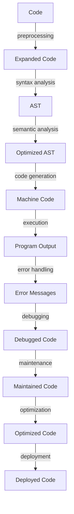

## Introduction
**C++** is a high-performance, compiled language that offers a unique combination of efficiency, flexibility, and control. However, its complexity can be overwhelming, especially for beginners. One of the primary drawbacks of C++ is the multitude of ways to accomplish the same task, which can lead to confusion, inefficient code, and maintainability issues. In this section, we will delve into the reasons why C++ has many ways to do the same thing, its real-world relevance, and why every engineer needs to understand this concept.

> **Note:** C++'s complexity is a double-edged sword. On one hand, it provides a high degree of flexibility and control, allowing developers to optimize their code for specific use cases. On the other hand, it can lead to a steep learning curve, making it challenging for newcomers to grasp the language.

## Core Concepts
To understand the drawbacks of C++'s complexity, it's essential to grasp the core concepts of the language. These include:

* **Operator overloading**: the ability to redefine the behavior of operators such as `+`, `-`, `*`, etc. for custom data types.
* **Templates**: a feature that allows for generic programming, enabling functions and classes to work with different data types.
* **Pointers**: variables that store memory addresses, providing direct access to memory locations.
* **Reference counting**: a technique used to manage memory by keeping track of the number of references to an object.

> **Warning:** C++'s complexity can lead to **code bloat**, making it difficult to maintain and optimize codebases. It's crucial to strike a balance between flexibility and simplicity to avoid this issue.

## How It Works Internally
C++'s compiler plays a significant role in managing the complexity of the language. The compilation process involves several stages, including:

1. **Preprocessing**: the compiler expands macros, includes header files, and performs other preliminary tasks.
2. **Syntax analysis**: the compiler checks the code for syntax errors and builds an abstract syntax tree (AST).
3. **Semantic analysis**: the compiler checks the code for semantic errors, such as type mismatches, and performs optimizations.
4. **Code generation**: the compiler generates machine code from the AST.

> **Tip:** Understanding the compilation process can help developers optimize their code and avoid common pitfalls. For example, using **const correctness** can improve code performance by reducing unnecessary copies of data.

## Code Examples
Here are three complete, runnable examples that demonstrate the complexity of C++:

**Example 1: Basic Operator Overloading**
```cpp
class Complex {
public:
    Complex(int real, int imaginary) : real_(real), imaginary_(imaginary) {}
    Complex operator+(const Complex& other) {
        return Complex(real_ + other.real_, imaginary_ + other.imaginary_);
    }
private:
    int real_;
    int imaginary_;
};

int main() {
    Complex c1(1, 2);
    Complex c2(3, 4);
    Complex result = c1 + c2;
    // ...
    return 0;
}
```
**Example 2: Template Metaprogramming**
```cpp
template <int N>
struct Factorial {
    enum { value = N * Factorial<N-1>::value };
};

template <>
struct Factorial<0> {
    enum { value = 1 };
};

int main() {
    int result = Factorial<5>::value;
    // ...
    return 0;
}
```
**Example 3: Smart Pointer Usage**
```cpp
#include <memory>

class MyClass {
public:
    MyClass() { std::cout << "MyClass constructor called" << std::endl; }
    ~MyClass() { std::cout << "MyClass destructor called" << std::endl; }
};

int main() {
    std::unique_ptr<MyClass> ptr(new MyClass());
    // ...
    return 0;
}
```
## Visual Diagram

The diagram illustrates the compilation process and the various stages involved in transforming C++ code into machine code.

> **Interview:** Can you explain the difference between **compile-time** and **runtime** evaluation in C++? How do these concepts relate to the compilation process?

## Comparison
| Approach | Time Complexity | Space Complexity | Pros | Cons | Best For |
| --- | --- | --- | --- | --- | --- |
| Operator Overloading | O(1) | O(1) | Flexible, expressive | Error-prone, complex | Mathematical operations |
| Template Metaprogramming | O(1) | O(1) | Efficient, flexible | Complex, verbose | Compile-time evaluation |
| Smart Pointers | O(1) | O(1) | Safe, efficient | Limited control, overhead | Memory management |

## Real-world Use Cases
Here are three real-world examples of C++'s complexity in action:

* **Google's Chrome browser**: uses a combination of C++ and JavaScript to provide a high-performance, secure browsing experience.
* **Microsoft's Windows operating system**: relies heavily on C++ for its core components, including the kernel and device drivers.
* **NASA's Mars Curiosity Rover**: uses C++ for its onboard software, which controls the rover's movements and scientific instruments.

> **Note:** C++'s complexity can be both a blessing and a curse. While it provides unparalleled flexibility and control, it can also lead to maintainability issues and performance problems if not managed carefully.

## Common Pitfalls
Here are four specific mistakes that engineers make when working with C++:

* **Dangling pointers**: using pointers that point to memory locations that have already been freed or reused.
* **Memory leaks**: failing to release memory allocated for objects or data structures.
* **Undefined behavior**: writing code that invokes undefined behavior, such as accessing an array out of bounds.
* **Thread safety issues**: failing to synchronize access to shared data in multithreaded environments.

> **Warning:** C++'s complexity can lead to **security vulnerabilities** if not addressed properly. It's essential to follow best practices, such as using **address space layout randomization (ASLR)** and **data execution prevention (DEP)**, to mitigate these risks.

## Interview Tips
Here are three common interview questions related to C++'s complexity, along with sample answers:

* **What is the difference between a pointer and a reference in C++?**
	+ Weak answer: "A pointer is a variable that stores a memory address, while a reference is an alias for a variable."
	+ Strong answer: "A pointer is a variable that stores a memory address, while a reference is an alias for a variable that is guaranteed to be valid for the lifetime of the reference. References are implemented as pointers under the hood, but they provide a safer and more convenient way to work with memory addresses."
* **How do you handle memory management in C++?**
	+ Weak answer: "I use pointers and delete them when I'm done with them."
	+ Strong answer: "I use smart pointers, such as `std::unique_ptr` and `std::shared_ptr`, to manage memory automatically. I also follow best practices, such as using `std::vector` instead of manual memory allocation, to minimize the risk of memory leaks and dangling pointers."
* **What is the purpose of `const` correctness in C++?**
	+ Weak answer: "It's used to make variables constant."
	+ Strong answer: "It's used to ensure that variables are not modified unnecessarily, which can improve code performance and readability. `const` correctness also helps to prevent bugs by ensuring that functions do not modify their input parameters unexpectedly."

## Key Takeaways
Here are ten key takeaways related to C++'s complexity:

* C++'s complexity is a double-edged sword, providing both flexibility and control, as well as maintainability issues and performance problems.
* Understanding the compilation process is essential for optimizing code and avoiding common pitfalls.
* Operator overloading, template metaprogramming, and smart pointers are powerful tools for managing complexity in C++.
* **const** correctness is essential for improving code performance and readability.
* Memory management is a critical aspect of C++ programming, and smart pointers can help to minimize the risk of memory leaks and dangling pointers.
* Thread safety is essential for writing correct and efficient multithreaded code.
* C++'s complexity can lead to security vulnerabilities if not addressed properly.
* Best practices, such as using ASLR and DEP, can help to mitigate security risks.
* C++'s complexity can be both a blessing and a curse, and it's essential to strike a balance between flexibility and simplicity to avoid maintainability issues.
* Understanding the trade-offs between different approaches, such as operator overloading and template metaprogramming, is essential for writing efficient and effective C++ code.