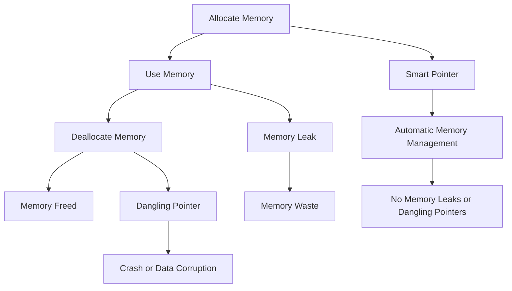

## Introduction
Manual memory management is a fundamental concept in **C++** programming that involves manually allocating and deallocating memory for variables and objects. This approach can be error-prone and lead to memory leaks, dangling pointers, and other issues if not handled correctly. In this section, we will explore the drawbacks of manual memory management and discuss how to mitigate these issues using smart pointers.

> **Note:** Manual memory management is a crucial aspect of **C++** programming, and understanding its drawbacks is essential for writing efficient and bug-free code.

Manual memory management is relevant in real-world scenarios where memory is a limited resource, and efficient memory allocation is critical. For example, in embedded systems, game development, and high-performance computing, manual memory management can be necessary to optimize memory usage.

## Core Concepts
To understand the drawbacks of manual memory management, we need to define some core concepts:

* **Memory allocation**: The process of assigning memory to a variable or object.
* **Memory deallocation**: The process of freeing up memory that is no longer in use.
* **Memory leak**: A situation where memory is allocated but not deallocated, leading to memory waste.
* **Dangling pointer**: A pointer that points to memory that has already been deallocated.

> **Warning:** Manual memory management can lead to memory leaks and dangling pointers if not handled correctly, resulting in crashes, data corruption, and security vulnerabilities.

## How It Works Internally
Manual memory management in **C++** involves using the `new` and `delete` operators to allocate and deallocate memory. Here's a step-by-step breakdown of how it works:

1. The `new` operator allocates memory for a variable or object.
2. The `delete` operator deallocates memory that is no longer in use.
3. If memory is not deallocated, it can lead to memory leaks.
4. If a pointer points to memory that has already been deallocated, it becomes a dangling pointer.

> **Tip:** To avoid memory leaks and dangling pointers, use smart pointers, such as `unique_ptr` and `shared_ptr`, which automatically manage memory for you.

## Code Examples
Here are three complete and runnable code examples that demonstrate manual memory management and its drawbacks:

### Example 1: Basic Manual Memory Management
```cpp
#include <iostream>

int main() {
    // Allocate memory for an integer
    int* ptr = new int;
    *ptr = 10;
    std::cout << "Value: " << *ptr << std::endl;
    // Deallocate memory
    delete ptr;
    return 0;
}
```
### Example 2: Memory Leak
```cpp
#include <iostream>

int main() {
    // Allocate memory for an integer
    int* ptr = new int;
    *ptr = 10;
    std::cout << "Value: " << *ptr << std::endl;
    // Do not deallocate memory
    return 0;
}
```
### Example 3: Dangling Pointer
```cpp
#include <iostream>

int main() {
    // Allocate memory for an integer
    int* ptr = new int;
    *ptr = 10;
    std::cout << "Value: " << *ptr << std::endl;
    // Deallocate memory
    delete ptr;
    // Use the pointer after deallocation
    std::cout << "Value: " << *ptr << std::endl;
    return 0;
}
```
## Visual Diagram

> **Note:** The diagram illustrates the flow of manual memory management and the potential drawbacks of memory leaks and dangling pointers. It also shows how smart pointers can mitigate these issues.

## Comparison
Here's a comparison of manual memory management with smart pointers:

| Approach | Time Complexity | Space Complexity | Pros | Cons | Best For |
| --- | --- | --- | --- | --- | --- |
| Manual Memory Management | O(1) | O(1) | Fine-grained control | Error-prone, memory leaks, dangling pointers | Embedded systems, game development |
| Smart Pointers | O(1) | O(1) | Automatic memory management, no memory leaks or dangling pointers | Less control, overhead | Most applications, high-level programming |
| Reference Counting | O(1) | O(1) | Automatic memory management, no memory leaks or dangling pointers | Overhead, cyclic references | Shared ownership, complex data structures |
| Garbage Collection | O(n) | O(1) | Automatic memory management, no memory leaks or dangling pointers | Overhead, pause times | High-level programming, dynamic memory allocation |

## Real-world Use Cases
Here are three real-world use cases for manual memory management and smart pointers:

1. **Embedded systems**: Manual memory management is often necessary in embedded systems where memory is limited and efficient memory allocation is critical.
2. **Game development**: Manual memory management is used in game development to optimize memory usage and improve performance.
3. **High-performance computing**: Manual memory management is used in high-performance computing to optimize memory allocation and improve parallelism.

> **Interview:** What are the drawbacks of manual memory management, and how can smart pointers mitigate these issues?

## Common Pitfalls
Here are four common pitfalls of manual memory management:

1. **Memory leaks**: Failing to deallocate memory can lead to memory leaks.
2. **Dangling pointers**: Using a pointer after deallocation can lead to crashes or data corruption.
3. **Double deletion**: Deallocating memory twice can lead to crashes or data corruption.
4. **Wild pointers**: Using an uninitialized pointer can lead to crashes or data corruption.

> **Warning:** Manual memory management can lead to these common pitfalls if not handled correctly.

## Interview Tips
Here are three common interview questions related to manual memory management and smart pointers:

1. **What are the drawbacks of manual memory management?**: The candidate should discuss memory leaks, dangling pointers, and other issues.
2. **How do smart pointers mitigate these drawbacks?**: The candidate should explain how smart pointers automatically manage memory and prevent memory leaks and dangling pointers.
3. **What are the trade-offs between manual memory management and smart pointers?**: The candidate should discuss the trade-offs between fine-grained control and automatic memory management.

> **Tip:** To answer these questions correctly, the candidate should demonstrate a deep understanding of manual memory management and smart pointers.

## Key Takeaways
Here are ten key takeaways from this section:

* Manual memory management can lead to memory leaks and dangling pointers if not handled correctly.
* Smart pointers can mitigate these issues by automatically managing memory.
* Manual memory management is necessary in embedded systems, game development, and high-performance computing.
* Smart pointers are suitable for most applications and high-level programming.
* Reference counting and garbage collection are alternative approaches to memory management.
* Manual memory management has a time complexity of O(1) and a space complexity of O(1).
* Smart pointers have a time complexity of O(1) and a space complexity of O(1).
* Memory leaks and dangling pointers can be avoided by using smart pointers.
* Double deletion and wild pointers are common pitfalls of manual memory management.
* The trade-offs between manual memory management and smart pointers include fine-grained control versus automatic memory management.