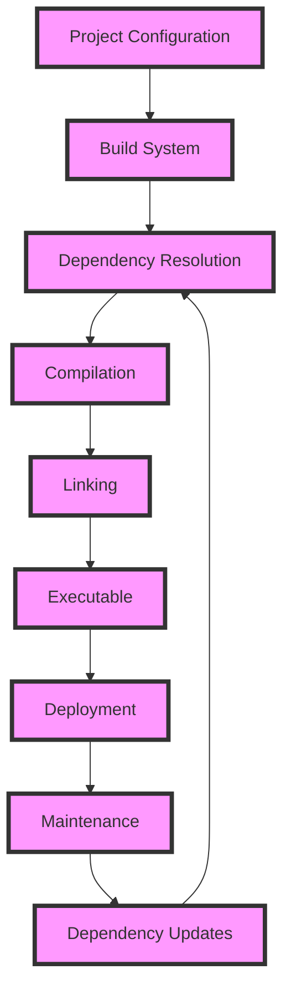

## Introduction
C++ is a powerful and versatile programming language, but one of its major drawbacks is the lack of a built-in package manager. This means that developers have to rely on third-party tools like CMake, Conan, or vcpkg to manage dependencies and libraries. In this section, we will explore the reasons behind this limitation and its implications on C++ development. **Note:** C++'s lack of a built-in package manager is a deliberate design choice, as the language's creators wanted to keep it as flexible and platform-independent as possible.

In real-world scenarios, the absence of a built-in package manager can lead to tedious and error-prone dependency management. For example, when working on a large project, developers may need to manually download, compile, and link multiple libraries, which can be time-consuming and prone to errors. **Tip:** Using a package manager like Conan or vcpkg can simplify this process and save developers a lot of time and effort.

## Core Concepts
To understand the drawbacks of C++'s lack of a built-in package manager, we need to define some key concepts:

* **Package manager:** A tool that automates the process of installing, updating, and managing dependencies and libraries.
* **Dependency management:** The process of managing the relationships between different libraries and packages in a project.
* **Library:** A collection of pre-written code that provides a specific functionality.

In C++, dependencies are typically managed using build systems like CMake or Meson, which generate build files for specific platforms. However, these build systems do not provide a built-in package manager, leaving developers to rely on external tools. **Warning:** Failing to properly manage dependencies can lead to build errors, runtime errors, or even security vulnerabilities.

## How It Works Internally
When a C++ project is built, the build system (e.g., CMake) generates a set of build files that specify how to compile and link the code. These build files typically include instructions for downloading and compiling dependencies, which can be time-consuming and prone to errors. **Note:** Some build systems, like CMake, provide features like `find_package` to simplify dependency management, but these features are not always reliable or efficient.

Here is a high-level overview of the build process:

1. **Configuration:** The build system generates a set of build files based on the project's configuration.
2. **Dependency resolution:** The build system resolves dependencies by downloading and compiling required libraries.
3. **Compilation:** The build system compiles the project's code using the resolved dependencies.
4. **Linking:** The build system links the compiled code with the required libraries.

## Code Examples
Here are three complete and runnable examples that demonstrate the use of CMake, Conan, and vcpkg for package management:

### Example 1: Basic CMake Usage
```cpp
// CMakeLists.txt
cmake_minimum_required(VERSION 3.10)
project(MyProject)

find_package(Boost 1.76.0 REQUIRED)

add_executable(my_executable main.cpp)
target_link_libraries(my_executable ${Boost_LIBRARIES})
```

```cpp
// main.cpp
#include <boost/asio.hpp>

int main() {
    boost::asio::io_context io_context;
    return 0;
}
```
This example demonstrates how to use CMake to find and link the Boost library.

### Example 2: Conan Package Management
```python
# conanfile.txt
from conans import ConanFile

class MyPackage(ConanFile):
    name = "my_package"
    version = "1.0"
    requires = "boost/1.76.0"

    def build(self):
        self.run("cmake .")
        self.run("cmake --build .")
```

```cpp
// main.cpp
#include <boost/asio.hpp>

int main() {
    boost::asio::io_context io_context;
    return 0;
}
```
This example demonstrates how to use Conan to manage dependencies and build a package.

### Example 3: vcpkg Package Management
```bash
# vcpkg install boost:x86-windows
```

```cpp
// main.cpp
#include <boost/asio.hpp>

int main() {
    boost::asio::io_context io_context;
    return 0;
}
```
This example demonstrates how to use vcpkg to install and use the Boost library.

## Visual Diagram

This diagram illustrates the build process and how dependencies are resolved and updated.

## Comparison
| Package Manager | Time Complexity | Space Complexity | Pros | Cons | Best For |
| --- | --- | --- | --- | --- | --- |
| CMake | O(n) | O(n) | Flexible, widely adopted | Steep learning curve, error-prone | Large-scale projects |
| Conan | O(n) | O(n) | Easy to use, fast | Limited community support | Small- to medium-scale projects |
| vcpkg | O(n) | O(n) | Easy to use, widely adopted | Limited flexibility | Windows-based projects |
| Meson | O(n) | O(n) | Fast, flexible | Limited community support | Linux-based projects |

## Real-world Use Cases
Here are three real-world examples of companies that use CMake, Conan, or vcpkg for package management:

* **Google:** Uses CMake for building and managing dependencies in its Chromium project.
* **Microsoft:** Uses vcpkg for package management in its Windows-based projects.
* **Palantir:** Uses Conan for package management in its data integration platform.

## Common Pitfalls
Here are four common mistakes that developers make when using CMake, Conan, or vcpkg:

* **Incorrect dependency versioning:** Failing to specify the correct version of a dependency can lead to build errors or runtime errors.
* **Insufficient testing:** Failing to test dependencies thoroughly can lead to bugs or security vulnerabilities.
* **Inconsistent package management:** Using multiple package managers in a single project can lead to conflicts and inconsistencies.
* **Lack of documentation:** Failing to document dependencies and package management processes can lead to maintenance issues and knowledge loss.

## Interview Tips
Here are three common interview questions related to package management in C++:

* **What is the difference between CMake and Conan?** A strong answer would highlight the differences in their design goals, usage, and features.
* **How do you manage dependencies in a large-scale C++ project?** A strong answer would describe a systematic approach to dependency management, including the use of package managers and build systems.
* **What are some common pitfalls in using vcpkg for package management?** A strong answer would identify common mistakes, such as incorrect dependency versioning or insufficient testing, and describe how to avoid them.

## Key Takeaways
Here are six key takeaways from this discussion:

* C++'s lack of a built-in package manager is a deliberate design choice.
* Package managers like CMake, Conan, and vcpkg can simplify dependency management.
* Incorrect dependency versioning can lead to build errors or runtime errors.
* Insufficient testing can lead to bugs or security vulnerabilities.
* Inconsistent package management can lead to conflicts and inconsistencies.
* Documentation is essential for maintaining knowledge and avoiding maintenance issues.