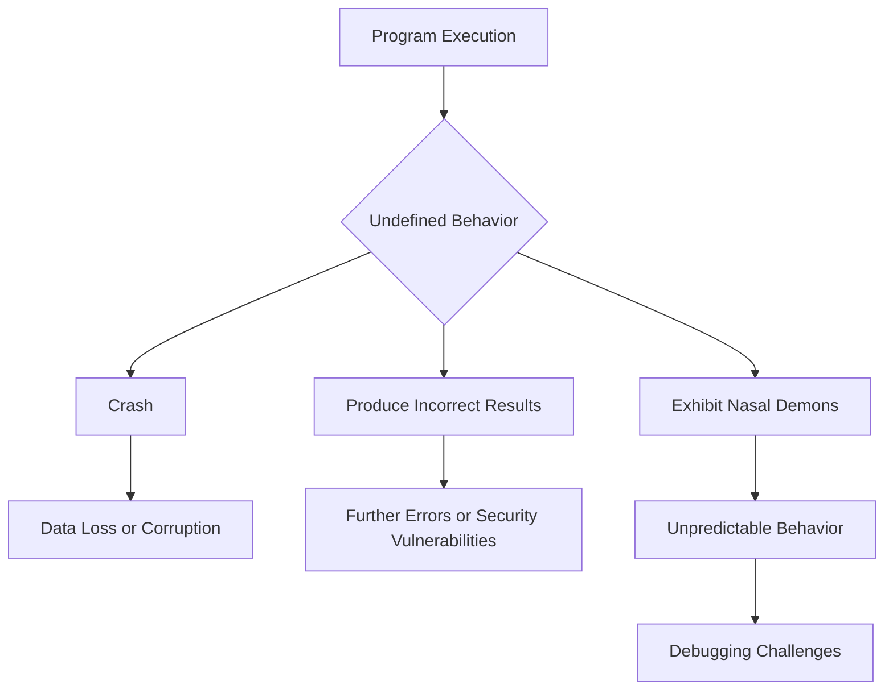

## Introduction
**Undefined behavior** is a term used in programming to describe a situation where the behavior of a program is not defined by the language specification. This can occur when a program encounters a situation that is not anticipated by the language designers, such as accessing an array out of bounds or dividing by zero. Undefined behavior is a serious issue because it can cause programs to crash, produce incorrect results, or even compromise security. In this section, we will explore the concept of undefined behavior, why it matters, and its real-world relevance.

Undefined behavior is a critical concern in systems programming, where the correctness and reliability of code are paramount. The C++ programming language, in particular, is notorious for its undefined behavior, which can arise from a variety of sources, including pointer arithmetic, array indexing, and integer overflow. **Warning:** ignoring undefined behavior can lead to catastrophic consequences, including data corruption, security vulnerabilities, and system crashes.

## Core Concepts
To understand undefined behavior, it is essential to grasp the concepts of **language specification**, **implementation-defined behavior**, and **undefined behavior**. The language specification defines the behavior of a program in terms of its syntax, semantics, and constraints. Implementation-defined behavior refers to situations where the language specification allows different implementations to behave differently. Undefined behavior, on the other hand, occurs when the language specification does not define the behavior of a program.

**Key terminology:**

* **Nasal demons**: a humorous term used to describe the unpredictable behavior of a program that exhibits undefined behavior.
* **Implementation-defined behavior**: behavior that is defined by the implementation, but not by the language specification.
* **Unspecified behavior**: behavior that is not defined by the language specification, but is not necessarily undefined.

> **Note:** understanding the differences between these concepts is crucial for writing reliable and correct code.

## How It Works Internally
When a program encounters undefined behavior, the compiler or runtime environment may generate code that produces unexpected results. This can occur due to various reasons, such as:

1. **Pointer arithmetic**: accessing memory locations outside the bounds of an array or buffer.
2. **Integer overflow**: exceeding the maximum value that can be represented by an integer type.
3. **Division by zero**: dividing a number by zero, which is undefined in mathematics.

The internal mechanics of undefined behavior can be complex and depend on the specific implementation. However, in general, the program may:

1. **Crash**: terminate abruptly, potentially causing data loss or corruption.
2. **Produce incorrect results**: generate incorrect or unexpected output, which can lead to further errors or security vulnerabilities.
3. **Exhibit nasal demons**: behave in unpredictable and seemingly random ways, making it challenging to diagnose and debug the issue.

## Code Examples
Here are three complete and runnable examples that demonstrate undefined behavior in C++:

### Example 1: Array Indexing
```cpp
#include <iostream>

int main() {
    int arr[5] = {1, 2, 3, 4, 5};
    std::cout << arr[10] << std::endl; // undefined behavior: accessing array out of bounds
    return 0;
}
```
> **Warning:** accessing an array out of bounds can lead to undefined behavior and potentially cause a crash or produce incorrect results.

### Example 2: Integer Overflow
```cpp
#include <iostream>

int main() {
    unsigned int x = UINT_MAX;
    x++; // undefined behavior: integer overflow
    std::cout << x << std::endl;
    return 0;
}
```
> **Tip:** using unsigned integers can help prevent integer overflows, but it is essential to consider the potential consequences of wrapping around to zero.

### Example 3: Division by Zero
```cpp
#include <iostream>

int main() {
    int x = 5;
    int y = 0;
    int result = x / y; // undefined behavior: division by zero
    std::cout << result << std::endl;
    return 0;
}
```
> **Interview:** can you explain why division by zero is undefined behavior in C++? How would you handle this situation in a real-world application?

## Visual Diagram

The diagram illustrates the potential consequences of undefined behavior, including crashes, incorrect results, and nasal demons.

## Comparison
| Approach | Time Complexity | Space Complexity | Pros | Cons | Best For |
| --- | --- | --- | --- | --- | --- |
| Bounds Checking | O(1) | O(1) | Prevents undefined behavior | Performance overhead | Safety-critical systems |
| Integer Overflow Handling | O(1) | O(1) | Prevents integer overflows | Complexity | Cryptographic applications |
| Error Handling | O(1) | O(1) | Catches and handles errors | Code bloat | Robust and reliable systems |
| Code Review | O(n) | O(1) | Detects undefined behavior | Time-consuming | High-quality codebases |

## Real-world Use Cases
1. **NASA's Mars Climate Orbiter**: a software bug caused the spacecraft to crash into Mars due to a unit conversion error, which led to undefined behavior.
2. **Heartbleed Bug**: a vulnerability in the OpenSSL library allowed attackers to exploit undefined behavior and steal sensitive data.
3. **Google's Chrome Browser**: the browser's address space layout randomization (ASLR) feature helps prevent undefined behavior by randomizing the location of code and data in memory.

## Common Pitfalls
1. **Ignoring compiler warnings**: compilers often warn about potential undefined behavior, but ignoring these warnings can lead to crashes or security vulnerabilities.
2. **Using deprecated functions**: deprecated functions may exhibit undefined behavior or have been removed from the language specification.
3. **Not checking for errors**: failing to check for errors or handle exceptions can lead to undefined behavior and make debugging more challenging.
4. **Using uninitialized variables**: using uninitialized variables can cause undefined behavior and produce incorrect results.

## Interview Tips
1. **What is undefined behavior, and why is it a concern in C++?**: a strong answer should explain the concept of undefined behavior, its potential consequences, and how to prevent it.
2. **How would you handle a division by zero error in a real-world application?**: a strong answer should describe a robust error handling mechanism, such as using try-catch blocks or checking for zero before dividing.
3. **Can you explain the difference between implementation-defined behavior and undefined behavior?**: a strong answer should clearly distinguish between the two concepts and provide examples of each.

## Key Takeaways
* Undefined behavior is a serious concern in systems programming that can cause crashes, produce incorrect results, or compromise security.
* Understanding the language specification, implementation-defined behavior, and undefined behavior is crucial for writing reliable and correct code.
* Bounds checking, integer overflow handling, and error handling are essential techniques for preventing undefined behavior.
* Code review and testing are critical for detecting and preventing undefined behavior.
* Ignoring compiler warnings, using deprecated functions, and not checking for errors are common pitfalls that can lead to undefined behavior.
* Using unsigned integers, checking for zero before dividing, and handling exceptions are best practices for preventing undefined behavior.