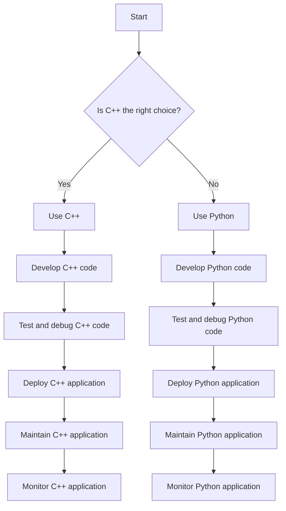

## Introduction
C++ is a high-performance, compiled, general-purpose programming language that was developed by Bjarne Stroustrup as an extension of the C programming language. It was designed to provide a balance between efficiency, flexibility, and safety, making it a popular choice for systems programming, game development, and high-performance applications. However, despite its many strengths, C++ is not the best choice for every project. In this article, we will explore when not to use C++ and why other languages like Python might be a better fit for certain tasks.

C++ is a powerful language that provides direct access to hardware resources, making it an excellent choice for applications that require low-level memory management, multithreading, and concurrency. However, this power comes at a cost, as C++ can be a complex and error-prone language to work with, especially for beginners. Additionally, C++ is not well-suited for tasks that require rapid development, prototyping, and scripting, as its compiled nature and lack of built-in support for dynamic typing can make it slower to develop and test code.

> **Note:** C++ is a great language for building high-performance applications, but it may not be the best choice for tasks that require rapid development, prototyping, and scripting.

## Core Concepts
Before we dive into the details of when not to use C++, let's cover some core concepts that are essential to understanding the language. C++ is an object-oriented language that supports encapsulation, inheritance, and polymorphism, making it well-suited for building complex, modular systems. C++ also provides a range of features that support low-level memory management, including pointers, references, and operator overloading.

However, C++'s lack of built-in support for dynamic typing and garbage collection can make it more difficult to work with than languages like Python, which provide these features out of the box. Additionally, C++'s compiled nature can make it slower to develop and test code, as changes to the code require a full recompilation of the program.

> **Warning:** C++'s lack of built-in support for dynamic typing and garbage collection can make it more error-prone and difficult to work with, especially for beginners.

## How It Works Internally
C++ is a compiled language, which means that the code is first compiled into an intermediate form called object code, and then linked into an executable file that can be run directly on the hardware. This compilation step can take time, especially for large programs, and can make it slower to develop and test code.

When a C++ program is compiled, the compiler translates the source code into machine code that can be executed directly by the CPU. This machine code is specific to the target hardware platform, which means that C++ programs may not be portable across different platforms without recompilation.

> **Tip:** To improve the performance of C++ code, it's essential to understand how the compiler optimizes the code and how to write code that is optimized for the target hardware platform.

## Code Examples
Here are three complete and runnable examples of C++ code that demonstrate its capabilities and limitations:
### Example 1: Basic C++ Program
```cpp
#include <iostream>

int main() {
    std::cout << "Hello, World!" << std::endl;
    return 0;
}
```
This example demonstrates a basic C++ program that prints "Hello, World!" to the console.

### Example 2: C++ Class Example
```cpp
#include <iostream>
#include <string>

class Person {
public:
    Person(std::string name, int age) : name_(name), age_(age) {}

    void printInfo() {
        std::cout << "Name: " << name_ << std::endl;
        std::cout << "Age: " << age_ << std::endl;
    }

private:
    std::string name_;
    int age_;
};

int main() {
    Person person("John", 30);
    person.printInfo();
    return 0;
}
```
This example demonstrates a C++ class that represents a person with a name and age.

### Example 3: C++ Template Example
```cpp
#include <iostream>

template <typename T>
T max(T a, T b) {
    return (a > b) ? a : b;
}

int main() {
    int intMax = max(10, 20);
    double doubleMax = max(10.5, 20.5);
    std::cout << "Int Max: " << intMax << std::endl;
    std::cout << "Double Max: " << doubleMax << std::endl;
    return 0;
}
```
This example demonstrates a C++ template function that returns the maximum of two values.

## Visual Diagram

This diagram illustrates the decision-making process for choosing between C++ and Python for a particular project.

## Comparison
Here is a comparison table that highlights the differences between C++ and Python:
| Language | Time Complexity | Space Complexity | Pros | Cons | Best For |
| --- | --- | --- | --- | --- | --- |
| C++ | O(1) - O(n) | O(1) - O(n) | High performance, low-level memory management | Complex, error-prone | Systems programming, game development, high-performance applications |
| Python | O(1) - O(n) | O(1) - O(n) | Rapid development, dynamic typing, ease of use | Slow performance, limited multithreading | Scripting, data science, web development |
| Java | O(1) - O(n) | O(1) - O(n) | Platform independence, object-oriented, large community | Slow performance, verbose syntax | Android app development, web development, enterprise software |
| JavaScript | O(1) - O(n) | O(1) - O(n) | Dynamic typing, first-class functions, client-side scripting | Limited multithreading, security concerns | Web development, client-side scripting, mobile app development |

## Real-world Use Cases
Here are three real-world use cases that demonstrate the strengths and weaknesses of C++:
1. **Google Chrome**: Google Chrome is a web browser that uses C++ for its rendering engine, which provides high performance and low-level memory management.
2. **Python Data Science**: Python is a popular language for data science and machine learning, thanks to its ease of use, dynamic typing, and extensive libraries like NumPy and pandas.
3. **Facebook**: Facebook uses a combination of C++ and Python for its backend infrastructure, with C++ providing high performance and low-level memory management, and Python providing rapid development and ease of use.

> **Interview:** What are some scenarios where you would choose to use C++ over Python, and vice versa? How do you determine the best language for a particular project?

## Common Pitfalls
Here are four common pitfalls to avoid when working with C++:
1. **Pointer Arithmetic**: Pointer arithmetic can be error-prone and difficult to debug, especially for beginners.
2. **Memory Leaks**: Memory leaks can occur when C++ code fails to release memory that is no longer needed, leading to performance issues and crashes.
3. **Null Pointer Dereferences**: Null pointer dereferences can occur when C++ code attempts to access memory through a null pointer, leading to crashes and security vulnerabilities.
4. **Buffer Overflows**: Buffer overflows can occur when C++ code writes more data to a buffer than it can hold, leading to crashes and security vulnerabilities.

> **Warning:** C++'s lack of built-in support for dynamic typing and garbage collection can make it more error-prone and difficult to work with, especially for beginners.

## Interview Tips
Here are three common interview questions that test a candidate's knowledge of C++ and Python:
1. **What are the advantages and disadvantages of using C++ over Python?**
	* Weak answer: C++ is faster and more efficient, but Python is easier to use and more flexible.
	* Strong answer: C++ provides high performance and low-level memory management, making it well-suited for systems programming and high-performance applications. However, Python provides rapid development, dynamic typing, and ease of use, making it well-suited for scripting, data science, and web development.
2. **How do you determine the best language for a particular project?**
	* Weak answer: I choose the language that I'm most familiar with.
	* Strong answer: I consider the project's requirements, including performance, scalability, and development time. I also consider the team's expertise and the project's maintainability and scalability.
3. **What are some common pitfalls to avoid when working with C++?**
	* Weak answer: I try to avoid using pointers and memory management.
	* Strong answer: I'm aware of common pitfalls like pointer arithmetic, memory leaks, null pointer dereferences, and buffer overflows. I use tools like Valgrind and AddressSanitizer to detect and fix these issues.

## Key Takeaways
Here are ten key takeaways to remember:
* C++ is a high-performance, compiled language that provides low-level memory management and multithreading.
* Python is a rapid development language that provides dynamic typing, ease of use, and extensive libraries.
* C++ is well-suited for systems programming, game development, and high-performance applications.
* Python is well-suited for scripting, data science, and web development.
* C++'s lack of built-in support for dynamic typing and garbage collection can make it more error-prone and difficult to work with.
* Python's dynamic typing and garbage collection can make it slower and less efficient than C++.
* C++'s compiled nature can make it slower to develop and test code.
* Python's interpreted nature can make it faster to develop and test code.
* C++'s performance advantages can be offset by its complexity and error-proneness.
* Python's ease of use and flexibility can make it a better choice for rapid development and prototyping.