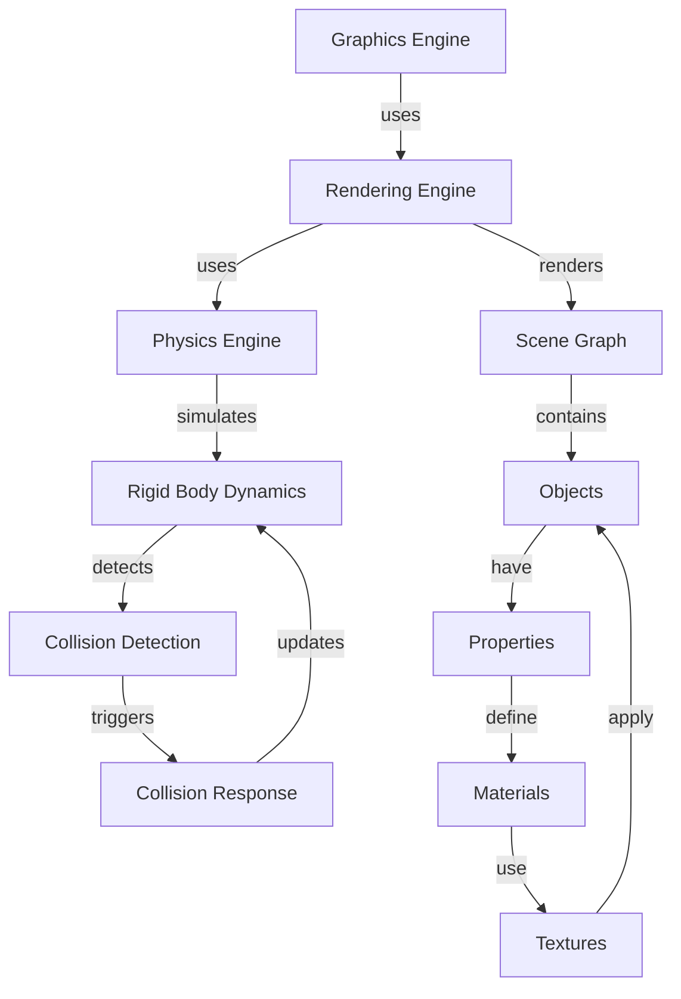

## Introduction
Graphics, rendering, and physics engines are crucial components of modern computer graphics, game development, and simulation software. These engines enable the creation of realistic and immersive experiences by simulating the behavior of objects in a virtual environment. In this study guide, we will explore the concepts, terminology, and implementation details of graphics, rendering, and physics engines, with a focus on when to use each. We will also examine real-world examples, common pitfalls, and interview tips to help you master these topics.

> **Note:** Understanding the differences between graphics, rendering, and physics engines is essential for building high-performance and realistic applications. Each engine has its strengths and weaknesses, and choosing the right one depends on the specific requirements of your project.

## Core Concepts
To understand when to use graphics, rendering, and physics engines, we need to define each concept and explore their relationships.

* **Graphics Engine:** A graphics engine is responsible for rendering 2D and 3D graphics, handling user input, and managing the application's window and rendering context. Examples of graphics engines include DirectX, OpenGL, and Vulkan.
* **Rendering Engine:** A rendering engine is a component of a graphics engine that handles the rendering of 3D scenes. It takes care of tasks such as scene graph management, lighting, shading, and texture mapping. Examples of rendering engines include Unity's rendering engine and Unreal Engine's rendering engine.
* **Physics Engine:** A physics engine is a component of a game or simulation engine that simulates the behavior of objects in a virtual environment. It handles tasks such as collision detection, rigid body dynamics, and soft body simulation. Examples of physics engines include PhysX, Havok, and Bullet Physics.

> **Tip:** When choosing a graphics engine, consider the platform you're targeting, the level of complexity you need, and the performance requirements of your application.

## How It Works Internally
To understand how graphics, rendering, and physics engines work internally, let's examine the following steps:

1. **Scene Graph Management:** The rendering engine manages the scene graph, which represents the 3D scene as a hierarchical structure of objects.
2. **Lighting and Shading:** The rendering engine applies lighting and shading effects to the scene, using techniques such as diffuse and specular lighting, ambient occlusion, and screen-space ambient occlusion.
3. **Texture Mapping:** The rendering engine applies textures to the scene, using techniques such as texture mapping, normal mapping, and specular mapping.
4. **Collision Detection:** The physics engine detects collisions between objects in the scene, using techniques such as sphere casting, ray casting, and GJK (Gilbert-Johnson-Keerthi) collision detection.
5. **Rigid Body Dynamics:** The physics engine simulates the motion of rigid bodies in the scene, using techniques such as Euler integration, Verlet integration, and impulse-based dynamics.

> **Warning:** Optimizing graphics, rendering, and physics engines for performance can be challenging. Be aware of common pitfalls such as over-drawing, unnecessary computations, and memory leaks.

## Code Examples
Here are three complete and runnable code examples that demonstrate the use of graphics, rendering, and physics engines:

### Example 1: Basic Graphics Engine (OpenGL)
```cpp
#include <GL/glew.h>
#include <GLFW/glfw3.h>

int main() {
    // Initialize GLFW and create a window
    glfwInit();
    GLFWwindow* window = glfwCreateWindow(800, 600, "Graphics Engine", NULL, NULL);

    // Create a graphics context and make it current
    glfwMakeContextCurrent(window);
    glewInit();

    // Render a triangle
    while (!glfwWindowShouldClose(window)) {
        glClear(GL_COLOR_BUFFER_BIT);
        glBegin(GL_TRIANGLES);
        glVertex2f(-0.5f, -0.5f);
        glVertex2f(0.5f, -0.5f);
        glVertex2f(0.0f, 0.5f);
        glEnd();
        glfwSwapBuffers(window);
        glfwPollEvents();
    }

    // Clean up
    glfwTerminate();
    return 0;
}
```

### Example 2: Real-World Rendering Engine (Unity)
```csharp
using UnityEngine;

public class RenderExample : MonoBehaviour
{
    private Material material;

    void Start()
    {
        // Create a new material
        material = new Material(Shader.Find("Standard"));
    }

    void Update()
    {
        // Render a cube
        GameObject cube = GameObject.CreatePrimitive(PrimitiveType.Cube);
        cube.transform.position = new Vector3(0, 0, 0);
        cube.GetComponent<Renderer>().material = material;
    }
}
```

### Example 3: Advanced Physics Engine (PhysX)
```cpp
#include <PxPhysics.h>

int main() {
    // Initialize PhysX and create a foundation
    PxInitExtensions();
    PxFoundation* foundation = PxCreateFoundation(PX_PHYSICS_VERSION, PxDefaultAllocator(), PxDefaultErrorCallback());

    // Create a physics engine and a scene
    PxCpuDispatcher* dispatcher = PxDefaultCpuDispatcherCreate(2);
    PxPhysics* physics = PxCreatePhysics(PX_PHYSICS_VERSION, *foundation, PxTolerancesScale(), true);
    PxScene* scene = physics->createScene(PxDefaultSimulationFilterShader(), dispatcher);

    // Create a rigid body and add it to the scene
    PxRigidDynamic* body = PxCreateDynamic(*physics, PxTransform(PxVec3(0, 0, 0)), PxBoxGeometry(PxVec3(1, 1, 1)), PxDefaultMaterial());
    scene->addActor(*body);

    // Simulate the physics
    scene->simulate(1.0f / 60.0f);

    // Clean up
    scene->release();
    physics->release();
    foundation->release();
    return 0;
}
```

## Visual Diagram

The diagram illustrates the relationships between the graphics engine, rendering engine, physics engine, and scene graph. The graphics engine uses the rendering engine, which in turn uses the physics engine to simulate the behavior of objects in the scene. The physics engine detects collisions and triggers collision responses, which update the rigid body dynamics. The rendering engine renders the scene graph, which contains objects with properties, materials, and textures.

> **Interview:** Can you explain the differences between a graphics engine, rendering engine, and physics engine? How do they interact with each other?

## Comparison
| Engine | Time Complexity | Space Complexity | Pros | Cons |
| --- | --- | --- | --- | --- |
| Graphics Engine | O(n) | O(n) | Handles user input, manages window and rendering context | Limited control over rendering pipeline |
| Rendering Engine | O(n^2) | O(n) | Handles rendering of 3D scenes, applies lighting and shading effects | Can be slow for complex scenes |
| Physics Engine | O(n^3) | O(n) | Simulates behavior of objects in virtual environment, detects collisions | Can be slow for large scenes, requires tuning of simulation parameters |

## Real-world Use Cases
Here are three real-world examples of graphics, rendering, and physics engines in use:

* **Game Development:** The Unreal Engine uses a combination of graphics, rendering, and physics engines to create realistic and immersive game worlds. For example, the game "Fortnite" uses Unreal Engine's rendering engine to render its 3D scenes, and its physics engine to simulate the behavior of objects in the game world.
* **Film and Animation:** The Blender 3D creation software uses a graphics engine to render 3D scenes, and a physics engine to simulate the behavior of objects in the scene. For example, the film "Spider-Man: Into the Spider-Verse" used Blender to create its 3D animation.
* **Scientific Simulation:** The OpenFOAM software uses a physics engine to simulate the behavior of fluids and solids in various engineering applications, such as aerospace and automotive engineering. For example, the NASA uses OpenFOAM to simulate the behavior of fluids in rocket engines.

## Common Pitfalls
Here are four common mistakes to avoid when using graphics, rendering, and physics engines:

* **Over-Drawing:** Drawing too many objects in the scene can lead to performance issues. Use techniques such as level of detail (LOD) and occlusion culling to reduce the number of objects drawn.
* **Unnecessary Computations:** Performing unnecessary computations can slow down the simulation. Use techniques such as caching and memoization to reduce the number of computations.
* **Memory Leaks:** Failing to release memory allocated by the engine can lead to memory leaks. Use techniques such as smart pointers and memory pools to manage memory allocation.
* **Incorrect Simulation Parameters:** Using incorrect simulation parameters can lead to unrealistic behavior. Use techniques such as experimentation and validation to tune the simulation parameters.

## Interview Tips
Here are three common interview questions related to graphics, rendering, and physics engines, along with sample answers:

* **What is the difference between a graphics engine and a rendering engine?**
	+ Weak answer: "A graphics engine is used for rendering, while a rendering engine is used for physics."
	+ Strong answer: "A graphics engine handles user input, manages the window and rendering context, and provides a high-level interface for rendering. A rendering engine, on the other hand, handles the rendering of 3D scenes, applies lighting and shading effects, and provides a low-level interface for rendering."
* **How do you optimize the performance of a physics engine?**
	+ Weak answer: "I would use a faster CPU."
	+ Strong answer: "I would use techniques such as caching, memoization, and level of detail to reduce the number of computations and objects simulated. I would also use parallel processing and multi-threading to take advantage of multi-core CPUs."
* **What is the purpose of a scene graph in a rendering engine?**
	+ Weak answer: "A scene graph is used for rendering."
	+ Strong answer: "A scene graph is a data structure that represents the 3D scene as a hierarchical structure of objects. It provides a way to manage the scene, optimize rendering, and perform tasks such as collision detection and physics simulation."

## Key Takeaways
Here are ten key takeaways to remember:

* **Graphics Engine:** Handles user input, manages window and rendering context.
* **Rendering Engine:** Handles rendering of 3D scenes, applies lighting and shading effects.
* **Physics Engine:** Simulates behavior of objects in virtual environment, detects collisions.
* **Scene Graph:** Represents 3D scene as a hierarchical structure of objects.
* **Level of Detail (LOD):** Technique used to reduce number of objects drawn.
* **Occlusion Culling:** Technique used to reduce number of objects drawn.
* **Caching:** Technique used to reduce number of computations.
* **Memoization:** Technique used to reduce number of computations.
* **Parallel Processing:** Technique used to take advantage of multi-core CPUs.
* **Multi-Threading:** Technique used to take advantage of multi-core CPUs.