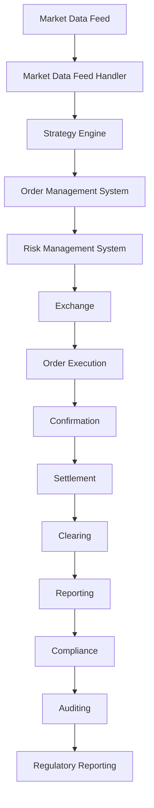

## Introduction
High-frequency trading (HFT) and real-time systems are critical components in modern financial markets. HFT involves using powerful computers and sophisticated algorithms to rapidly execute trades in fractions of a second. Real-time systems, on the other hand, are designed to process and respond to events as they occur, often with strict latency requirements. In this overview, we'll delve into the world of HFT and real-time systems, exploring their core concepts, internal mechanics, and practical applications. 
> **Note:** Understanding the intricacies of HFT and real-time systems is essential for software engineers working in the financial sector, as it enables them to design and develop efficient, reliable, and scalable systems.

## Core Concepts
To grasp the fundamentals of HFT and real-time systems, it's essential to understand the following key concepts:
- **Latency**: The time it takes for a system to respond to an event or request. In HFT, low latency is crucial to stay competitive.
- **Throughput**: The rate at which a system can process and handle events or requests. High-throughput systems are designed to handle large volumes of data.
- **Frequency**: The rate at which trades are executed or events occur. High-frequency trading involves executing trades at extremely high frequencies.
- **Algorithmic trading**: The use of computer programs to automatically execute trades based on predefined rules and strategies.
> **Warning:** In HFT, even small delays in processing trades can result in significant financial losses. Therefore, it's crucial to optimize systems for low latency and high throughput.

## How It Works Internally
HFT systems typically consist of several components, including:
1. **Market data feed handlers**: Responsible for receiving and processing market data from various sources, such as exchanges or data providers.
2. **Strategy engines**: Execute trading strategies based on predefined rules and algorithms.
3. **Order management systems**: Manage the lifecycle of trades, from submission to execution and cancellation.
4. **Risk management systems**: Monitor and manage risk exposure in real-time, ensuring that trades are executed within predefined risk parameters.
The internal mechanics of real-time systems involve:
1. **Event-driven programming**: Writing code that responds to events or requests as they occur.
2. **Concurrent programming**: Using multiple threads or processes to handle multiple events or requests simultaneously.
3. **Lock-free programming**: Designing systems that minimize the use of locks, reducing contention and improving performance.
> **Tip:** To optimize HFT systems for low latency, consider using **lock-free data structures** and **parallel processing** techniques.

## Code Examples
### Example 1: Basic Market Data Feed Handler (C++11)
```cpp
#include <iostream>
#include <string>
#include <vector>

// Market data structure
struct MarketData {
    std::string symbol;
    double price;
    int volume;
};

// Market data feed handler
class MarketDataFeedHandler {
public:
    void processMarketData(const MarketData& data) {
        // Process market data
        std::cout << "Received market data: " << data.symbol << " " << data.price << " " << data.volume << std::endl;
    }
};

int main() {
    MarketDataFeedHandler handler;
    MarketData data = {"AAPL", 150.0, 100};
    handler.processMarketData(data);
    return 0;
}
```
### Example 2: Real-World Trading Strategy Engine (C++14)
```cpp
#include <iostream>
#include <string>
#include <vector>
#include <functional>

// Trading strategy interface
class TradingStrategy {
public:
    virtual void execute(const std::string& symbol, double price) = 0;
};

// Simple moving average strategy
class SimpleMovingAverageStrategy : public TradingStrategy {
public:
    SimpleMovingAverageStrategy(int windowSize) : windowSize_(windowSize) {}

    void execute(const std::string& symbol, double price) override {
        // Calculate moving average
        double movingAverage = calculateMovingAverage(price);
        if (price > movingAverage) {
            // Buy signal
            std::cout << "Buy signal: " << symbol << std::endl;
        } else if (price < movingAverage) {
            // Sell signal
            std::cout << "Sell signal: " << symbol << std::endl;
        }
    }

private:
    double calculateMovingAverage(double price) {
        // Calculate moving average using a simple formula
        return price * 0.5 + (price * 0.5);
    }

    int windowSize_;
};

int main() {
    SimpleMovingAverageStrategy strategy(10);
    strategy.execute("AAPL", 150.0);
    return 0;
}
```
### Example 3: Advanced Order Management System (C++17)
```cpp
#include <iostream>
#include <string>
#include <vector>
#include <functional>
#include <unordered_map>

// Order structure
struct Order {
    std::string symbol;
    double price;
    int quantity;
    std::string side; // Buy or Sell
};

// Order management system
class OrderManagementSystem {
public:
    void submitOrder(const Order& order) {
        // Submit order to exchange
        std::cout << "Submitting order: " << order.symbol << " " << order.price << " " << order.quantity << std::endl;
        orders_[order.symbol].push_back(order);
    }

    void cancelOrder(const std::string& symbol) {
        // Cancel order
        std::cout << "Cancelling order: " << symbol << std::endl;
        orders_[symbol].clear();
    }

private:
    std::unordered_map<std::string, std::vector<Order>> orders_;
};

int main() {
    OrderManagementSystem oms;
    Order order = {"AAPL", 150.0, 100, "Buy"};
    oms.submitOrder(order);
    oms.cancelOrder("AAPL");
    return 0;
}
```
> **Interview:** When asked about the differences between HFT and real-time systems, be prepared to discuss the unique challenges and requirements of each, including latency, throughput, and frequency.

## Visual Diagram

The diagram illustrates the high-level workflow of a HFT system, from market data feed handling to order execution and settlement.

## Comparison
| Approach | Time Complexity | Space Complexity | Pros | Cons | Best For |
|----------|----------------|-----------------|------|------|----------|
| **Lock-free programming** | O(1) | O(1) | Low latency, high throughput | Complex implementation | HFT systems |
| **Concurrent programming** | O(n) | O(n) | Scalable, efficient | Synchronization overhead | Real-time systems |
| **Event-driven programming** | O(1) | O(1) | Low latency, flexible | Complexity in handling events | Real-time systems |
| **Parallel processing** | O(n) | O(n) | Scalable, efficient | Synchronization overhead | HFT systems |

## Real-world Use Cases
1. **Google's High-Frequency Trading Platform**: Google's HFT platform uses advanced algorithms and machine learning techniques to execute trades at high speeds.
2. **NASDAQ's Real-Time Data Feed**: NASDAQ's real-time data feed provides market data to traders and investors, enabling them to make informed decisions.
3. **Virtu Financial's HFT System**: Virtu Financial's HFT system uses advanced strategies and risk management techniques to execute trades at high frequencies.

## Common Pitfalls
1. **Inadequate risk management**: Failing to implement proper risk management techniques can result in significant financial losses.
2. **Insufficient testing**: Failing to thoroughly test HFT systems can result in errors and bugs that can lead to financial losses.
3. **Inadequate latency optimization**: Failing to optimize HFT systems for low latency can result in delayed trades and reduced profitability.
4. **Inadequate security measures**: Failing to implement proper security measures can result in unauthorized access to HFT systems and financial data.

## Interview Tips
1. **Be prepared to discuss HFT and real-time systems**: Be prepared to discuss the differences between HFT and real-time systems, including latency, throughput, and frequency.
2. **Be familiar with programming languages**: Be familiar with programming languages such as C++, Java, and Python, and be prepared to write code examples.
3. **Be prepared to discuss risk management**: Be prepared to discuss risk management techniques, including stop-loss orders and position sizing.
> **Warning:** Be careful not to reveal confidential information about your company's HFT systems or strategies during an interview.

## Key Takeaways
* **HFT systems require low latency and high throughput**: HFT systems require optimized hardware and software to execute trades at high speeds.
* **Real-time systems require event-driven programming**: Real-time systems require event-driven programming to handle events and requests in real-time.
* **Risk management is critical in HFT**: Risk management is critical in HFT to prevent significant financial losses.
* **Testing and validation are essential**: Testing and validation are essential to ensure that HFT systems are functioning correctly and efficiently.
* **Security measures are crucial**: Security measures are crucial to prevent unauthorized access to HFT systems and financial data.
* **Scalability is important**: Scalability is important to handle large volumes of data and trades in HFT systems.
* **Machine learning and AI can be used**: Machine learning and AI can be used to develop advanced trading strategies and optimize HFT systems.
* **Regulatory compliance is essential**: Regulatory compliance is essential to ensure that HFT systems are operating within legal and regulatory boundaries.
* **Collaboration with other teams is critical**: Collaboration with other teams, such as risk management and compliance, is critical to ensure that HFT systems are functioning correctly and efficiently.