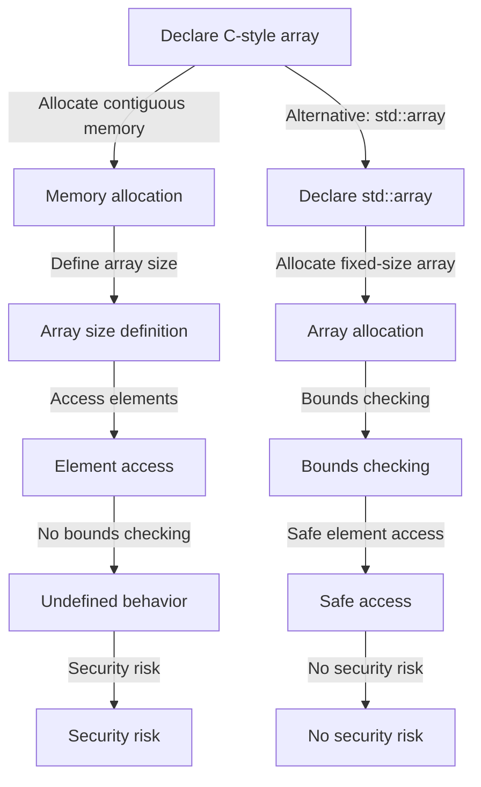

## Introduction
Arrays are a fundamental data structure in programming, and C++ provides two primary ways to work with arrays: C-style arrays and `std::array`. Understanding the differences between these two approaches is crucial for any C++ developer. In this section, we will explore the importance of arrays, their real-world relevance, and why every engineer needs to know about them.

Arrays are essential in programming because they allow us to store and manipulate large amounts of data efficiently. They are widely used in various fields, such as scientific computing, data analysis, and game development. In C++, arrays are used to implement dynamic memory allocation, which is a critical aspect of the language.

> **Note:** C-style arrays are a relic of the C language, and while they are still widely used in C++, they have some significant drawbacks compared to `std::array`. In particular, C-style arrays do not provide bounds checking, which can lead to buffer overflows and other security issues.

## Core Concepts
In this section, we will define the core concepts related to arrays in C++.

*   **C-style array**: A C-style array is a contiguous block of memory that stores elements of the same type. It is defined using the `type name[size]` syntax, where `type` is the data type of the elements, `name` is the name of the array, and `size` is the number of elements.
*   **`std::array`**: `std::array` is a class template that provides a fixed-size array with bounds checking and other safety features. It is defined using the `std::array<type, size>` syntax, where `type` is the data type of the elements and `size` is the number of elements.
*   **Element**: An element is a single item stored in an array.
*   **Index**: An index is a numerical value that identifies the position of an element in an array.

> **Warning:** C-style arrays do not perform bounds checking, which means that accessing an element outside the array's bounds can lead to undefined behavior.

## How It Works Internally
In this section, we will delve into the internal mechanics of C-style arrays and `std::array`.

When you declare a C-style array, the compiler allocates a contiguous block of memory to store the elements. The size of the array is fixed at compile-time, and the compiler performs no bounds checking.

On the other hand, `std::array` provides a safer and more flexible way to work with arrays. When you declare a `std::array`, the compiler allocates a fixed-size array with bounds checking. The `std::array` class template provides various member functions, such as `at()`, `front()`, and `back()`, which allow you to access elements safely.

Here's an example of how C-style arrays and `std::array` work internally:
```cpp
// C-style array
int cStyleArray[5];
// The compiler allocates a contiguous block of memory:
//  cStyleArray[0]  cStyleArray[1]  cStyleArray[2]  cStyleArray[3]  cStyleArray[4]

// std::array
std::array<int, 5> stdArray;
// The compiler allocates a fixed-size array with bounds checking:
//  stdArray[0]  stdArray[1]  stdArray[2]  stdArray[3]  stdArray[4]
```
> **Tip:** When working with arrays, it's essential to consider the trade-offs between performance and safety. C-style arrays provide better performance but lack bounds checking, while `std::array` provides safer access to elements but may incur a small performance overhead.

## Code Examples
In this section, we will provide three complete and runnable code examples that demonstrate the use of C-style arrays and `std::array`.

### Example 1: Basic C-style Array
```cpp
#include <iostream>

int main() {
    int cStyleArray[5] = {1, 2, 3, 4, 5};
    for (int i = 0; i < 5; i++) {
        std::cout << cStyleArray[i] << " ";
    }
    return 0;
}
```
This example demonstrates how to declare and initialize a C-style array.

### Example 2: `std::array` with Bounds Checking
```cpp
#include <array>
#include <iostream>

int main() {
    std::array<int, 5> stdArray = {1, 2, 3, 4, 5};
    try {
        std::cout << stdArray.at(10) << std::endl; // Throws an exception
    } catch (const std::out_of_range& e) {
        std::cerr << e.what() << std::endl;
    }
    return 0;
}
```
This example demonstrates how to use `std::array` with bounds checking.

### Example 3: Advanced `std::array` Usage
```cpp
#include <array>
#include <iostream>

int main() {
    std::array<int, 5> stdArray = {1, 2, 3, 4, 5};
    // Use the front() and back() member functions
    std::cout << stdArray.front() << " " << stdArray.back() << std::endl;
    // Use the size() member function
    std::cout << stdArray.size() << std::endl;
    return 0;
}
```
This example demonstrates how to use the `front()`, `back()`, and `size()` member functions of `std::array`.

## Visual Diagram

This diagram illustrates the differences between C-style arrays and `std::array` in terms of memory allocation, bounds checking, and security risks.

## Comparison
The following table compares C-style arrays and `std::array` in terms of their characteristics:
| Approach | Time Complexity | Space Complexity | Pros | Cons | Best For |
| --- | --- | --- | --- | --- | --- |
| C-style array | O(1) access time | O(n) space complexity | Better performance, less overhead | No bounds checking, security risks | Performance-critical code, legacy systems |
| `std::array` | O(1) access time | O(n) space complexity | Safer access, bounds checking | Small performance overhead, fixed size | General-purpose programming, safety-critical code |

> **Interview:** When asked about the differences between C-style arrays and `std::array`, be sure to mention the trade-offs between performance and safety. Emphasize that `std::array` provides safer access to elements but may incur a small performance overhead.

## Real-world Use Cases
Here are three real-world examples of using arrays in C++:

1.  **Scientific computing:** In scientific computing, arrays are used to store large amounts of data, such as matrices and vectors. For example, the BLAS (Basic Linear Algebra Subprograms) library uses arrays to perform linear algebra operations.
2.  **Game development:** In game development, arrays are used to store game data, such as 3D models, textures, and audio samples. For example, the Unreal Engine uses arrays to store game data and perform physics simulations.
3.  **Data analysis:** In data analysis, arrays are used to store and manipulate large datasets, such as time series data and statistical models. For example, the pandas library in Python uses arrays to store and manipulate data.

> **Tip:** When working with large datasets, consider using arrays or other data structures that provide efficient access and manipulation of data.

## Common Pitfalls
Here are four common pitfalls to avoid when working with arrays in C++:

1.  **Buffer overflows:** Buffer overflows occur when you access an element outside the bounds of an array. This can lead to undefined behavior and security risks.
2.  **Null pointer dereferences:** Null pointer dereferences occur when you attempt to access an element through a null pointer. This can lead to crashes and security risks.
3.  **Data corruption:** Data corruption occurs when you modify an element in an array unintentionally. This can lead to incorrect results and security risks.
4.  **Memory leaks:** Memory leaks occur when you allocate memory for an array but fail to deallocate it. This can lead to memory waste and performance issues.

Here's an example of how to avoid buffer overflows when working with C-style arrays:
```cpp
// Wrong way:
int cStyleArray[5];
cStyleArray[10] = 5; // Buffer overflow

// Right way:
int cStyleArray[5];
if (10 < 5) {
    cStyleArray[10] = 5; // This will not compile
} else {
    std::cerr << "Buffer overflow!" << std::endl;
}
```
> **Warning:** Always check the bounds of an array before accessing an element to avoid buffer overflows and other security risks.

## Interview Tips
Here are three common interview questions related to arrays in C++:

1.  **What is the difference between C-style arrays and `std::array`?**
    *   Weak answer: "I'm not sure."
    *   Strong answer: "C-style arrays are a relic of the C language and lack bounds checking, while `std::array` provides safer access to elements but may incur a small performance overhead."
2.  **How do you avoid buffer overflows when working with arrays?**
    *   Weak answer: "I'm not sure."
    *   Strong answer: "I always check the bounds of an array before accessing an element to avoid buffer overflows and other security risks."
3.  **What are some common pitfalls to avoid when working with arrays?**
    *   Weak answer: "I'm not sure."
    *   Strong answer: "Some common pitfalls include buffer overflows, null pointer dereferences, data corruption, and memory leaks. I always check the bounds of an array, use smart pointers, and follow best practices to avoid these pitfalls."

## Key Takeaways
Here are ten key takeaways to remember when working with arrays in C++:

*   **Use `std::array` instead of C-style arrays** when possible to ensure safer access to elements.
*   **Always check the bounds of an array** before accessing an element to avoid buffer overflows and other security risks.
*   **Use smart pointers** to manage memory and avoid memory leaks.
*   **Follow best practices** to avoid common pitfalls such as null pointer dereferences and data corruption.
*   **Consider the trade-offs** between performance and safety when choosing between C-style arrays and `std::array`.
*   **Use arrays** to store large amounts of data, such as matrices and vectors.
*   **Avoid using arrays** to store small amounts of data, such as a single element.
*   **Use `std::vector`** instead of arrays when the size of the array is dynamic.
*   **Use `std::array`** instead of `std::vector` when the size of the array is fixed.
*   **Always document** your code and follow coding standards to ensure readability and maintainability.

> **Note:** By following these key takeaways, you can ensure safe and efficient use of arrays in your C++ programs.